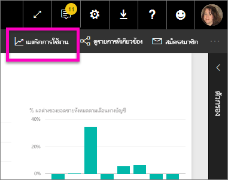
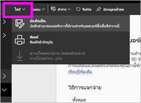

# เฝ้าติดตามเมตริกการใช้งานสำหรับแดชบอร์ดและรายงานของ Power BI

หากคุณสร้างแดชบอร์ดและรายงาน วิธีใช้เมตริกการใช้งานจะช่วยคุณให้เข้าใจเกี่ยวกับผลกระทบของแดชบอร์ดและรายงานเหล่านี้ เมื่อคุณเรียกใช้เมตริกการใช้งานแดชบอร์ดหรือเมตริกการใช้งานรายงาน คุณพบว่ามีการใช้แดชบอร์ดและรายงานเหล่านั้นทั่วทั้งองค์กรของคุณอย่างไร ใครบ้างที่ใช้ และเพื่อวัตถุประสงค์ใด  

รายงานเมตริกการใช้งานเป็นแบบอ่านอย่างเดียว อย่างไรก็ตาม คุณสามารถคัดลอกรายงานเมตริกการใช้งาน การคัดลอกสร้างรายงาน Power BI มาตรฐานที่คุณสามารถแก้ไข นอกจากนี้ คุณยังสามารถสร้างรายงานของคุณเองใน Power BI Desktop ที่ยึดตามชุดข้อมูลพื้นฐาน ซึ่งประกอบด้วยเมตริกการใช้งานสำหรับแดชบอร์ดทั้งหมดหรือรายงานทั้งหมดในพื้นที่ทำงาน ในการเริ่มต้น รายงานที่คัดลอกจะแสดงเมตริกเฉพาะสำหรับแดชบอร์ดหรือรายงานที่เลือกเท่านั้น คุณสามารถลบตัวกรองเริ่มต้นและมีสิทธิเข้าถึงชุดข้อมูลพื้นฐานพร้อมกับเมตริกการใช้งานทั้งหมดของพื้นที่ทำงานที่เลือก คุณอาจเห็นชื่อของผู้ใช้ที่ระบุ ถ้าผู้ดูแลระบบของคุณได้รับอนุญาต

> [!NOTE]
> เมตริกการใช้งานติดตามการใช้งานของรายงานที่ฝังอยู่ใน SharePoint Online อย่างไรก็ตาม เมตริกการใช้งานจะไม่ติดตามแดชบอร์ดและรายงานที่ฝังผ่านกระแส "ผู้ใช้ที่เป็นเจ้าของข้อมูลประจำตัว" หรือ "แอปที่เป็นเจ้าของข้อมูลประจำตัว" นอกจากนี้ เมตริกการใช้งานยังจะไม่ติดตามการใช้งานของรายงานที่ฝังผ่าน[เผยแพร่ไปยังเว็บ](service-publish-to-web.md)

## ทำไมเมตริกการใช้งานจึงมีความสำคัญ

การทราบว่ามีการใช้เนื้อหาของคุณอย่างไรช่วยคุณในการแสดงผลกระทบและจัดลำดับความสำคัญความพยายามของคุณ เมตริกการใช้งานของคุณอาจแสดงว่าหนึ่งในรายงานของคุณมีการใช้เป็นประจำทุกวันโดยส่วนใหญ่ขององค์กร และอาจแสดงว่าไม่มีการดูแดชบอร์ดที่คุณสร้างขึ้นเลยก็เป็นได้ คำติชมประเภทนี้มีประโยชน์มากสำหรับเป็นแนวทางในการทำงานของคุณ

คุณสามารถเรียกใช้รายงานเมตริกการใช้งานในบริการของ Power BI เท่านั้น อย่างไรก็ตาม หากคุณบันทึกการใช้เมตริกรายงานหรือปักหมุดไปยังแดชบอร์ด คุณสามารถเปิดและโต้ตอบกับรายงานนั้นบนอุปกรณ์เคลื่อนที่ได้

## ข้อกำหนดเบื้องต้น

- คุณต้องมีสิทธิการใช้งาน Power BI Pro เพื่อเรียกใช้และเข้าถึงข้อมูลเมตริกการใช้งาน อย่างไรก็ตาม คุณลักษณะเมตริกการใช้งานรวบรวมข้อมูลการใช้งานจากผู้ใช้ทั้งหมด ไม่ว่าผู้ใช้งานนั้นมีสิทธิการใช้งานเป็นแบบใด
- เมื่อต้องการเข้าถึงเมตริกการใช้งานสำหรับแดชบอร์ดเฉพาะหรือรายงาน คุณต้องมีสิทธิการเข้าถึงการแก้ไขในแดชบอร์ดหรือรายงานนั้น
- ผู้ดูแลระบบ Power BI ของคุณจะต้องมีเมตริกการใช้งานที่เปิดใช้งานสำหรับผู้สร้างเนื้อหา ผู้ดูแลระบบ Power BI ของคุณยังอาจเก็บรวบรวมข้อมูลต่อผู้ใช้ในเมตริกการใช้งาน อ่านเกี่ยวกับวิธีการ[เปิดใช้งานตัวเลือกเหล่านี้ในพอร์ทัลผู้ดูแลระบบ](../admin/service-admin-portal.md#control-usage-metrics) 

## ดูรายงานเมตริกการใช้งาน

1. เริ่มต้นในพื้นที่ทำงานที่ประกอบด้วยแดชบอร์ดหรือรายงาน
2. จากรายการเนื้อหาพื้นที่ทำงานหรือจากแดชบอร์ดหรือตัวรายงานเองรายการใดรายการหนึ่ง ให้เลือกไอคอนสำหรับ **เมตริกการใช้งาน**  

    

    
3. ในครั้งแรกที่คุณทำเช่นนี้ Power BI จะสร้างรายงานเมตริกการใช้งานและแจ้งให้คุณทราบเมื่อพร้อม

    
4. เมื่อต้องการดูผลลัพธ์ เลือก**ดูเมตริกการใช้งาน**

    เมตริกการใช้งานเป็นการรวมกันที่ทรงพลังขณะที่คุณใช้และคงแดชบอร์ด Power BI และรายงานไว้ สงสัยหรือไม่ว่าหน้าใดของรายงานของคุณมีประโยชน์สูงสุด และหน้าใดคุณควรนำออกไป? การแบ่งส่วนแยกตาม**หน้ารายงาน**เพื่อหาคำตอบ สงสัยหรือไม่ว่าคุณควรสร้างเค้าโครงอุปกรณ์มือถือสำหรับแดชบอร์ดของคุณหรือไม่? การแบ่งส่วน**แพลตฟอร์ม**เพื่อดูจำนวนผู้ใช้ที่เข้าถึงเนื้อหาของคุณผ่านทางแอปฯมือถือเทียบกับการเข้าถึงผ่านทางเว็บเบราว์เซอร์

5. อีกทางหนึ่งคือ เลื่อนไปเหนือภาพแล้วเลือกไอคอนหมุดเพื่อเพิ่มการแสดงภาพไปยังแดชบอร์ด หรือจากแถบเมนูด้านบน เลือก**หน้า Pin Live** เพื่อเพิ่มทั้งหน้าไปยังแดชบอร์ดหนึ่ง จากแดชบอร์ดดังกล่าว คุณสามารถตรวจสอบเมตริกการใช้งานหรือแชร์ไปยังผู้อื่นได้ง่ายยิ่งขึ้น

    > [!NOTE]
    > ถ้าคุณปักหมุดไทล์จากรายงานเมตริกการใช้งานไปยังแดชบอร์ด จะไม่สามารถเพิ่มแดชบอร์ดลงในแอปได้

### รายงานเมตริกการใช้งานแดชบอร์ด

### รายงานเมตริกการใช้งานแดชบอร์ด

## เกีึ่ยวกับรายงานเมตริกการใช้งาน

เมื่อคุณเลือก**เมตริกการใช้งาน**หรือไอคอน ถัดจากแดชบอร์ดหรือรายงาน Power BI จะสร้างรายงานที่สร้างไว้ล่วงหน้าด้วยเมตริกการใช้งานสำหรับเนื้อหานั้นของ 90 วันที่ผ่านมา  รายงานมีลักษณะคล้ายกับรายงาน Power BI ที่คุณคุ้นเคยอยู่แล้ว คุณจะสามารถแบ่งส่วนข้อมูลโดยยึดตามวิธีการที่ผู้ใช้ของคุณได้รับการเข้าถึง ว่าพวกเขาเข้าถึงผ่านทางเว็บหรือแอปมือถือ หรืออื่น ๆ ขณะที่แดชบอร์ดและรายงานของคุณพัฒนาขึ้น รายงานเมตริกการใช้งานจะพัฒนาขึ้นด้วย ซึ่งจะอัปเดตด้วยข้อมูลใหม่ทุกวัน  

รายงานเมตริกการใช้งานจะไม่แสดงขึ้นใน**ล่าสุด** **พื้นที่ทำงาน** **รายการโปรด** หรือรายการเนื้อหาอื่น ไม่สามารถเพิ่มรายงานเมตริกการใช้งานลงในแอปได้ ถ้าคุณปักหมุดไทล์จากรายงานเมตริกการใช้งานไปยังแดชบอร์ด จะไม่สามารถเพิ่มแดชบอร์ดลงในแอปได้

หากต้องการเจาะลึกข้อมูลรายงาน หรือหากต้องการสร้างรายงานของคุณเองกับชุดข้อมูลพื้นฐาน คุณมีสองตัวเลือก: 

- สร้างรายงานนี้ในบริการของ Power BI ดู[บันทึกสำเนาของรายงานเมตริกการใช้งาน](#save-a-copy-of-the-usage-metrics-report)ภายหลังในบทความนี้สำหรับรายละเอียด
- เชื่อมต่อกับชุดข้อมูลจาก Power BI Desktop สำหรับทุกพื้นที่ทำงาน ชุดข้อมูลมีชื่อ "แบบจำลองเมตริกการใช้งานรายงาน" ดู[สร้างการเชื่อมต่อไปยังชุดข้อมูลที่เผยแพร่](../connect-data/desktop-report-lifecycle-datasets.md#establish-a-power-bi-service-live-connection-to-the-published-dataset)สำหรับรายละเอียด

    

## มีการรายงานเมตริกใด?

| เมตริก | แดชบอร์ด | รายงาน | คำอธิบาย |
| --- | --- | --- | --- |
| ตัวแบ่งส่วนข้อมูลวิธีการแจกจ่าย |ใช่ |ใช่ |วิธีการที่ผู้ใช้เข้าถึงเนื้อหา มี 3 วิธีด้วยกัน: ผู้ใช้สามารถเข้าถึงแดชบอร์ดหรือรายงานโดยการเป็นสมาชิกของ[พื้นที่ทำงาน](../consumer/end-user-experience.md) โดยการแชร์เนื้อหา[กับสมาชิก ](service-share-dashboards.md)หรือโดยการติดตั้งชุดเนื้อหา/แอป  โปรดทราบว่ามุมมองผ่านแอปฯจะนับเป็น "ชุดเนื้อหา" |
| ตัวแบ่งส่วนข้อมูลแพลตฟอร์ม |ใช่ |ใช่ |มีการเข้าถึงแดชบอร์ดหรือรายงานผ่านทางบริการ Power BI (powerbi.com) หรืออุปกรณ์เคลื่อนที่หรือไม่? อุปกรณ์เคลื่อนที่รวมแอปฯ iOS, Android และ Windows ทั้งหมดของเรา |
| ตัวแบ่งส่วนข้อมูลหน้ารายงาน |ไม่ |ใช่ |ถ้ารายงานมีมากกว่า 1 หน้า แบ่งส่วนรายงานแยกตามหน้าที่มีการดู ถ้าคุณเห็นตัวเลือกรายการสำหรับ "Blank" หมายความว่ามีการเพิ่มหน้ารายงานเมื่อเร็ว ๆ นี้ (ภายใน 24 ชั่วโมงชื่อที่แท้จริงของหน้าใหม่ปรากฏในรายการตัวแบ่งส่วนข้อมูล) และ/หรือมีการลบหน้ารายงานออก "Blank" จับประเภทของสถานการณ์เหล่านี้ |
| ยอดดูต่อวัน |ใช่ |ใช่ |จำนวนรวมของมุมมองแต่ละวัน - มุมมองหมายถึงหน้ารายงานหรือแดชบอร์ดที่ผู้ใช้ทำการโหลด |
| ผู้เข้าชมที่ไม่ซ้ำกันต่อวัน |ใช่ |ใช่ |จำนวนที่*แตกต่างกัน*ของผู้ใช้ที่ดูแดชบอร์ดหรือรายงาน (โดยยึดตามบัญชีผู้ใช้ AAD) |
| ยอดดูต่อวัน |ใช่ |ใช่ |จำนวนของมุมมองใน 90 วันที่ผ่านมา แบ่งตามผู้ใช้แต่ละราย |
| การแชร์ต่อวัน |ใช่ |ไม่ |จำนวนครั้งที่มีการแชร์แดชบอร์ดกับผู้ใช้หรือกลุ่มอื่น |
| ผลรวมยอดดู |ใช่ |ใช่ |จำนวนของมุมมองใน 90 วันที่ผ่านมา |
| ผลรวมผู้เข้าชม |ใช่ |ใช่ |จำนวนผู้ชมที่ไม่ซ้ำกันใน 90 วันที่ผ่านมา |
| ผลรวมการแชร์ |ใช่ |ไม่ |จำนวนครั้งที่มีการแชร์แดชบอร์ดหรือรายงานใน 90 วันที่ผ่านมา |
| ผลรวมทั้งหมดในองค์กร |ใช่ |ใช่ |จำนวนแดชบอร์ดหรือรายงานทั้งหมดในทั้งองค์กรที่มียอดดูอย่างน้อยหนึ่งครั้งในช่วง 90 วันที่ผ่านมา  ใช้ในการคำนวณอันดับ |
| อันดับ: ผลรวมยอดดู |ใช่ |ใช่ |สำหรับยอดดูรวมของแดชบอร์ดหรือรายงานทั้งหมดในองค์กรในช่วง 90 วันที่ผ่านมาที่มีการจัดอันดับแดชบอร์ดหรือรายงานนี้ |
| อันดับ: ผลรวมการแชร์ |ใช่ |ไม่ |สำหรับการแชร์รวมของแดชบอร์ดหรือรายงานทั้งหมดในองค์กรในช่วง 90 วันที่ผ่านมาที่มีการจัดอันดับแดชบอร์ดหรือรายงานนี้ |

## บันทึกสำเนาของรายงานเมตริกการใช้งาน

ใช้**บันทึกเป็น**เพื่อแปลงรายงานเมตริการใช้งานเป็นรายงาน Power BI ทั่วไปที่คุณสามารถกำหนดเองตามความต้องการเฉพาะของคุณ คุณยังสามารถใช้ Power BI Desktop เพื่อสร้างรายงานเมตริกการใช้งานแบบกำหนดเองที่ยึดตามชุดข้อมูลพื้นฐาน ดู[สร้างการเชื่อมต่อไปยังชุดข้อมูลที่เผยแพร่](../connect-data/desktop-report-lifecycle-datasets.md#establish-a-power-bi-service-live-connection-to-the-published-dataset)สำหรับรายละเอียด

ยิ่งไปกว่านั้น ชุดข้อมูลพื้นฐานมีรายละเอียดเกี่ยวกับการใช้งานทั้งหมดของแดชบอร์ดและรายงานในพื้นที่ทำงาน ซึ่งจะมีความเป็นไปได้มากขึ้น ตัวอย่างเช่น คุณสามารถสร้างรายงานที่เปรียบเทียบแดชบอร์ดทั้งหมดในพื้นที่ทำงานของคุณโดยยึดตามการใช้งาน หรือ คุณสามารถสร้างแดชบอร์ดเมตริกการใช้งานสำหรับแอป Power BI ของคุณได้โดยการรวมการใช้งานเนื้อหาทั้งหมดที่กระจายอยู่ภายในแอปนั้น  ดูวิธีการลบตัวกรองและ[ดูเมตริกการใช้งานทั้งหมดสำหรับพื้นที่ทำงาน](#see-all-workspace-usage-metrics)ในภายหลังในบทความนี้

### สร้างสำเนาของรายงานการใช้งาน

เมื่อคุณสร้างสำเนาของรายงานการใช้งานแบบอ่านอย่างเดียวที่สร้างไว้ล่วงหน้า Power BI จะสร้างสำเนาของรายงานที่แก้ไขได้ ในการมองครั้งแรก จะเห็นว่ามีลักษณะเหมือนกัน อย่างไรก็ตาม ตอนนี้คุณสามารถเปิดรายงานในมุมมองการแก้ไข เพิ่มภาพ ตัวกรอง และหน้าปรับเปลี่ยนใหม่ หรือลบแสดงภาพที่มีอยู่ และอื่น ๆ อีกมาก Power BI จะบันทึกรายงานใหม่ในพื้นที่ทำงานปัจจุบัน

1. จากรายงานเมตริกการใช้งานที่สร้างไว้ล่วงหน้า เลือก**ไฟล์ > บันทึกเป็น** Power BI สร้างรายงาน Power BI ที่สามารถแก้ไขได้ ซึ่งบันทึกไว้ในพื้นที่ทำงานปัจจุบัน

    
2. เปิดรายงานในมุมมองการแก้ไข และ[โต้ตอบกับข้อมูลเช่นเดียวกับรายงาน Power BI อื่น ๆ](../create-reports/service-interact-with-a-report-in-editing-view.md) ตัวอย่างเช่น เพิ่มหน้าใหม่ และสร้างการแสดงภาพแบบใหม่ เพิ่มตัวกรอง จัดรูปแบบตัวอักษร สี และอื่น ๆ

    
3. รายงานใหม่จะถูกบันทึกในแท็บ**รายงาน** ในพื้นที่ทำงานปัจจุบัน และเพิ่มลงในรายการเนื้อหา**ล่าสุด**

    

## ดูเมตริกการใช้พื้นที่ทำงาน*ทั้งหมด*

เมื่อต้องการดูเมตริกสำหรับแดชบอร์ดทั้งหมดหรือสำหรับรายงานทั้งหมดในพื้นที่ทำงาน คุณจะต้องลบตัวกรองออก ตามค่าเริ่มต้น รายงานจะถูกกรองให้แสดงเฉพาะเมตริกสำหรับแดชบอร์ดหรือรายงานที่ใช้เพื่อสร้างเท่านั้น

1. เลือก**แก้ไขรายงาน** เพื่อเปิดรายงานที่สามารถแก้ไขได้ใน มุมมองการแก้ไข

    
2. ในพื้นที่ตัวกรอง ค้นหาแหล่งชุด**ตัวกรองระดับรายงาน**และลบตัวกรองโดยการเลือกยางลบที่อยู่ถัดจาก **ReportGuid**

    

    ขณะนี้รายงานของคุณแสดงเมตริกสำหรับทั้งพื้นที่ทำงาน

## ตัวควบคุมผู้ดูแลระบบสำหรับเมตริกการใช้งาน

รายงานเมตริกการใช้งานเป็นคุณลักษณะที่ผู้ดูแลระบบ Power BI หรือ Office 365 สามารถเปิดหรือปิดได้ ผู้ดูแลระบบสามารถควบคุมระดับแยกย่อยที่ผู้ใช้มีสิทธิ์เข้าถึงเมตริกการใช้งาน ซึ่งจะ**เปิดอยู่**โดยเป็นค่าเริ่มต้นสำหรับผู้ใช้ทั้งหมดในองค์กร

> [!NOTE]
> เฉพาะผู้ดูแลระบบสำหรับผู้เช่า Power BI เท่านั้นที่สามารถดูพอร์ทัลผู้ดูแลระบบ และแก้ไขการตั้งค่า 

ด้วยค่าเริ่มต้น ข้อมูลต่อผู้ใช้จะถูกเปิดใช้งานสำหรับเมตริกการใช้งาน และข้อมูลบัญชีผู้ใช้เนื้อหาจะถูกรวมอยู่ในรายงานเมตริก ถ้าผู้ดูแลระบบไม่ต้องการเปิดเผยข้อมูลนี้สำหรับผู้ใช้บางคนหรือทั้งหมด พวกเขาสามารถปิดใช้งานคุณลักษณะสำหรับกลุ่มความปลอดภัยที่ระบุ หรือ คุณลักษณะสำหรับทั้งองค์กร จากนั้นข้อมูลบัญชีแสดงในรายงานว่า*ไม่มีชื่อ*

เมื่อปิดใช้งานเมตริกการใช้งานสำหรับทั้งองค์กร ผู้ดูแลระบบสามารถใช้ตัวเลือก**ลบเนื้อหาเมตริกการใช้งานที่มีอยู่ทั้งหมด**เพื่อลบรายงานและไทล์แดชบอร์ดที่มีอยู่ทั้งหมดที่สร้างขึ้นโดยใช้รายงานเมตริกการใช้งาน ตัวเลือกนี้จะลบการเข้าถึงข้อมูลเมตริกการใช้งานทั้งหมดสำหรับผู้ใช้ทั้งหมดในองค์กรที่อาจใช้งานอยู่แล้ว การลบเนื้อหาเมตริกการใช้งานที่มีอยู่เป็นการกระทำที่ไม่สามารถเรียกกลับคืนได้

ดู[ควบคุมเมตริกการใช้งาน](../admin/service-admin-portal.md#control-usage-metrics)ในบทความพอร์ทัลของผู้ดูแลระบบสำหรับรายละเอียดเกี่ยวกับการตั้งค่าเหล่านี้ 

## เมตริกการใช้งานในระบบคลาวด์ของชาติ

Power BI มีอยู่ในระบบคลาวด์ของชาติแยกต่างหาก ระบบคลาวด์เหล่านี้มีการรักษาความปลอดภัย ความเป็นส่วนตัว การปฏิบัติตามข้อกำหนด และความโปร่งใสเช่นเดียวกับ Power BI ทั่วโลก รวมกับรูปแบบเฉพาะสำหรับข้อบังคับท้องถิ่นเกี่ยวกับการให้บริการ ที่เก็บข้อมูล การเข้าถึง และการควบคุม เนื่องจากรูปแบบเฉพาะสำหรับข้อบังคับท้องถิ่น เมตริกการใช้งานไม่สามารถใช้งานได้ในระบบคลาวด์ของชาติ สำหรับข้อมูลเพิ่มเติม ให้ดู [ระบบคลาวด์ของชาติ](https://powerbi.microsoft.com/clouds/)

## ข้อควรพิจารณาและข้อจำกัด

### ความขัดแย้งระหว่างบันทึกการตรวจสอบและเมตริกการใช้งาน

เป็นสิ่งสำคัญที่ต้องทำความเข้าใจที่มีผลต่างที่อาจเกิดขึ้น เมื่อเปรียบเทียบบันทึกเมตริกและตรวจสอบการใช้งาน และเพราะอะไร *บันทึกการตรวจสอบ*ถูกรวบรวมโดยใช้ข้อมูลจากบริการของ Power BI และ*เมตริกการใช้งาน*จะถูกรวบรวมไว้บนไคลเอ็นต์ จำนวนรวมของกิจกรรมในบันทึกการตรวจสอบอาจไม่ตรงกันเสมอเมตริกการใช้งาน เนื่องจากต่อไปนี้:

* เมตริกการใช้งานในบางครั้งอาจนับจำนวนต่ำกว่า กิจกรรมเนื่องจากการเชื่อมต่อเครือข่ายไม่สอดคล้องกัน ตัวบล็อก ad หรือปัญหาอื่นๆ ที่สามารถทำการส่งเหตุการณ์จากไคลเอ็นต์
* มุมมองบางชนิดไม่รวมอยู่ในเมตริกการใช้งาน ตามที่อธิบายไว้ก่อนหน้าในบทความนี้
* เมตริกการใช้งานในบางครั้งอาจนับจำนวนเกินกว่ากิจกรรม ในสถานการณ์ที่ไคลเอ็นต์ รีเฟรชโดยไม่จำเป็นต้องมีคำขอที่ถูกส่งกลับไปยังบริการ Power BI

### ข้อควรพิจารณาอื่น ๆ

คุณจำเป็นต้องดูเนื้อหาในพื้นที่ทำงานของคุณจากภายในพื้นที่ทำงานนั้นอย่างน้อยหนึ่งครั้ง ถ้าไม่มีมุมมองของเนื้อหาจากพื้นที่ทำงานตัวเองอย่างน้อยหนึ่งครั้ง ข้อมูลจะไม่สัมพันธ์กับมุมมองของแอปพลิเคชันในรายงานเมตริกการใช้งาน ในการยกเลิกการบล็อกการประมวลผลข้อมูลสำหรับรายงานนี้ เพียงแค่ดูเนื้อหาจากพื้นที่ทำงานของคุณอย่างน้อยหนึ่งครั้ง

## คำถามที่ถามบ่อย

นอกเหนือจากความแตกต่างที่อาจเกิดขึ้นระหว่างการบันทึกเมตริกและตรวจสอบการใช้งาน คำถามและคำตอบเกี่ยวกับเมตริกการใช้งานต่อไปนี้อาจเป็นประโยชน์สำหรับผู้ใช้และผู้ดูแลระบบ:

**คำถาม:**    ฉันไม่สามารถเรียกใช้เมตริกการใช้งานบนแดชบอร์ดหรือรายงานได้

**คำตอบ:**    คำตอบ: คุณสามารถดูเมตริกการใช้งานสำหรับเนื้อหาที่คุณเป็นเจ้าของหรือมีสิทธิ์ในการแก้ไขเท่านั้น

**คำถาม:**    เมตริกการใช้งานจะจับภาพมุมมองจากแดชบอร์ดแบบฝังตัวและรายงานหรือไม่?

**คำตอบ:**    เมตริกการใช้งานในปัจจุบันไม่สนับสนุนการบันทึกการใช้งานสำหรับแดชบอร์ดแบบฝังตัว รายงาน และกระแส[เผยแพร่ไปยังเว็บ](service-publish-to-web.md) ในกรณีเหล่านั้น เราแนะนำให้ใช้แพลตฟอร์มการวิเคราะห์เว็บที่มีอยู่เพื่อติดตามการใช้งานสำหรับการโฮสต์แอปฯหรือเว็บไซต์

**คำถาม:**    ฉันไม่สามารถเรียกใช้เมตริกการใช้งานบนเนื้อหาใด ๆ เลย

**คำตอบที่ 1:**    ผู้ดูแลระบบสามารถปิดใช้งานคุณลักษณะนี้สำหรับองค์กรของพวกเขา  ให้ติดต่อผู้ดูแลระบบของคุณเพื่อดูว่าเป็นในกรณีนี้หรือไม่

**คำตอบที่ 2:**    เมตริกการใช้งานเป็นคุณลักษณะ Power BI Pro

**คำถาม:**    ข้อมูลเหมือนไม่อัปเดต ตัวอย่างเช่น วิธีีการกระจายไม่แสดงขึ้น หน้ารายงานสูญหาย และอื่น ๆ

**คำตอบ:**    อาจใช้เวลาถึง 24 ชั่วโมงเพื่อทำการอัปเดตข้อมูล

**คำถาม:**    มีสี่รายงานในพื้นที่ทำงาน แต่รายงานเมตริกการใช้งานแสดงเพียงสามรายงานเท่านั้น

**คำตอบ:**    การใช้เมตริกรายงานรวมเฉพาะรายงาน (หรือแดชบอร์ด) ที่มีการเข้าถึงใน 90 วันที่ผ่านมา  ถ้ารายงาน (หรือแดชบอร์ด) ไม่แสดงขึ้น เป็นไปได้ว่าอาจไม่ได้ใช้ในนานกว่า 90 วัน

## ขั้นตอนถัดไป

[การดูแล Power BI ในพอร์ทัลผู้ดูแลระบบ](../admin/service-admin-portal.md)

มีคำถามเพิ่มเติมหรือไม่ [ลองไปที่ชุมชน Power BI](https://community.powerbi.com/)
