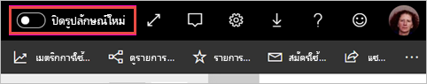
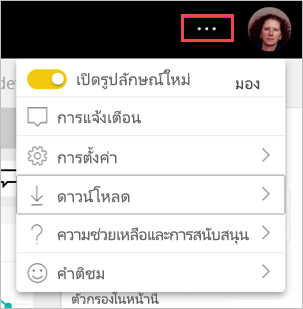

# เลือกใช้รูปลักษณ์พื้นที่ทำงาน “รูปลักษณ์ใหม่” (พรีวิว)

พื้นที่ทำงานมีรูปลักษณ์ใหม่ที่สอดคล้องกับ[รูปลักษณ์ใหม่](../service-new-look.md)ของบริการ Power BI ทุกคนที่ใช้บริการ Power BI (app.powerbi.com) สามารถเลือกใช้งานได้ เมื่อคุณเปิดการ **ลักษณะใหม่** ในแถบส่วนหัวสีดำคุณเลือกที่จะค้นหารายงานและพื้นที่ทำงานใหม่ ทุกพื้นที่ทำงาน ทั้งคลาสสิกและแบบใหม่สามารถได้ประโยชน์จากรูปลักษณ์ใหม่ได้

ต้องการเกี่ยวกับรูปลักษณ์ใหม่ใน **Power BI Desktop**อย่างนั้นหรือ คุณสามารถอ่านได้ที่ใช้ [ชุดแถบเครื่องมือที่อัปเดตแล้วใน Power BI Desktop](../desktop-ribbon.md)

## คุณลักษณะของรูปลักษณ์ใหม่่

:::image type="content" source="media/service-workspaces-new-look/power-bi-workspace-new-look-numbered.png" alt-text="รูปลักษณ์ใหม่ของพื้นที่ทำงานที่มีตัวเลขแจ้งเพื่อคำบรรยาย":::

|ตัวเลข  |วิธีการทำงาน |
|---------|---------|
|    | **รับข้อมูล**: เพิ่มเนื้อหาไปยังพื้นที่ทำงานของคุณได้ง่ายขึ้น เลือกปุ่ม **+ ใหม่**เพื่อเชื่อมต่อกับข้อมูล เปิดไฟล์ และสร้างรายงาน แดชบอร์ด และอื่น ๆ  |
|   | **ตัวสลับมุมมอง**: ดูการเชื่อมต่อระหว่างกระแสข้อมูล ชุดข้อมูล รายงาน และแดชบอร์ดของคุณและการเชื่อมต่อกับแหล่งข้อมูลอื่น ๆ สลับระหว่างมุมมอง **รายการ** กับมุมมอง **สายข้อมูล** |
|  | **การค้นหาภายในพื้นที่ทำงาน**: ค้นหาเนื้อหาทั้งหมดในพื้นที่ทำงานในกล่องค้นหาแบบใหม่  |
|   | **รายการและแท็บ**: เนื้อหาทั้งหมดในพื้นที่ทำงานอยู่ในรายการของแดชบอร์ด รายงาน ชุดข้อมูล ฯลฯ แบบราบ เช่น SharePoint คุณไม่ต้องเปิดพื้นที่ทำงานไปยังแท็บ **แดชบอร์ด** ที่อาจว่างเปล่าแล้วสงสัยว่าเนื้อหาของคุณอยู่ที่ใดอีกต่อไป นี่คือลำดับแท็บใหม่:  **ทั้งหมด**: แสดงเนื้อหาทั้งหมด (แดชบอร์ด รายงาน เวิร์กบุ๊ก รายงานที่มีการแบ่งหน้า ชุดข้อมูล และกระแสข้อมูล) ในพื้นที่ทำงาน  **เนื้อหา**: รวบรวมเนื้อหาทั้งหมดที่สร้างขึ้นเพื่อการใช้งาน (แดชบอร์ด รายงาน เวิร์กบุ๊ก และรายงานที่มีการแบ่งหน้า) ภายในพื้นที่ทำงาน  **ชุดข้อมูล + กระแสข้อมูล**: รวบรวมชุดข้อมูลและกระแสข้อมูลทั้งหมดในพื้นที่ทำงาน เพื่อให้ง่ายต่อการจัดการข้อมูล |
|  | **ตัวกรอง**: สำหรับพื้นที่ทำงานที่มีวัตถุหลายร้อยรายการ คุณสามารถกรองเนื้อหาในแผงตัวกรองได้ หลังจากการใช้ตัวกรอง คุณจะเห็นตัวกรองอยู่ที่ด้านบนของรายการเนื้อหา |

**การดำเนินการด่วน**: เมื่อคุณชี้เมาส์เหนือเนื้อหาในรายการ คุณจะเห็นการดำเนินการที่ใช้บ่อยที่สุดสำหรับรายการนั้น รวมถึงรายการอื่น ๆ ที่มีอยู่ในเมนู **ตัวเลือกเพิ่มเติม** (...)

:::image type="content" source="media/service-workspaces-new-look/power-bi-workspace-new-look-quick-actions.png" alt-text="การดำเนินการด่วนในพื้นที่ทำงานใหม่":::

## เลือกรับสำหรับรูปลักษณ์ใหม่

ผู้ใช้บริการของ Power BI สามารถเลือกรับสำหรับรูปลักษณ์ใหม่ได้ เพียงแค่เลื่อนจาก **ปิดรูปลักษณ์ใหม่** เป็น **เปิดรูปลักษณ์ใหม่**

ถ้าคุณต้องการย้อนกลับไปใช้รูปลักษณ์เก่า เพียงแค่เลื่อนกลับเพื่อ**ปิด** หากคุณไม่เห็นรายการดังกล่าว ให้เลือกเมนูจุดไข่ปลาที่มุมขวาบน

## ขั้นตอนถัดไป

- [ใช้ชุดแถบเครื่องมือที่อัปเดตแล้วใน Power BI Desktop](../desktop-ribbon.md)
- ["รูปลักษณ์ใหม่" ของบริการของ Power BI](../service-new-look.md)
- มีคำถามหรือไม่ [ลองไปที่ชุมชน Power BI](https://community.powerbi.com/)

