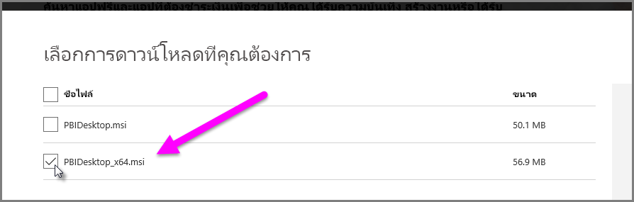

# การแก้ไขปัญหาการนำเข้าไฟล์ Access และไฟล์ .xls ของ Excel ใน Power BI Desktop

ใน Power BI Desktop ทั้งฐานข้อมูล Access และเวิร์กบุ๊ก Excel รุ่นก่อนหน้า (ไฟล์ .XLS ของ Excel 97-2003) ใช้*กลไกจัดการฐานข้อมูล Access* มีสามสถานการณ์ทั่วไปที่ทำให้กลไกจัดการฐานข้อมูล Access ไม่สามารถทำงานอย่างถูกต้อง:

## สถานการณ์ที่ 1: ไม่ติดตั้งกลไกจัดการฐานข้อมูล Access

ถ้าข้อความแสดงความผิดพลาดของ Power BI Desktop ระบุว่าไม่ได้ติดตั้งกลไกจัดการฐานข้อมูล Access คุณต้องติดตั้งกลไกจัดการฐานข้อมูล Access แบบ 32 บิต หรือ 64 บิต ที่ตรงกับเวอร์ชัน Power BI Desktop ของคุณ คุณสามารถติดตั้งกลไกจัดการฐานข้อมูล Access จาก[หน้าดาวน์โหลด](https://www.microsoft.com/download/details.aspx?id=13255)ได้

>[!NOTE]
>ถ้าเวอร์ชันบิตของกลไกจัดการฐานข้อมูล Access ที่ติดตั้งแตกต่างจากเวอร์ชันบิตของ Microsoft Office ที่คุณติดตั้ง แอปพลิเคชัน Office จะไม่สามารถใช้กลไกจัดการฐานข้อมูล Access

## สถานการณ์ที่ 2: เวอร์ชันบิตของกลไกจัดการฐานข้อมูล Access (32 บิต หรือ 64 บิต) แตกต่างจากเวอร์ชันบิตของ Power BI Desktop ของคุณ

สถานการณ์นี้มักจะเกิดขึ้นเมื่อเวอร์ชั่นของ Microsoft Office ที่ติดตั้งเป็นแบบ 32 บิต และเวอร์ชันของ Power BI Desktop ที่ติดตั้งเป็นแบบ 64 บิต สถานการณ์ตรงกันข้ามสามารถเกิดขึ้นได้และเกิดการไม่สอดล้องกันของเวอร์ชันบิตในกรณีใดกรณีหนึ่ง หากคุณใช้การสมัครใช้งาน Office 365 ให้ดู [สถานการณ์ที่ 3](#situation-3-trouble-using-access-or-xls-files-with-an-office-365-subscription) สำหรับปัญหาและวิธีแก้ไขที่แตกต่างกัน วิธีการแก้ไขหนึ่งจากหลายข้อต่อไปนี้สามารถแก้ไขข้อผิดพลาดเรื่องเวอร์ชันบิตที่ไม่ตรงกัน:

### วิธีการแก้ไขที่ 1

เปลี่ยนเวอร์ชันของ Power BI Desktop เพื่อให้เข้ากับเวอร์ชันบิต Microsoft Office ที่ติดตั้ง 

1. เมื่อต้องเปลี่ยนเวอร์ชันบิตของ Power BI Desktop ถอนการติดตั้ง Power BI Desktop และจากนั้น ติดตั้งเวอร์ชันของ Power BI Desktop ที่เข้ากับการติดตั้ง Office 

1. เมื่อต้องเลือกเวอร์ชันของ Power BI Desktop ให้เลือก**ตัวเลือกการดาวน์โหลดขั้นสูง** บนหน้าดาวน์โหลด Power BI Desktop
   
   
   
1. บนหน้าการดาวน์โหลดที่ปรากฏขึ้น เลือกภาษาของคุณ จากนั้น เลือกปุ่ม**ดาวน์โหลด** 
 
1. บนหน้าจอที่ปรากฏขึ้น เลือกกล่องกาเครื่องหมายข้าง PBIDesktop.msi สำหรับเวอร์ชัน 32 บิต หรือ PBIDesktop_x64.msi สำหรับเวอร์ชัน 64 บิต 

   ในภาพหน้าจอต่อไปนี้ ให้เลือกเวอร์ชัน 64 บิต
   
   
   
   >[!NOTE]
   >หากคุณใช้ Power BI Desktop เวอร์ชัน 32 บิตเมื่อสร้างแบบจำลองข้อมูลที่มีขนาดใหญ่มาก คุณอาจประสบปัญหาหน่วยความจำไม่เพียงพอ

### วิธีการแก้ไขที่ 2

เปลี่ยนเวอร์ชันบิตของ Power BI Desktop เพื่อให้เข้ากับเวอร์ชันบิตของตัวติดตั้ง Microsoft Office:

1. ถอนการติดตั้ง Microsoft Office

2. ติดตั้ง Office เวอร์ชันที่ตรงกับตัวติดตั้ง Power BI Desktop ของคุณ

### วิธีการแก้ไขที่ 3

ถ้ามีข้อผิดพลาดเกิดขึ้นขณะที่คุณพยายามเปิดไฟล์ .XLS (เวิร์กบุ๊ก Excel 97-2003) คุณสามารถหลีกเลี่ยงการใช้กลไกจัดการฐานข้อมูล Access ด้วยการเปิดไฟล์ .XLS ใน Excel และบันทึกเป็นไฟล์ XLSX

### วิธีการแก้ไขที่ 4

ถ้าวิธีแก้ไขปัญหาสามข้อก่อนหน้านี้ไม่สามารถทำได้ เป็นไปได้ที่คุณจะติดตั้งกลไกจัดการฐานข้อมูล Access ทั้งสองเวอร์ชัน อย่างไรก็ตาม เราไม่ขอแนะนำการแก้ปัญหาเฉพาะหน้าแบบนี้ ถึงแม้ว่าการติดตั้งทั้งสองเวอร์ชันจะแก้ไขปัญหานี้สำหรับ Power Query สำหรับ Excel และ Power BI Desktop แต่จะสร้างข้อผิดพลาดและปัญหาสำหรับแอปพลิเคชันที่ใช้เวอร์ชันบิตของกลไกจัดการฐานข้อมูล Access ที่มีการติดตั้งในครั้งแรกโดยอัตโนมัติ (ตามค่าเริ่มต้น) 

หากต้องการติดตั้งกลไกจัดการฐานข้อมูล Access ทั้งสองเวอร์ชันบิต ให้ทำตามขั้นตอนเหล่านี้:

1. ติดตั้งกลไกจัดการฐานข้อมูล Access ทั้งสองเวอร์ชันบิตจาก [หน้าดาวน์โหลด](https://www.microsoft.com/download/details.aspx?id=13255) 

1. เรียกใช้กลไกจัดการฐานข้อมูล Access แต่ละเวอร์ชันโดยใช้สวิตช์ */passive* ตัวอย่างเช่น:
   
       c:\users\joe\downloads\AccessDatabaseEngine.exe /passive
   
       c:\users\joe\downloads\AccessDatabaseEngine_x64.exe /passive

## สถานการณ์ที่ 3: ปัญหาในการใช้ไฟล์ Access หรือ .XLS กับ Office 365 แบบสมัครใช้งาน

ถ้าคุณกำลังใช้ Office 365 แบบสมัครใช้งานไม่ว่าจะเป็น **Office 2013** หรือ **Office 2016** ตัวให้บริการของกลไกจัดการฐานข้อมูล Access จะได้รับการลงทะเบียนในตำแหน่งที่ตั้งของรีจิสทรีเสมือนจริงที่สามารถเข้าถึงได้*เฉพาะ*กระบวนการต่าง ๆ ของ Microsoft Office เท่านั้น เป็นผลให้กลไกจัดการ Mashup (ซึ่งรับผิดชอบในการเรียกใช้งาน Excel ที่ไม่ใช่ Office 365 และ Power BI Desktop และไม่ใช่กระบวนการ Office) ไม่สามารถใช้งานตัวให้บริการของกลไกจัดการฐานข้อมูล Access ได้

เพื่อแก้ไขสถานการณ์นี้ ให้[ดาวน์โหลดและติดตั้งกลไกจัดการฐานข้อมูล Access ชนิดสามารถเผยแพร่ต่อ](https://www.microsoft.com/download/details.aspx?id=13255)ที่เข้ากับเวอร์ชันบิตของ Power BI Desktop ที่ติดตั้งของคุณ สำหรับข้อมูลเพิ่มเติมเกี่ยวกับเวอร์ชันบิต ให้ดูส่วนก่อนหน้าในบทความนี้

## สถานการณ์อื่น ๆ ที่อาจทำให้เกิดปัญหาการนำเข้า

เราจะมุ่งมั่นที่จะครอบคลุมปัญหาที่เกิดขึ้นกับไฟล์ Access หรือ .XLS มากเท่าที่เป็นไปได้ ถ้าคุณพบปัญหาที่ไม่ได้ครอบคลุมในบทความนี้ โปรดส่งคำถามเกี่ยวกับปัญหานั้นไปที่ [ศูนย์สนับสนุน Power BI](https://powerbi.microsoft.com/support/) เราดูปัญหาที่อาจจะมีผลกระทบต่อลูกค้าเป็นประจำ และรวมเอาไว้ในบทความของเรา

