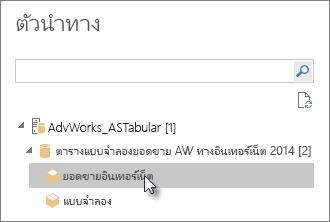
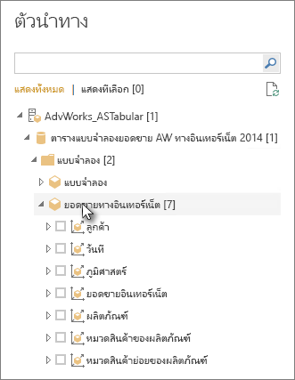

# เชื่อมต่อกับข้อมูลแบบตารางของ Analysis Services ใน Power BI Desktop
ด้วย Power BI Desktop คุณสามารถเชื่อมต่อ และรับข้อมูลจากแบบจำลองตารางของ SQL Server Analysis Services ได้สองวิธีคือ: สำรวจโดยใช้การเชื่อมต่อแบบสดหรือเลือกรายการและนำเข้าสู่ Power BI Desktop

ลองมาดูรายละเอียดกัน

**สำรวจโดยใช้การเชื่อมต่อแบบสด**: เมื่อใช้การเชื่อมต่อแบบสด รายการในแบบจำลองตาราง หรือมุมมองของคุณ เช่น ตาราง คอลัมน์ และหน่วยวัด จะปรากฏในรายการบานหน้าต่าง **เขตข้อมูล** Power BI Desktop ของคุณ คุณสามารถใช้การแสดงวิชวลขั้นสูงและ เครื่องมือรายงานของ Power BI Desktop เพื่อสำรวจแบบจำลองตารางของคุณ ด้วยวิธีการใหม่ที่สามารถโต้ตอบได้สูง

เมื่อมีการเชื่อมต่อโดยตรง จะไม่มีการนำเข้าข้อมูลจากแบบจำลองตารางลงใน Power BI Desktop ในแต่ละครั้งที่คุณโต้ตอบกับการแสดงวิชวล Power BI Desktop จะคิวรีแบบจำลองตาราง และคำนวณผลลัพธ์ที่คุณเห็น คุณจะเห็นข้อมูลล่าสุดที่พร้อมใช้งานในแบบจำลองตาราง จากเวลาประมวลผลครั้งล่าสุด หรือจากตารางคิวรีโดยตรงที่พร้อมใช้งานในแบบจำลองตาราง 

โปรดทราบว่าแบบจำลองตารางนั้นมีความปลอดภัยสูง รายการที่ปรากฏใน Power BI Desktop ขึ้นอยู่กับสิทธิ์ของคุณสำหรับแบบจำลองตารางที่คุณได้เชื่อมต่ออยู่

เมื่อคุณสร้างรายงานแบบไดนามิกใน Power BI Desktop คุณสามารถแบ่งปันเอกสารโดยการเผยแพร่ไปยังไซต์ Power BI ของคุณ เมื่อคุณเผยแพร่ไฟล์ Power BI Desktop ด้วยการเชื่อมต่อแบบสดไปยังแบบจำลองตาราง ไปสู่ไซต์ Power BI ของคุณ เกตเวย์ข้อมูลภายในองค์กรต้องได้รับการติดตั้ง และกำหนดค่าโดยผู้ดูแลระบบ ดูที่ [เกตเวย์ข้อมูลภายในองค์กร](service-gateway-onprem.md) เพื่อเรียนรู้เพิ่มเติม

**เลือกรายการและนำเข้าไปยัง Power BI Desktop**: เมื่อคุณเชื่อมต่อกับตัวเลือกนี้ คุณสามารถเลือกรายการ เช่น ตาราง คอลัมน์ และหน่วยวัดในแบบจำลองตาราง หรือมุมมองของคุณ และโหลดรายการเหล่านั้นลงในแบบจำลอง Power BI Desktop ใช้ตัวแก้ไข Power Query ของ Power BI Desktop เพื่อกำหนดรูปร่างสิ่งที่คุณต้องการเพิ่มเติมและคุณลักษณะการสร้างแบบจำลองเพื่อสร้างแบบจำลองข้อมูลเพิ่มเติม เนื่องจากไม่มีการเชื่อมต่อแบบสดระหว่าง Power BI Desktop และแบบจำลองตาราง คุณสามารถสำรวจแบบจำลอง Power BI Desktop ของคุณแบบออฟไลน์หรือเผยแพร่ไปยังไซต์ Power BI ของคุณได้

## เพื่อเชื่อมต่อกับแบบจำลองตาราง
1. ใน Power BI Desktop บนแท็บ**หน้าแรก** เลือก **รับข้อมูล** > **เพิ่มเติม** > **ฐานข้อมูล**
   
1. เลือก **ฐานข้อมูล SQL Server Analysis Services** จากนั้นเลือก**เชื่อมต่อ**
   
   
3. ในหน้าต่าง**ฐานข้อมูล SQL Server Analysis Services** ให้ใส่ชื่อ **เซิร์ฟเวอร์** เลือกโหมดการเชื่อมต่อ แล้วเลือก **ตกลง**
   
   
4. ขั้นตอนนี้ในหน้าต่าง **ตัวนำทาง** ขึ้นอยู่กับโหมดการเชื่อมต่อที่คุณเลือก:

   - ถ้าคุณกำลังเชื่อมต่อแบบสด ให้เลือกแบบจำลองตาราง หรือมุมมอง
  
      
   - ถ้าคุณเลือก เลือกรายการและรับข้อมูล ให้เลือกแบบจำลองตาราง หรือมุมมอง จากนั้นเลือกตารางหรือคอลัมน์เฉพาะที่จะโหลด เมื่อต้องการจัดรูปร่างข้อมูลของคุณก่อนการโหลด ให้เลือก **แก้ไขคิวรี** เพื่อเปิดตัวแก้ไข Power Query เมื่อคุณพร้อมแล้ว ให้เลือก **โหลด** เพื่อนำเข้าข้อมูลลงใน Power BI Desktop

      

## คำถามที่ถามบ่อย
**คำถาม:** ฉันจำเป็นต้องมีเกตเวย์ข้อมูลภายในองค์กรหรือไม่

**คำตอบ:** ขึ้นอยู่กับปัจจัยหลายๆ อย่าง ถ้าคุณใช้ Power BI Desktop เพื่อเชื่อมต่อแบบสดกับแบบจำลองตาราง แต่ไม่ต้องการเผยแพร่ไปยังไซต์ Power BI ของคุณ คุณไม่จำเป็นต้องมีเกตเวย์ ในทางกลับกัน ถ้าคุณต้องการเผยแพร่ไปยังไซต์ Power BI ของคุณ คุณจำเป็นต้องมีเกตเวย์ข้อมูลเพื่อให้แน่ใจว่าการสื่อสารจะปลอดภัยระหว่างบริการ Power BI และเซิร์ฟเวอร์ Analysis Services ภายในองค์กรของคุณ อย่าลืมพูดกับผู้ดูแลเซิร์ฟเวอร์ Analysis Services ของคุณก่อนติดตั้งเกตเวย์ข้อมูล

ถ้าคุณเลือก เลือกรายการและรับข้อมูลแล้ว คุณจะต้องนำเข้าข้อมูลแบบจำลองตารางโดยตรงไปยังไฟล์ Power BI Desktop ของคุณทันที ดังนั้นจึงไม่จำเป็นต้องมีเกตเวย์

**คำถาม:** การเชื่อมต่อกันโดยตรงกับแบบจำลองตาราง จากบริการ Power BI และการเชื่อมต่อโดยตรงจาก Power BI Desktop แตกต่างกันอย่างไร

**คำตอบ:** เมื่อเชื่อมต่อแบบสดไปยังแบบจำลองตาราง จากไซต์ของคุณในบริการ Power BI ไปยังฐานข้อมูล Analysis Services ภายในองค์กรของคุณ เกตเวย์ข้อมูลภายในองค์กรต้องมีการติดต่อสื่อสารที่ปลอดภัยระหว่างกัน เมื่อเชื่อมต่อแบบสดไปยังแบบจำลองตาราง จาก Power BI Desktop คุณไม่จำเป็นต้องใช้เกตเวย์ เนื่องจากทั้ง Power BI Desktop และเซิร์ฟเวอร์ Analysis Services ที่คุณกำลังเชื่อมต่อนั้นกำลังทำงานอยู่ภายในองค์กรของคุณ อย่างไรก็ตามคุณจำเป็นต้องมีเกตเวย์ ถ้าคุณเผยแพร่ไฟล์ Power BI Desktop ของคุณไปยังไซต์ Power BI ของคุณ

**คำถาม:** ถ้าฉันได้สร้างการเชื่อมต่อโดยตรง ฉันสามารถเชื่อมต่อกับแหล่งข้อมูลอื่น ๆ ในไฟล์ Power BI Desktop เดียวกันได้หรือไม่

**คำตอบ:** หมายเลข คุณไม่สามารถสำรวจข้อมูลแบบสด และเชื่อมต่อกับแหล่งข้อมูลชนิดอื่นในไฟล์เดียวกันได้ ถ้าคุณนำเข้าข้อมูล หรือเชื่อมต่อกับแหล่งข้อมูลที่แตกต่างในไฟล์ Power BI Desktop แล้ว คุณจะต้องสร้างไฟล์ใหม่เพื่อสำรวจแบบสด

**คำถาม:** ถ้าฉันสร้างการเชื่อมต่อโดยตรง ฉันสามารถแก้ไขแบบจำลองหรือคิวรีใน Power BI Desktop ได้หรือไม่

**คำตอบ:** คุณสามารถสร้างหน่วยวัดระดับรายงานใน Power BI Desktop แต่คิวรีอื่นทั้งหมดและคุณลักษณะการสร้างแบบจำลองจะปิดใช้งานเมื่อมีการสำรวจข้อมูลแบบไลฟ์

**คำถาม:** ถ้าฉันสร้างการเชื่อมต่อกันโดยตรง การเชื่อมต่อนั้นจะปลอดภัยหรือไม่

**คำตอบ:** ใช่ ข้อมูลประจำตัว Windows ปัจจุบันของคุณใช้เพื่อเชื่อมต่อไปยังเซิร์ฟเวอร์ Analysis Services คุณไม่สามารถใช้ข้อมูลประจำตัวพื้นฐานหรือข้อมูลประจำตัวที่เก็บไว้ในบริการ Power BI หรือ Power BI Desktop เมื่อมีการสำรวจแบบสด

**คำถาม:** ใน “ตัวนำทาง” ฉันเห็นทั้งแบบจำลองและเปอร์สเปคทีฟ อะไรคือความแตกต่าง?

**คำตอบ:** เปอร์สเปคทีฟเป็นมุมมองเฉพาะของแบบจำลองตาราง ซึ่งอาจรวมถึงตาราง คอลัมน์ หรือหน่วยวัดบางอย่าง โดยขึ้นอยู่กับความต้องการวิเคราะห์ข้อมูลที่ไม่ซ้ำกัน แบบจำลองตารางจะประกอบด้วยหนึ่งเปอร์สเปคทีฟเป็นอย่างต่ำเสมอ ซึ่งอาจรวมถึงทุกสิ่งที่อยู่ในแบบจำลอง หากคุณไม่แน่ใจว่าควรเลือกมุมมองใด ให้ตรวจสอบกับผู้ดูแลระบบของคุณ

**คำถาม:** มีฟีเจอร์ใด ๆ ของบริการวิเคราะห์ที่เปลี่ยนวิธีการทำงานของ Power BI

**คำตอบ:** ใช่ ประสบการณ์ใน Power BI Desktop อาจเปลี่ยนแปลงได้โดยขึ้นอยู่กับลักษณะการทำงานแบบตารางของคุณ ตัวอย่างเช่น:
* คุณอาจเห็นหน่วยวัดในแบบจำลองที่จัดกลุ่มไว้ด้วยกันที่ด้านบนของรายการบานหน้าต่าง**เขตข้อมูล**แทนที่จะอยู่ในตารางควบคู่ไปกับคอลัมน์ ไม่ต้องกังวล คุณสามารถใช้ได้ตามปกติ เป็นเพียงวิธีที่ง่ายกว่าในการดำเนินการเช่นนี้

* หากแบบจำลองตารางมีกลุ่มการคำนวณที่กำหนด คุณจะสามารถใช้งานร่วมกับหน่วยวัดแบบจำลองและไม่ได้รวมกับหน่วยวัดโดยนัยที่คุณสร้างขึ้นโดยการเพิ่มส่วนตัวเลขในการแสดงผล นอกจากนี้แบบจำลองอาจมีสถานะ **DiscourageImplicitMeasures** ที่กำหนดเอง ซึ่งมีผลเหมือนกัน สำหรับการเรียนรู้เพิ่มเติม โปรดดู [กลุ่มการคำนวณใน Analysis Services](https://docs.microsoft.com/analysis-services/tabular-models/calculation-groups#benefits)

## เพื่อเปลี่ยนชื่อของเซิร์ฟเวอร์หลังจากการเชื่อมต่อเริ่มต้น
หลังจากคุณสร้างไฟล์ Power BI Desktop พร้อมกับการเชื่อมต่อแบบสดของการสำรวจ อาจมีบางกรณีที่คุณต้องการสลับการเชื่อมต่อไปยังเซิร์ฟเวอร์อื่น ตัวอย่างเช่น ถ้าคุณสร้างไฟล์ Power BI Desktop ของคุณ เมื่อเชื่อมต่อไปยังเซิร์ฟเวอร์พัฒนา และก่อนเผยแพร่ไปยังบริการ Power BI คุณต้องการสลับการเชื่อมต่อไปยังเซิร์ฟเวอร์การผลิต

เมื่อต้องการเปลี่ยนชื่อเซิร์ฟเวอร์:

1. เลือก**แก้ไขคิวรี**จากแท็บ**หน้าแรก**

2. ในหน้าต่าง**ฐานข้อมูล SQL Server Analysis Services** ให้ใส่ชื่อ **เซิร์ฟเวอร์** ใหม่ แล้วเลือก **ตกลง**

   
## การแก้ไขปัญหา 
รายการต่อไปนี้อธิบายปัญหาที่ทราบแล้วทั้งหมด เมื่อเชื่อมต่อกับ SQL Server Analysis Services (SSAS) หรือ Azure Analysis Services: 

* **ข้อผิดพลาด: ไม่สามารถโหลดสคีมาสำหรับแบบจำลอง**: ข้อผิดพลาดนี้มักจะเกิดขึ้นเมื่อผู้ใช้ที่เชื่อมต่อกับ Analysis Services ไม่สามารถเข้าถึงฐานข้อมูล/แบบจำลองได้

