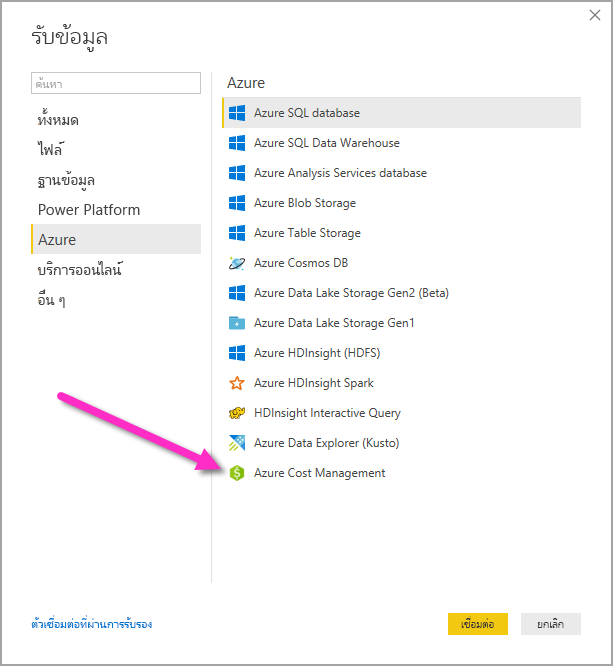
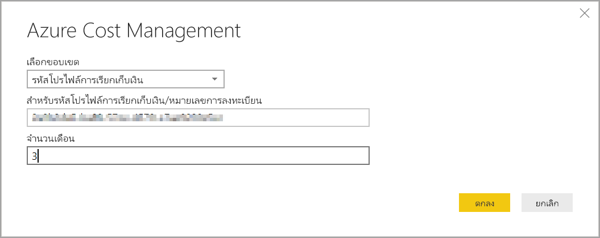
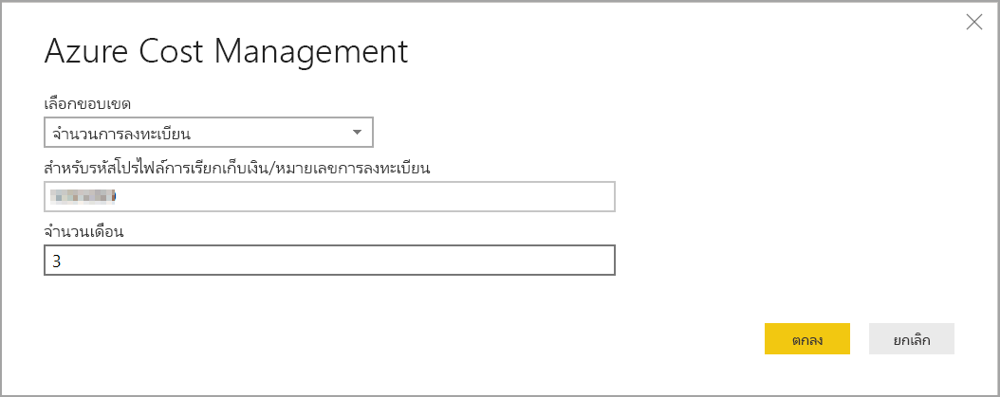
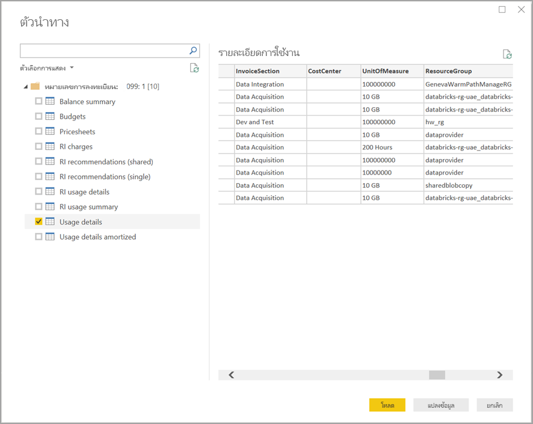

# สร้างวิชวลและรายงานด้วยตัวเชื่อมต่อ Azure Cost Management ใน Power BI Desktop

คุณสามารถใช้ตัวเชื่อมต่อการจัดการค่าใช้จ่ายของ Azure สำหรับ Power BI Desktop เพื่อสร้างการแสดงภาพและรายงานแบบกำหนดเองที่ทรงพลังซึ่งช่วยให้คุณเข้าใจการใช้งาน Azure ของคุณได้ดียิ่งขึ้น ตัวเชื่อมต่อ Azure Cost Management ในขณะนี้สนับสนุนลูกค้าด้วย[Microsoft Customer Agreement](https://azure.microsoft.com/pricing/purchase-options/microsoft-customer-agreement/) หรือ [Enterprise Agreement (EA)](https://azure.microsoft.com/pricing/enterprise-agreement/)  

ตัวเชื่อมต่อ Azure Cost Management ใช้ OAuth 2.0 สำหรับการรับรองความถูกต้องกับ Azure และระบุตัวตนผู้ใช้ที่กำลังจะใช้ตัวเชื่อมต่อ โทเค็นที่สร้างขึ้นในกระบวนการนี้จะใช้ได้สำหรับช่วงเวลาที่ระบุ Power BI เก็บรักษาโทเค็นสำหรับการเข้าสู่ระบบครั้งถัดไป OAuth 2.0 เป็นมาตรฐานสำหรับกระบวนการที่อยู่เบื้องหลังเพื่อให้แน่ใจว่าการจัดการสิทธิ์เหล่านี้มีความปลอดภัย หากต้องการเชื่อมต่อคุณต้องใช้บัญชี[ผู้ดูแล Enterprise](https://docs.microsoft.com/azure/billing/billing-understand-ea-roles) สำหรับข้อตกลงขององค์กรหรือ[เจ้าของบัญชีเรียกเก็บเงิน](https://docs.microsoft.com/azure/billing/billing-understand-mca-roles) สำหรับข้อตกลงลูกค้าของ Microsoft 

> [!NOTE]
> ตัวเชื่อมต่อนี้จะแทนที่ตัวเชื่อมต่อ [Azure Consumption Insights และ Azure Cost Management (Beta)](desktop-connect-azure-consumption-insights.md) ที่มีอยู่ก่อนหน้านี้ รายงานใดๆ ที่สร้างขึ้นด้วยตัวเชื่อมต่อก่อนหน้านี้จะต้องได้รับการจัดรูปแบบใหม่โดยใช้การเชื่อมต่อนี้

## เชื่อมต่อโดยใช้ยังการจัดการค่าใช้จ่ายของ Azure

ในการใช้ตัวเชื่อมต่อ**การจัดการค่าใช้จ่ายของ Azure**ใน Power BI Desktop ให้ทำตามขั้นตอนต่อไปนี้

1.  ใน Ribbon **หน้าแรก** ให้เลือก **รับข้อมูล**
2.  เลือก  **Azure** จากรายการ catagories ข้อมูล
3.  เลือก **Azure Cost Management**

    

4. ในกล่องโต้ตอบที่ปรากฏขึ้นให้ใส่**ID โปรไฟล์การชำระเงินของคุณ** **ข้อตกลงของลูกค้า Microsoft**  หรือ **หมาขเลขการสมัครเข้า** ของคุณสำหรับ **ข้อตกลงองค์กร (EA)** 

## เชื่อมต่อกับบัญชีข้อตกลงลูกค้าของ Microsoft 

หากต้องการเชื่อมต่อกับบัญชี **ข้อตกลงลูกค้าของ Microsoft** คุณสามารถรับ**ID โปรไฟล์การชำระเงินของคุณ** จากพอร์ทัล Azure:

1.  ใน [Azure portal](https://portal.azure.com/) นำทางไปยัง **การจัดการค่าใช้จ่าย + การเรียกเก็บเงิน**
2.  เลือกโปรไฟลการ์เรียกเก็บเงินของคุณ 
3.   ในเมนู**การตั้งค่า** ให้เลือก **คุณสมบัติ**  ในแถบด้านข้าง
4.  ในเมนู **โปรไฟล์การเรียกเก็บเงิน**  ให้คัดลอก**ID** 
5.  สำหรับ **ขอบเขตการเลือก** ให้เลือก **ID โปรไฟล์การเรียกเก็บเงิน** และวาง ID โปรไฟล์การเรียกเก็บเงินจากขั้นตอนก่อนหน้า 
6.  ใส่จำนวนเดือนและเลือก **ตกลง** 

    

7.  เมื่อได้รับพร้อมท์ให้ลงชื่อเข้าใช้ด้วยบัญชีผู้ใช้และรหัสผ่าน Azure ของคุณ 

## เชื่อมต่อไปยังบัญชีข้อตกลงองค์กร

หากต้องการเชื่อมต่อกับบัญชี ข้อตกลงองค์กร (EA) คุณจะได้รับ ID การลงทะเบียนของคุณจากพอร์ทัล Azure:

1.  ใน [Azure portal](https://portal.azure.com/) นำทางไปยัง **การจัดการค่าใช้จ่าย + การเรียกเก็บเงิน**
2.  เลือกบัญชีสำหรับการเรียกเก็บเงินของคุณ
3.  ในเมนู **ภาพรวม** คัดลอก **ID บัญชีการเรียกเก็บเงิน**
4.  สำหรับ **ขอบเขตการเลือก** ให้เลือก **หมายเลขการสมัครเข้า**  และวาง ID บัญชีการเรียกเก็บเงินจากขั้นตอนก่อนหน้า 
5.  ใส่จำนวนเดือนและจากนั้นเลือก **ตกลง** 

    

6.  เมื่อได้รับพร้อมท์ให้ลงชื่อเข้าใช้ด้วยบัญชีผู้ใช้และรหัสผ่าน Azure ของคุณ 

## ข้อมูลที่พร้อมใช้งานผ่านตัวเชื่อมต่อ

เมื่อคุณรับรองความถูกต้องเรียบร้อยแล้ว หน้าต่าง **ตัวนำทาง**  จะปรากฏขึ้นพร้อมกับตารางข้อมูลที่พร้อมใช้งานดังต่อไปนี้:

| **ตาราง** | **คำอธิบาย** |
| --- | --- |
| **สรุปยอดดุล** | สรุปยอดดุลสำหรับข้อตกลงองค์กร (EA) |
| **กิจกรรมในการเรียกเก็บเงิน** | แฟ้มบันทึกเหตุการณ์ของใบแจ้งหนี้ใหม่ ซื้อเครดิต และอื่น ๆ ข้อตกลงลูกค้าของ Microsoft เท่านั้น |
| **งบประมาณ** | รายละเอียดงบประมาณเพื่อดูค่าใช้จ่ายจริงหรือการใช้งานกับเป้าหมายงบประมาณที่มีอยู่ |
| **ค่าธรรมเนียม** | สรุปการใช้งาน Azure ระดับเดือน ค่าธรรมเนียม Market Place และค่าธรรมเนียมที่เรียกเก็บเงินแยกต่างหาก ข้อตกลงลูกค้าของ Microsoft เท่านั้น |
| **เครดิตทั้งหมด** | รายละเอียดการสั่งซื้อเครดิต Azure ทั้งหมดสำหรับโปรไฟล์การเรียกเก็บเงินที่ระบุ ข้อตกลงลูกค้าของ Microsoft เท่านั้น |
| **ใบราคา** | อัตราการใช้โดยตัววัดสำหรับโปรไฟล์การเรียกเก็บเงินที่ระบุหรือการสมัครเข้า EA |
| **ค่าใช้จ่าย RI** | ค่าใช้จ่ายที่เชื่อมโยงกับอินสแตนซ์ที่สงวนไว้ของคุณมากกว่า 24 เดือนที่ผ่านมา |
| **คำแนะนำ RI (ใช้ร่วมกัน)** | คำแนะนำในการซื้อมีอินสแตนซ์ที่สงวนไว้ยึดตามแนวโน้มการใช้งานของคุณในการสมัครใช้งานทั้งหมดในช่วง 7, 30 หรือ 60 วัน |
| **คำแนะนำ RI (เดียว)** | คำแนะนำในการซื้อมีอินสแตนซ์ที่สงวนไว้ยึดตามแนวโน้มการใช้งานของคุณในการสมัครใช้งานครั้งเดียวในช่วง 7, 30 หรือ 60 วัน |
| **รายละเอียดการใช้งาน RI** | รายละเอียดของปริมาณการใช้สำหรับอินสแตนซ์ที่สงวนไว้ของคุณที่มีอยู่ในช่วงเดือนที่ผ่านมา |
| **ข้อมูลสรุปการใช้งาน RI** | เปอร์เซ็นต์การใช้งานการของ Azure รายวัน |
| **รายละเอียดการใช้งาน** | การแบ่งรายละเอียดของปริมาณการใช้และค่าธรรมเนียมโดยประมาณสำหรับโปรไฟล์การเรียกเก็บเงินที่ให้ไว้ในการสมัครเข้า EA |
| **รายละเอียดการใช้งานที่คืนทุน** | การแบ่งรายละเอียดของปริมาณการใช้และค่าธรรมเนียมโดยประมาณสำหรับโปรไฟล์การเรียกเก็บเงินที่คืนทุนที่ให้ไว้ในการสมัครเข้า EA |

คุณสามารถเลือกตารางเพื่อดูตัวอย่างบทสนทนา คุณสามารถเลือกโดยการติ๊กกล่องด้านข้างชื่อของพวกเขาอย่างน้อยหนึ่งตาราง จาก นั้นเลือก**การโหลด**

เมื่อคุณเลือก**โหลด**ข้อมูลจะถูกโหลดลงใน Power BI Desktop 

เมื่อข้อมูลที่คุณเลือกถูกโหลด ตารางและเขตข้อมูลที่ปรากฏสามารถเห็นได้ในบานหน้าต่าง**เขตข้อมูล**

## ขั้นตอนถัดไป

คุณสามารถเชื่อมต่อไปยังแหล่งข้อมูลต่าง ๆ มากมายโดยใช้ Power BI Desktop สำหรับข้อมูลเพิ่มเติม ให้ดูบทความต่อไปนี้:

* [Power BI Desktop คืออะไร](../fundamentals/desktop-what-is-desktop.md)
* [แหล่งข้อมูลใน Power BI Desktop](desktop-data-sources.md)
* [จัดรูปทรงและรวมข้อมูลด้วย Power BI Desktop](desktop-shape-and-combine-data.md)
* [เชื่อมต่อกับเวิร์กบุ๊ก Excel ใน Power BI Desktop](desktop-connect-excel.md)   
* [ป้อนข้อมูลลงใน Power BI Desktop โดยตรง](desktop-enter-data-directly-into-desktop.md)   
