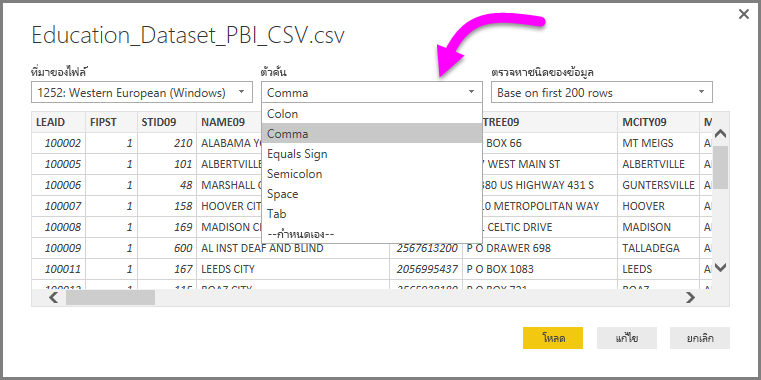
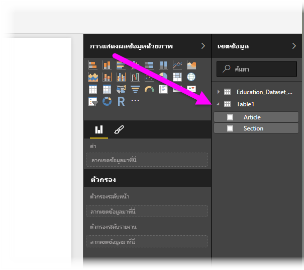

# เชื่อมต่อกับไฟล์ CSV ใน Power BI Desktop
การเชื่อมต่อกับแฟ้มที่ใช้จุลภาคเป็นตัวคั่น (*CSV*) จาก Power BI Desktop เหมือนการเชื่อมต่อกับเวิร์กบุ๊ก Excel มาก ทั้งสองเป็นเรื่องง่าย และบทความนี้จะพาคุณไปตามขั้นตอน วิธีการเชื่อมต่อกับไฟล์ CSV ใด ๆ ที่คุณสามารถเข้าถึงได้

เริ่มต้นจากใน Power BI Desktop เลือก **รับข้อมูล > CSV**จาก ribbon **หน้าแรก**

เลือกไฟล์ CSV ของคุณจากกล่องโต้ตอบ**เปิด**ที่ปรากฏขึ้น

เมื่อคุณเลือก**เปิด** Power BI Desktop จะเข้าถึงไฟล์ และพิจารณาไฟล์แอตทริบิวต์บางตัว เช่นที่มาของไฟล์ ชนิดตัวคั่น และจำนวนแถวที่ควรใช้เพื่อตรวจสอบชนิดข้อมูลในไฟล์

แอตทริบิวต์และตัวเลือกของไฟล์เหล่านี้ จะแสดงในรายการดรอปดาวน์ด้านบนของหน้าต่างกล่องโต้ตอบ**การนำเข้า CSV** ดังแสดงด้านล่างนี้ คุณสามารถเปลี่ยนการตั้งค่าที่ตรวจพบเหล่านี้ด้วยตนเอง โดยการเลือกตัวเลือกอื่นจากรายการดรอปดาวน์ได้

เมื่อคุณพอใจกับการเลือก คุณสามารถเลือก**โหลด**เพื่อการนำเข้าไฟล์ไปยัง Power BI Desktop หรือคุณสามารถเลือก**แก้ไข**เพื่อเปิด**ตัวแก้ไขคิวรี**และจัดรูปทรงหรือแปลงข้อมูลเพิ่มเติม ก่อนที่จะนำเข้า

เมื่อคุณโหลดข้อมูลลงใน Power BI Desktop แล้ว คุณจะเห็นตารางและคอลัมน์ (ซึ่งจะแสดงเป็นเขตข้อมูลใน Power BI Desktop) ในบานหน้าต่าง**เขตข้อมูล** ทางด้านขวาของมุมมองรายงานใน Power BI Desktop

นั่นคือทั้งหมดที่คุณต้องทำ – ข้อมูลจากไฟล์ CSV ของคุณในขณะนี้ อยู่ใน Power BI Desktop เรียบร้อยแล้ว

คุณสามารถใช้ข้อมูลดังกล่าวใน Power BI Desktop เพื่อสร้างวิชวล รายงาน หรือโต้ตอบกับข้อมูลอื่น ๆ ที่คุณอาจต้องการเชื่อมต่อและนำเข้า เช่น เวิร์กบุ๊ก Excel, ฐานข้อมูล หรือแหล่งข้อมูลอื่น

> [!IMPORTANT]
> เมื่อคุณนำเข้าไฟล์ CSV, Power BI Desktop จะสร้าง*คอลัมน์ = x* (โดยที่*x*คือจำนวนคอลัมน์ในไฟล์ CSV ในระหว่างการนำเข้าเริ่มต้น) เป็นขั้นตอนในตัวแก้ไข Power Query หากคุณเพิ่มคอลัมน์เพิ่มเติมในภายหลังและแหล่งข้อมูลถูกตั้งค่าให้รีเฟรช คอลัมน์ใด ๆ ที่เกินจำนวนคอลัมน์ *x* เริ่มต้น จะไม่รีเฟรช 

## ขั้นตอนถัดไป
มีข้อมูลหลากหลายประเภทที่คุณสามารถเชื่อมต่อโดยใช้ Power BI Desktop สำหรับข้อมูลเพิ่มเติมเกี่ยวกับแหล่งข้อมูล โปรดดูทรัพยากรต่อไปนี้:

* [Power BI Desktop คืออะไร](../fundamentals/desktop-what-is-desktop.md)
* [แหล่งข้อมูลใน Power BI Desktop](desktop-data-sources.md)
* [จัดรูปทรง และรวมข้อมูลด้วย Power BI Desktop](desktop-shape-and-combine-data.md)
* [เชื่อมต่อกับเวิร์กบุ๊ก Excel ใน Power BI Desktop](desktop-connect-excel.md)   
* [ใส่ข้อมูลลงใน Power BI Desktop โดยตรง](desktop-enter-data-directly-into-desktop.md)   
