# เชื่อมต่อ LinkedIn Sales Navigator ใน Power BI Desktop

ใน **Power BI Desktop** คุณสามารถเชื่อมต่อกับ **LinkedIn Sales Navigator**เพื่อช่วยในการค้นหาและสร้างความสัมพันธ์เช่นเดียวกับแหล่งข้อมูลอื่นๆ ใน Power BI Desktop และสร้างรายงานที่พร้อมใช้งานเกี่ยวกับความคืบหน้าของคุณ

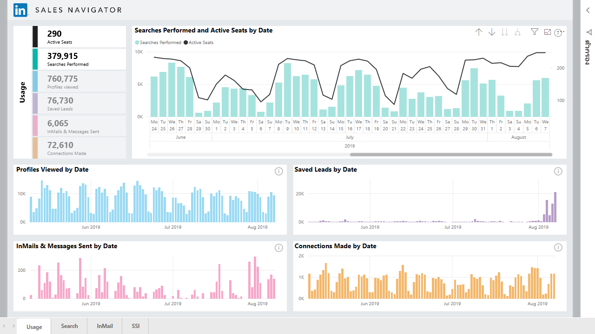

หากต้องการเชื่อมต่อกับข้อมูล LinkedIn โดยใช้ **LinkedIn Sales Navigator** คุณต้องมีแพ็กเกจ LinkedIn Sales Navigator Enterprise และเป็นผู้ดูแลหรือผู้ใช้การรายงานในสัญญา Sales Navigator

วิดีโอต่อไปนี้ให้ข้อมูลแบบย่อและการฝึกใช้งานแอปแม่แบบ **LinkedIn Sales Navigator** ซึ่งจะอธิบายอย่างละเอียด[ภายหลังในบทความนี้](#using-the-linkedin-sales-navigator-template-app) 

> [!VIDEO https://www.youtube.com/embed/ZqhmaiORLw0]

## เชื่อมต่อกับ LinkedIn Sales Navigator

หากต้องการเชื่อมต่อกับข้อมูล **LinkedIn Sales Navigator** ให้เลือก**รับข้อมูล**จากริบบิ้น**หน้าแรก** ใน Power BI Desktop เลือก **บริการออนไลน์**จากหมวดหมู่ทางด้านซ้าย จากนั้นเลื่อนลงมาจนเห็น **LinkedIn Sales Navigator (Beta)**

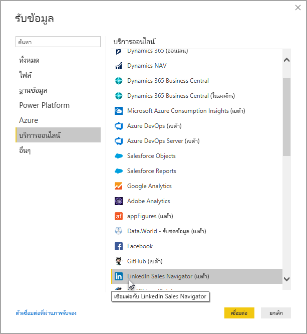

ระบบจะแนะนำคุณให้เชื่อมต่อกับตัวเชื่อมต่อบุคคลที่สามที่อยู่ในระหว่างการพัฒนา 

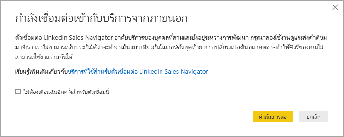

เมื่อเลือก**ดำเนินการต่อ** ระบบจะแจ้งให้คุณระบุข้อมูลที่ต้องการ

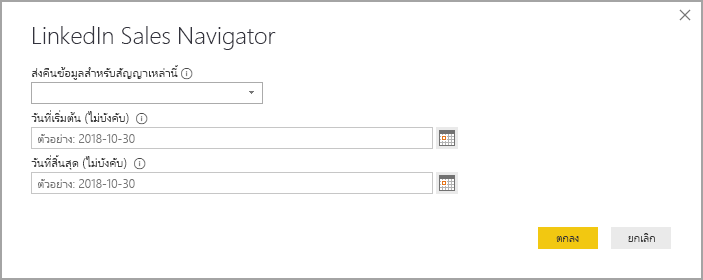

ในหน้าต่าง **LinkedIn Sales Navigator** ที่ปรากฎขึ้น ให้เลือกข้อมูลที่คุณต้องการให้แสดง เช่น *ผู้ติดต่อทั้งหมด* หรือ*ผู้ติดต่อที่เลือก*จากตัวเลือกแบบเลื่อนลงอันแรก จากนั้นระบุวันที่เริ่มต้นและวันสิ้นสุดเพื่อจำกัดข้อมูลที่ได้รับไปยังหน้าต่างเวลาเฉพาะ

เมื่อคุณให้ข้อมูลแล้ว Power BI Desktop จะเชื่อมต่อกับข้อมูลที่เชื่อมโยงกับสัญญา LinkedIn Sales Navigator ใช้อีเมลเดียวกันกับที่คุณใช้ลงชื่อเข้าใช้ LinkedIn Sales Navigator ผ่านเว็บไซต์ 

เมื่อเชื่อมต่อเรียบร้อยแล้ว คุณจะได้รับแจ้งให้เลือกข้อมูลจากสัญญา LinkedIn Sales Navigator จากหน้าต่าง **Navigator**{3}{4}

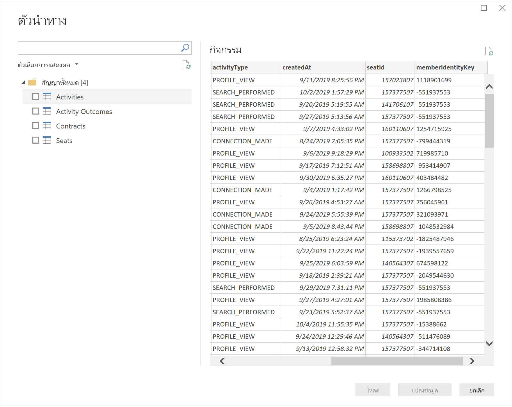

คุณจะสร้างรายงานที่คุณต้องการได้ด้วยข้อมูล LinkedIn Sales Navigator เพื่อให้สิ่งต่างๆ ง่ายขึ้น นอกจากนี้ยังมีไฟล์ .PBIX ของ LinkedIn Sales Navigator ที่คุณดาวน์โหลดได้ซึ่งมีข้อมูลตัวอย่างอยู่แล้ว ดังนั้นคุณจึงทำความคุ้นเคยกับข้อมูลและรายงานได้โดยไม่ต้องเริ่มต้นใหม่

คุณดาวน์โหลดไฟล์ .PBIX ได้จากตำแหน่งต่อไปนี้
* [PBIX for LinkedIn Sales Navigator](service-template-apps-samples.md)

นอกเหนือจากไฟล์ .PBIX แล้ว LinkedIn Sales Navigator ยังมีแอปแม่แบบที่คุณดาวน์โหลดและใช้งานได้เช่นกัน หัวข้อถัดไปจะอธิบายเกี่ยวกับแอปแม่แบบอย่างละเอียด

## การใช้แอปแม่แบบ LinkedIn Sales Navigator

หากต้องการใช้ **LinkedIn Sales Navigator** ให้ง่ายที่สุด คุณจะใช้[แอปแม่แบบ](service-template-apps-overview.md)ที่สร้างรายงานพร้อมใช้โดยอัตโนมัติจากข้อมูล LinkedIn Sales Navigator ได้

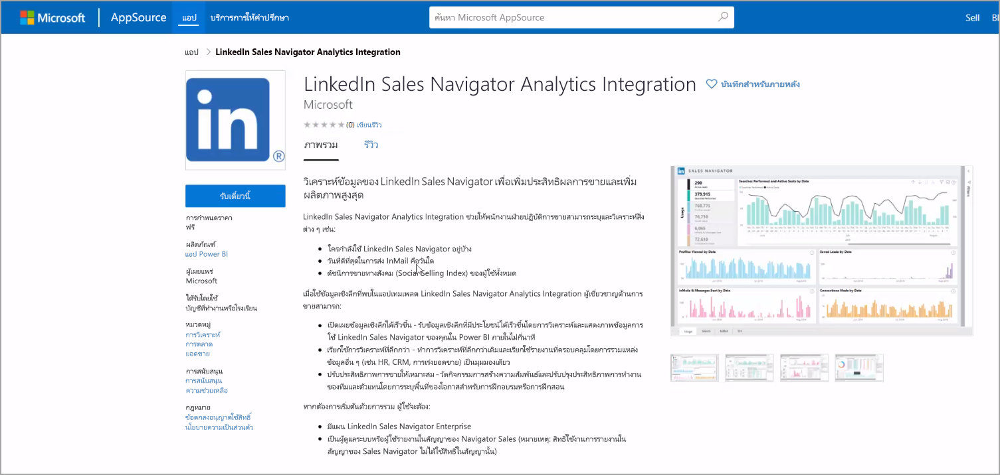

เมื่อดาวน์โหลดแอป คุณเลือกว่าจะเชื่อมต่อกับข้อมูลของคุณหรือสำรวจแอปด้วยข้อมูลตัวอย่าง คุณย้อนกลับและเชื่อมต่อกับข้อมูล LinkedIn Sales Navigator ของคุณเองหลังจากที่คุณสำรวจข้อมูลตัวอย่างได้เสมอ 

คุณดาวน์โหลดแอปแม่แบบ **LinkedIn Sales Navigator** ได้จากลิงก์ต่อไปนี้
* [แอปแม่แบบ LinkedIn Sales Navigator](https://appsource.microsoft.com/en-us/product/power-bi/pbi-contentpacks.linkedin_navigator)

แอปแม่แบบจะมีแท็บ 4 แบบเพื่อช่วยวิเคราะห์และแชร์ข้อมูลของคุณ ดังนี้

* การใช้งาน
* Search
* InMail
* SSI

แท็บ**การใช้งาน**จะแสดงข้อมูล LinkedIn Sales Navigator โดยรวมของคุณ

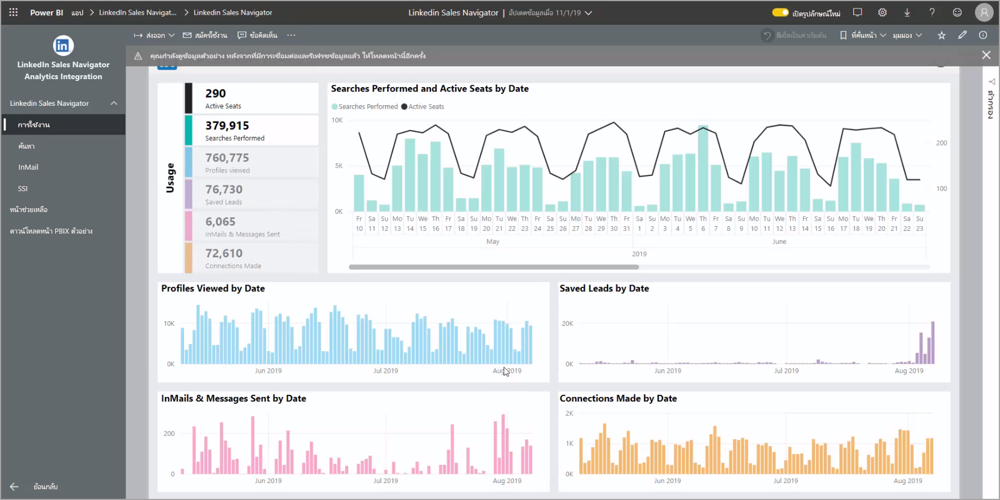

แท็บ**ค้นหา**จะช่วยให้คุณดูผลลัพธ์การค้นหาได้ละเอียดยิ่งขึ้น

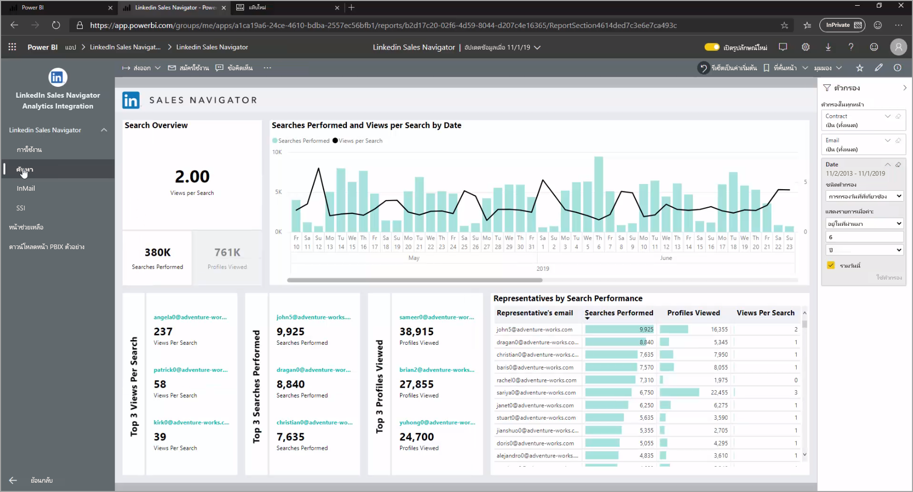

**InMail** ให้ข้อมูลเชิงลึกเกี่ยวกับการใช้งาน InMail รวมถึงจำนวนการส่ง InMail อัตราการยอมรับ และข้อมูลอื่นๆ ที่เป็นประโยชน์

แท็บ **SSI** ให้รายละเอียดเพิ่มเติมเกี่ยวกับดัชนีการขายทางสังคม (SSI)

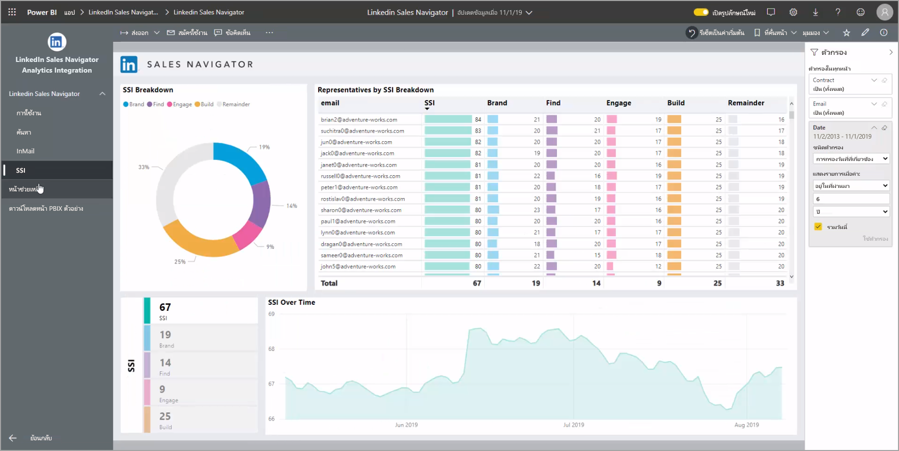

หากต้องการเปลี่ยนจากข้อมูลตัวอย่างปเป็นข้อมูลของคุณเอง ให้เลือก**แก้ไขแอป**ที่มุมขวาบน (ไอคอนดินสอ) และเลือก**เชื่อมต่อข้อมูล**จากหน้าจอที่ปรากฎขึ้น

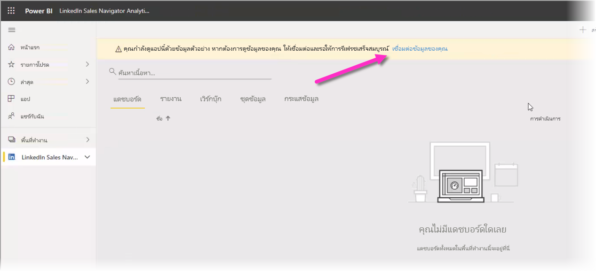

จากตรงนี้ คุณจะเชื่อมต่อข้อมูลของคุณได้โดยเลือกจำนวนวันของข้อมูลที่จะโหลด คุณโหลดข้อมูลได้สูงสุดถึง 365 วัน คุณจะต้องลงชื่อเข้าใช้และใช้อีเมลเดิมที่คุณใช้ลงชื่อเข้าใช้ LinkedIn Sales Navigator ผ่านเว็บไซต์อีกครั้ง 

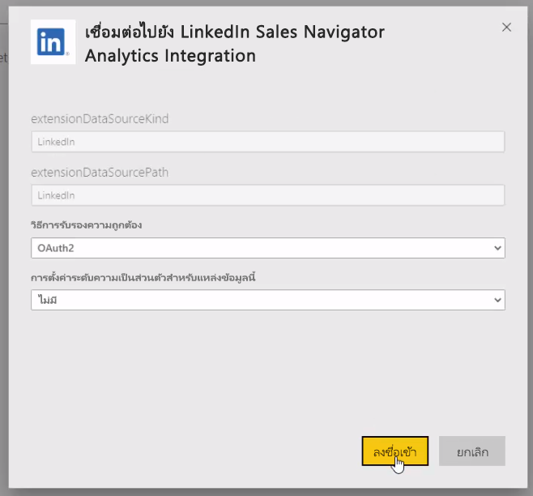

แอปแม่แบบ จากนั้นรีเฟรชข้อมูลในแอปด้วยข้อมูลข้องคุณ คุณยังตั้งค่าการรีเฟรชตามกำหนดการได้เพื่อให้ข้อมูลในแอปเป็นปัจจุบันตามความถี่การรีเฟรชที่คุณระบุ 

เมื่อข้อมูลอัปเดต คุณจะเห็นข้อมูลของคุณปรากฎในแอป

## การขอความช่วยเหลือ

หากคุณประสบปัญหาเมื่อเชื่อมต่อกับข้อมูลของคุณ คุณสามารถติดต่อฝ่ายสนับสนุน LinkedIn Sales Navigator ได้ที่ https://www.linkedin.com/help/sales-navigator 

## ขั้นตอนถัดไป
มีข้อมูลหลากหลายประเภทที่คุณสามารถเชื่อมต่อโดยใช้ Power BI Desktop สำหรับข้อมูลเพิ่มเติมเกี่ยวกับแหล่งข้อมูล โปรดดูทรัพยากรต่อไปนี้:

* [Power BI Desktop คืออะไร](../fundamentals/desktop-what-is-desktop.md)
* [แหล่งข้อมูลใน Power BI Desktop](desktop-data-sources.md)
* [จัดรูปทรง และรวมข้อมูลด้วย Power BI Desktop](desktop-shape-and-combine-data.md)
* [เชื่อมต่อกับเวิร์กบุ๊ก Excel ใน Power BI Desktop](desktop-connect-excel.md)   
* [ใส่ข้อมูลลงใน Power BI Desktop โดยตรง](desktop-enter-data-directly-into-desktop.md)   
