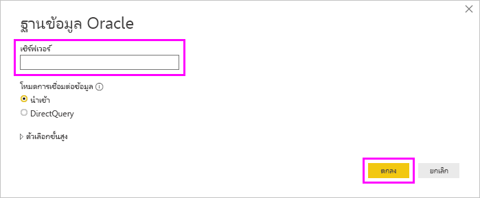

# เชื่อมต่อกับฐานข้อมูล Oracle ด้วย Power BI Desktop
การเชื่อมต่อกับฐานข้อมูล Oracle ด้วย Power BI Desktop นั้น ต้องติดตั้งซอฟต์แวร์ไคลเอ็นต์ Oracle ที่ถูกต้องบนคอมพิวเตอร์ที่ใช้งาน Power BI Desktop ซอฟต์แวร์ไคลเอ็นต์ Oracle ที่คุณใช้ขึ้นอยู่กับเวอร์ชันของ Power BI Desktop ที่คุณได้ติดตั้ง: 32 บิต หรือ 64 บิต นอกจากนี้ยังขึ้นอยู่กับเวอร์ชันของเซิร์ฟเวอร์ Oracle ของคุณ

เวอร์ชัน Oracle ที่รองรับ: 
- Oracle Server 9 และเวอร์ชันที่ใหม่กว่า
- ซอฟต์แวร์ Oracle Data Access Client (ODAC) 11.2 และเวอร์ชันที่ใหม่กว่า

> [!NOTE]
> หากคุณกำลังกำหนดค่าฐานข้อมูล Oracle สำหรับ Power BI Desktop เกตเวย์ข้อมูลในองค์กร หรือ เซิร์ฟเวอร์รายงาน Power BI โปรดดูข้อมูลในบทความ[ชนิดการเชื่อมต่อ Oracle](https://docs.microsoft.com/sql/reporting-services/report-data/oracle-connection-type-ssrs?view=sql-server-ver15) 

## หา Power BI Desktop ที่ติดตั้งอยู่เวอร์ชันใด
เมื่อต้องการตรวจสอบเวอร์ชันของ Power BI Desktop ที่ถูกติดตั้ง ให้เลือก **ไฟล์** > **วิธีใช้** > **เกี่ยวกับ** จากนั้นให้ตรวจสอบบรรทัด **เวอร์ชัน** ในรูปต่อไปนี้ Power BI Desktop เวอร์ชัน 64 บิตถูกติดตั้ง

## ติดตั้ง Oracle client
- สำหรับ Power BI Desktop เวอร์ชัน 32 บิต [ดาวน์โหลดและติดตั้งไคลเอ็นต์ Oracle 32 บิต](https://www.oracle.com/technetwork/topics/dotnet/utilsoft-086879.html).

- สำหรับ Power BI Desktop เวอร์ชัน 64 บิต [ดาวน์โหลดและติดตั้งไคลเอ็นต์ Oracle 64 บิต](https://www.oracle.com/database/technologies/odac-downloads.html).

> [!NOTE]
> เลือกเวอร์ชันของ Oracle Data Access Client (ODAC) ซึ่งสามารถทำงานร่วมกับเซิร์ฟเวอร์ Oracle ของคุณได้ ตัวอย่างเช่น ODAC 12.x ไม่รองรับเซิร์ฟเวอร์ Oracle เวอร์ชัน 9
> เลือกตัวติดตั้ง Windows ของไคลเอ็นต์ Oracle
> ระหว่างการตั้งค่าของไคลเอ็นต์ Oracle คุณต้องตรวจสอบให้แน่ใจว่าได้เปิดใช้งาน *กำหนดค่า ODP.NET และ/หรือผู้ให้บริการ Oracle สำหรับ ASP.NET ที่ระดับเครื่อง* โดยการเลือกกล่องกาเครื่องหมายที่เกี่ยวข้องในระหว่างการตั้งค่าตัวช่วยสร้าง ตัวช่วยสร้างไคลเอ็นต์ Oracle บางเวอร์ชันเลือกกล่องกาเครื่องหมายตามค่าเริ่มต้น ซึ่งเวอร์ชันอื่น ๆ ไม่ทำเช่นนี้ ตรวจสอบให้แน่ใจว่าคุณได้เลือกกล่องกาเครื่องหมายเพื่อให้ Power BI สามารถเชื่อมต่อกับฐานข้อมูล Oracle ของคุณได้

## เชื่อมต่อกับฐานข้อมูล Oracle
หลังจากที่คุณติดตั้งไคลเอ็นต์ไดร์ฟเวอร์ Oracle ที่ตรงกัน คุณสามารถเชื่อมต่อกับฐานข้อมูล Oracle เมื่อต้องทำการเชื่อมต่อ ให้ทำตามขั้นตอนต่อไปนี้

1. จากแท็บ **หน้าแรก** ให้เลือก **รับข้อมูล** 

2. จากหน้าต่าง **รับข้อมูล** ที่ปรากฏขึ้น ให้เลือก **เพิ่มเติม** (ถ้าจำเป็น) เลือก **ฐานข้อมูล** > **ฐานข้อมูล Oracle**และจากนั้นเลือก **เชื่อมต่อ**
   
   
3. ในกล่องโต้ตอบ **ฐานข้อมูล Oracle** ที่ปรากฏขึ้น ให้ใส่ชื่อของ **เซิร์ฟเวอร์** และเลือก **ตกลง** หากกำหนดให้มี SID ให้ระบุโดยใช้รูปแบบ: *ServerName/SID* โดยที่ *SID* เป็นชื่อที่ไม่ซ้ำกันของฐานข้อมูล ถ้ารูปแบบ *ServerName/SID* ไม่ทำงาน ให้ใช้ *ServerName/ServiceName* โดยที่ *ServiceName* เป็นนามแฝงที่คุณใช้เพื่อเชื่อมต่อ

   

   > [!NOTE]
   > หากคุณกำลังใช้ฐานข้อมูลในเครื่องหรือการเชื่อมต่อฐานข้อมูลที่ทำงานแบบอิสระ คุณอาจต้องวางชื่อเซิร์ฟเวอร์ในเครื่องหมายคำพูดเพื่อหลีกเลี่ยงข้อผิดพลาดในการเชื่อมต่อ 
      
4. ถ้าคุณต้องการนำเข้าข้อมูลโดยใชคิวรี่ของฐานข้อมูลแบบเนทีฟ ให้ใส่คิวรีของคุณในกล่อง **คำสั่ง SQL** ที่ปรากฏขึ้นเมื่อคุณขยายส่วน **ตัวเลือกขั้นสูง** ของกล่องโต้ตอบ **ฐานข้อมูล Oracle**
   
   

5. หลังจากที่คุณป้อนข้อมูลของฐานข้อมูล Oracle ของคุณลงในกล่องโต้ตอบฐานข้อมูล **Oracle** (รวมถึงข้อมูลประกอบใดๆ เช่น SID หรือคิวรี่ฐานข้อมูลเนทีฟ) ให้เลือก **ตกลง** เพื่อเชื่อมต่อ
5. ถ้าฐานข้อมูล Oracle ต้องใช้ข้อมูลประจำตัวผู้ใช้ฐานข้อมูล ให้ป้อนข้อมูลประจำตัวเหล่านั้นในกล่องโต้ตอบเมื่อได้รับการขอจากระบบ

## การแก้ไขปัญหา

คุณอาจพบข้อผิดพลาดต่าง ๆ มากมายจาก Oracle เมื่อไวยากรณ์การตั้งชื่อไม่ถูกต้อง หรือไม่ได้กำหนดค่าอย่างถูกต้อง:

* ORA-12154: TNS: ไม่สามารถแก้ไขตัวระบุการเชื่อมต่อที่ระบุได้
* ORA-12514: TNS: ในขณะนี้ ตัวรอรับการติดต่อไม่รู้จักบริการที่ร้องขอในตัวอธิบายการเชื่อมต่อ
* ORA-12541: TNS: ไม่มีตัวรอรับการติดต่อ
* ORA-12170: TNS: เกิดเหตุการณ์การเชื่อมต่อหมดเวลา
* ORA-12504: TNS: ตัวรอรับการติดต่อไม่ได้รับ SERVICE_NAME ใน CONNECT_DATA

ข้อผิดพลาดเหล่านี้อาจเกิดขึ้นหากไม่ได้ติดตั้ง Oracle client หรือกำหนดค่าไม่ถูกต้อง ถ้ามีการติดตั้งอยู่แล้ว ให้ตรวจสอบว่ามีการกำหนดค่าไฟล์ tnsnames.ora อย่างถูกต้องหรือไม่ และคุณกำลังใช้ net_service_name ที่เหมาะสมหรือไม่ นอกจากนี้ คุณจะต้องตรวจสอบให้แน่ใจว่า net_service_name สำหรับเครื่องที่ใช้ Power BI Desktop และเครื่องที่ใช้งานเกตเวย์นั้นเป็นตัวเดียวกันหรือไม่ สำหรับข้อมูลเพิ่มเติม โปรดดู [ติดตั้ง Oracle Client](#install-the-oracle-client)

คุณอาจประสบปัญหาความเข้ากันได้ระหว่างเวอร์ชัน Oracle server และเวอร์ชัน Oracle Data Access Client โดยทั่วไปแล้ว คุณต้องใช้เวอร์ชันที่สอดคล้องกัน เนื่องจากชุดการทำงานบางอย่างอาจไม่เข้ากัน ตัวอย่างเช่น ODAC 12.x นั้นไม่รองรับเซิร์ฟเวอร์ Oracle เวอร์ชัน 9

ถ้าคุณดาวน์โหลด Power BI Desktop จาก Microsoft Store คุณอาจไม่สามารถเชื่อมต่อกับฐานข้อมูล Oracle เนื่องจากปัญหาโปรแกรมควบคุม Oracle ถ้าคุณพบปัญหานี้ ข้อความแสดงข้อผิดพลาดที่ส่งคืนคือ: *ไม่ได้ตั้งค่าการอ้างอิงอ็อปเจ็กต์* การแก้ไขปัญหา ให้ทำหนึ่งในขั้นตอนเหล่านี้:

* ดาวน์โหลด Power BI Desktop จาก [ศูนย์ดาวน์โหลด](https://www.microsoft.com/download/details.aspx?id=58494) แทนที่จะเป็น Microsoft Store

* ถ้าคุณต้องการใช้เวอร์ชันจาก Microsoft Store: บนคอมพิวเตอร์ของคุณ ให้คัดลอก oraons.dll จาก_12.X.X\client_X_ ลงใน _12.X.X\client_X\bin_ โดยที่ _X_ แสดงเวอร์ชันและหมายเลขไดเรกทอรี่

หากคุณเห็นข้อความแสดงข้อผิดพลาด *ไม่ได้ตั้งค่าการอ้างอิงอ็อปเจ็กต์* ใน Power BI Gateway เมื่อคุณเชื่อมต่อกับฐานข้อมูล Oracle ให้ทำตามคำแนะนำใน [จัดการแหล่งข้อมูลของคุณ - Oracle](service-gateway-onprem-manage-oracle.md)

ถ้าคุณกำลังใช้เซิร์ฟเวอร์รายงาน Power BI ให้ดูคำแนะนำในบทความ [ชนิดการเชื่อมต่อ Oracle](https://docs.microsoft.com/sql/reporting-services/report-data/oracle-connection-type-ssrs?view=sql-server-ver15)
