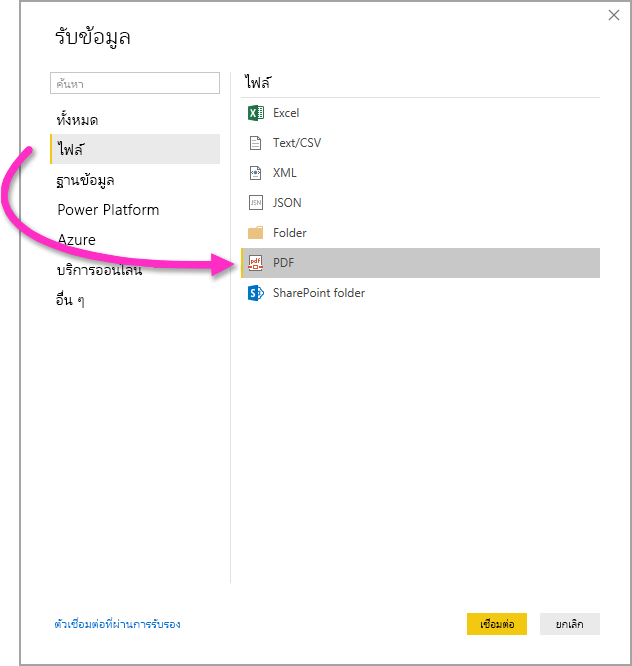

# เชื่อมต่อกับไฟล์ PDF ใน Power BI Desktop
ใน Power BI Desktop คุณสามารถเชื่อมต่อกับ **ไฟล์ PDF** และใช้ข้อมูลที่รวมจากไฟล์เช่นเดียวกับแหล่งข้อมูลอื่น ๆ ใน Power BI Desktop

หัวข้อต่อไปนี้อธิบายถึงวิธีเชื่อมต่อกับ **ไฟล์ PDF** เลือกข้อมูล และนำข้อมูลดังกล่าวไปวางไว้ที่ **Power BI Desktop**

เราแนะนำให้อัปเกรดเป็นเวอร์ชันล่าสุด**Power BI Desktop**เสมอ ซึ่งคุณสามารถรับได้จากลิงก์ใน[รับ Power BI Desktop](../fundamentals/desktop-get-the-desktop.md) 

## เชื่อมต่อกับไฟล์ PDF
หากต้องการเชื่อมต่อกับไฟล์ **PDF** ให้เลือก **รับข้อมูล** จากริบบิ้น **หน้าแรก** ใน Power BI Desktop เลือก **ไฟล์** จากหมวดหมู่ด้านซ้าย และคุณจะเห็น **PDF**

คุณได้รับพร้อมท์ให้ระบุตำแหน่งของไฟล์ PDF ที่คุณต้องการใช้ เมื่อคุณระบุตำแหน่งไฟล์และโหลดไฟล์ PDF หน้าต่าง **เนวิเกเตอร์** จะปรากฏขึ้นและแสดงข้อมูลจากไฟล์ ซึ่งคุณสามารถเลือกองค์ประกอบหนึ่งหรือหลายรายการเพื่อนำเข้าและใช้ใน **Power BI Desktop**

การเลือกช่องทำเครื่องหมายถัดจากองค์ประกอบที่ค้นพบในไฟล์ PDF จะแสดงรายการในบานหน้าต่างด้านขวา เมื่อคุณพร้อมที่จะนำเข้าแล้วให้เลือกปุ่ม **Load (โหลด)** เพื่อนำข้อมูลมาไว้ใน **Power BI Desktop**

ตั้งแต่เดือนพฤศจิกายน 2018 ในการเผยแพร่ของ **Power BI Desktop** คุณสามารถระบุ**หน้าเริ่มต้น**และ**หน้าสุดท้าย**เป็นพารามิเตอร์เพิ่มเติมสำหรับการเชื่อมต่อ PDF ของคุณได้ คุณยังสามารถระบุพารามิเตอร์เหล่านี้ในภาษาสูตร M โดยใช้รูปแบบต่อไปนี้:

`Pdf.Tables(File.Contents("c:\sample.pdf"), [StartPage=10, EndPage=11])`

## ขั้นตอนถัดไป
มีข้อมูลหลากหลายประเภทที่คุณสามารถเชื่อมต่อโดยใช้ Power BI Desktop สำหรับข้อมูลเพิ่มเติมเกี่ยวกับแหล่งข้อมูล โปรดดูทรัพยากรต่อไปนี้:

* [Power BI Desktop คืออะไร](../fundamentals/desktop-what-is-desktop.md)
* [แหล่งข้อมูลใน Power BI Desktop](desktop-data-sources.md)
* [จัดรูปทรง และรวมข้อมูลด้วย Power BI Desktop](desktop-shape-and-combine-data.md)
* [เชื่อมต่อกับเวิร์กบุ๊ก Excel ใน Power BI Desktop](desktop-connect-excel.md)   
* [ใส่ข้อมูลลงใน Power BI Desktop โดยตรง](desktop-enter-data-directly-into-desktop.md)   
