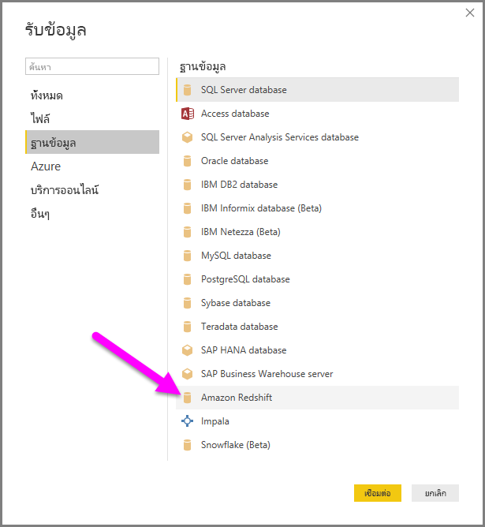
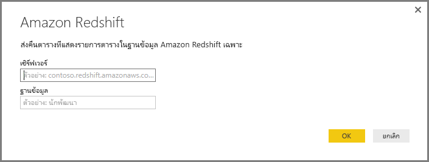
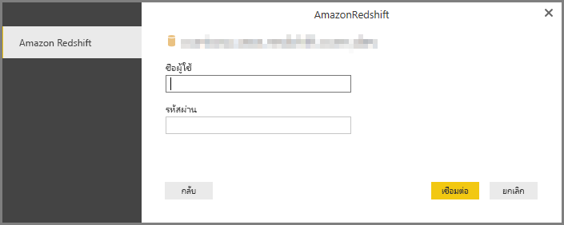
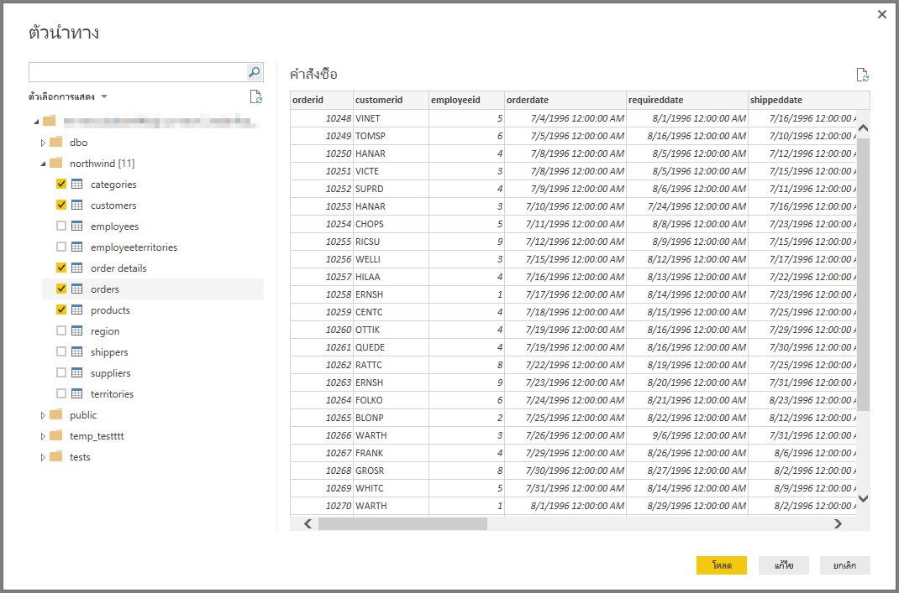

# เชื่อมต่อกับฐานข้อมูล Amazon Redshift ใน Power BI Desktop
ใน **Power BI Desktop** คุณสามารถเชื่อมต่อกับฐานข้อมูล **Amazon Redshift** และใช้ข้อมูลเบื้องต้นเช่นเดียวกับแหล่งข้อมูลอื่นใน Power BI Desktop ได้

## เชื่อมต่อกับฐานข้อมูล Amazon Redshift
เพื่อเชื่อมต่อกับฐานข้อมูล **Impala** ให้เลือก**รับข้อมูล**จาก ริบบอน**หน้าแรก** ใน Power BI Desktop เลือก**ฐานข้อมูล**จากประเภททางด้านซ้าย จากนั้นคุณจะเห็น **Amazon Redshift**

ในหน้าต่าง**Amazon Redshift**ที่ปรากฎขึ้น พิมพ์หรือวางชื่อเซิร์ฟเวอร์**Amazon Redshift**และฐานข้อมูลของคุณลงในกล่อง ในฐานะเป็นส่วนหนึ่งของเขตข้อมูล*เซิร์ฟเวอร์* ผู้ใช้สามารถระบุพอร์ตในรูปแบบต่อไปนี้: *ServerURL:Port*

เมื่อได้รับการถาม ให้ใส่ชื่อผู้ใช้และรหัสผ่านของคุณ คุณควรใช้ชื่อเซิร์ฟเวอร์ที่ได้ตรงกับใบรับรอง SSL เพื่อหลีกเลี่ยงข้อผิดพลาด 

เมื่อเชื่อมต่อเสร็จเรียบร้อยแล้ว หน้าต่าง**ตัวนำทาง**จะปรากฏขึ้น และแสดงข้อมูลที่พร้อมใช้งานบนเซิร์ฟเวอร์ ซึ่งคุณสามารถเลือกองค์ประกอบหนึ่งรายการหรือหลายรายการเพื่อนำเข้าและใช้ใน**Power BI Desktop** ได้

เมื่อคุณทำการเลือกจากหน้าต่าง**ตัวนำทาง** คุณสามารถเลือกที่จะ**การโหลด**หรือ**แก้ไข**ข้อมูลได้

* ถ้าคุณเลือกที่จะ**โหลด**ข้อมูล คุณจะถูกถามให้ใช้ฟังก์ชัน*นำเข้า*หรือโหมด*DirectQuery*เพื่อโหลดข้อมูล สำหรับข้อมูลเพิ่มเติม ให้ตรวจสอบ[บทความที่อธิบาย DirectQuery](desktop-use-directquery.md)
* ถ้าคุณเลือกที่จะ**แก้ไข**ข้อมูล **ตัวแก้ไขคิวรี**จะปรากฏขึ้นซึ่งคุณสามารถทำการเรียงลำดับของการเปลี่ยนแปลงและตัวกรองข้อมูลทั้งหมด มีหลายตัวที่จะนำไปใช้กับต้นแบบฐานข้อมูล**Amazon Redshift**  (ถ้าได้รับการสนับสนุน)

## ขั้นตอนถัดไป
มีข้อมูลหลากหลายประเภทที่คุณสามารถเชื่อมต่อโดยใช้ Power BI Desktop สำหรับข้อมูลเพิ่มเติมเกี่ยวกับแหล่งข้อมูล โปรดดูทรัพยากรต่อไปนี้:

* [Power BI Desktop คืออะไร](../fundamentals/desktop-what-is-desktop.md)
* [แหล่งข้อมูลใน Power BI Desktop](desktop-data-sources.md)
* [จัดรูปทรงและรวมข้อมูลด้วย Power BI Desktop](desktop-shape-and-combine-data.md)
* [เชื่อมต่อกับเวิร์กบุ๊ก Excel ใน Power BI Desktop](desktop-connect-excel.md)   
* [ป้อนข้อมูลลงใน Power BI Desktop โดยตรง](desktop-enter-data-directly-into-desktop.md)   
