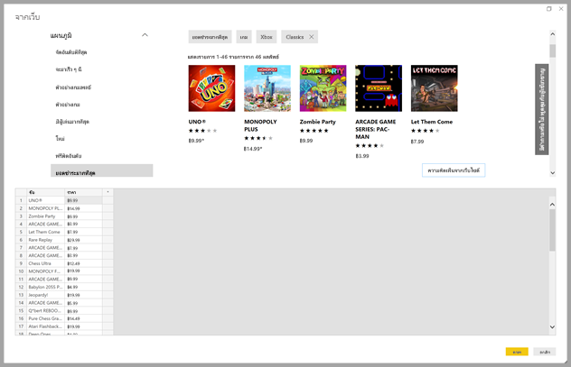
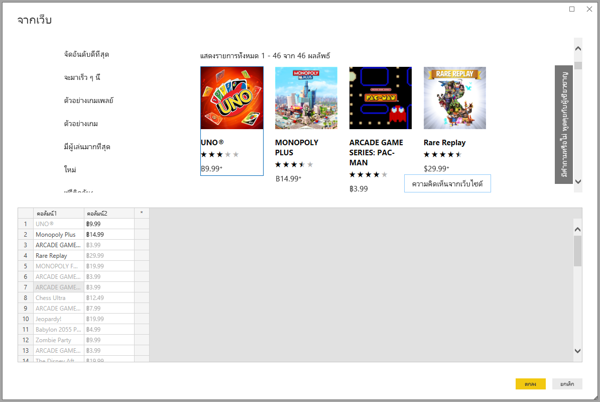

# รับข้อมูลเว็บเพจโดยให้ตัวอย่าง

การรับข้อมูลจากเว็บเพจ ให้ผู้ใช้สามารถแยกข้อมูลจากเว็บเพจ และนำเข้าข้อมูลนั้นลงใน *Power BI Desktop* ได้อย่างง่ายดาย อย่างไรก็ตาม ข้อมูลบนเว็บเพจมักจะไม่อยู่ในตารางที่เป็นระเบียบ ซึ่งดึงข้อมูลได้ง่าย การรับข้อมูลจากหน้าดังกล่าวอาจเป็นปัญหาท้าทาย แม้ว่าข้อมูลดังกล่าวจะมีการจัดโครงสร้างและสอดคล้องกันก็ตาม

มีวิธีแก้ไขวิธีหนึ่ง ด้วยคุณลักษณะ *รับข้อมูลจากเว็บตามตัวอย่าง* คุณจะสามารถแสดง Power BI Desktop ว่าข้อมูลใดที่คุณต้องการดึงโดยจัดหาตัวอย่างหนึ่งรายการขึ้นไปภายในกล่องโต้ตอบของตัวเชื่อมต่อ Power BI Desktop จะรวบรวมข้อมูลอื่นบนหน้าดังกล่าวที่ตรงกับตัวอย่างของคุณ ด้วยโซลูชันนี้ คุณสามารถแยกข้อมูลต่าง ๆ ได้จากเว็บเพจ รวมถึงข้อมูลที่พบในตาราง*และ*ข้อมูลอื่น ๆ ที่ไม่ใช่ตารางได้

ราคาในกราฟิกมีเพื่อใช้เป็นตัวอย่างเท่านั้น

## รับข้อมูลจากเว็บโดยตัวอย่าง

เลือก **รับข้อมูล** จากเมนู Ribbon **หน้าแรก** ในกล่องโต้ตอบที่ปรากฏ เลือก **อื่นๆ** จากประเภทในบานหน้าต่างด้านซ้ายมือ จากนั้นเลือก **เว็บ** เลือก **เชื่อมต่อ** เพื่อดำเนินการต่อ

ใน **จากเว็บ** ป้อน URL ของหน้าเว็บที่คุณต้องการดึงข้อมูล ในบทความนี้ พวกเราจะใช้หน้าของ Microsoft Store Web และแสดงลักษณะการทำงานของตัวเชื่อมต่อนี้

ถ้าคุณต้องการทำตาม คุณสามารถใช้ [URL ของ Microsoft Store](https://www.microsoft.com/store/top-paid/games/xbox?category=classics) ที่เราใช้ในบทความนี้:

    https://www.microsoft.com/store/top-paid/games/xbox?category=classics

เมื่อคุณเลือก**ตกลง** คุณจะถูกนำทางไปยังกล่องโต้ตอบ**ตัวนำทาง** ที่ซึ่งจะแสดงตารางที่ตรวจพบโดยอัตโนมัติจากเว็บเพจ ในกรณีที่ปรากฏในรูปภาพด้านล่างนี้ จะไม่พบตาราง เลือก **เพิ่มตารางโดยใช้ตัวอย่าง** เพื่อแสดงตัวอย่าง

**เพิ่มตารางโดยใช้ตัวอย่าง** จะแสดงหน้าต่างแบบโต้ตอบที่คุณสามารถดูตัวอย่างของเนื้อหาของเว็บเพจได้ ป้อนค่าตัวอย่างของข้อมูลที่คุณต้องการดึงออกมา

ในตัวอย่างนี้ เราจะแยก *ชื่อ* และ *ราคา* สำหรับแต่ละเกมบนหน้า เราสามารถดำเนินการดังกล่าวได้โดยการระบุคู่ตัวอย่างจากหน้าดังกล่าวสำหรับแต่ละคอลัมน์ เมื่อป้อนตัวอย่างแล้ว *Power Query* จะดึงข้อมูลที่เหมาะกับรูปแบบของรายการตัวอย่างโดยใช้อัลกอริทึมการดึงข้อมูลอัจฉริยะ

> [!NOTE]
> ค่าแนะนำจะแสดงค่าที่มีความยาวน้อยกว่าหรือเท่ากับ 128 อักขระเท่านั้น

เมื่อคุณพอใจกับข้อมูลที่ดึงออกมาจากเว็บเพจแล้ว เลือก **ตกลง** เพื่อไปที่ตัวแก้ไข Power Query คุณสามารถปรับใช้การแปลงข้อมูลเพิ่มเติมหรือจัดรูปร่างข้อมูลได้ เช่น การผสานข้อมูลนี้กับแหล่งข้อมูลอื่นของเรา

จากที่นั่น คุณสามารถสร้างวิชวล หรือใช้ข้อมูลเว็บเพจเพื่อสร้างรายงาน Power BI Desktop ของคุณได้

## ขั้นตอนถัดไป

มีข้อมูลหลากหลายประเภทที่คุณสามารถเชื่อมต่อโดยใช้ Power BI Desktop สำหรับข้อมูลเพิ่มเติมเกี่ยวกับแหล่งข้อมูล โปรดดูทรัพยากรต่อไปนี้:

* [เพิ่มคอลัมน์จากตัวอย่างใน Power BI Desktop](../create-reports/desktop-add-column-from-example.md)
* [เชื่อมต่อหน้าเว็บจาก Power BI Desktop](desktop-connect-to-web.md)
* [แหล่งข้อมูลใน Power BI Desktop](desktop-data-sources.md)
* [จัดรูปร่างและรวมข้อมูลใน Power BI Desktop](desktop-shape-and-combine-data.md)
* [เชื่อมต่อกับเวิร์กบุ๊ก Excel ใน Power BI Desktop](desktop-connect-excel.md)
* [เชื่อมต่อกับไฟล์ CSV ใน Power BI Desktop](desktop-connect-csv.md)
* [ใส่ข้อมูลลงใน Power BI Desktop โดยตรง](desktop-enter-data-directly-into-desktop.md)
