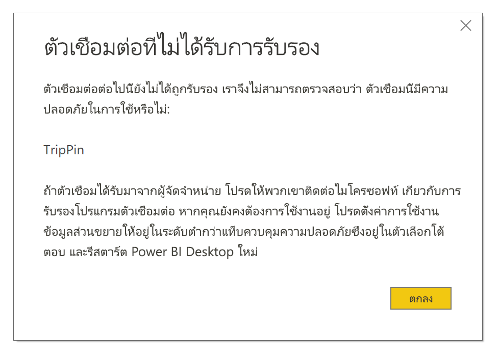

# การขยายของตัวเชื่อมต่อใน Power BI

Power BI สามารถเชื่อมต่อกับข้อมูลโดยใช้ตัวเชื่อมต่อและแหล่งข้อมูลทั่วไป เช่น ODBC, OData, OLE DB, Web, CSV, XML และ JSON หรือนักพัฒนาสามารถเปิดใช้งานแหล่งข้อมูลใหม่ด้วยส่วนขยายข้อมูลแบบกำหนดเองที่เรียกว่า *ตัวเชื่อมต่อแบบกำหนดเอง* ตัวเชื่อมต่อแบบกำหนดเองบางตัวจะได้รับการรับรองและเผยแพร่โดย Microsoft ในฐานะ *ตัวเชื่อมต่อที่ได้รับการรับรอง*

เพื่อใช้ตัวเชื่อมต่อแบบกำหนดเองที่ยังไม่ผ่านการรับรอง ซึ่งคุณหรือบุคคลที่สามได้พัฒนาขึ้น คุณจะต้องปรับการตั้งค่าการรักษาความปลอดภัยของ Power BI Desktop เพื่ออนุญาตให้ส่วนขยายสามารถโหลดได้โดยไม่จำเป็นต้องตรวจสอบความถูกต้องหรือคำเตือน เนื่องจากรหัสนี้สามารถจัดการข้อมูลประจำตัว รวมถึงการส่งข้อมูลประจำตัวผ่านทาง HTTP และเพิกเฉยระดับความเป็นส่วนตัว คุณควรใช้การตั้งค่าการรักษาความปลอดภัยนี้ ในกรณีที่คุณไว้วางใจในตัวเชื่อมต่อแบบกำหนดเองของคุณอย่างสมบูรณ์เท่านั้น

อีกตัวเลือกหนึ่งสำหรับนักพัฒนาคือ การลงชื่อเข้าใช้ตัวเชื่อมต่อที่มีใบรับรอง และระบุข้อมูลที่คุณจำเป็นต้องใช้โดยไม่เปลี่ยนแปลงการตั้งค่าการรักษาความปลอดภัย สำหรับข้อมูลเพิ่มเติม ดู [เกี่ยวกับตัวเชื่อมต่อบุคลที่สามที่เชื่อถือได้](desktop-trusted-third-party-connectors.md)

## ตัวเชื่อมต่อแบบกำหนดเอง

ตัวเชื่อมต่อแบบกำหนดเองที่ยังไม่ผ่านการรับรอง สามารถรวมการใช้งานได้อย่างกว้างขวาง ตั้งแต่ API ขนาดเล็กที่มีความสำคัญต่อธุรกิจของคุณไปจนถึงบริการเฉพาะของอุตสาหกรรมขนาดใหญ่ที่ Microsoft ยังไม่ได้เผยแพร่ตัวเชื่อมต่อให้ มีการเผยแพร่ตัวเชื่อมต่อจำนวนมากโดยผู้จำหน่าย ถ้าคุณจำเป็นต้องมีตัวเชื่อมต่อข้อมูลเฉพาะ ให้ติดต่อผู้จำหน่าย 

เมื่อต้องการใช้ตัวเชื่อมต่อแบบกำหนดเองที่ยังไม่ผ่านการรับรอง ให้วางตัวเชื่อมต่อไฟล์ *.pq*, *.pqx*, *.m* หรือ *.mez* ในโฟลเดอร์ *\[Documents]\\Power BI Desktop\\ตัวเชื่อมต่อแบบกำหนดเอง* หากไม่มีโฟลเดอร์ ให้สร้างใหม่

ปรับการตั้งค่าการรักษาความปลอดภัยของส่วนขยายข้อมูลดังนี้:

ใน Power BI Desktop เลือก **ไฟล์** > **ตัวเลือกและการตั้งค่า** > **ตัวเลือก** > **การรักษาความปลอดภัย**

ภายใต้ **ส่วนขยายข้อมูล** เลือก **(ไม่แนะนำ) อนุญาตให้โหลดส่วนขยายใด ๆ โดยไม่มีการตรวจสอบความถูกต้องหรือคำเตือน** เลือก **ตกลง** จากนั้น รีสตาร์ท Power BI Desktop 

การตั้งค่าความปลอดภัยของส่วนขยายข้อมูล Power BI Desktop ค่าเริ่มต้นคือ **(แนะนำ) อนุญาตให้ส่วนขยายของบุคคลที่สามที่เชื่อถือได้อื่น ๆ และได้รับการรับรองจาก Microsoft เท่านั้นที่จะโหลดได้** ด้วยการตั้งค่านี้ หากมีตัวเชื่อมต่อแบบกำหนดเองที่ไม่ได้รับการรับรองบนระบบของคุณ กล่องโต้ตอบ **ตัวเชื่อมต่อที่ไม่ได้รับการรับรอง** จะปรากฏขึ้นที่หน้าเริ่มต้นของ Power BI Desktop โดยแสดงรายการตัวเชื่อมต่อที่ไม่สามารถโหลดอย่างปลอดภัยได้

เมื่อต้องการแก้ไขข้อผิดพลาดนี้ คุณสามารถเปลี่ยนการตั้งค่าการรักษาความปลอดภัยของ**ส่วนขยายข้อมูล**ของคุณ หรือลบตัวเชื่อมต่อที่ไม่ผ่านการรับรองออกจากโฟลเดอร์ *ตัวเชื่อมต่อแบบกำหนดเอง* ของคุณ

## ตัวเชื่อมต่อที่ผ่านการรับรอง

ชุดย่อยที่จำกัดของส่วนขยายข้อมูลถือว่า *ผ่านการรับรอง* ในขณะที่ Microsoft เผยแพร่ตัวเชื่อมต่อเหล่านี้ เราไม่รับผิดชอบต่อประสิทธิภาพการทำงานหรือการใช้งานฟังก์ชันได้อย่างต่อเนื่องของตัวเชื่อมต่อดังกล่าว นักพัฒนาบุคคลที่สามที่สร้างตัวเชื่อมต่อนั้น มีหน้าที่รับผิดชอบเกี่ยวกับการบำรุงรักษาและการสนับสนุน 

ใน Power BI Desktop ตัวเชื่อมต่อของบุคคลที่สามที่ผ่านการรับรอง จะปรากฏในรายการในกล่องโต้ตอบ **รับข้อมูล** พร้อมกับตัวเชื่อมต่อทั่วไปและที่พบบ่อย คุณไม่จำเป็นต้องปรับการตั้งค่าการรักษาความปลอดภัยเพื่อใช้ตัวเชื่อมต่อที่ผ่านการรับรอง

หากคุณต้องการให้ตัวเชื่อมต่อแบบกำหนดเองผ่านการรับรอง โปรดสอบถามผู้จำหน่ายของคุณเพื่อทำการติดต่อ dataconnectors@microsoft.com
