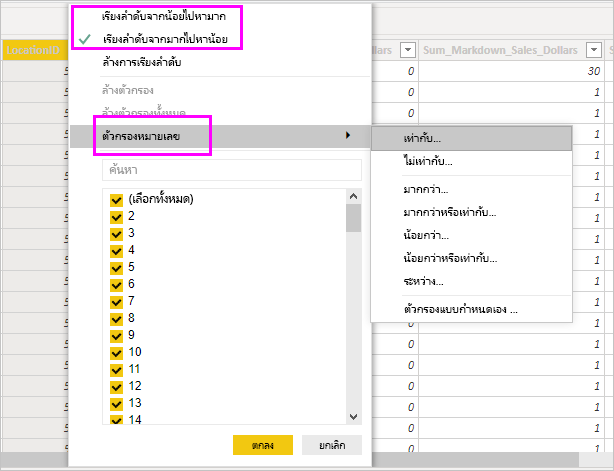

# ทำงานด้วยมุมมองข้อมูลใน Power BI Desktop

*มุมมองข้อมูล* ช่วยให้คุณตรวจสอบ สำรวจ และทำความเข้าใจข้อมูลในรูปแบบ *Power BI Desktop* ซึ่งจะแตกต่างจากวิธีที่คุณดูตาราง คอลัมน์ และข้อมูลใน *ตัวแก้ไข Power Query* ด้วยมุมมองข้อมูล คุณจะกำลังดูข้อมูลของคุณ*หลังจาก*ที่โหลดเข้ามาในรูปแบบเรียบร้อยแล้ว

> [!NOTE]
> เนื่องจากมุมมองข้อมูลแสดงข้อมูลหลังจากที่โหลดลงในแบบจำลองแล้ว ไอคอนมุมมองข้อมูลจะไม่สามารถมองเห็นได้หากแหล่งข้อมูลทั้งหมดขึ้นอยู่กับ DirectQuery 

เมื่อคุณกำลังจัดรูปแบบข้อมูลของคุณ บางครั้งคุณต้องการดูว่ามีอะไรอยู่ในตารางหรือคอลัมน์จริง ๆ โดยไม่สร้างวิชวลบนพื้นที่รายงาน คุณอาจต้องการดูลึกลงไปถึงระดับแถว ความสามารถนี้จะเป็นประโยชน์มาก โดยเฉพาะอย่างยิ่งเมื่อคุณกำลังจะสร้างการวัดและคอลัมน์จากการคำนวณ หรือคุณจำเป็นต้องระบุชนิดข้อมูลหรือประเภทข้อมูล

ลองมาดูรายละเอียดองค์ประกอบที่พบในมุมมองข้อมูลกันบ้าง

1. **ไอคอนมุมมองข้อมูล** เลือกไอคอนนี้เพื่อเข้าสู่มุมมองข้อมูล

2. **ตารางข้อมูล** พื้นที่นี้แสดงตารางที่เลือกและคอลัมน์และแถวทั้งหมดในตารางดด้วย คอลัมน์ที่ซ่อนจากมุมมอง*รายงาน*จะเป็นสีเทา คุณสามารถคลิกขวาบนคอลัมน์สำหรับตัวเลือก

3. **Ribbon การจัดรูปแบบ** คุณสามารถจัดการความสัมพันธ์ สร้างการคำนวณ เปลี่ยนชนิดข้อมูล รูปแบบ ประเภทข้อมูลสำหรับคอลัมน์

4. **แถบสูตร** ป้อนสูตรนิพจน์การวิเคราะห์ข้อมูล (DAX) สำหรับการวัดและคอลัมน์จากการคำนวณ

5. **ค้นหา** ค้นหาตารางหรือคอลัมน์ในแบบจำลองของคุณ

6. **รายการเขตข้อมูล** เลือกตารางหรือคอลัมน์เพื่อดูในตารางข้อมูล

## การกรองในมุมมองข้อมูล

คุณยังสามารถกรองและจัดเรียงข้อมูลในมุมมองข้อมูลได้อีกด้วย แต่ละคอลัมน์จะแสดงไอคอนที่ระบุทิศทางการจัดเรียง ถ้ามีการนำไปใช้

คุณสามารถกรองค่าแต่ละค่าได้ หรือใช้การกรองขั้นสูงตามข้อมูลในคอลัมน์

> [!NOTE]
> เมื่อมีการสร้างแบบจำลอง Power BI ในวัฒนธรรมอื่นนอกเหนือจากส่วนติดต่อผู้ใช้ปัจจุบันของคุณ กล่องการค้นหาจะไม่ปรากฏในส่วนติดต่อผู้ใช้ของมุมมองข้อมูล สำหรับสิ่งอื่นใดนอกเหนือจากเขตข้อมูลข้อความ ตัวอย่างเช่น รายการนี้จะปรับใช้สำหรับแบบจำลองที่สร้างขึ้นในภาษาอังกฤษแบบสหรัฐอเมริกาที่คุณดูในภาษาสเปน

## ขั้นตอนถัดไป

คุณสามารถทำการเรียงลำดับของของต่างๆ ด้วย Power BI Desktop สำหรับข้อมูลเพิ่มเติมเกี่ยวกับขีดความสามารถ กรุณาดูแหล่งทรัพยากรต่อไปนี้:

* [Power BI Desktop คืออะไร](../fundamentals/desktop-what-is-desktop.md)
* [ภาพรวมคำถามด้วย Power BI Desktop](../transform-model/desktop-query-overview.md)
* [ชนิดข้อมูลใน Power BI Desktop](desktop-data-types.md)
* [จัดรูปร่างและรวมข้อมูลด้วย Power BI Desktop](desktop-shape-and-combine-data.md)
* [งานแบบสอบถามทั่วไปใน Power BI Desktop](../transform-model/desktop-common-query-tasks.md)
