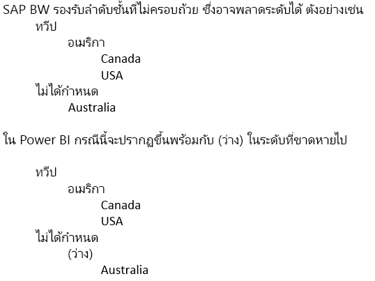

# เชื่อมต่อกับ SAP Business Warehouse โดยใช้ DirectQuery ใน Power BI
คุณสามารถเชื่อมต่อกับแหล่งข้อมูล **SAP Business Warehouse (BW)** ได้โดยตรงโดยใช้ **DirectQuery** เนื่องจากลักษณะแบบ OLAP/หลายมิติของ SAP BW ซึ่งมีความแตกต่างกันมากกว่าระหว่าง DirectQuery กับ SAP BW เมื่อเทียบกับแหล่งข้อมูลเชิงสัมพันธ์เช่น SQL Server ความแตกต่างเหล่านี้จะสรุปได้ดังนี้

* เมืื่อเทียบ**DirectQuery**กับแหล่งข้อมูลเชิงสัมพันธ์ มีชุดของคิวรี่ (ตามที่กำหนดไว้ในการ**รับข้อมูล**หรือกล่องโต้ตอบ**ตัวแก้ไขคิวรี**) ที่กำหนดข้อมูลที่ใช้งานในรายการเขตข้อมูล นี่*ไมใช่่*กรณีเมื่อเชื่อมต่อกับแหล่งข้อมูล OLAP เช่น SAP BW แทนที่จะทำอย่างนั้น เมื่อเชื่อมต่อกับ SAP server โดยใช้**รับข้อมูล**เพียงแค่ Infocube หรือคิวรี่ BEx ถูกเลือกไว้ จากนั้น ตัวเลขคีย์และขนาดของคิวรี่ Infocube/BEx ที่เลือกทั้งหมดจะไม่มีอยู่ในรายการเขตข้อมูล   
* ในทำนองเดียวกัน ไม่มี**ตัวแก้ไขคิวรี**เมื่อเชื่อมต่อกับ SAP BW สามารถเปลี่ยนการตั้งค่าแหล่งข้อมูล (ตัวอย่างเช่น ชื่อเซิร์ฟเวอร์) โดยการเลือก**แก้ไขแบบสอบถาม > ตั้งค่าแหล่งข้อมูล**ได้ สามารถเปลี่ยนการตั้งค่าสำหรับพารามิเตอร์ใด ๆ โดยการเลือก**แก้ไขคิวรี่ > จัดการพารามิเตอร์**ได้
* ด้วยลักษณะเฉพาะของแหล่งข้อมูล OLAP มีข้อจำกัดเพิ่มเติม (สำหรับทั้งการสร้างโมเดลและแสดงภาพ) ที่นำไปใช้ นอกเหนือจากข้อจำกัดปกติที่กำหนดสำหรับ DirectQuery ข้อจำกัดเหล่านี้จะอธิบายไว้ในบทความนี้ในภายหลัง

นอกจากนี้ จึงเป็น*สิ่งสำคัญ*ที่จะทำความเข้าใจว่า มีฟีเจอร์มากมายของ SAP BW ที่ Power BI ไม่รับรอง และเนื่องจากลักษณะของอินเทอร์เฟซสาธารณะกับ SAP BW มีกรณีสำคัญซึ่งผลลัพธ์ถูกมองเห็นผ่าน Power BI จะไม่ตรงกับการมองเห็นเมื่อใช้เครื่องมือ SAP ข้อจำกัดเหล่านี้จะอธิบายไว้ในบทความนี้ในภายหลัง ข้อจำกัดและลักษณะการทำงานที่แตกต่างเหล่านี้ควรจะตรวจทานแบบระมัดระวัง เพื่อให้แน่ใจว่า ผลลัพธ์นั้นมองเห็นผ่านทาง Power BI ตามที่ส่งกลับผ่านอินเทอร์เฟซสาธารณะของ SAP ถูกแปลความอย่างถูกต้อง  

> [!NOTE]
> ความสามารถในการใช้ DirectQuery แทน SAP BW ได้ถูกแสดงตัวอย่างจนถึงเดือนมีนาคม 2018 เพื่ออัปเดต Power BI Desktop ในระหว่างการแสดงตัวอย่าง คำติชมและการปรับปรุงที่ถูกแนะนำได้แสดงการเปลี่ยนแปลงที่มีผลกับรายงาน ที่ถูกสร้างขึ้นโดยใช้การแสดงตัวอย่างเวอร์ชัน ขณะนี้ความพร้อมใช้โดยทั่วไป (GA) ของ DirectQuery เทียบกับ SAP BW ได้ออกมา คุณ*ต้อง*ทิ้งรายงาน(ตามตัวอย่าง)ใดๆ ซึ่งใช้ DirectQuery เทียบกับ SAP BW ที่ถูกสร้างด้วยเวอร์ชัน pre-GA ในรายงานที่ถูกสร้างขึ้น ด้วย DirectQuery pre-GA แทน SAP BW ข้อผิดพลาดจะเกิดขึ้นกับรายงาน pre-GA เมื่อเรียกใช้การรีเฟรช เนื่องจากการพยายามรีเฟรชเมตาดาต้าที มีการเปลี่ยนแปลงใด ๆ ไปยังต้นแบบ SAP BW cube โปรดสร้างรายงานเหล่านั้นจากรายงานว่างเปล่า โดยใช้ DirectQuery เวอร์ชัน GA แทน SAP BW 

## ข้อจำกัดเกี่ยวกับแบบจำลองเพิ่มเติม
ข้อจำกัดหลักเกี่ยวกับแบบจำลองเพิ่มเติมเมื่อเชื่อมต่อกับ SAP BW โดยใช้ DirectQuery ใน Power BI มีดังนี้

* **ไมสนับสนุนสำหรับคอลัมน์จากการคำนวณ** ความสามารถในการสร้างคอลัมน์จากการคำนวณถูกปิดใช้งาน นอกจากนี้ ก็ยังหมายความอีกด้วยว่า การจัดกลุ่มและการจัดคลัสเตอร์ซึ่งสร้างคอลัมน์จากการคำนวณยังไม่พร้อมใช้งาน
* **ข้อจำกัดเพิ่มเติมสำหรับหน่วยวัด** มีข้อจำกัดเพิ่มเติมที่กำหนดบนนิพจน์ DAX ซึ่งสามารถใช้ในหน่วยวัดเพื่อแสดงระดับการสนับสนุนที่เสนอโดย SAP BW
* **ไม่รองรับการกำหนดความสัมพันธ์** ความสัมพันธ์จะสิลทอดในแหล่งข้อมูล SAP ภายนอก และไม่สามารถกำหนดความสัมพันธ์เพิ่มเติมในแบบจำลอง
* **ไม่มีมุมมองข้อมูล:** **มุมมองข้อมูล** ที่แสดงข้อมูลระดับรายละเอียดในตารางได้ตามปกติ ด้วยลักษณะของแหล่งข้อมูล OLAP เช่น SAP BW มุมมองนี้ไมสามารถใช้งานผ่าน SAP BW
* **มีการแก้ไขรายละเอียดคอลัมน์และหน่วยวัด** มีการแก้ไขรายการของคอลัมน์และหน่วยวัดที่เห็นในรายการเขตข้อมูลโดยแหล่งข้อมูลพื้นฐานและไม่สามารถปรับเปลี่ยนได้ ตัวอย่างเช่น จะไม่สามารถลบคอลัมน์หรือเปลี่ยนแปลง datatype (อย่างไรก็ตาม สามารถเปลี่ยนชื่อได้)
* **ข้อจำกัดเพิ่มเติมใน DAX** มีข้อจำกัดเพิ่มเติมเกี่ยวกับ DAX ที่สามารถใช้ในการกำหนดหน่วยวัดเพื่อสะท้อนถึงขีดจำกัดในแหล่งข้อมูล ตัวอย่างเช่น ไม่สามารถใช้ฟังก์ชันรวมกับตารางได้

## ข้อจำกัดในการการจัดรูปแบบการแสดงข้อมูลเพิ่มเติม
ข้อจำกัดเพิ่มเติมหลักในการแสดงภาพเมื่อเชื่อมต่อกับ SAP BW ที่ใช้ DirectQuery ใน Power BI มีดังนี้

* **ไม่มีการรวมคอลัมน:** ไม่สามารถเปลี่ยนแปลงการรวมสำหรับคอลัมนในการแสดงผลด้วยภาพ และ*อย่ารวม*ตลอด
* **หน่วยวัดการกรองถูกปิดใช้งาน** หน่วยวัดการกรองถูกปิดเพื่อแสดงถึงการสนับสนุนที่เสนอโดย SAP BW
* **เลือกหลายค่าและรวม/แยก** ความสามารถในการเลือกจุดข้อมูลได้หลายจุดบนภาพถูกปิด ถ้าจุดจะแสดงค่าจากคอลัมน์มากกว่าหนึ่งคอลัมน์ ตัวอย่างเช่น กำหนดแผนภูมิแท่งที่แสดงยอดขายตามประเทศ โดยมีประเภทในคำอธิบายแผนภูมิ มันควรเป็นไปไม่ได้เมื่อเลือกจุด (สหรัฐอเมริกา จักรยาน) และ (ฝรั่งเศส เสื้อผ้า) ในทำนองเดียวกัน จะไม่สามารถเลือกจุดสำหรับ (สหรัฐอเมริกา จักรยาน) และแยกออกจากภาพ ข้อจำกัดทั้งสองจะถูกกำหนดเพื่อแสดงถึงการรองรับโดย SAP BW

## รองรับฟีเจอร์ SAP BW
ตารางต่อไปนี้แสดงรายการฟีเจอร์ SAP BW ของคุณซึ่ง่ไมรองรับทั้งหมด หรือจะทำงานต่างกันเมื่อใช้ Power BI   

| ลักษณะการทำงาน | คำอธิบาย |
| --- | --- |
| คำนวณภายในเครื่อง |คำนวณในเครื่องที่กำหนดในคิวรี่ BEx จะเปลี่ยนแปลงตัวเลขตามที่แสดงผ่านเครื่องมือเช่นตัววิเคราะห์ BEx อย่างไรก็ตาม จะไม่มีผลในตัวเลขที่ส่งกลับจาก SAP ผ่านอินเทอร์เฟซสาธารณะ MDX     **ลักษณะดังกล่าว หมายเลขที่เห็นได้ในรูปภาพ Power BI จะไม่จำเป็นต้องตรงกับสำหรับรูปภาพที่สอดคล้องกันในเครื่องมือ SAP**     ตัวอย่างเช่น เมื่อเชื่อมต่อไปยังคิวรี่คิวบ์จากคิวรี่ BEx ที่ตั้งค่าการรวมแบบเพิ่มเรื่อยๆ (เช่น การเรียกผลรวม) Power BI จะได้รับตัวเลขกลับมา โดยไม่คำนึงถึงการตั้งค่านั้น  ผู้วิเคราะห์สามารถใช้การคำนวณผลรวมที่ทำอยู่ภายในเครื่องใน Power BI แต่จะต้องระมัดระวังในวิธีการแปลความหมายเลขถ้าไม่ทำสิ่งนี้ได้ |
| การรวม |ในบางกรณี (โดยเฉพาะอย่างยิ่งเมื่อทำงานกับหลายสกุลเงิน) ตัวเลขรวมที่ส่งกลับโดยอินเทอร์เฟซสาธารณะ SAP จะไม่ตรงกับค่าที่แสดงด้วยเครื่องมือ SAP     **ลักษณะดังกล่าว หมายเลขที่เห็นได้ในรูปภาพ Power BI จะไม่จำเป็นต้องตรงกับสำหรับรูปภาพที่สอดคล้องกันในเครื่องมือ SAP**     ตัวอย่างเช่น ผลรวมสกุลเงินอื่นจะแสดงเป็น "*" ในตัววิเคราะห์ BEx แต่ผลรวมจะเริ่มส่งกลับ โดยอินเทอร์เฟซสาธารณะ SAP  โดยไม่มีข้อมูลใด ๆ การรวมตัวเลขดังกล่าวนั้นไม่มีความหมาย ดังนั้น หมายเลข (aggregating, say, $, EUR, และ AUD) จะเริ่มแสดง โดย Power BI |
| จัดรูปแบบสกุลเงิน |การจัดรูปแบบสกุลเงิน (ตัวอย่างเช่น $2,300 หรือ 4000 AUD) จะไม่มีผลใดๆ ใน Power BI |
| หน่วยวัด |หน่วยวัด (ตัวอย่างเช่น 230 กก.) จะไม่มีผลใน Power BI |
| คีย์เทียบกับข้อความ (short, medium, long) |สำหรับลักษณะ SAP BW เช่น CostCenter รายการเขตข้อมูลจะแสดงคอลัมน์เดียว Cost Center  โดยใช้คอลัมน์นั้นจะแสดงข้อความเริ่มต้น  โดยการแสดงเขตข้อมูลที่ซ่อน ซึ่งจะยังสามารถเห็นคอลัมนที่ช่ื่อไม่ซ้ำกัน (ซึ่งจะส่งกลับชื่อไม่ซ้ำกันที่กำหนดให้โดยแ SAP BW และเป็นพื้นฐานของการไม่ซ้ำกัน)     คีย์และเขตข้อมูลข้อความอื่นๆ นั้นไม่พร้อมใช้งาน |
| ความหลายลำดับชั้นเป็นลักษณะ |ใน**SAP**เป็นลักษณะที่สามารถมีหลายลำดับชั้นได้ จากนั้น ในเครื่องมือเช่นตัววิเคราะห์ BEx เมื่อเป็นลักษณะนั้นถูกรวมอยู่ในคิวรี่หนึ่ง ผู้ใชจะ้สามารถเลือกลำดับชั้นที่จะใช้ได้     ใน**Power BI**ลำดับชั้นต่าง ๆ สามารถดูรายการเขตข้อมูลเป็นลำดับชั้นที่แตกต่างกันในมิติเดียวกันได้  อย่างไรก็ตาม การเลือกหลายระดับจากลำดับชั้นที่แตกต่างกันสองขั้นในมิติเดียวกัน จะส่งผลให้ข้อมูลว่างเปล่า ที่ถูกส่งกลับ โดย SAP |
| จัดการลำดับชั้นที่ไม่ตรงกัน | |
| พิกัดอัตรา/กลับการลงนาม |ใน SAP ตัวเลขคีย์สามารถมีสัดส่วนมาตรา(ตัวอย่าง 1000) ซึ่งถูกกำหนดให้เป็นตัวเลือกการจัดรูปแบบ ซึ่งหมายความว่าการแสดงทั้งหมดจะถูกปรับลดลงตามสัดส่วนนั้น     ในทำนองเดียวกันดังกล่าวอาจมีชุดคุณสมบัติที่ย้อนกลับเครื่องหมาย ให้ใช้เลขคีย์เหล่านั้น Power BI (ในรูปภาพ หรือเป็นส่วนหนึ่งของการคำนวณ) จะส่งผลให้หมายเลขที่ไม่มีสเกลกำลังถูกใช้ (และสัญลักษณ์ไม่มีการย้อนกลับ) ไม่สามารถใช้ปัจจัยการกำหนดขนาดอ้างอิงได้ ในภาพ Power BI คุณสามารถควบคุมหน่วยสเกลที่แสดงบนแกน (K, M, B) ในฐานะส่วนหนึ่งของการจัดรูปแบบรูปภาพ |
| ลำดับชั้นที่ระดับปรากฏ/หายไปแบบไดนามิก |เริ่มต้นเมื่อเชื่อมต่อกับ SAP BW ข้อมูลที่เกี่ยวกับระดับของลำดับชั้นถูกเรียกใช้ ซึ่งทำให้ได้ชุดของเขตข้อมูลในรายการเขตข้อมูล นี้สิ่งนี้ถูกแคช และถ้าชุดของระดับนั้นเปลี่ยนแปลง แล้วชุดของเขตข้อมูลจะไม่เปลี่ยนแปลงจนกว่ารีเฟรชจะถูกเรียกใช้     ใช้ได้ใน**Power BI Desktop** เท่านั้น รีเฟรชดังกล่าวนั้นเพื่อแสดงการเปลี่ยนแปลงไปยังระดับไม่สามารถเรียกใช้ใน Power BI service หลังจากเผยแพร่แล้ว |
| ตัวกรองเริ่มต้น |คิวรี BEx สามารถใส่ตัวกรองเริ่มต้น ซึ่งตัววิเคราะห์ BEx SAP จะนำไปใช้โดยอัตโนมัติ สิ่งเหล่านี้จะไม่ถูกแสดง และค่าโดยปริยายจะไม่ทำให้การใช้งานที่เทียบเท่าใน Power BI ใช้ตัวกรองเดียวกันนี |
| ตัวเลขคีย์ที่ซ่อนอยู่ |คิวรี BEx สามารถควบคุมการมองเห็นตัวเลขคีย์ และตัวเลขคีย์ที่ซ่อนอยู่จะไม่ปรากฏในตัววิเคราะห์ BEx SAP ซึ่งจะไม่มีผลทาง API สาธารณะ และดังนั้น ตัวเลขคีย์ที่ซ่อนอยู่จะยังคงปรากฏอยู่ในรายการเขตข้อมูล อย่างไรก็ตาม สามารถซ่อนตัวเลขคีย์ภายใน Power BI |
| การจัดรูปแบบตัวเลข |การจัดรูปแบบตัวเลข (จำนวนตำแหน่งทศนิยม จุดทศนิยม และอื่นๆ) จะไม่เกิดขึ้น่โดยอัตโนมัติใน Power BI อย่างไรก็ตาม คุณจะสามารถควบคุมการจัดรูปแบบดังกล่าวภายใน Power BI |
| การกำหนดรุ่นลำดับชั้น |แบนด์วิดท์ SAP BW รักษาเวอร์ชันต่าง ๆ ของลำดับชั้น ตัวอย่างเช่น ลำดับชั้นศูนย์ต้นทุนในปี 2007 เทียบกับปี 2008 เวอร์ชันล่าสุดเท่านั้นจะพร้อมใช้งานใน Power BI เนื่องจาก API แบบสาธารณะไม่แสดงข้อมูลเกี่ยวกับเวอร์ชันต่างๆ |
| ลำดับชั้นที่ขึ้นกับเวลา |เมื่อใช้ Power BI ลำดับชั้นที่ขึ้นกับเวลาจะถูกประเมิน ณ วันปัจจุบัน |
| การแปลงสกุลเงิน |แบนด์วิดท์ SAP BW สนับสนุนการแปลงสกุลเงินตามอัตราที่ถูกเก็บไว้ในคิวบ์ แต่ API สาธารณะ ไม่ได้รับความสามารถดังกล่าวและดังนั้นการแปลงสกุลเงินจึงไม่พร้อมใช้งานใน Power BI |
| ลำดับการจัดเรียง |ลำดับการจัดเรียง (ด้วยข้อความ หรือ ด้วยคีย์) สำหรับลักษณะสามารถถูกกำหนดได้ใน SAP ลำดับการจัดเรียงนี้จะไม่มีผลปรากฎใน Power BI ตัวอย่างเช่น เดือนอาจปรากฏเป็น "เมษายน "ส.ค." และอื่น ๆ     ไม่สามารถเปลี่ยนลำดับการจัดเรียงนี้ใน Power BI |
| ชื่อทางเทคนิค |ใน**รับข้อมูล**คุณจะเห็นทั้งลักษณะ/ชื่อหน่วยวัด (คำอธิบาย) และชื่อทางเทคนิค รายการเขตข้อมูลจะประกอบด้วยลักษณะ/ชื่อหน่วยวัดชื่อ (คำอธิบาย)เท่านั้น |
| แอตทริบิวต์ |ไม่สามารถเข้าถึงแอตทริบิวต์ของลักษณะภายใน Power BI |
| การตั้งค่าภาษาของผู้ใช้ปลายทาง |ตำแหน่งที่ตั้งที่เชื่อมต่อกับ SAP BW ซึ่งถูกตั้งค่าเป็นส่วนหนึ่งของรายละเอียดการเชื่อมต่อ และไม่แสดงตำแหน่งที่ตั้งของผู้บริโภครายงานขั้นสุดท้าย |
| ตัวแปรข้อความ |SAP BW ทำให้ชื่อเขตข้อมูลประกอบด้วยพื้นที่สำหรับตัวแปร(ตัวอย่างเช่น "$YEAR$ Actuals") ที่จะถูกแทนที่ด้วยค่าที่เลือกไว้ ตัวอย่างเช่น เขตข้อมูลปรากฏเป็น "รายการจริงปี 2016" ในเครื่องมือ BEx ถ้าปี 2016 ที่ถูกเลือกสำหรับตัวแปร     คูณจะไม่สามารถเปลี่ยนชื่อคอลัมน์ใน Power BI ทั้งนี้ขึ้นอยู่กับค่าของตัวแปร และดังนั้น ชื่อคอลัมน์จะปรากฏเป็น "$YEAR$ Actuals"  อย่างไรก็ตาม คุณสามารถเปลี่ยนชื่อคอลัมน์ใน Power BI |
| ตัวแปรจบการทำงานของลูกค้า | API สาธารณะ ไม่ได้รับความสามารถด้านตัวแปรจบการทำงานของลูกค้า และดังนั้นตัวแปรนี้จึงไม่พร้อมใช้งานใน Power BI |
| โครงสร้างของคุณลักษณะ | โครงสร้างลักษณะใดๆ ในแหล่งข้อมูลแบนด์วิดท์ SAP BW พื้นฐานจะส่งผลให้หน่วยวัดที่แสดงใน Power BI 'กระจาย' ตัวอย่างเช่น มีหน่วยวัดสองตัว คือ ยอดขายและต้นทุน และโครงสร้างลักษณะที่ี่ประกอบด้วยงบประมาณและรายการจริง หน่วยวัด 4 ตัวดังกล่าวจะแสดงเป็น ยอดขายงบประมาณ ยอดขายรายการจริง ต้นทุนยอดขาย ต้นทุนรายการจริง |

## ขั้นตอนถัดไป
สำหรับข้อมูลเพิ่มเติมเกี่ยวกับ DirectQuery โปรดดูที่ทรัพยากรดังต่อไปนี้:

* [DirectQuery ใน Power BI](desktop-directquery-about.md)
* [แหล่งข้อมูลที่ได้รับการสนับสนุนโดย DirectQuery](power-bi-data-sources.md)
* [DirectQuery และ SAP HANA](desktop-directquery-sap-hana.md)
