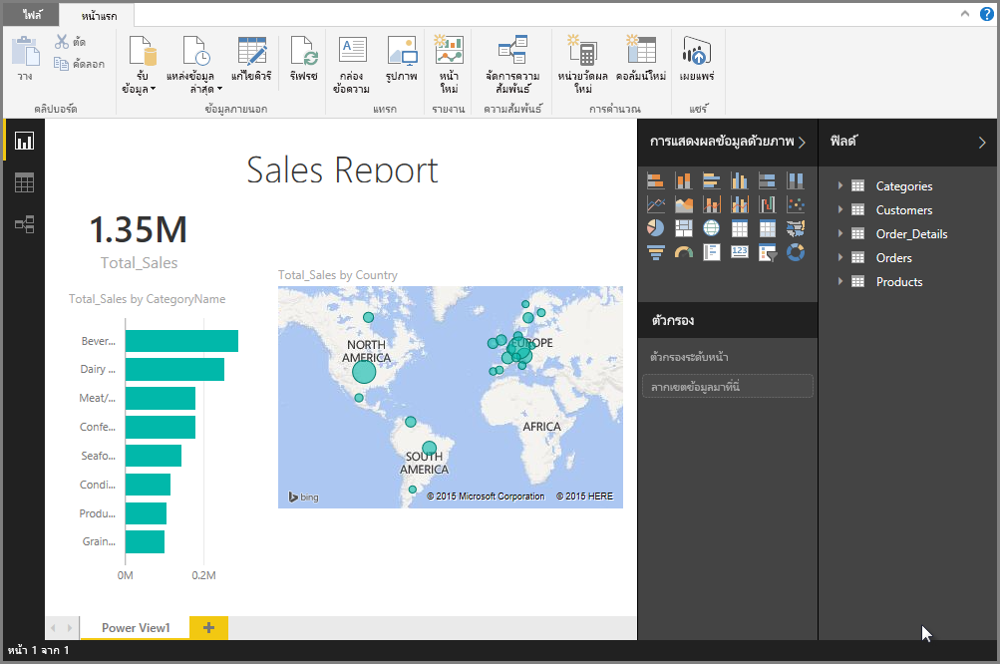

# นำเข้าสมุดงาน Excel ลงใน Power BI Desktop
ด้วย Power BI Desktop คุณจะสามารถนำเข้าเวิร์กบุ๊กของ Excel ที่มีคิวรีของ Power Query แบบจำลอง Power Pivot แผ่นงานของ Power View ลงใน Power BI Desktop ได้อย่างง่ายดาย Power BI Desktop จะสร้างรายงานและการจัดรูปแบบการแสดงข้อมูลโดยอัตโนมัติโดยยึดตามเวิร์กบุ๊ก Excel หลังจากนำเข้าแล้ว คุณสามารถปรับปรุงรายงานเหล่านั้นต่อด้วย Power BI Desktop โดยใช้คุณลักษณะที่มีอยู่และคุณลักษณะใหม่ที่เผยแพร่ในอัปเดตประจำเดือนของ Power BI Desktop

## ฉันนำเข้าเวิร์กบุ๊ก Excel ได้อย่างไร?
1. หากต้องการนำเข้าเวิร์กบุ๊ก Excel ลงใน Power BI Desktop เลือก **ไฟล์** > **นำเข้า** > **Power Query, Power Pivot, Power View**

   

2. จากหน้าต่าง **เปิด** เลือกเวิร์กบุ๊ก Excel ที่จะนำเข้า 

   ขณะนี้ ยังไม่มีการจำกัดขนาดหรือจำนวนของวัตถุในเวิร์กบุ๊ก แต่เวิร์กบุ๊กขนาดใหญ่ทำให้ Power BI Desktop ใช้เวลานานในการวิเคราะห์ และนำเข้า

   > [!NOTE]
   > หากต้องการโหลด หรือนำเข้าไฟล์ Excel จากโฟลเดอร์ OneDrive for Business ที่แชร์ หรือจากโฟลเดอร์ Microsoft 365 Group ให้ใช้ URL ของไฟล์ Excel และการป้อนข้อมูลลงในแหล่งข้อมูลในเว็บ Power BI Desktop มีสองสามขั้นตอนที่คุณจำเป็นต้องทำตาม เพื่อจัดรูปแบบ URL ของ OneDrive for Business ให้ถูกต้อง สำหรับข้อมูลและชุดขั้นตอนที่ถูกต้อง ดู [ใช้การเชื่อมโยง OneDrive for Business ใน Power BI Desktop](desktop-use-onedrive-business-links.md)
   > 
   > 

3. จากกล่องโต้ตอบนำเข้าที่ปรากฏขึ้น เลือก **เริ่ม**

   

   Power BI Desktop จะวิเคราะห์เวิร์กบุ๊ก และแปลงเป็นไฟล์ Power BI Desktop (.pbix) การดำเนินการนี้ เป็นเหตุการณ์แบบครั้งเดียว เมื่อไฟล์ Power BI Desktop ถูกสร้างด้วยขั้นตอนเหล่านี้แล้ว ไฟล์ Power BI Desktop จะไม่ขึ้นกับเวิร์กบุ๊ก Excel เดิมอีกต่อไป และสามารถปรับเปลี่ยน บันทึก และแชร์โดยไม่มีผลต่อเวิร์กบุ๊กเดิม

   เมื่อการนำเข้าเสร็จสมบูรณ์ หน้าสรุปจะแสดงรายการที่ถูกแปลง และรายการที่ไม่สามารถนำเข้าได้

   

4. เลือก **ปิด** 

   Power BI Desktop นำเข้าเวิร์กบุ๊ก Excel และโหลดรายงานที่ยึดตามเนื้อหาของเวิร์กบุ๊ก

   

หลังจากนำเข้าเวิร์กบุ๊กแล้ว คุณจะสามารถทำงานบนรายงานดังกล่าวต่อ คุณสามารถสร้างการแสดงภาพใหม่ เพิ่มข้อมูล หรือสร้างหน้ารายงานใหม่โดยการใช้คุณลักษณะหรือความสามารถใดๆ ที่รวมอยู่ใน Power BI Desktop

## องค์ประกอบไหนของเวิร์กบุ๊กที่ถูกนำเข้า?
Power BI Desktop สามารถนำเข้าองค์ประกอบต่อไปนี้ ซึ่งมักเรียกว่า*วัตถุ*ใน Excel

| วัตถุในเวิร์กบุ๊กของ Excel | ผลลัพธ์สุดท้ายในไฟล์ Power BI Desktop |
| --- | --- |
| คิวรี Power Query |คิวรี Power Query ทั้งหมดจาก Excel จะถูกแปลงเป็นคิวรีใน Power BI Desktop หากมีกลุ่มคิวรีกำหนดไว้ในเวิร์กบุ๊ก Excel จะการทำสำเนาโครงสร้างดังกล่าวใน Power BI Desktop คิวรีทั้งหมดจะถูกโหลด เว้นแต่ว่าจะถูกตั้งค่าเป็น **สร้างเฉพาะการเชื่อมต่อเท่านั้น** ในกล่องโต้ตอบของ Excel **นำเข้าข้อมูล** รูปแบบการโหลดสามารถกำหนดเองโดยการเลือก **คุณสมบัติ** จากแท็บ**หน้าแรก**ของตัวแก้ไข Power Query ใน Power BI Desktop ได้ |
| การเชื่อมต่อข้อมูลภายนอกของ Power Pivot |การเชื่อมต่อข้อมูลภายนอกของ Power Pivot ทั้งหมดถูกแปลงเป็นคิวรีใน Power BI Desktop |
| ตารางที่เชื่อมโยงหรือตารางเวิร์กบุ๊กปัจจุบัน |หากมีตารางแผ่นงานใน Excel ที่เชื่อมโยงกับแบบจำลองข้อมูล หรือเชื่อมโยงกับคิวรี (โดยใช้ฟังก์ชัน *จากตาราง* หรือ *Excel.CurrentWorkbook()* ใน M) ตัวเลือกต่อไปนี้จะปรากฏขึ้น: <ol><li><b>นำเข้าตารางไปยังไฟล์ของ Power BI Desktop</b> ตารางนี้เป็นสแนปช็อตครั้งเดียวของข้อมูล หลังจากที่ข้อมูลเป็นแบบอ่านอย่างเดียวในตารางใน Power BI Desktop มีข้อจำกัดขนาดที่ 1 ล้านตัวอักษร (รวมส่วนหัวของคอลัมน์และเซลล์ทั้งหมด) สำหรับตารางที่สร้างขึ้นโดยใช้ตัวเลือกนี้</li><li><b>คงการเชื่อมต่อไปยังเวิร์กบุ๊กเดิม</b> อีกทางเลือกหนึ่งคือ คุณสามารถคงการเชื่อมต่อไปยังเวิร์กบุ๊ก Excel เดิม และ Power BI Desktop จะดึงข้อมูลล่าสุดในตารางนี้ในการรีเฟรชแต่ละครั้ง เช่นเดียวกับคิวรีอื่นใด ๆ ที่สร้างขึ้นจากเวิร์กบุ๊ก Excel ใน Power BI Desktop</li></ul> |
| คอลัมน์จากการคำนวณ, หน่วยวัด, KPI, ประเภทข้อมูล และความสัมพันธ์ของรูปแบบข้อมูล |วัตถุรูปแบบข้อมูลเหล่านี้จะถูกแปลงเป็นวัตถุเทียบเท่าใน Power BI Desktop สังเกตว่า มีบางประเภทข้อมูลที่ยังไม่มีใน Power BI Desktop เช่น รูปภาพ ในกรณีเหล่านี้ ข้อมูลของประเภทข้อมูลจะถูกล้างค่าสำหรับคอลัมน์ดังกล่าว |
| แผ่นงาน Power View |หน้ารายงานใหม่จะถูกสร้างขึ้นสำหรับแต่ละแผ่นงาน Power View ใน Excel ชื่อและลำดับของหน้ารายงานเหล่านี้จะตรงกับเวิร์กบุ๊ก Excel เดิม |

## มีข้อจำกัดในการนำเข้าเวิร์กบุ๊กหรือไม่?
มีข้อจำกัดบางอย่างเมื่อต้องการนำเข้าเวิร์กบุ๊กไปยัง Power BI Desktop:

* **การเชื่อมต่อภายนอกไปยังรูปแบบตาราง SQL Server Analysis Services:** ใน Excel 2013 สามารถสร้างการเชื่อมต่อกับรูปแบบตารางของ SQL Server Analysis Services ได้แล้ว และสร้างรายงาน Power View ไว้ด้านบนรูปแบบเหล่านี้ได้โดยไม่จำเป็นต้องนำเข้าข้อมูล การเชื่อมต่อชนิดนี้ ในขณะนี้ยังไม่รองรับให้เป็นส่วนหนึ่งของการนำเข้าเวิร์กบุ๊ก Excel ลงใน Power BI Desktop ในระหว่างนี้ คุณต้องสร้างการเชื่อมต่อภายนอกเหล่านี้ใน Power BI Desktop ใหม่
* **ลำดับชั้น:** ในขณะนี้ ยังไม่มีการรองรับวัตถุรูปแบบข้อมูลดังกล่าวใน Power BI Desktop ดังนั้น ลำดับชั้นจะถูกข้ามไปตอนนำเข้าเวิร์กบุ๊ก Excel ลงใน Power BI Desktop
* **คอลัมน์ข้อมูลไบนารี:** ในขณะนี้ ยังไม่มีการรองรับคอลัมน์รูปแบบข้อมูลดังกล่าวใน Power BI Desktop คอลัมน์ข้อมูลไบนารีจะถูกเอาออกจากตารางผลลัพธ์ใน Power BI Desktop
* **องค์ประกอบ Power View ที่ยังไม่มีการรองรับ:** ยังมีบางคุณลักษณะใน Power View ที่ไม่มีการรองรับใน Power BI Desktop เช่น ธีม หรือการแสดงภาพบางชนิด (แผนภูมิกระจายที่มีแกนเคลื่อนไหว ลักษณะการดูรายละเอียดแนวลึก ฯลฯ) แสดงภาพเหล่านี้ จะแสดงเป็นข้อความ*ไม่สนับสนุนการแสดงภาพ*บนตำแหน่งของวิชวลในการรายงาน Power BI Desktop ซึ่งคุณสามารถลบ หรือกำหนดค่าใหม่ตามความจำเป็น
* **การใช้ระยะที่ตั้งชื่อ*****จากตาราง*****ใน Power Query หรือใช้*****Excel.CurrentWorkbook*****ใน M:** การนำเข้าข้อมูลในระยะที่ตั้งชื่อนี้ยังไม่มีการรองรับใน Power BI Desktop แต่มีแผนที่จะรองรับในการอัปเดต ในปัจจุบัน ระยะที่ตั้งชื่อเหล่านี้จะโหลดลงใน Power BI Desktop เป็นรูปการเชื่อมต่อไปยังเวิร์กบุ๊ก Excel ภายนอกแทน
* **PowerPivot ไป SSRS:** การเชื่อมต่อภายนอกของ PowerPivot กับ SQL Server Reporting Services (SSRS) ยังไม่ได้รับการสนับสนุน เนื่องจากแหล่งข้อมูลนั้นยังไม่มีใน Power BI Desktop

