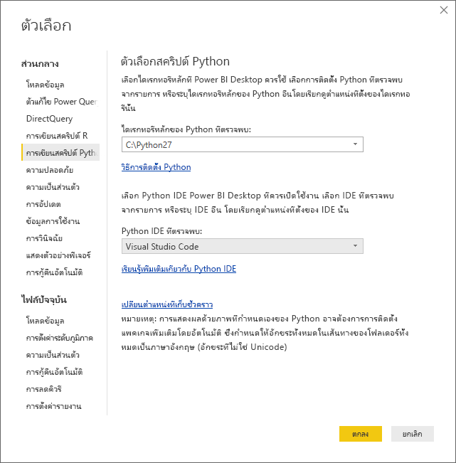
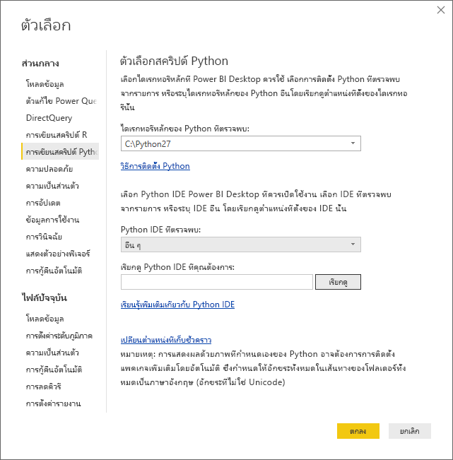
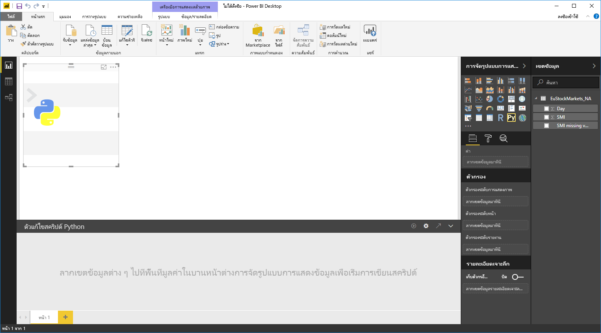
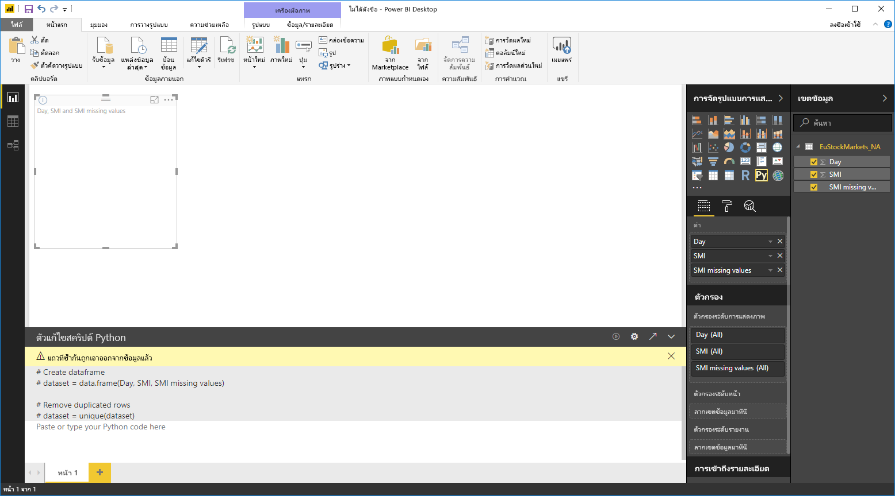
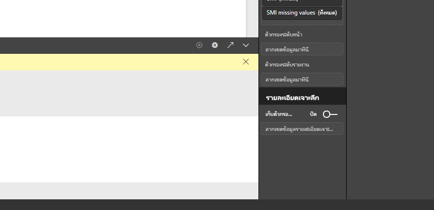
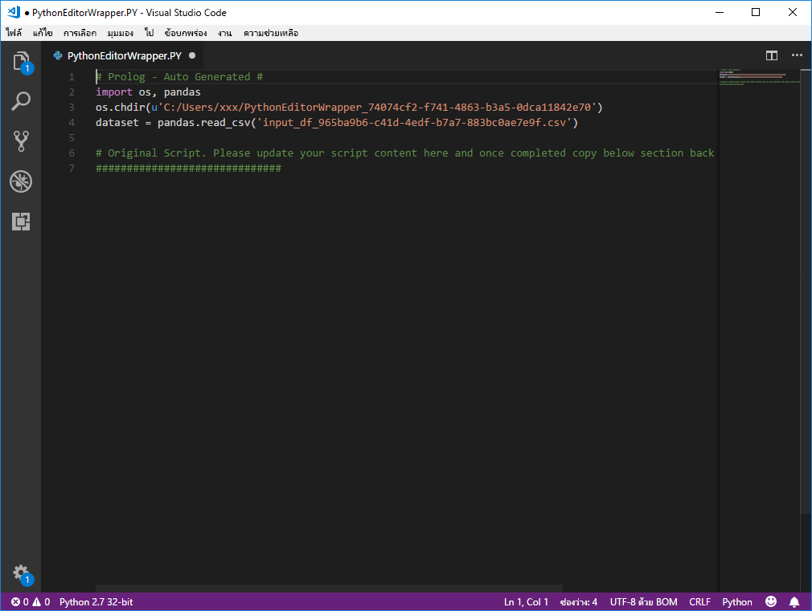

# ใช้ Python IDE ภายนอกกับ Power BI
ด้วย**Power BI Desktop** คุณสามารถใช้ Python IDE ภายนอกของคุณ (สภาพแวดล้อมรวมเพื่อการพัฒนา) เพื่อสร้าง และปรับปรุงสคริปต์ Python แล้วจะใช้สคริปต์เหล่านั้นใน Power BI ได้

## เปิดใช้งานการ Python IDE ภายนอก
คุณสามารถเปิดใช้ของคุณ Python IDE ภายนอกจาก**Power BI Desktop** และจะนำเข้าข้อมูลของคุณโดยอัตโนมัติ และแสดงใน Python IDE จากที่นั่น คุณสามารถปรับเปลี่ยนสคริปต์ใน Python IDE ภายนอก จากนั้นวางกลับลงใน **Power BI Desktop** เพื่อสร้างวิชวลและรายงาน Power BI ได้

คุณสามารถระบุว่าต้องการใช้ Python IDE แบบใดและเปิดใช้งานได้โดยอัตโนมัติภายใน **Power BI Desktop** หรือไม่

### ความต้องการ
เมื่อต้องใช้คุณลักษณะนี้ คุณจำเป็นต้องติดตั้ง **Python IDE** บนเครื่องคอมพิวเตอร์ของคุณ **Power BI Desktop** ไม่รวมการนำเข้าใช้หรือการติดตั้ง Python engine ดังนั้นคุณต้องติดตั้ง **Python** แบบบนเครื่องคอมพิวเตอร์ของคุณแบบแยกต่างหาก คุณสามารถเลือก Python IDE ที่จะใช้ ด้วยตัวเลือกต่อไปนี้:

* คุณสามารถติดตั้ง Python IDE ตัวโปรดของคุณ ซึ่งมีจำนวนมากที่ใช้งานฟรี เช่น [หน้าดาวน์โหลด Visual Studio Code](https://code.visualstudio.com/download/)
* **Power BI Desktop** ยังรองรับ **Visual Studio** อีกด้วย
* นอกจากนี้คุณยังสามารถติดตั้ง Python IDE ที่แตกต่างกันและมี **Power BI Desktop** ซึ่งเปิดใช้งานที่ **Python IDE** โดยทำอย่างใดอย่างหนึ่งต่อไปนี้ได้อีกด้วย:
  
  * คุณสามารถเชื่อมโยงไฟล์ **.PY** จาก IDE ภายนอกที่คุณต้องการเปิดใช้งาน **Power BI Desktop**
  * คุณสามารถระบุไฟล์ .exe ที่ **Power BI Desktop** ควรเปิดใช้งานโดยเลือก *อื่น ๆ* จากส่วน **ตัวเลือกสคริปต์ Python** ในกล่องโต้ตอบ **ตัวเลือก** คุณสามารถนำกล่องโต้ตอบ **ตัวเลือก**โดยไปที่**ไฟล์ > ตัวเลือกและการตั้งค่า > ตัวเลือก**
    
    

ถ้าคุณติดตั้ง Python IDE หลายตัว คุณสามารถระบุได้ว่าจะเปิดตัวใด โดยการเลือกเมนูดรอปดาวน์ *Python IDE ที่ตรวจพบ* ในกล่องโต้ตอบ **ตัวเลือก**

โดยค่าเริ่มต้น **Power BI Desktop** จะเรียกใช้งาน **Visual Studio Code** เป็น IDE ภายนอกของ Python หากมีการติดตั้งไว้ในเครื่องคอมพิวเตอร์ของคุณ ถ้าไม่ได้มีการติดตั้ง **Visual Studio Code** และคุณมี **Visual Studio** โปรแกรมนี้จะเริ่มทำงานแทน ถ้าไม่มีการติดตั้ง Python IDE อยู่เลย แอปพลิเคชันที่เชื่อมโยงกับไฟล์  **.PY** จะถูกเปิดใช้งาน

และถ้าหากไม่มีความสัมพันธ์ของไฟล์ **.PY** อาจเป็นไปได้ที่จะต้องระบุเส้นทางไปยัง IDE แบบกำหนดเอง ใน*เรียกดู Python IDE ที่คุณต้องการ* ส่วนของ**กล่องโต้ตอบ**ตัวเลือก คุณยังสามารถเปิดใช้ Python IDE อื่น โดยการเลือกไอคอนรูปเฟืองด้านข้าง **ตั้งค่า** **เปิดใช้ไอคอนลูกศรของ Python IDE** ใน **Power BI Desktop**

## เปิดใช้งาน Python IDE จาก Power BI Desktop
เมื่อต้องการเปิดใช้งาน Python IDE จาก **Power BI Desktop** ให้ทำตามขั้นตอนต่อไปนี้:

1. โหลดข้อมูลลงใน**Power BI Desktop**
2. เลือกเขตข้อมูลบางอย่างจากบานหน้าต่าง**เขตข้อมูล**ที่คุณต้องการใช้งาน ถ้าคุณยังไม่ได้เปิดใช้งานรูปของสคริปต์ คุณจะได้ถูกถามให้ทำเช่นนั้น
   
   
3. เมื่อเปิดใช้งานวิชวลของสคริปต์ คุณจะสามารถเลือกรูป Python จากบานหน้าต่าง **การแสดงวิชวล** ซึ่งสร้างวิชวล Python แบบว่างที่พร้อมที่จะแสดงผลลัพธ์ของสคริปต์ของคุณ บานหน้าต่าง**ตัวแก้ไขสคริปต์ Python** จะปรากฏขึ้น
   
   
4. ตอนนี้ คุณสามารถเลือกเขตข้อมูลที่คุณต้องการใช้ในสคริปต์ Python ได้ เมื่อคุณเลือกเขตข้อมูล เขตข้อมูล**ตัวแก้ไขสคริปต์ Python** จะถูกสร้างขึ้นแบบอัตโนมัติโดยเป็นไปตามเขตข้อมูลที่คุณเลือก คุณสามารถสร้าง (หรือวาง) สคริปต์ Python ของคุณโดยตรงในบานหน้าต่าง **ตัวแก้ไขสคริปต์ Python** หรือคุณสามารถปล่อยให้ว่างเปล่าก็ได้
   
   
   
   > [!NOTE]
   > ชนิดการรวมเริ่มต้นสำหรับวิชวล Python คือ *ไม่ต้องทำการสรุป*
   > 
   > 
5. ขณะนี้คุณสามารถเปิดใช้ Python IDE ของคุณได้โดยตรงจาก**Power BI Desktop** เลือกปุ่ม **เปิดใช้ Python IDE** ที่พบบนด้านขวาของแถบชื่อ **ตัวแก้ไขสคริปต์ Python** ตามที่แสดงด้านล่าง
   
   
6. Power BI Desktop เรียกใช้งาน Python IDE ที่ระบุของคุณ ดังที่แสดงในรูปต่อไปนี้ (ในภาพนี้ **Visual Studio Code** เป็น Python IDE ค่าเริ่มต้น)
   
   
   
   > [!NOTE]
   > **Power BI Desktop**เพิ่มสามบรรทัดแรกของสคริปต์ แล้วจึงค่อยสามารถนำเข้าข้อมูลของคุณจาก**Power BI Desktop**เมื่อคุณเรียกใช้สคริปต์
   > 
   > 
7. สคริปต์ใด ๆ ที่คุณสร้างขึ้นใน **บานหน้าต่างตัวแก้ไขสคริปต์ Python** ของ **Power BI Desktop** จะปรากฏเริ่มต้นในบรรทัดที่ 4 ใน Python IDE ของคุณ ในตอนนี้ คุณสามารถสร้างสคริปต์ Python ของคุณใน Python IDE ได้ เมื่อคุณสร้างสคริปต์ Python เสร็จสมบูรณ์แล้วใน Python IDE ของคุณ คุณจำเป็นต้องคัดลอกและวางสคริปต์กลับเข้าไปยังบานหน้าต่าง **ตัวแก้ไขสคริปต์ Python** ใน **Power BI Desktop***ยกเว้น*สามบรรทัดแรกของตัวสคริปต์ที่ **Power BI Desktop** สร้างขึ้นโดยอัตโนมัติ ห้ามคัดลอกสามบรรทัดแรกของสคริปต์กลับเข้าไปใน **Power BI Desktop** ซึ่งบรรทัดเหล่านั้นถูกใช้เพื่อนำเข้าข้อมูลของคุณไปยัง Python IDE ของคุณเท่านั้นจาก **Power BI Desktop**

### ข้อจำกัดที่ทราบ
การเปิดใช้งาน Python IDE โดยตรงจาก Power BI Desktop มีข้อจำกัดบางอย่าง:

* ระบบยังไม่รองรับการส่งออกสคริปต์จาก Python IDE ของคุณไปยัง **Power BI Desktop** โดยอัตโนมัติ

## ขั้นตอนถัดไป
ดูข้อมูลเพิ่มเติมเกี่ยวกับ Python ใน Power BI ต่อไปนี้

* [การเรียกใช้สคริปต์ Python ใน Power BI Desktop](desktop-python-scripts.md)
* [สร้างวิชวลของ Power BI โดยใช้ Python](desktop-python-visuals.md)

