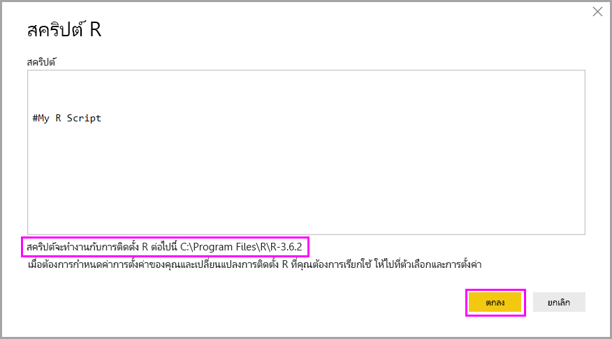

# เรียกใช้สคริปต์ R ใน Power BI Desktop

คุณสามารถเรียกใช้งานสคริปต์ R ได้โดยตรงใน Power BI Desktop และนำเข้าชุดข้อมูลผลลัพธ์ไปยังแบบจำลองข้อมูล Power BI Desktop ได้

## ติดตั้ง R

เพื่อเรียกใช้สคริปต์ R ใน  Power BI Desktop คุณต้องทำการติดตั้ง R ลงบนเครื่องของคุณก่อน คุณสามารถดาวน์โหลดและติดตั้ง R ได้ฟรีจากหลายตำแหน่ง ประกอบด้วย [Microsoft R Application Network](https://mran.revolutionanalytics.com/download/) และ [CRAN Repository](https://cran.r-project.org/bin/windows/base/) การเผยแพร่ในปัจจุบันสนับสนุนอักขระ Unicode และช่องว่าง (อักขระว่าง) ในเส้นทางการติดตั้ง

## เรียกใช้สคริปต์ R

เพียงไม่กี่ขั้นตอนใน Power BI Desktop คุณก็สามารถเรียกใช้งานสคริปต์ R และสร้างแบบจำลองข้อมูลได้ ด้วยแบบจำลองข้อมูลนั้น คุณสามารถสร้างรายงานและแชร์ไปยังบริการของ Power BI ได้ สคริปต์ R ใน Power BI Desktop ตอนนี้สนับสนุนรูปแบบตัวเลขที่มีจุดทศนิยม (.) และเครื่องหมายจุลภาค (,)

### เตรียมสคริปต์ R

เพื่อเรียกใช้สคริปต์ R ใน Power BI Desktop สร้างสคริปต์ R ของคุณในสภาพแวดล้อมการพัฒนา และการตรวจสอบให้แน่ใจว่าการเรียกใช้สำเร็จ

เพื่อเรียกใช้สคริปต์ใน Power BI Desktop ตรวจสอบให้แน่ใจว่าสคริปต์ทำงานสำเร็จในพื้นที่ทำงานที่สร้างขึ้นใหม่และยังไม่ได้เปลี่ยนแปลงอะไร ข้อกำหนดเบื้องต้นนี้หมายความว่า ทุกแพคเกจและสคริปต์ที่ขึ้นต่อกัน ต้องโหลดและทำงานได้อย่างชัดเจน คุณสามารถใช้ `source()` เพื่อเรียกใช้สคริปต์ที่ขึ้นต่อกันได้

ในการเตรียมการและเรียกใช้สคริปต์ R ใน Power BI Desktop นั้น มีข้อจำกัดอยู่บางประการ:

* เฉพาะเฟรมข้อมูลเท่านั้นที่ถูกนำเข้า ดังนั้นให้ตรวจสอบแน่ใจว่าข้อมูลที่คุณต้องการนำเข้าไปยัง Power BI อยู่ในรูปเฟรมข้อมูล
* คอลัมน์ที่มีชนิดเป็นจำนวนเชิงซ้อนและเวกเตอร์จะไม่ถูกนำเข้า และจะถูกแทนที่ด้วยค่าผิดพลาดในตารางที่สร้างใหม่
* ค่าที่เป็น `N/A`จะถูกแปลเป็นค่า`NULL` ใน Power BI Desktop
* ถ้าการเรียกใช้สคริปต์ R ทำงานนานกว่า 30 นาที จะหมดเวลา
* การเรียกแบบโต้ตอบในสคริปต์ R เช่นรอให้ผู้ใช้ป้อนข้อมูล จะหยุดการทำงานของสคริปต์
* เมื่อตั้งค่าไดเรกทอรีการทำงานภายในสคริปต์ R คุณ*ต้อง*กำหนดเส้นทางแบบเต็มไปยังไดเรกทอรีการทำงาน แทนที่จะเป็นเส้นทางสัมพัทธ์

### เรียกใช้สคริปต์ R ของคุณ และนำเข้าข้อมูล

ตอนนี้คุณสามารถเรียกใช้สคริปต์ R เพื่อนำเข้าข้อมูลไปยัง  Power BI Desktop ได้:

1. ใน Power BI Desktop เลือก**รับข้อมูล** เลือก**สคริปต์ R** > **อื่นๆ**  จากนั้นเลือก **เชื่อมต่อ**:

    

2. ถ้า R ได้รับการติดตั้งลงในเครื่องของคุณ เพียงแค่คัดลอกสคริปต์ของคุณไปยังหน้าต่างสคริปต์ และเลือก **ตกลง** เวอร์ชันที่ติดตั้งล่าสุดจะแสดงเป็นเครื่องมือ R ของคุณ

    

3. เลือก**ตกลง**เพื่อเรียกใช้สคริปต์ R เมื่อสคริปต์ทำงานเสร็จเรียบร้อย คุณสามารถเลือกเฟรมข้อมูลผลลัพธ์ เพื่อเพิ่มไปยังรูปแบบ Power BI

คุณสามารถควบคุมได้ว่าจะใช้การติดตั้ง R ใดในการเรียกใช้งานสคริปต์ข้อคุณ เพื่อระบุการตั้งค่าการติดตั้ง R ของคุณ เลือก**ไฟล์** > **ตัวเลือกและตั้งค่า** > **ตัวเลือก** จากนั้นเลือก**สคริปต์ R** ภายใต้ **ตัวเลือกของสคริปต์ R** รายการแบบดรอปดาวน์ **ไดเรกทอรีหน้าหลัก R ที่ตรวจพบ** แสดงตัวเลือกการติดตั้ง R ปัจจุบันของคุณ ถ้าการติดตั้ง R ที่คุณต้องการไม่ได้อยู่ในรายการ ให้เลือก **อื่นๆ** จากนั้นเรียกดูหรือใส่โฟลเดอร์การติดตั้ง R ที่คุณต้องการใน **ตั้งค่าไดเรกทอรีหน้าหลัก R**

### Refresh

คุณสามารถรีเฟรชสคริปต์ R ใน Power BI Desktop เมื่อคุณรีเฟรชสคริปต์ R, Power BI Desktop เรียกใช้สคริปต์ R อีกครั้งในสภาพแวดล้อมของ Power BI Desktop

## ขั้นตอนถัดไป

ดูข้อมูลเพิ่มเติมเกี่ยวกับ R ใน Power BI

* [สร้างภาพ Power BI ที่ใช้ R](../create-reports/desktop-r-visuals.md)
* [ใช้ R IDE ภายนอกกับ Power BI](desktop-r-ide.md)
