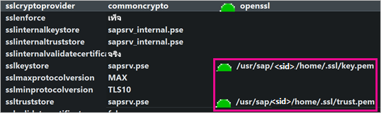
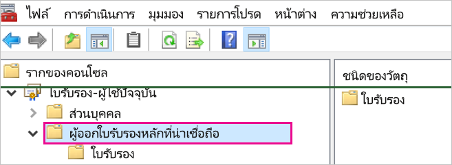
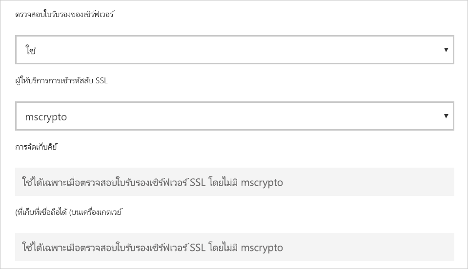

# <a name="enable-encryption-for-sap-hana"></a>เปิดใช้งานการเข้ารหัสลับสำหรับ SAP HANA

เราขอแนะนำให้คุณเข้ารหัสการเชื่อมต่อไปยังเซิร์ฟเวอร์ SAP HANA จาก Power BI Desktop และบริการของ Power BI คุณสามารถเปิดใช้งานการเข้ารหัส HANA โดยใช้ทั้ง OpenSSL และ CommonCryptoLib ของไลบรารี SAP (เดิมเรียกว่า sapcrypto) SAP จะแนะนำโดยใช้ CommonCryptoLib แต่คุณลักษณะการเข้ารหัสลับพื้นฐานจะพร้อมใช้งานโดยใช้ไลบรารีหนึ่ง

บทความนี้แสดงภาพรวมของการเปิดใช้งานการเข้ารหัสด้วย OpenSSL และอ้างอิงบางพื้นที่เฉพาะของเอกสารประกอบ SAP เรามีการปรับปรุงเนื้อหาและลิงก์เป็นระยะ ๆ แต่สำหรับคำแนะนำและการสนับสนุนที่ครอบคลุม ให้อ้างอิงถึงเอกสารประกอบ SAP อย่างเป็นทางการเสมอ หากคุณต้องการตั้งค่าการเข้ารหัสโดยใช้ CommonCryptoLib แทน OpenSSL ให้ดู [วิธีการกำหนดค่า TLS/SSL ใน SAP HANA 2.0](https://blogs.sap.com/2018/11/13/how-to-configure-tlsssl-in-sap-hana-2.0/) สำหรับขั้นตอนต่าง ๆ เกี่ยวกับวิธีการโยกย้ายจาก OpenSSL ไปยัง CommonCryptoLib ให้ดูที่ [SAP Note 2093286](https://launchpad.support.sap.com/#/notes/2093286) (ต้องมีผู้ใช้ s)

> [!NOTE]
> ขั้นตอนการตั้งค่าสำหรับการเข้ารหัสลับโดยละเอียดในบทความนี้ทับซ้อนกับขั้นตอนการตั้งค่าและการกำหนดค่าสำหรับ SAML SSO ไม่ว่าคุณจะเลือก OpenSSL หรือ CommonCryptoLib เป็นผู้ให้บริการการเข้ารหัสลับของเซิร์ฟเวอร์ HANA ตรวจสอบให้แน่ใจว่าตัวเลือกของคุณมีความสอดคล้องกันในการกำหนดค่า SAML และการเข้ารหัสลับ

มีสี่ขั้นตอนในการเปิดใช้งานการเข้ารหัสลับสำหรับ SAP HANA โดยใช้ OpenSSL เราจะอธิบายถึงขั้นตอนเหล่านี้ต่อไป  สำหรับข้อมูลเพิ่มเติม ให้ดู [การรักษาความปลอดภัยการสื่อสารระหว่าง SAP HANA Studio และ SAP HANA Server ผ่าน SSL](https://blogs.sap.com/2015/09/28/securing-the-communication-between-sap-hana-studio-and-sap-hana-server-through-ssl/)

## <a name="use-openssl"></a>ใช้ OpenSSL

ตรวจสอบให้แน่ใจว่าเซิร์ฟเวอร์ HANA ของคุณได้รับการกำหนดค่าให้ใช้ OpenSSL เป็นผู้ให้บริการการเข้ารหัสลับ แทนที่ข้อมูลพาธที่หายไปด้านล่างด้วย ID เซิร์ฟเวอร์ (sid) ของเซิร์ฟเวอร์ HANA ของคุณ



## <a name="create-a-certificate-signing-request"></a>สร้างคำขอการรับรองใบรับรอง

สร้างคำขอการรับรองใบรับรอง X509 สำหรับเซิร์ฟเวอร์ HANA

1. การใช้ SSH จะเชื่อมต่อกับเครื่อง Linux ที่เซิร์ฟเวอร์ HANA ทำงานเป็นผู้ดูแลระบบ \<sid\>

1. ไปยัง Home directory _/__usr/sap/\<sid\>/home_

1. สร้างไดเรกทอรีที่ซ่อนอยู่ด้วยชื่อ _ __ssl_ถ้าไม่มีอยู่

1. ใช้คำสั่งต่อไปนี้:

    ```
    openssl req -newkey rsa:2048 -days 365 -sha256 -keyout Server\_Key.pem -out Server\_Req.pem -nodes
    ```

คำสั่งนี้จะสร้างคำขอการรับรองใบรับรองและคีย์ส่วนตัว เมื่อมีการรับรองแล้ว ใบรับรองจะมีผลบังคับใช้เป็นเวลาหนึ่งปี (ดูพารามิเตอร์-วัน) เมื่อได้รับพร้อมท์สำหรับชื่อทั่วไป (CN) ใส่ชื่อโดเมนที่มีคุณสมบัติครบถ้วน (FQDN) ของคอมพิวเตอร์ที่มีการติดตั้งเซิร์ฟเวอร์ HANA

## <a name="get-the-certificate-signed"></a>รับใบรับรองทีได้รับการรับรองแล้ว

รับใบรับรองที่รับรองโดยผู้ให้บริการออกใบรับรอง (CA) ที่เชื่อถือได้โดยไคลเอ็นต์ที่คุณจะใช้เพื่อเชื่อมต่อกับเซิร์ฟเวอร์ HANA

1. ถ้าคุณมี CA ของบริษัทที่เชื่อถือได้ (แทนด้วย CA\_Cert.pem and CA\_Key.pem ในตัวอย่างต่อไปนี้) ให้รับรองคำขอใบรับรองโดยการเรียกใช้คำสั่งต่อไปนี้:

    ```
    openssl x509 -req -days 365 -in Server\_Req.pem -sha256 -extfile /etc/ssl/openssl.cnf -extensions usr\_cert -CA CA\_Cert.pem -CAkey CA\_Key.pem -CAcreateserial -out Server\_Cert.pem
    ```

    หากคุณยังไม่มี CA ที่คุณสามารถใช้ได้ คุณสามารถสร้าง CA ระดับสูงด้วยตัวเองโดยทำตามขั้นตอนที่อธิบายไว้ใน [การรักษาความปลอดภัยการสื่อสารระหว่าง SAP HANA Studio และ SAP HANA Server ผ่าน SSL](https://blogs.sap.com/2015/09/28/securing-the-communication-between-sap-hana-studio-and-sap-hana-server-through-ssl/)

1. สร้างห่วงโซ่ใบรับรองเซิร์ฟเวอร์ HANA โดยรวมใบรับรองเซิร์ฟเวอร์ คีย์ และใบรับรองของ CA (ชื่อ key.pem เป็นแบบแผนสำหรับ SAP HANA):

    ```
    cat Server\_Cert.pem Server\_Key.pem CA\_Cert.pem \> key.pem
    ```

1. สร้างสำเนาของ CA\_Cert.pem ชื่อ trust.pem (ชื่อ trust.pem เป็นแบบแผนสำหรับ SAP HANA):

    ```
    cp CA\_Cert.pem trust.pem
    ```

1. รีสตาร์ทเซิร์ฟเวอร์ HANA

1. ตรวจสอบความสัมพันธ์ที่เชื่อถือได้ระหว่างไคลเอนต์และ CA ที่คุณใช้ในการรับรองใบรับรองของเซิร์ฟเวอร์ SAP HANA

    ไคลเอนต์ต้องเชื่อถือ CA ที่ใช้ในการรับรองใบรับรอง X509 ของเซิร์ฟเวอร์ HANA ก่อนที่สามารถทำการเชื่อมต่อแบบเข้ารหัสกับเซิร์ฟเวอร์ HANA จากเครื่องของไคลเอ็นต์

    มีหลายวิธีในการตรวจสอบให้แน่ใจว่าความสัมพันธ์ที่น่าเชื่อถือนี้มีอยู่โดยใช้ Microsoft Management Console (mmc) หรือบรรทัดคำสั่ง คุณสามารถนำเข้าใบรับรอง X509 ของ CA (trust.pem) ไปยังโฟลเดอร์ **Trusted Root Certification Authorities** สำหรับผู้ใช้ที่จะสร้างการเชื่อมต่อ หรือไปยังในโฟลเดอร์เดียวกันสำหรับเครื่องไคลเอนต์เองหากเป็นที่ต้องการ

    

    ก่อนอื่นคุณต้องแปลง trust.pem เป็นไฟล์. crt ก่อนที่คุณจะสามารถนำเข้าใบรับรองไปยังโฟลเดอร์ Trusted Root Certificate Authorities ตัวอย่างเช่น โดยการเรียกใช้คำสั่ง OpenSSL ต่อไปนี้:

    ```
    openssl x509 -outform der -in your-cert.pem -out your-cert.crt
    ```
    
    สำหรับข้อมูลเกี่ยวกับการใช้ OpenSSL สำหรับการแปลง โปรดดู [เอกสารประกอบ OpenSSL](https://www.openssl.org/docs/man1.0.2/man3/x509.html)

## <a name="test-the-connection"></a>ทดสอบการเชื่อมต่อ

ทดสอบการเชื่อมต่อใน Power BI Desktop หรือบริการของ Power BI

1. ใน Power BI Desktop หรือในหน้า **จัดการเกตเวย์** ของบริการของ Power BI ตรวจสอบให้แน่ใจว่ามีการเปิดใช้งาน **ตรวจสอบใบรับรองเซิร์ฟเวอร์** ก่อนที่จะพยายามสร้างการเชื่อมต่อไปยังเซิร์ฟเวอร์ SAP HANA ของคุณ สำหรับ **ผู้ให้บริการการเข้ารหัส SSL** ให้เลือก mscrypto ถ้าคุณได้ทำตามขั้นตอนการตั้งค่า OpenSSL และ commoncrypto ถ้าคุณได้กำหนดค่าไลบรารีนั้นเป็นผู้ให้บริการการเข้ารหัสลับของคุณ ปล่อยเขตข้อมูลคีย์สโตร์ของ SSL และทรัสต์สโตร์ของ SSL ว่างไว้

    - Power BI Desktop

        

    - บริการ power BI

        

1. ตรวจสอบว่าคุณสามารถสร้างการเชื่อมต่อแบบเข้ารหัสไปยังเซิร์ฟเวอร์ได้สำเร็จโดยเปิดใช้งานตัวเลือก **ตรวจสอบใบรับรองเซิร์ฟเวอร์**  โดยการโหลดข้อมูลใน Power BI Desktop หรือการรีเฟรชรายงานที่เผยแพร่ในบริการของ Power BI
