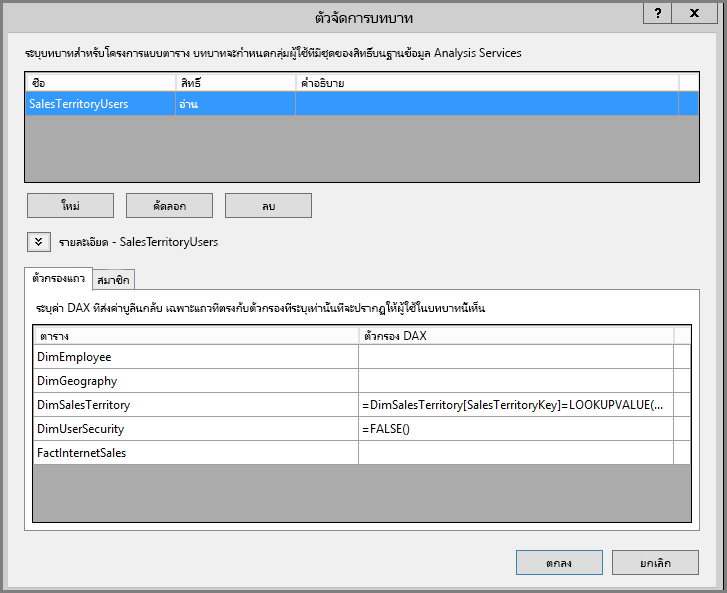
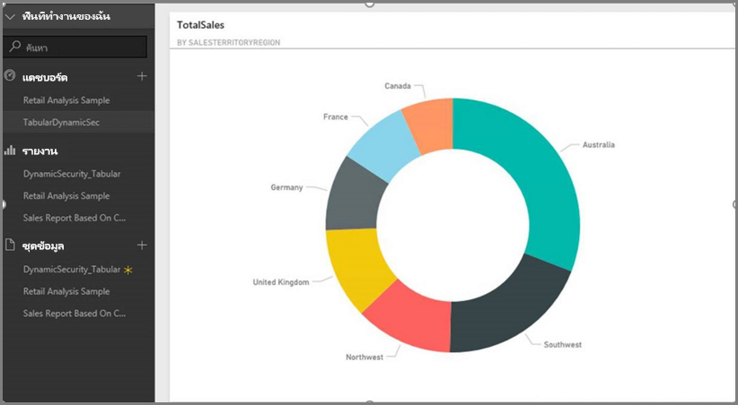

# <a name="implement-row-level-security-in-an-analysis-services-tabular-model"></a>ใช้การรักษาความปลอดภัยระดับแถวในแบบจำลองตาราง Analysis Services

ใช้ชุดข้อมูลตัวอย่างเพื่อทำงานผ่านขั้นตอนด้านล่าง บทช่วยสอนนี้จะแสดงวิธีใช้[**ความปลอดภัยระดับแถว**](../admin/service-admin-rls.md)ใน*รูปแบบตาราง Analysis Services*และใช้ในรายงาน Power BI

* สร้างตารางความปลอดภัยใหม่ใน [ฐานข้อมูล AdventureworksDW2012](https://github.com/Microsoft/sql-server-samples/releases/tag/adventureworks)
* สร้างแบบจำลองแบบตารางด้วยตารางที่มีข้อเท็จจริงและมิติข้อมูลที่จำเป็น
* กำหนดบทบาทและสิทธิ์ของผู้ใช้
* ปรับใช้รูปแบบไปยังอินสแตนซ์*ตาราง Analysis Services*
* สร้างรายงาน Power BI Desktop ที่แสดงข้อมูลที่กำหนดให้เหมาะสมกับการเข้าถึงรายงานของผู้ใช้
* ปรับใช้รายงานไปยัง*บริการของ Power BI*
* สร้างแดชบอร์ดใหม่ตามรายงาน
* แชร์แดชบอร์ดกับเพื่อนร่วมงานของคุณ

บทช่วยสอนนี้จะต้องมี[ฐานข้อมูล AdventureworksDW2012](https://github.com/Microsoft/sql-server-samples/releases/tag/adventureworks)

## <a name="task-1-create-the-user-security-table-and-define-data-relationship"></a>งานที่ 1: สร้างตารางความปลอดภัยของผู้ใช้และกำหนดความสัมพันธ์ข้อมูล

คุณสามารถหาบทความมากมายที่อธิบายถึงวิธีกำหนดระดับการรักษาความปลอดภัยแบบไดนามิกระดับแถวด้วยรูปแบบ*ตาราง SQL Server Analysis Services (SSAS)* สำหรับตัวอย่างของเรา เราใช้ [การใช้การรักษาความปลอดภัยแบบไดนามิกโดยใช้ตัวกรองแถว](/analysis-services/tutorial-tabular-1200/supplemental-lesson-implement-dynamic-security-by-using-row-filters)

ขั้นตอนต่าง ๆ ในส่วนนี้จะต้องใช้ฐานข้อมูลเชิงสัมพันธ์ AdventureworksDW2012

1. ใน AdventureworksDW2012 สร้างตาราง `DimUserSecurity` ตามที่แสดงด้านล่าง คุณสามารถใช้ [SQL Server Management Studio (SSMS)](/sql/ssms/download-sql-server-management-studio-ssms) เพื่อสร้างตาราง

   

1. หลังจากที่คุณสร้างและบันทึกตารางแล้ว คุณจำเป็นต้องสร้างความสัมพันธ์ระหว่างคอลัมน์ `SalesTerritoryID` ของตาราง `DimUserSecurity` และคอลัมน์ `SalesTerritoryKey` ของตาราง `DimSalesTerritory` ดังที่แสดงด้านล่าง

   ใน SSMS คลิกขวาที่ **DimUserSecurity** แล้วเลือก **การออกแบบ** จากนั้นเลือก **ตัวออกแบบตาราง** > **ความสัมพันธ์...** เมื่อเสร็จสิ้น ให้บันทึกตาราง

   

1. เพิ่มผู้ใช้ไปที่ตาราง คลิกขวาที่ **DimUserSecurity** และเลือก **แก้ไข 200 แถวยอดนิยม** หลังจากเพิ่มผู้ใช้แล้ว ตาราง `DimUserSecurity` ควรปรากฏในลักษณะที่คล้ายกับตัวอย่างต่อไปนี้:

   

   เราจะเห็นผู้ใช้เหล่านี้ในงานที่กำลังจะเกิดขึ้น

1. ถัดไป ดำเนินการ *การรวมภายใน* กับตาราง `DimSalesTerritory` ซึ่งจะแสดงรายละเอียดภูมิภาคที่เกี่ยวข้องกับผู้ใช้ รหัส SQL ที่นี่ใช้สำหรับการรวมภายใน และรูปภาพจะแสดงลักษณะการปรากฏของตาราง

    ```sql
    select b.SalesTerritoryCountry, b.SalesTerritoryRegion, a.EmployeeID, a.FirstName, a.LastName, a.UserName from [dbo].[DimUserSecurity] as a join [dbo].[DimSalesTerritory] as b on a.[SalesTerritoryID] = b.[SalesTerritoryKey]
    ```

   ตารางรวมจะแสดงบุคคลที่รับผิดชอบในแต่ละภูมิภาคการขาย ตามความสัมพันธ์ที่สร้างขึ้นในขั้นตอนที่ 2 ตัวอย่างเช่น คุณสามารถดู *Rita Santos* ที่รับผิดชอบใน*ออสเตรเลีย*ได้

## <a name="task-2-create-the-tabular-model-with-facts-and-dimension-tables"></a>งานที่ 2: สร้างแบบจำลองตารางด้วยตารางข้อเท็จจริงและมิติข้อมูล

เมื่อคลังข้อมูลเชิงสัมพันธ์ของคุณเสร็จเรียบร้อยแล้ว คุณจะต้องกำหนดแบบจำลองตารางของคุณ คุณสามารถสร้างแบบจำลองได้โดยใช้ [SQL Server Data Tools](/sql/ssdt/sql-server-data-tools) (SSDT) สำหรับข้อมูลเพิ่มเติม โปรดดูที่[สร้างโครงการแบบจำลองตารางใหม่](/analysis-services/tutorial-tabular-1400/as-lesson-1-create-a-new-tabular-model-project)

1. นำเข้าตารางที่จำเป็นทั้งหมดลงในแบบจำลอง ดังที่แสดงด้านล่าง

    

1. เมื่อคุณนำเข้าตารางที่จำเป็น คุณต้องกำหนดบทบาทที่เรียกว่า *SalesTerritoryUsers* ที่มีสิทธิ์แบบอ่าน เลือกเมนู **แบบจำลอง** ใน SQL Server Data Tools แล้วเลือก **บทบาท** ใน **ตัวจัดการบทบาท** เลือก **ใหม่**

1. ใต้**สมาชิก**ใน**ตัวจัดการบทบาท** ให้เพิ่มผู้ใช้ที่คุณกำหนดไว้ในตาราง `DimUserSecurity` ใน [งาน 1](#task-1-create-the-user-security-table-and-define-data-relationship)

    

1. ถัดไป เพิ่มฟังก์ชันที่ถูกต้องสำหรับตาราง `DimSalesTerritory` และ`DimUserSecurity` ตามที่แสดงด้านล่าง ใต้แท็บ **ตัวกรองแถว**

    

1. ฟังก์ชัน `LOOKUPVALUE` จะแสดงค่าสำหรับคอลัมน์ที่ชื่อผู้ใช้ Windows ตรงกับรายการที่ฟังก์ชัน `USERNAME` แสดงผล จากนั้น คุณจะสามารถจำกัดคิวรีเป็นตำแหน่งที่ค่าที่แสดง `LOOKUPVALUE` ตรงกับรายการในตารางเดียวกันหรือตารางที่เกี่ยวข้อง ในคอลัมน์**ตัวกรอง DAX** ให้พิมพ์สูตรต่อไปนี้:

    ```dax
        =DimSalesTerritory[SalesTerritoryKey]=LOOKUPVALUE(DimUserSecurity[SalesTerritoryID], DimUserSecurity[UserName], USERNAME(), DimUserSecurity[SalesTerritoryID], DimSalesTerritory[SalesTerritoryKey])
    ```

    ในสูตรนี้ ฟังก์ชัน `LOOKUPVALUE` จะแสดงค่าทั้งหมดสำหรับคอลัมน์ `DimUserSecurity[SalesTerritoryID]` ที่ซึ่ง `DimUserSecurity[UserName]` ตรงกับรายการปัจจุบันที่เข้าสู่ระบบด้วยชื่อผู้ใช้ Windows และ `DimUserSecurity[SalesTerritoryID]` เหมือนกับ `DimSalesTerritory[SalesTerritoryKey]`

    > [!IMPORTANT]
    > เมื่อใช้ความปลอดภัยระดับแถว ระบบจะไม่รองรับ [USERELATIONSHIP](/dax/userelationship-function-dax) ของฟังก์ชัน DAX

   ชุดค่าที่ส่งกลับของยอดขาย`SalesTerritoryKey``LOOKUPVALUE`จะถูกใช้เพื่อจำกัดแถวที่แสดงใน `DimSalesTerritory` เฉพาะแถวที่ค่า `SalesTerritoryKey` อยู่ใน ID เท่านั้นที่ฟังก์ชัน `LOOKUPVALUE` จะแสดงผลลัพธ์

1. สำหรับตาราง `DimUserSecurity` ในคอลัมน์ **ตัวกรอง DAX** ให้เพิ่มสูตรต่อไปนี้:

    ```dax
        =FALSE()
    ```

    สูตรนี้ระบุว่า คอลัมน์ทั้งหมดจะแก้ไข `false` ซึ่งหมายความว่าคอลัมน์ตาราง `DimUserSecurity` ไม่สามารถสอบถามได้

ตอนนี้ คุณจะต้องประมวลผลและปรับใช้แบบจำลอง สำหรับข้อมูลเพิ่มเติม ดูที่ [ปรับใช้](/analysis-services/tutorial-tabular-1200/lesson-13-deploy)

## <a name="task-3-add-data-sources-within-your-on-premises-data-gateway"></a>งานที่ 3: เพิ่มแหล่งข้อมูลภายในเกตเวย์ข้อมูลในองค์กรของคุณ

เมื่อแบบจำลองแบบตารางของคุณมีการปรับใช้ และพร้อมสำหรับการใช้ คุณต้องเพิ่มการเชื่อมต่อแหล่งข้อมูลไปยังเซิร์ฟเวอร์ Analysis Services แบบตารางในองค์กร

1. เพื่อให้บริการของ Power BI สามารถเข้าถึงบริการการวิเคราะห์ของคุณในสถานที่ คุณจะต้องติดตั้ง [เกตเวย์ข้อมูลภายในองค์กร](service-gateway-onprem.md) และกำหนดค่าในสภาพแวดล้อมของคุณ

1. เมื่อเกตเวย์ได้รับการกำหนดค่าอย่างถูกต้อง คุณต้องสร้างการเชื่อมต่อแหล่งข้อมูลสำหรับอินสแตนซ์ของตาราง *Analysis Services* ของคุณ สำหรับข้อมูลเพิ่มเติม โปรดดูที่ [จัดการแหล่งข้อมูลของคุณ - Analysis Services](service-gateway-enterprise-manage-ssas.md)

   

เมื่อขั้นตอนนี้เสร็จสมบูรณ์ เกตเวย์จะถูกกำหนดค่าและพร้อมสำหรับการโต้ตอบ กับแหล่งข้อมูล Analysis Services ในองค์กรของคุณ

## <a name="task-4-create-report-based-on-analysis-services-tabular-model-using-power-bi-desktop"></a>งานที่ 4: สร้างรายงานที่ยึดตามรูปแบบตารางข้อมูล Analysis Services โดยใช้ Power BI desktop

1. เปิดใช้งาน Power BI Desktop และเลือก **รับข้อมูล** > **ฐานข้อมูล**

1. จากรายการแหล่งข้อมูล ให้เลือก**ฐานข้อมูล SQL Server Analysis Services** และเลือก**เชื่อมต่อ**

   

1. กรอกรายละเอียดอินสแตนซ์ของ Analysis Services แบบตาราง และเลือก **เชื่อมต่อแบบไลฟ์** จากนั้นเลือก **ตกลง**
  
   

   ด้วย Power BI การรักษาความปลอดภัยแบบไดนามิกจะใช้ได้เฉพาะกับการเชื่อมต่อแบบไลฟ์เท่านั้น

1. คุณสามารถมองเห็นว่าแบบจำลองที่ปรับใช้อยู่ในอินสแตนซ์ Analysis Services เลือกแบบจำลองที่เกี่ยวข้อง แล้วเลือก**ตกลง**

   ขณะนี้ Power BI Desktop จะแสดงเขตข้อมูลทั้งหมดที่พร้อมใช้งาน ทางด้านขวาของพื้นที่ทำงานในบานหน้าต่าง**เขตข้อมูล**

1. ในบานหน้าต่าง**เขตข้อมูล** ให้เลือกการวัด **SalesAmount** จากตาราง **FactInternetSales** และมิติ **SalesTerritoryRegion** จากตาราง **SalesTerritory**

1. เพื่อเก็บรายงานนี้อย่างง่ายๆ เราจะไม่เพิ่มคอลัมน์ใดๆ อีกในตอนนี้ เมื่อต้องการแสดงสื่อความหมายของข้อมูลให้มากขึ้น คุณสามารถเปลี่ยนการแสดงภาพเป็น**แผนภูมิโดนัท**

   

1. เมื่อรายงานของคุณพร้อมแล้ว คุณสามารถเผยแพร่ไปยังพอร์ทัล Power BI ได้โดยตรง จาก Ribbon ของ**หน้าแรก** ใน Power BI Desktop ให้เลือก **เผยแพร่**

## <a name="task-5-create-and-share-a-dashboard"></a>งานที่ 5: สร้างและแชร์แดชบอร์ด

คุณได้สร้างรายงานและเผยแพร่ไปยังบริการของ **Power BI** ตอนนี้ คุณสามารถใช้ตัวอย่างที่สร้างขึ้นในขั้นตอนก่อนหน้าเพื่อสาธิตสถานการณ์ด้านการรักษาความปลอดภัยของแบบจำลอง

ในบทบาทของ *ผู้จัดการฝ่ายขาย* ผู้ใช้ เกรซสามารถดูข้อมูลได้จากทุกภูมิภาคการขาย เกรซได้สร้างรายงานและเผยแพร่ไปยังบริการของ Power BI รายงานนี้ถูกสร้างขึ้นในงานก่อนหน้านี้

เมื่อเกรซเผยแพร่รายงาน ขั้นตอนต่อไปคือการสร้างแดชบอร์ดในบริการของ Power BI ซึ่งเรียกว่า *TabularDynamicSec* โดยอิงกับรายงานนั้น ในภาพต่อไปนี้ โปรดสังเกตว่าเกรซสามารถดูข้อมูลที่เกี่ยวข้องกับภูมิภาคการขายทั้งหมดได้

   

ตอนนี้ เกรซแชร์แดชบอร์ดกับเพื่อนร่วมงาน ริต้าซึ่งเป็นผู้รับผิดชอบการขายในภูมิภาคออสเตรเลีย

   

เมื่อริต้าลงชื่อเข้าใช้บริการของ Power BI และดูหน้าแดชบอร์ดที่แชร์ซึ่งเกรซสร้างไว้ เธอควรเห็นเฉพาะยอดขายจากภูมิภาคออสเตรเลียเท่านั้น

ยินดีด้วย! บริการของ Power BI จะแสดงความปลอดภัยระดับแถวแบบไดนามิกแบบจำลองแบบตาราง Analysis Services ในองค์กร Power BI ใช้คุณสมบัติ `EffectiveUserName` เพื่อส่งข้อมูลประจำตัวผู้ใช้ Power BI ปัจจุบันไปยังแหล่งข้อมูลในองค์กรเพื่อเรียกใช้คิวรี

## <a name="task-6-understand-what-happens-behind-the-scenes"></a>งานที่ 6: ทำความเข้าใจกับสิ่งที่เกิดขึ้นเบื้องหลัง

งานนี้อนุมานว่าคุณคุ้นเคยกับ [SQL Server Profiler](/sql/tools/sql-server-profiler/sql-server-profiler) เนื่องจากคุณจำเป็นต้องจับภาพการติดตาม SQL Server profiler ในอินสแตนซ์ตารางแบบ SSAS ในองค์กรของคุณ

เซสชันได้รับการเตรียมใช้งานทันทีที่ผู้ใช้ ซึ่งได้แก่ ริต้า เข้าถึงแดชบอร์ดในบริการของ Power BI คุณสามารถพบว่า บทบาท **salesterritoryusers** มีผลทันที โดยชื่อผู้ใช้ที่มีประสิทธิภาพมีฐานะเป็น **<EffectiveUserName>rita@contoso.com</EffectiveUserName>**
```
       <PropertyList><Catalog>DefinedSalesTabular</Catalog><Timeout>600</Timeout><Content>SchemaData</Content><Format>Tabular</Format><AxisFormat>TupleFormat</AxisFormat><BeginRange>-1</BeginRange><EndRange>-1</EndRange><ShowHiddenCubes>false</ShowHiddenCubes><VisualMode>0</VisualMode><DbpropMsmdFlattened2>true</DbpropMsmdFlattened2><SspropInitAppName>PowerBI</SspropInitAppName><SecuredCellValue>0</SecuredCellValue><ImpactAnalysis>false</ImpactAnalysis><SQLQueryMode>Calculated</SQLQueryMode><ClientProcessID>6408</ClientProcessID><Cube>Model</Cube><ReturnCellProperties>true</ReturnCellProperties><CommitTimeout>0</CommitTimeout><ForceCommitTimeout>0</ForceCommitTimeout><ExecutionMode>Execute</ExecutionMode><RealTimeOlap>false</RealTimeOlap><MdxMissingMemberMode>Default</MdxMissingMemberMode><DisablePrefetchFacts>false</DisablePrefetchFacts><UpdateIsolationLevel>2</UpdateIsolationLevel><DbpropMsmdOptimizeResponse>0</DbpropMsmdOptimizeResponse><ResponseEncoding>Default</ResponseEncoding><DirectQueryMode>Default</DirectQueryMode><DbpropMsmdActivityID>4ea2a372-dd2f-4edd-a8ca-1b909b4165b5</DbpropMsmdActivityID><DbpropMsmdRequestID>2313cf77-b881-015d-e6da-eda9846d42db</DbpropMsmdRequestID><LocaleIdentifier>1033</LocaleIdentifier><EffectiveUserName>rita@contoso.com</EffectiveUserName></PropertyList>
```
ตามคำขอชื่อผู้ใช้ที่มีประสิทธิภาพ Analysis Services จะแปลงคำขอเป็นข้อมูลประจำตัว `contoso\rita` จริงหลังจากคิวรี Active Directory ในเครื่อง เมื่อ Analysis Services ได้รับข้อมูลประจำตัว Analysis Services จะส่งกลับข้อมูลที่ผู้ใช้มีสิทธิ์ในการดูและเข้าถึง

หากมีกิจกรรมอื่นๆ เกิดขึ้นกับแดชบอร์ด ด้วย SQL Profiler คุณจะเห็นคิวรีเฉพาะอย่างไปยังรูปแบบตารางข้อมูล Analysis Services ในฐานะเป็นคิวรี DAX ตัวอย่างเช่น หากริต้าไปจากแดชบอร์ดไปยังรายงานเบื้องต้น คิวรีต่อไปนี้จะเกิดขึ้น

   

นอกจากนี้ คุณยังสามารถดูคิวรี DAX ที่กำลังดำเนินการเพื่อใส่ข้อมูลรายงาน
   
   ```dax
   EVALUATE
     ROW(
       "SumEmployeeKey", CALCULATE(SUM(Employee[EmployeeKey]))
     )
   
   <PropertyList xmlns="urn:schemas-microsoft-com:xml-analysis">``
             <Catalog>DefinedSalesTabular</Catalog>
             <Cube>Model</Cube>
             <SspropInitAppName>PowerBI</SspropInitAppName>
             <EffectiveUserName>rita@contoso.com</EffectiveUserName>
             <LocaleIdentifier>1033</LocaleIdentifier>
             <ClientProcessID>6408</ClientProcessID>
             <Format>Tabular</Format>
             <Content>SchemaData</Content>
             <Timeout>600</Timeout>
             <DbpropMsmdRequestID>8510d758-f07b-a025-8fb3-a0540189ff79</DbpropMsmdRequestID>
             <DbPropMsmdActivityID>f2dbe8a3-ef51-4d70-a879-5f02a502b2c3</DbPropMsmdActivityID>
             <ReturnCellProperties>true</ReturnCellProperties>
             <DbpropMsmdFlattened2>true</DbpropMsmdFlattened2>
             <DbpropMsmdActivityID>f2dbe8a3-ef51-4d70-a879-5f02a502b2c3</DbpropMsmdActivityID>
           </PropertyList>
   ```

## <a name="considerations"></a>ข้อควรพิจารณา

* การรักษาความปลอดภัยระดับแถวในองค์กรด้วย Power BI จะใช้ได้เฉพาะกับการเชื่อมต่อแบบไลฟ์เท่านั้น

* การเปลี่ยนแปลงข้อมูลหลังจากประมวลผลแบบจำลองจะพร้อมใช้งานในทันทีสำหรับผู้ใช้ที่เข้าถึงรายงานด้วยการเชื่อมต่อแบบไลฟ์ จากบริการของ Power BI
