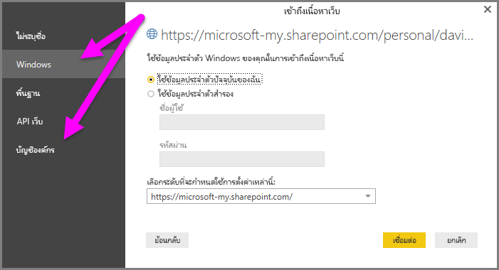

# ใช้ลิงก์ OneDrive for Business ใน Power BI Desktop
หลายคนมีเวิร์กบุ๊ก Excel ที่จัดเก็บไว้ใน OneDrive for Business ที่จะเหมาะสำหรับใช้งานกับ Power BI Desktop ด้วย Power BI Desktop คุณสามารถใช้ลิงก์ออนไลน์สำหรับไฟล์ Excel ที่จัดเก็บไว้ใน OneDrive for Business เพื่อสร้างรายงานและวิชวลได้ คุณสามารถใช้บัญชีผู้ใช้กลุ่ม OneDrive for Business หรือบัญชีผู้ใช้บุคคล OneDrive for Business ของคุณก็ได้

การรับลิงก์ออนไลน์จาก OneDrive for Business ต้องใช้ขั้นตอนที่เฉพาะเจาะจงสองสามขั้นตอน ส่วนต่อไปนี้จะอธิบายขั้นตอนดังกล่าว ให้คุณสามารถแชร์ลิงก์ของไฟล์ระหว่างกลุ่ม ระหว่างเครื่อง และกับเพื่อนร่วมงานของคุณ

## รับลิงก์จาก Excel
1. นำทางไปยังที่ตั้ง OneDrive for Business ของคุณโดยใช้เบราว์เซอร์ คลิกขวาไฟล์ที่คุณต้องการใช้ และเลือก**เปิดใน Excel**
   
   > [!NOTE]
   > อินเทอร์เฟซบนเบราว์เซอร์ของคุณอาจไม่เหมือนรูปต่อไปนี้ มีหลายวิธีในการเลือก**เปิดใน Excel** สำหรับไฟล์ในอินเทอร์เฟซบนเบราว์เซอร์ OneDrive for Business ของคุณ คุณสามารถใช้ทางเลือกใด ๆ ที่ทำให้คุณสามารถเปิดไฟล์ใน Excel
   
   

2. ใน Excel เลือก**ไฟล์** > **ข้อมูล**จากนั้นเลือกปุ่ม **คัดลอกเส้นทาง** ดังที่แสดงในรูปต่อไปนี้
   
   

## ใช้ลิงก์ใน Power BI Desktop
ใน Power BI Desktop คุณสามารถใช้ลิงก์ที่คุณเพิ่งคัดลอกไปยังคลิปบอร์ด ทำตามขั้นตอนต่อไปนี้:

1. ใน Power BI Desktop ให้เลือก **รับข้อมูล** > **เว็บ**
   
   
2. ด้วยตัวเลือก **พื้นฐาน** ที่เลือกไว้ วางลิงก์ในกล่องโต้ตอบ **จากเว็บ**
3. ลบสตริง *?web=1* ออกที่จุดสิ้นสุดของลิงก์เพื่อให้ Power BI Desktop สามารถนำทางไปยังไฟล์ของคุณอย่างถูกต้อง จากนั้นเลือก**ตกลง**
   
     
4. ถ้า Power BI Desktop พร้อมท์คุณสำหรับข้อมูลประจำตัว เลือก **Windows** (สำหรับไซต์ SharePoint ภายในองค์กร) หรือ **บัญชีองค์กร** (สำหรับ Microsoft 365 หรือ ไซต์ OneDrive for Business) อย่างใดอย่างหนึ่ง
   
   

   กล่องโต้ตอบ**ตัวนำทาง**จะปรากฏขึ้น ช่วยให้คุณสามารถเลือกจากรายการของตาราง แผ่นงาน และช่วงที่พบในเวิร์กบุ๊ก Excel จากที่นั่น คุณสามารถใช้ไฟล์ OneDrive for Business เช่นเดียวกับไฟล์ Excel อื่น ๆ ได้ คุณสามารถสร้างรายงานและใช้ในชุดข้อมูลได้เช่นเดียวกับที่คุณต้องการกับแหล่งข้อมูลอื่น ๆ

> [!NOTE]
> หากต้องการใช้ไฟล์ OneDrive for Business เป็นแหล่งข้อมูลในบริการของ Power BI ที่เปิดใช้งาน **การบริการรีเฟรช** สำหรับไฟล์ดังกล่าว ตรวจสอบให้แน่ใจว่า คุณเลือก **OAuth2** เป็น **วิธีการรับรองความถูกต้อง**เมื่อกำหนดค่าการตั้งค่าการรีเฟรชของคุณ มิฉะนั้น คุณอาจพบข้อผิดพลาด (เช่น*ไม่สามารถปรับปรุงข้อมูลประจำตัวสำหรับแหล่งข้อมูล*) เมื่อคุณพยายามเชื่อมต่อ หรือรีเฟรชได้ การเลือก **OAuth2** ให้เป็นวิธีการรับรองความถูกต้อง เป็นการแก้ไขข้อผิดพลาดข้อมูลประจำตัวนั้น
>
