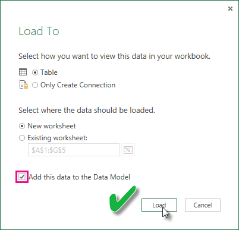

# รีเฟรชชุดข้อมูลที่สร้างขึ้นจากสมุดงาน Excel บนไดรฟ์ภายในเครื่อง
## รับรองอะไรบ้าง
ใน Power BI “รีเฟรชตอนนี้” และ “กำหนดเวลารีเฟรช” ได้รับการสนับสนุนสำหรับชุดข้อมูลที่สร้างจากสมุดงาน Excel ที่นำเข้าจากไดรฟ์ภายในเครื่องที่มีการใช้ Power Query (รับและแปลงข้อมูลใน Excel 2016) หรือ Power Pivot เพื่อเชื่อมต่อกับแหล่งข้อมูลใด ๆ ต่อไปนี้และโหลดข้อมูลลงในแบบจำลองข้อมูล Excel:  

### Power BI Gateway - Personal
* แหล่งข้อมูลออนไลน์ทั้งหมดที่แสดงใน Power Query
* แหล่งข้อมูลภายในองค์กรทั้งหมดที่แสดงอยู่ใน Power Query ยกเว้นไฟล์ Hadoop (HDFS) และ Microsoft Exchange
* แหล่งข้อมูลออนไลน์ทั้งหมดที่แสดงใน Power Pivot\*
* แหล่งข้อมูลภายในองค์กรทั้งหมดที่แสดงอยู่ใน Power Pivot ยกเว้นไฟล์ Hadoop (HDFS) และ Microsoft Exchange

<!-- Refresh Data sources-->
[!INCLUDE [refresh-datasources](../includes/refresh-datasources.md)]

> **หมายเหตุ:**  
> 
> * เกตเวย์ต้องได้รับการติดตั้ง และเรียกใช้เพื่อให้ Power BI เชื่อมต่อกับแหล่งข้อมูลภายในองค์กร และรีเฟรชชุดข้อมูล
> * เมื่อใช้ Excel 2013 ตรวจสอบให้แน่ใจว่า คุณได้ทำการอัปเดต Power Query ให้เป็นรุ่นล่าสุด
> * การรีเฟรชไม่ได้รับการสนับสนุนสำหรับสมุดงาน Excel ที่นำเข้าจากไดรฟ์ภายในเครื่องที่มีข้อมูลอยู่ในแผ่นงานหรือตารางที่เชื่อมโยงเท่านั้น การรีเฟรชจะได้รับการสนับสนุนสำหรับข้อมูลในแผ่นงานหากมีการจัดเก็บและนำเข้าจาก OneDrive เมื่อต้องการเรียนรู้เพิ่มเติม ดูที่[รีเฟรชชุดข้อมูลที่สร้างขึ้นจากสมุดงาน Excel บน OneDrive หรือ SharePoint Online](refresh-excel-file-onedrive.md)
> * เมื่อคุณรีเฟรชชุดข้อมูลที่สร้างขึ้นจากสมุดงาน Excel ที่นำเข้าจากในไดรฟ์ภายในเครื่อง จะมีการรีเฟรชเฉพาะข้อมูลที่คิวรีจากแหล่งข้อมูล ถ้าคุณเปลี่ยนโครงสร้างของแบบจำลองข้อมูลใน Excel หรือ Power Pivot ตัวอย่างเช่น สร้างหน่วยวัดใหม่ หรือเปลี่ยนชื่อของคอลัมน์ การเปลี่ยนแปลงเหล่านั้นจะไม่ได้รับการคัดลอกไปยังชุดข้อมูล ถ้าคุณทำการเปลี่ยนแปลงดังกล่าว คุณจะต้องอัปโหลดใหม่ หรือเผยแพร่สมุดงานอีกครั้ง ถ้าคุณคาดว่าจะทำการเปลี่ยนแปลงทั่วไปกับโครงสร้างสมุดงานของคุณ และคุณต้องการให้สิ่งเหล่านั้นมีผลในชุดข้อมูลใน Power BI โดยไม่ต้องอัปโหลดใหม่ โปรดพิจารณาการย้ายสมุดงานของคุณไปยัง OneDrive Power BI จะรีเฟรชทั้งข้อมูลโครงสร้างและแผ่นงานจากสมุดงานที่เก็บไว้ และนำเข้าจาก OneDrive โดยอัตโนมัติ
> 
> 

## ฉันจะแน่ใจได้อย่างไรว่าข้อมูลได้รับการโหลดไปยังแบบจำลองข้อมูล Excel
เมื่อคุณใช้ Power Query (รับและแปลงข้อมูลใน Excel 2016) เพื่อเชื่อมต่อกับแหล่งข้อมูล คุณจะมีหลายตัวเลือกสำหรับตำแหน่งที่จะโหลดข้อมูล เมื่อต้องการตรวจสอบให้แน่ใจว่า คุณโหลดข้อมูลลงในแบบจำลองข้อมูล คุณต้องเลือก**เพิ่มข้อมูลนี้ลงในตัวเลือกแบบจำลองข้อมูล**ใน**โหลดไปยัง**กล่องโต้ตอบ

> [!NOTE]
> รูปภาพนี้แสดง Excel 2016
> 
> 

ใน**ตัวนำทาง**คลิก**โหลดไปยัง...**  
    

หรือ ถ้าคุณคลิก**แก้ไข**ในตัวนำทาง ตัวแก้ไขคิวรีจะเปิดขึ้น ซึ่งคุณสามารถคลิก**ปิด & โหลดไปยัง...**  
    

จากนั้นใน**โหลดไปยัง**ตรวจสอบให้แน่ใจว่าคุณเลือก**เพิ่มข้อมูลนี้ลงในแบบจำลองข้อมูล**  
    

### เกิดอะไรขึ้นถ้าฉันใช้ “รับข้อมูลภายนอกใน Power Pivot”
ไม่มีปัญหา เมื่อใดก็ตามที่คุณใช้ Power Pivot เพื่อเชื่อมต่อ และคิวรีข้อมูลจากแหล่งข้อมูลภายในองค์กร หรือแหล่งข้อมูลออนไลน์ ข้อมูลจะได้รับการโหลดลงในแบบจำลองข้อมูลโดยอัตโนมัติ

## ฉันจะกำหนดเวลารีเฟรชได้อย่างไร
เมื่อคุณตั้งค่ากำหนดการรีเฟรช Power BI จะเชื่อมต่อโดยตรงไปยังแหล่งข้อมูลโดยใช้ข้อมูลการเชื่อมต่อและข้อมูลประจำตัวในชุดข้อมูล เพื่อคิวรีข้อมูลที่อัปเดตแล้ว จากนั้นโหลดข้อมูลที่อัปเดตแล้วลงในชุดข้อมูล การแสดงภาพด้วยข้อมูลในรายงานและแดชบอร์ดที่อิงชุดข้อมูลนั้นในบริการของ Power BI จะได้รับการอัปเดตตามไปด้วย

สำหรับรายละเอียดเกี่ยวกับวิธีการตั้งค่าการรีเฟรชตามกำหนดการ ดูที่[กำหนดค่าเวลาการรีเฟรช](refresh-scheduled-refresh.md)

## เมื่อเกิดสิ่งผิดปกติขึ้น
เมื่อเกิดสิ่งผิดปกติขึ้น ซึ่งโดยปกติจะเกิดเนื่องจาก Power BI ไม่สามารถลงชื่อเข้าใช้แหล่งข้อมูล หรือถ้าชุดข้อมูลเชื่อมต่อกับแหล่งข้อมูลภายในองค์กร เกตเวย์จะออฟไลน์ ตรวจสอบให้แน่ใจว่า Power BI สามารถลงชื่อเข้าใช้แหล่งข้อมูล ถ้ามีการเปลี่ยนแปลงรหัสผ่านที่คุณลงชื่อเพื่อเข้าใช้แหล่งข้อมูล หรือ Power BI ได้รับการให้ออกจากแหล่งข้อมูล กรุณาลองลงชื่อเข้าใช้แหล่งข้อมูลของคุณอีกครั้งในข้อมูลประจำตัวของแหล่งข้อมูล

โปรดแน่ใจว่าคุณออกจาก**ส่งอีเมล์แจ้งเตือนเมื่อการรีเฟรชล้มเหลวให้ฉันตรวจสอบ** คุณต้องทราบทันทีว่าการรีเฟรชตามกำหนดการล้มเหลวหรือไม่

>[!IMPORTANT]
>การรีเฟรชไม่ได้รับการสนับสนุนสำหรับฟีด OData ที่เชื่อมต่อ และคิวรีจาก Power Pivot เมื่อใช้ฟีด OData เป็นแหล่งข้อมูล ให้ใช้ Power Query

## แนวทางการแก้ไขปัญหา
การรีเฟรชข้อมูลอาจไม่เป็นไปตามที่คาดไว้ในบางครั้ง โดยทั่วไปแล้วจะเป็นปัญหาที่เกี่ยวข้องกับเกตเวย์ โปรดดูที่บทความแก้ไขปัญหาเกตเวย์สำหรับเครื่องมือและปัญหาที่ทราบแล้ว

[การแก้ไขปัญหา เกตเวย์ข้อมูลในองค์กร](service-gateway-onprem-tshoot.md)

[แก้ไขปัญหาเกตเวย์ Power BI - ส่วนบุคคล](service-admin-troubleshooting-power-bi-personal-gateway.md)

## ขั้นตอนถัดไป
มีคำถามเพิ่มเติมหรือไม่ [ลองไปที่ชุมชน Power BI](https://community.powerbi.com/)
