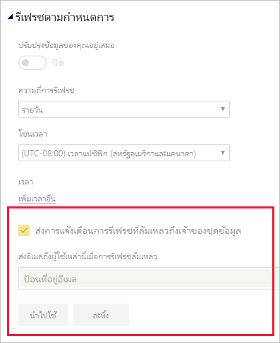

# การแก้ไขปัญหาสถานการณ์สมมติในการรีเฟรช

ที่นี่คุณสามารถค้นหาข้อมูลเกี่ยวกับสถานการณ์สมมติที่หลากหลายที่คุณอาจประสบเมื่อรีเฟรชข้อมูลภายในบริการ Power BI

> [!NOTE]
> ถ้าคุณพบกับสถานการณ์สมมติที่ไม่ได้แสดงอยู่ในรายการด้านล่างนี้ และทำให้เกิดปัญหากับคุณ คุณสามารถขอความช่วยเหลือเพิ่มเติมได้ใน[เว็บไซต์ชุมชน](https://community.powerbi.com/) หรือคุณสามารถสร้าง[ตั๋วสนับสนุน](https://powerbi.microsoft.com/support/)ได้
>
>

## การแจ้งเตือนทางอีเมล

หากคุณเข้ามาในบทความนี้จากการแจ้งเตือนทางอีเมล และคุณไม่ต้องการรับอีเมลเกี่ยวกับปัญหาการรีเฟรชอีกต่อไป ให้ติดต่อผู้ดูแลระบบ Power BI ของคุณ ขอให้พวกเขาลบอีเมลของคุณหรือรายชื่ออีเมลที่คุณสมัครใช้งานจากชุดข้อมูลที่เหมาะสมใน Power BI พวกเขาสามารถทำสิ่งนี้ได้จากพื้นที่ต่อไปนี้ในพอร์ทัลผู้ดูแลระบบ Power BI

## รีเฟรชโดยการใช้ตัวเชื่อมต่อเว็บ ไม่ทำงานอย่างถูกต้อง

ถ้าคุณมีสคริปต์ตัวเชื่อมต่อเว็บที่ใช้ในฟังก์ชัน[**Web.Page**](https://msdn.microsoft.com/library/mt260924.aspx) และคุณได้อัปเดตชุดข้อมูลหรือรายงานของคุณหลังวันที่ 18 พฤศจิกายน 2016 คุณต้องใช้เกตเวย์สำหรับการรีเฟรชเพื่อให้ระบบทำงานอย่างถูกต้อง

## แหล่งข้อมูลที่ไม่รับรองสำหรับการรีเฟรช

เมื่อต้องการกำหนดค่าชุดข้อมูล อาจมีข้อผิดพลาดที่ระบุว่า ชุดข้อมูลใช้แหล่งข้อมูลที่ไม่รับรองสำหรับการรีเฟรช สำหรับรายละเอียด ดู[การแก้ไขปัญหาแหล่งข้อมูลที่ไม่รับรองสำหรับการรีเฟรช](service-admin-troubleshoot-unsupported-data-source-for-refresh.md)

## แดชบอร์ดไม่แสดงการเปลี่ยนแปลงหลังจากรีเฟรช

โปรดรอประมาณ 10-15 นาทีสำหรับการรีเฟรชเพื่อให้มีผลในไทล์แดชบอร์ด ถ้ายังคงไม่ปรากฏขึ้น ให้ปักหมุดการแสดงภาพไปยังแดชบอีกครั้ง

## GatewayNotReachable เมื่อตั้งค่าข้อมูลประจำตัว

คุณอาจพบ `GatewayNotReachable` เมื่อพยายามตั้งค่าข้อมูลประจำตัวสำหรับแหล่งข้อมูล ซึ่งอาจเกิดจากเกตเวย์ที่ไม่อัปเดต ติดตั้งเกตเวย์ล่าสุด แล้วลองอีกครั้ง

## ข้อผิดพลาดเกี่ยวกับการประมวลผล: ระบบเกิดข้อผิดพลาดต่อไปนี้: ประเภทไม่ตรงกัน

ซึ่งอาจเป็นปัญหาจากสคริปต์ M ของคุณภายในไฟล์ Power BI Desktop หรือสมุดงาน Excel ของคุณ นอกจากนี้ อาจเกิดจากเวอร์ชัน Power BI Desktop ที่ล้าสมัย

## ข้อผิดพลาดการรีเฟรชไทล์

สำหรับรายการและคำอธิบายของข้อผิดพลาดที่คุณอาจประสบไทล์แดชบอร์ด ดู[แก้ไขปัญหาข้อผิดพลาดไทล์](refresh-troubleshooting-tile-errors.md)

## รีเฟรชล้มเหลวเมื่อปรับปรุงข้อมูลจากแหล่งข้อมูลที่ใช้ AAD OAuth

โทเค็น OAuth ของ Azure Active Director (**AAD**) ที่ใช้งานโดยแหล่งข้อมูลต่าง ๆ มากมายจะหมดอายุในหนึ่งชั่วโมงโดยประมาณ คุณอาจอยู่ในสถานการณ์ที่การโหลดข้อมูลใช้เวลานานกว่าอายุการใช้งานของโทเค็น (มากกว่าหนึ่งชั่วโมง) เนื่องจากบริการ Power BI รอถึงสองชั่วโมงเมื่อโหลดข้อมูล ในสถานการณ์เช่นนี้ กระบวนการในการโหลดข้อมูลอาจไม่สำเร้จและมีข้อผิดพลาดข้อมูลประจำตัว

แหล่งข้อมูลที่ใช้ AAD OAuth รวมถึง **Microsoft Dynamics CRM Online**, **SharePoint Online** (SPO) และอื่น ๆ ถ้าคุณกำลังเชื่อมต่อกับแหล่งข้อมูลดังกล่าวและเกิดความล้มเหลวของข้อมูลประจำตัวเมื่อโหลดข้อมูลใช้เวลามากกว่าหนึ่งชั่วโมง นี่อาจเป็นเหตุผล

Microsoft กำลังค้นหาโซลูชันที่ช่วยให้กระบวนหารโหลดข้อมูลทำการรีเฟรชโทเค็นและดำเนินต่อ อย่างไรก็ตาม หากตัวอย่าง Dynamics CRM Online หรือ SharePoint Online ของคุณ (หรือแหล่งข้อมูล AAD OAuth อื่น) มีขนาดใหญ่มากและอาจเข้าในเกณฑ์ค่าต่ำสุดการโหลดข้อมูล 2 ชั่วโมง คุณอาจประสบกับการหมดเวลาการโหลดข้อมูลจากบริการ Power BI ได้เช่นกัน

นอกจากนี้ โปรดทราบว่าสำหรับรีเฟรชเพื่อให้ทำงานได้อย่างเหมาะสม เมื่อเชื่อมต่อไปยังข้อมูลแหล่ง **SharePoint Online**โดยใช้ AAD OAuth คุณต้องใช้บัญชีเดียวกันกับที่คุณใช้เพื่อลงชื่อเข้าใช้**บริการ Power BI**

## ขีดจำกัดข้อมูลที่ไม่มีการบีบอัดสำหรับรีเฟรช

ขนาดสูงสุดสำหรับชุดข้อมูลที่นำเข้าใน**บริการ Power BI**คือ 1 GB ชุดข้อมูลเหล่านี้จะถูกบีบอัดเพื่อให้แน่ใจถึงประสิทธิภาพสูงสุดในการทำงาน นอกจากนี้ ในความจุที่ใช้ร่วมกัน บริการจะวางขีดจำกัดจำนวนข้อมูลที่ไม่บีบอัดที่มีการประมวลผลในระหว่างการรีเฟรชเเป็น 10 GB ซึ่งขั้นตอนนี้จะจำกัดบัญชีผู้ใช้ในการบีบอัด ดังนั้นจึงสูงกว่า 1 GB มาก ชุดข้อมูลใน Power BI Premium ไม่ขึ้นอยู่กับขีดจำกัดนี้ ถ้าการรีเฟรชในบริการ Power BI ล้มเหลวด้วยเหตุผลนี้ โปรดลดปริมาณข้อมูลที่จะนำเข้าไปยัง Power BI และลองอีกครั้ง

## หมดเวลารีเฟรชตามกำหนดการ

รีเฟรชตามกำหนดการสำหรับการหมดเวลาของชุดข้อมูลที่นำเข้าหลังจากสองชั่วโมง การหมดเวลานี้จะเพิ่มเป็น 5 ชั่วโมงสำหรับชุดข้อมูลในพื้นที่ทำงาน **Premium** ถ้าคุณประสบกับขีดจำกัดนี้อาจต้องพิจารณาลดขนาดหรือความซับซ้อนของชุดข้อมูลของคุณ หรือพิจารณาแบ่งชุดข้อมูลเป็นขนาดที่เล็กลง

## รีเฟรชตามกำหนดการล้มเหลว

ถ้าการรีเฟรชตามกำหนดการล้มเหลวสี่ครั้งติดต่อกัน Power BI จะปิดใช้งานการรีเฟรช แก้ไขปัญหาพื้นฐาน และจากนั้นจึงเปิดใช้งานการรีเฟรชตามกำหนดการใหม่

## การเข้าถึงทรัพยากรถูกห้าม  

ข้อผิดพลาดนี้สามารถเกิดขึ้นเนื่องจากข้อมูลประจำตัวที่แคชไว้หมดอายุแล้ว ล้างแคชของเบราว์เซอร์อินเทอร์เน็ตของคุณ โดยลงชื่อเข้าใช้ Power BI แล้วไปที่ `https://app.powerbi.com?alwaysPromptForContentProviderCreds=true` ซึ่งเป็นการบังคับการปรับปรุงข้อมูลประจำตัวของคุณ

## การรีเฟรชข้อมูลล้มเหลวเนื่องจากการเปลี่ยนรหัสผ่าน หรือข้อมูลประจำตัวที่หมดอายุ

การรีเฟรชข้อมูลอาจล้มเหลวเนื่องจากข้อมูลประจำตัวที่แคชไว้หมดอายุแล้ว ล้างแคชของเบราว์เซอร์อินเทอร์เน็ตของคุณ โดยลงชื่อเข้าใช้ Power BI แล้วไปที่ `https://app.powerbi.com?alwaysPromptForContentProviderCreds=true` ซึ่งเป็นการบังคับการปรับปรุงข้อมูลประจำตัวของคุณ

## ขั้นตอนถัดไป

- [การรีเฟรชข้อมูลใน Power BI](refresh-data.md)  
- [การแก้ไขปัญหาเกตเวย์ข้อมูลในองค์กร](service-gateway-onprem-tshoot.md)  
- [แก้ไขปัญหาเกตเวย์ Power BI - ส่วนบุคคล](service-admin-troubleshooting-power-bi-personal-gateway.md)  

มีคำถามเพิ่มเติมหรือไม่ [ลองถามชุมชน Power BI](https://community.powerbi.com/)
