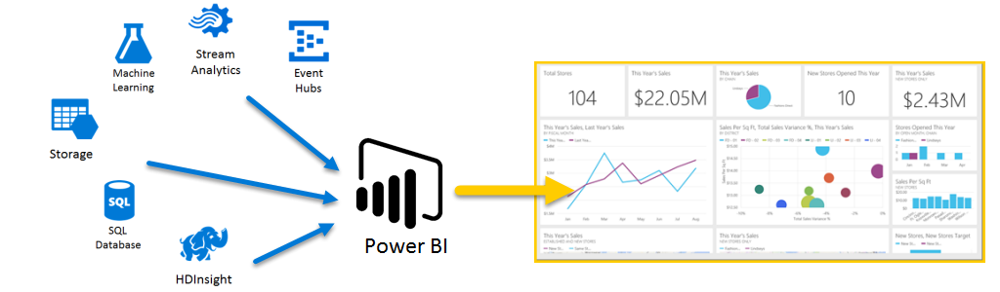

# Azure และ Power BI

ด้วยบริการ**Azure** และ**Power BI** คุณสามารถเปิดใช้การประมวลผลข้อมูลของคุณลงในการวิเคราะห์และรายงานที่ให้ข้อมูลเชิงลึกแบบเรียลไทม์ในธุรกิจของคุณได้ ไม่ว่าการประมวลข้อมูลจะอยู่ในคลาวด์หรือภายในองค์กร ตรงไปตรงมาหรือซับซ้อน มาจากแหล่งเดียวหรือปรับมาตราส่วนให้กว้างขึ้น จัดเก็บเอาไว้หรือเรียลไทม์ก็ตาม Azure และ Power BI มีภาวะเชื่อมต่อและการหาปริพันธ์ที่อยู่ภายใน เพื่อให้ความพยายามในระบบธุรกิจอัจฉริยะเป็นจริงขึ้นมาได้

Power BI มีการเชื่อมต่อ Azure ที่พร้อมใช้งานที่หลากหลาย และโซลูชันข่าวกรองทางธุรกิจที่คุณสามารถสร้างได้ด้วยบริการเหล่านั้น จะมีความเป็นเอกลักษณ์เช่นเดียวกับธุรกิจของคุณ คุณสามารถเชื่อมต่อในปริมานน้อยได้ เช่น หนึ่งแหล่งข้อมูล Azure หรือจำนวนไม่กี่แหล่ง จาก นั้นจัดรูปร่างและปรับปรุงข้อมูลของคุณเพื่อสร้างรายงานแบบกำหนดเอง

## ฐานข้อมูล Azure SQL และ Power BI

คุณสามารถเริ่มต้นด้วยการเชื่อมต่อตรงไปยังฐานข้อมูล SQL Azure และสร้างรายงานเพื่อตรวจติดตามความคืบหน้าของธุรกิจของคุณได้ การใช้[Power BI Desktop](../fundamentals/desktop-getting-started.md) คุณสามารถสร้างรายงานที่ระบุแนวโน้มและตัวบ่งชี้ประสิทธิภาพที่สำคัญที่ขับเคลื่อนธุรกิจของคุณให้มุ่งไปข้างหน้า

มีข้อมูลเพิ่มเติมจำนวนมากที่ให้คุณเรียนรู้เกี่ยวกับ[ฐานข้อมูล Azure SQL](https://azure.microsoft.com/services/sql-database/) ได้

## แปลง ปรับรูปร่าง และผสานข้อมูลในระบบคลาวด์ของคุณ

คุณมีข้อมูลที่ซับซ้อนกว่าและมีทุกประเภทของแหล่งที่มาของข้อมูลหรือไม่? ไม่มีปัญหา ด้วย **Power BI Desktop** และบริการของ Azure คุณสามารถเชื่อมต่อได้ง่าย ๆ โดยการแตะกล่องโต้ตอบ**รับข้อมูล** ภายในแบบสอบถามเดียวกัน คุณสามารถเชื่อมต่อ**ฐานข้อมูล SQL Azure**ของคุณ แหล่งข้อมูล**Azure HDInsight**ของคุณ และ**การเก็บข้อมูล Azure Blob** ของคุณได้ (หรือ**ตารางเก็บข้อมูล Azure**) จากนั้นเลือกเฉพาะชุดย่อยภายในแต่ละรายการที่คุณต้องการและปรับปรุงเอกสารจากตรงนั้น

คุณสามารถสร้างรายงานอื่นสำหรับผู้ชมกลุ่มอื่นโดยใช้การเชื่อมต่อข้อมูลเดียวกันและแม้แต่การสอบถามเดียวกันได้เช่นกัน เพียงแค่สร้างหน้ารายงานใหม่ ปรับปรุงการแสดงภาพของคุณสำหรับแต่ละผู้ชม และดูการติดตามความก้าวหน้าธุรกิจของคุณ

สำหรับข้อมูลเพิ่มเติม โปรดดูที่แหล่งทรัพยากรต่อไปนี้:

* [ฐานข้อมูล Azure SQL](https://azure.microsoft.com/services/sql-database/)
* [Azure HDInsight (HDFS)](https://azure.microsoft.com/services/hdinsight/)
* [พื้นที่จัดเก็บ Azure](https://azure.microsoft.com/services/storage/) (พื้นที่จัดเก็บ Blob และพื้นที่จัดเก็บตาราง)

## รับรายงานที่ซับซ้อน (และทำล่วงหน้า) โดยใช้ Azure Services และ Power BI

คุณสามารถขยายได้มากเท่าที่คุณต้องการสำหรับ Azure และ Power BI ควบคุมการประมวลผลข้อมูลหลายแหล่ง ใช้ระบบแบบเรียลไทม์ขนาดใหญ่ ใช้[Stream Analytics](https://azure.microsoft.com/services/stream-analytics/)และ[Event Hubs](https://azure.microsoft.com/services/event-hubs/)และรวมบริการ SaaS ต่าง ๆ ของคุณเข้ากับรายงานข่าวกรองทางธุรกิจที่ให้ข้อมูลทางธุรกิจที่ล้ำสมัยกับคุณ

## ข้อมูลเชิงลึกในบริบทพร้อมการวิเคราะห์ Power BI Embedded

ฝังการแสดงภาพเชิงโต้ตอบอันน่าทึ่งในแอปพลิเคชัน เว็บไซต์ พอร์ทัล และอื่นๆ เพื่อใช้ประโยชน์จากข้อมูลธุรกิจของคุณ ด้วย [Power BI Embedded เป็นแหล่งทรัพยากรใน Azure](https://azure.microsoft.com/services/power-bi-embedded/) คุณจะสามารถฝังรายงานเชิงโต้ตอบและแดชบอร์ดได้อย่างง่ายดาย ดังนั้นผู้ใช้ของคุณจะเพลิดเพลินไปกับการใช้งานข้ามอุปกรณ์ที่สม่ำเสมอและมีความแม่นยำสูง  Power BI ที่ใช้กับการฝังการวิเคราะห์นั้นมีไว้เพื่อช่วยในการเดินทางจากข้อมูล -> ความรู้ -> ข้อมูลเชิงลึก -> การดำเนินการ  ยิ่งไปกว่านั้น คุณสามารถขยายค่าของ Power BI และ Azure ได้โดยการฝังการวิเคราะห์ใน [แอปพลิเคชันและพอร์ทัลภายในขององค์](https://powerbi.microsoft.com/developers/embedded-analytics/organization/)

มีข้อมูลจำนวนมากเกี่ยวกับ Power BI API ใน[พอร์ทัลนักพัฒนา Power BI](https://dev.powerbi.com)

สำหรับข้อมูลเพิ่มเติมดู [Power BI Embedded อะไรใน Azure](../developer/embedded/azure-pbie-what-is-power-bi-embedded.md)

## ฝังข้อมูล Power BI ของคุณไว้ภายในแอป

ฝังการแสดงภาพเชิงโต้ตอบอันน่าทึ่งในแอปพลิเคชัน เว็บไซต์ พอร์ทัล และอื่นๆ เพื่อแสดงข้อมูลธุรกิจของคุณในบริบท ด้วยการใช้ [Power BI Embedded ใน Azure](https://azure.microsoft.com/services/power-bi-embedded/) คุณสามารถฝังรายงานเชิงโต้ตอบและแดชบอร์ดได้อย่างง่ายดาย เพื่อให้ผู้ใช้ของคุณเพลิดเพลินไปกับการใช้งานข้ามอุปกรณ์ที่สม่ำเสมอและมีความแม่นยำสูง

## คุณสามารถทำอะไรได้บ้างกับ Azure และ Power BI?

มีหลากหลายสถานการณ์มากทีี่เราสามารถใช้งาน **Azure**ร่วมกับ**Power BI**ได้ ความเป็นไปได้และโอกาสต่าง ๆ จะมีความเป็นเอกลักษณ์เฉกเช่นธุรกิจของคุณ สำหรับข้อมูลเพิ่มเติมเกี่ยวกับ**บริการ Azure** สามารถดูได้ที่[เพจภาพรวม](https://docs.microsoft.com/azure/machine-learning/team-data-science-process/plan-your-environment)ซึ่งอธิบายเกี่ยวกับ**สถานการณ์สมมติการวิเคราะห์ข้อมูลโดยใช้ Azure** และเรียนรู้วิธีการเปลี่ยนแปลงแหล่งข้อมูลเป็นข่าวกรองที่ขับเคลื่อนธุรกิจของคุณให้ก้าวไปข้างหน้า
