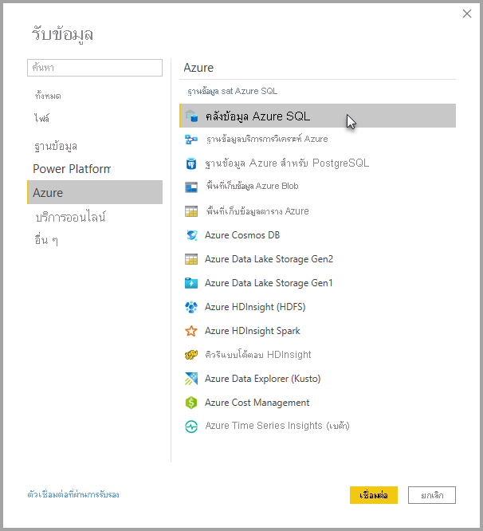
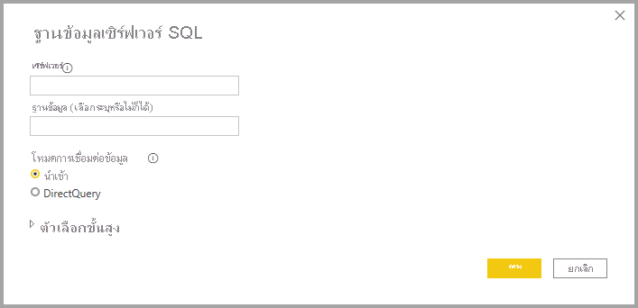

# Azure SQL Data Warehouse พร้อม DirectQuery

Azure SQL Data Warehouse พร้อม DirectQuery ช่วยให้คุณสามารถสร้างรายงานแบบไดนามิกที่ยึดตามข้อมูลและเมทริกซ์ที่คุณมีอยู่แล้วใน Azure SQL Data Warehouse ด้วย DirectQuery แบบสอบถามจะถูกส่งกลับไปยัง Azure SQL Data Warehouse ของคุณในแบบเรียลไทม์ ตามที่คุณสำรวจข้อมูล โดยแบบสอบถามแบบเรียลไทม์นั้นมีการรวมเข้ากับ SQL Data Warehouse ส่วนหนึ่ง เพื่อให้ผู้ใช้งานสามารถสร้างรายงานแบบไดนามิกได้ในเวลาเพียงไม่นาน แม้จะมีข้อมูลเยอะระดับเทราไบต์ นอกจากนี้ ลิงก์**สร้างแดชบอร์ด + รายงาน** ช่วยให้ผู้ใช้สามารถสร้างรายงาน Power BI โดยใช้ SQL Data Warehouse ของพวกเขา

เมื่อใช้ตัวเชื่อมต่อ SQL Data Warehouse:

* ระบุชื่อเซิร์ฟเวอร์ที่มีคุณสมบัติครบถ้วนเมื่อเชื่อมต่อ (ดูด้านล่างสำหรับรายละเอียด)
* ตรวจสอบให้แน่ใจว่ามีการกำหนดค่ากฎไฟร์วอลล์สำหรับเซิร์ฟเวอร์เพื่อ "อนุญาตการเข้าถึงบริการ Azure"
* ทุกการดำเนินการ เช่น การเลือกคอลัมน์ หรือเพิ่มตัวกรองจะสอบถามคลังข้อมูลโดยตรง
* ไทล์จะถูกตั้งค่าการรีเฟรชทุก 15 นาทีโดยประมาณ และรีเฟรชไม่จำเป็นต้องมีการทำกำหนดการ  ซึ่งคุณอาจปรับการรีเฟรชในส่วนการตั้งค่าขั้นสูงได้เมื่อทำการเชื่อมต่อ
* การถามตอบสำหรับชุดข้อมูล DirectQuery ไม่พร้อมใช้งาน
* ไม่มีการเลือกการเปลี่ยนแปลง Schema โดยอัตโนมัติ

ข้อจำกัดและบันทึกย่อเหล่านี้อาจเปลี่ยนแปลงขณะที่เราปรับปรุงประสบการณ์การใช้งานขึ้นเรื่อย ๆ ขั้นตอนในการเชื่อมต่อจะมีรายละเอียดดังด้านล่าง

## สร้างแดชบอร์ดและรายงานใน Power BI

> [!Important]
> เรากำลังปรับปรุงการเชื่อมต่อของเรากับคลังข้อมูล SQL ของ Azure สำหรับประสบการณ์ดีที่สุดในการเชื่อมต่อกับแหล่งคลังข้อมูล SQL ของ Azure ของคุณ ใช้ Power BI Desktop เมื่อคุณได้สร้างรูปแบบข้อมูลและรายงานของคุณแล้ว คุณสามารถเผยแพร่สิ่งดังกล่าวไปยังบริการ Power BI ตัวเชื่อมต่อโดยตรงที่มีอยู่ก่อนหน้านี้สำหรับ Azure SQL Data Warehouse ในบริการ Power BI ในขณะนี้ไม่สามารถใช้ได้อีกต่อไป

การเคลื่อนย้ายข้อมูลระหว่าง SQL Data Warehouse กับ Power BI คือการสร้างรายงานใน Power BI Desktop คุณสามารถใช้ปุ่ม **สร้างแดชบอร์ด + รายงาน** ภายในพอร์ทัล Azure

1. ในการเริ่มต้น ให้ดาวน์โหลดและติดตั้ง Power BI Desktop ดูบทความ [รับ Power BI Desktop](../fundamentals/desktop-get-the-desktop.md) สำหรับข้อมูลเกี่ยวกับการดาวน์โหลดและติดตั้ง หรือไปยังขั้นตอนถัดไปโดยตรง

2. คุณยังสามารถคลิกลิงก์ **สร้างแดชบอร์ด + รายงาน** เพื่อดาวน์โหลด Power BI Desktop ได้อีกด้วย

    

## เชื่อมต่อผ่านทาง Power BI Desktop

คุณสามารถเชื่อมต่อกับ SQL Data Warehouse ได้โดยใช้ปุ่ม **รับข้อมูล** ใน Power BI Desktop 

1. เลือกปุ่ม **รับข้อมูล** จากเมนู **หน้าหลัก**  

    

2. เลือก **เพิ่มเติม ...** เพื่อดูแหล่งข้อมูลทั้งหมดที่มีอยู่ จากหน้าต่างที่ปรากฏขึ้น ให้เลือก **Azure** จากบานหน้าต่างด้านซ้ายจากนั้นเลือก **Azure SQL Data Warehouse** จากรายการของตัวเชื่อมต่อที่พร้อมใช้งานในบานหน้าต่างด้านขวา

    

3. ในหน้าต่างที่ปรากฏขึ้น ให้ใส่เซิร์ฟเวอร์ของคุณและเลือกระบุฐานข้อมูลที่คุณต้องการเชื่อมต่อ คุณยังสามารถเลือกโหมดการเชื่อมต่อข้อมูลของคุณ: Import หรือ DirectQuery สำหรับการเข้าถึงข้อมูลแบบเรียลไทม์ใน Azure SQL Data Warehouse ของคุณ ให้ใช้ DirectQuery

    

4. สำหรับตัวเลือกขั้นสูงสำหรับการเชื่อมต่อ Azure SQL Data Warehouse ให้เลือกลูกศรลงที่อยู่ด้านช้าง **ตัวเลือกขั้นสูง** เพื่อแสดงตัวเลือกเพิ่มเติมสำหรับการเชื่อมต่อของคุณ

    

ส่วนถัดไปจะอธิบายวิธีการค้นหาค่าพารามิเตอร์สำหรับการเชื่อมต่อของคุณ 

## ค้นหาค่าพารามิเตอร์

สามารถค้นหาชื่อเซิร์ฟเวอร์และชื่อฐานข้อมูลแบบเต็มของคุณได้ในพอร์ทัล Microsoft Azure โปรดสังเกตว่ามีเฉพาะ SQL Data Warehouse เท่านั้นที่ปรากฏในพอร์ทัล Azure ในขณะนี้

> [!NOTE]
> ถ้าผู้เช่า Power BI ของคุณอยู่ในภูมิภาคเดียวกันกับ Azure SQL Data Warehouse จะไม่มีค่าธรรมเนียมขาออก คุณสามารถค้นหาตำแหน่งที่ผู้เช่า Power BI ของคุณอยู่โดยใช้[คำแนะนำเหล่านี้](https://docs.microsoft.com/power-bi/service-admin-where-is-my-tenant-located)ได้

[!INCLUDE [direct-query-sso](../includes/direct-query-sso.md)]

## ขั้นตอนถัดไป

* [เกี่ยวกับการใช้ DirectQuery ใน Power BI](desktop-directquery-about.md)
* [Power BI คืออะไร](../fundamentals/power-bi-overview.md)  
* [รับข้อมูลสำหรับ Power BI](service-get-data.md)  
* [คลังข้อมูล Azure SQL](/azure/sql-data-warehouse/sql-data-warehouse-overview-what-is/)

มีคำถามเพิ่มเติมหรือไม่ [ลองไปที่ชุมชน Power BI](https://community.powerbi.com/)
