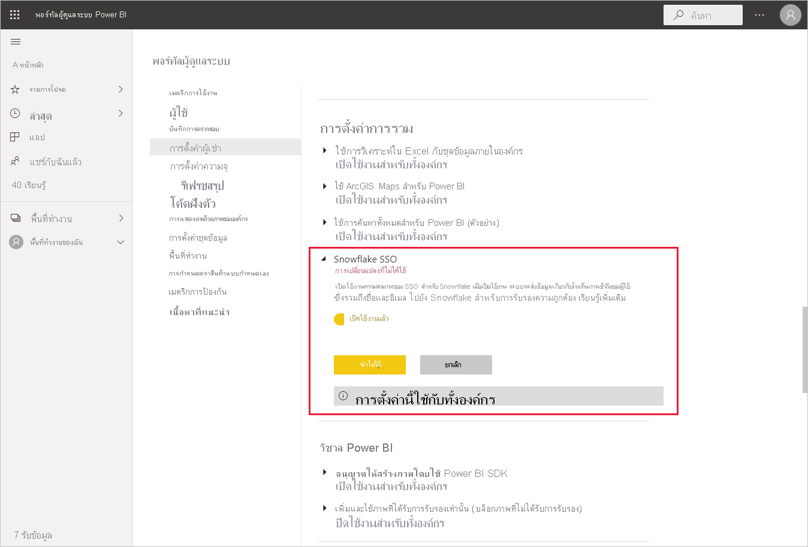
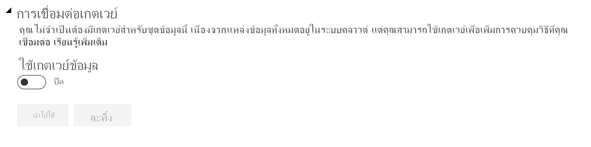
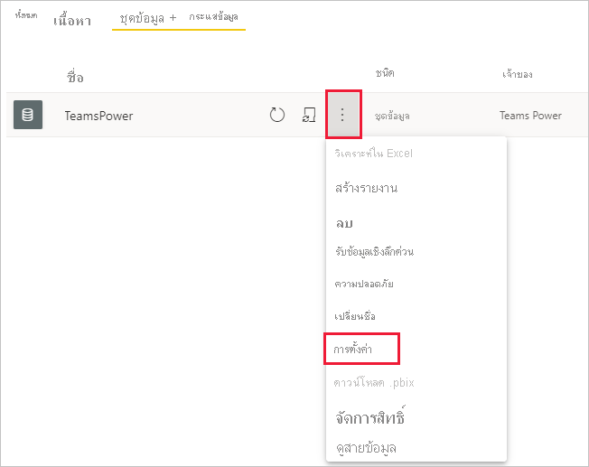
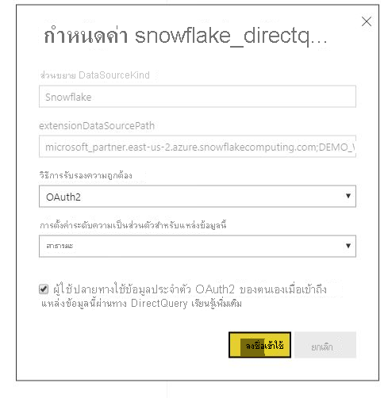

# เชื่อมต่อกับ Snowflake ในบริการของ Power BI

## บทนำ

การเชื่อมต่อกับ Snowflake ในบริการของ Power BI มีความแตกต่างจากตัวเชื่อมต่ออื่นๆ เพียงหนึ่งประการ Snowflake มีความสามารถเพิ่มเติมสำหรับ Azure Active Directory (AAD) ด้วยตัวเลือกสำหรับ SSO ส่วนต่างๆ ของการรวมต้องมีบทบาทการดูแลที่แตกต่างกันใน Snowflake Power BI และ Azure คุณยังสามารถเลือกเปิดใช้งานการรับรองความถูกต้อง AAD โดยไม่ต้องใช้ SSO ได้ การรับรองความถูกต้องเบื้องต้นทำงานคล้ายกับตัวเชื่อมต่ออื่น ๆ ในบริการ

ในการกำหนดค่าการรวม AAD และเลือกเปิดใช้งาน SSO ให้ทำตามขั้นตอนในบทความนี้:

* ถ้าคุณเป็นผู้ดูแลระบบ Snowflake โปรดอ่านบทความ [Power BI SSO ถึง Snowflake - เริ่มต้นใช้งาน](https://docs.snowflake.com/en/user-guide/oauth-powerbi.html) ในเอกสารคู่มือ Snowflake
* ถ้าคุณเป็นผู้ดูแลระบบ Power BI ให้อ้างอิง [การกำหนดค่าบริการของ Power BI - พอร์ทัลผู้ดูแลระบบ](service-connect-snowflake.md#admin-portal) เพื่อเรียนรู้วิธีการเปิดใช้งาน SSO
* ถ้าคุณเป็นผู้สร้างชุดข้อมูล Power BI ให้อ้างอิง [การกำหนดค่าบริการของ Power BI - การกำหนดค่าชุดข้อมูลด้วย AAD](service-connect-snowflake.md#configuring-a-dataset-with-aad) เพื่อเรียนรู้วิธีการเปิดใช้งาน SSO

## การกำหนดค่าบริการ Power BI

### พอร์ทัลผู้ดูแลระบบ

เมื่อต้องการเปิดใช้งาน SSO ผู้ดูแลระบบส่วนกลางจะต้องเปิดการตั้งค่าในพอร์ทัลผู้ดูแลระบบ Power BI การตั้งค่านี้จะอนุมัติการส่งข้อมูลประจำตัว AAD ไปยัง Snowflake สำหรับการรับรองความถูกต้องสำหรับทั้งองค์กร ทำตามขั้นตอนเหล่านี้เพื่อเปิดใช้งาน SSO:

1. [ลงชื่อเข้าใช้ Power BI](https://app.powerbi.com) โดยใช้ข้อมูลประจำตัวของผู้ดูแลระบบส่วนกลาง
1. เลือก **การตั้งค่า** จากเมนูส่วนหัวของหน้า จากนั้นเลือก **พอร์ทัลผู้ดูแลระบบ**
1. เลือก **การตั้งค่าผู้เช่า** จากนั้นเลื่อนเพื่อค้นหา **การตั้งค่าการรวม**

   

4. ขยาย **Snowflake SSO** สลับการตั้งค่าเป็น **เปิดใช้งาน** จากนั้นเลือก **นำไปใช้**

ขั้นตอนนี้จะต้องยินยอมให้ส่งโทเค็น AAD ของคุณไปยังเซิร์ฟเวอร์ Snowflake หลังจากที่คุณเปิดใช้งานการตั้งค่า อาจใช้เวลาถึงหนึ่งชั่วโมงจึงจะมีผลการใช้งาน

หลังจากที่มีการเปิดใช้งาน SSO คุณสามารถใช้รายงานกับ SSO ได้

### การกำหนดค่าชุดข้อมูลที่มี AAD

หลังจากที่มีการเผยแพร่รายงานที่อิงตามตัวเชื่อมต่อ Snowflake ไปยังบริการของ Power BI ผู้สร้างชุดข้อมูลต้องอัปเดตตั้งค่าสำหรับพื้นที่ทำงานที่เหมาะสมเพื่อให้สามารถใช้ SSO ได้

เนื่องด้วยวิธีการทำงานของ Power BI นั้น SSO จะทำงานเฉพาะเมื่อไม่มีการเรียกใช้แหล่งข้อมูลผ่านเกตเวย์ข้อมูลภายในองค์กร ข้อจำกัดแสดงดังรายการด้านล่าง:

* หากคุณกำลังใช้เฉพาะแหล่งข้อมูล Snowflake ในแบบจำลองข้อมูลของคุณ คุณสามารถใช้ SSO ได้ถ้าคุณเลือกที่จะไม่ใช้เกตเวย์ข้อมูลภายในองค์กร
* หากคุณกำลังใช้แหล่งข้อมูล Snowflake กับแหล่งข้อมูลอื่น คุณสามารถใช้ SSO ได้หากไม่มีแหล่งข้อมูลใดที่ใช้เกตเวย์ข้อมูลภายในองค์กร
* หากคุณกำลังใช้แหล่งข้อมูล Snowflake ผ่านเกตเวย์ข้อมูลภายในองค์กร โปรดทราบว่าข้อมูลประจำตัว AAD ยังไม่รองรับในขณะนี้ การพิจารณานี้อาจมีความเกี่ยวข้องในกรณีที่คุณกำลังพยายามเข้าถึง VNet จาก IP เดียวกับเกตเวย์ที่ติดตั้งอยู่ในนั้น แทนที่จะเป็นจากช่วง IP ทั้งหมดของ Power BI
* หากคุณกำลังใช้แหล่งข้อมูล Snowflake และแหล่งข้อมูลอื่นที่ต้องการใช้เกตเวย์ คุณจะต้องใช้ Snowflake ผ่านเกตเวย์ข้อมูลภายในองค์กรเช่นกัน คุณจะไม่สามารถใช้ SSO ในกรณีนี้ได้

เรียนรู้เพิ่มเติมเกี่ยวกับวิธีการใช้เกตเวย์ข้อมูลภายในองค์กรใน [เกตเวย์ข้อมูลภายในองค์กรคืออะไร](service-gateway-onprem.md)

หากคุณไม่ได้ใช้เกตเวย์นั้น คุณพร้อมใช้งานแล้ว เมื่อคุณมีการกำหนดค่าข้อมูลประจำตัว Snowflake บนเกตเวย์ข้อมูลภายในองค์กรของคุณแล้ว แต่คุณใช้เฉพาะแหล่งข้อมูลนั้นในแบบจำลองของคุณ คุณสามารถคลิกปุ่มสลับบนหน้าการตั้งค่าชุดข้อมูล เพื่อปิดเกตเวย์สำหรับแบบจำลองข้อมูลนั้นได้

เมื่อต้องการเปิดใช้งาน SSO สำหรับชุดข้อมูล ให้ทำตามขั้นตอนเหล่านี้:

1. [ลงชื่อเข้าใช้ Power BI](https://app.powerbi.com) โดยใช้ข้อมูลประจำตัวของผู้สร้างชุดข้อมูล
1. เลือกพื้นที่ทำงานที่เหมาะสม จากนั้นเลือก **การตั้งค่า** จากเมนูตัวเลือกเพิ่มเติมที่อยู่ถัดจากชื่อชุดข้อมูล
  
1. เลือก **ข้อมูลประจำตัวของแหล่งข้อมูล** และลงชื่อเข้าใช้ คุณสามารถลงชื่อเข้าใช้ชุดข้อมูลไปยัง Snowflake ได้ด้วยข้อมูลประจำตัวพื้นฐานหรือข้อมูลประจำตัว OAuth2 (AAD) ถ้าคุณใช้ AAD คุณสามารถเปิดใช้งาน SSO ในขั้นตอนถัดไป
1. เลือกตัวเลือก **ผู้ใช้ใช้ข้อมูลประจำตัว OAuth2 ของตนเองเมื่อเข้าถึงแหล่งข้อมูลนี้ผ่านทาง DirectQuery** การตั้งค่านี้จะเป็นการเปิดใช้งาน AAD SSO ไม่ว่าผู้ใช้เริ่มต้นจะลงชื่อเข้าใช้ด้วยการรับรองความถูกต้องเบื้องต้นหรือ OAuth2 (AAD) ข้อมูลประจำตัวของ AAD ก็คือสิ่งที่จะถูกส่งไปยัง SSO

    

เมื่อเสร็จสิ้นขั้นตอนดังกล่าวแล้ว ผู้ใช้ควรใช้การรับรองความถูกต้อง AAD ของตนโดยอัตโนมัติเพื่อเชื่อมต่อกับข้อมูลจากชุดข้อมูลของ Snowflake นั้น

ถ้าคุณเลือกที่จะไม่เปิดใช้งาน SSO จากนั้นผู้ใช้จะรีเฟรชรายงานจะใช้ข้อมูลประจำตัวของผู้ใช้ที่เข้าสู่ระบบ เช่น รายงาน Power BI อื่นๆ ส่วนใหญ่

### การแก้ไขปัญหา

หากพบปัญหาใดก็ตามเกี่ยวกับการรวม โปรดอ้างอิง [คู่มือการแก้ไขปัญหา](https://docs.snowflake.com/en/user-guide/oauth-powerbi.html#troubleshooting) ของ Snowflake

## ขั้นตอนถัดไป

* [แหล่งข้อมูลสำหรับบริการ Power BI](service-get-data.md)
* [เชื่อมต่อกับชุดข้อมูลในบริการของ Power BI จาก Power BI Desktop](desktop-report-lifecycle-datasets.md)
* [เชื่อมต่อกับ Snowflake Computing Warehouse](desktop-connect-snowflake.md)