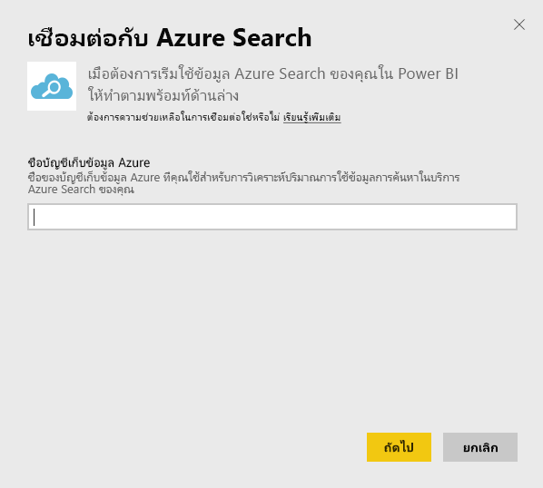
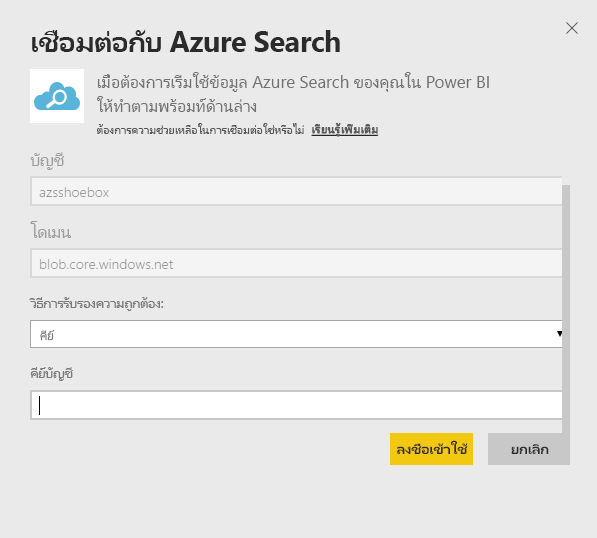
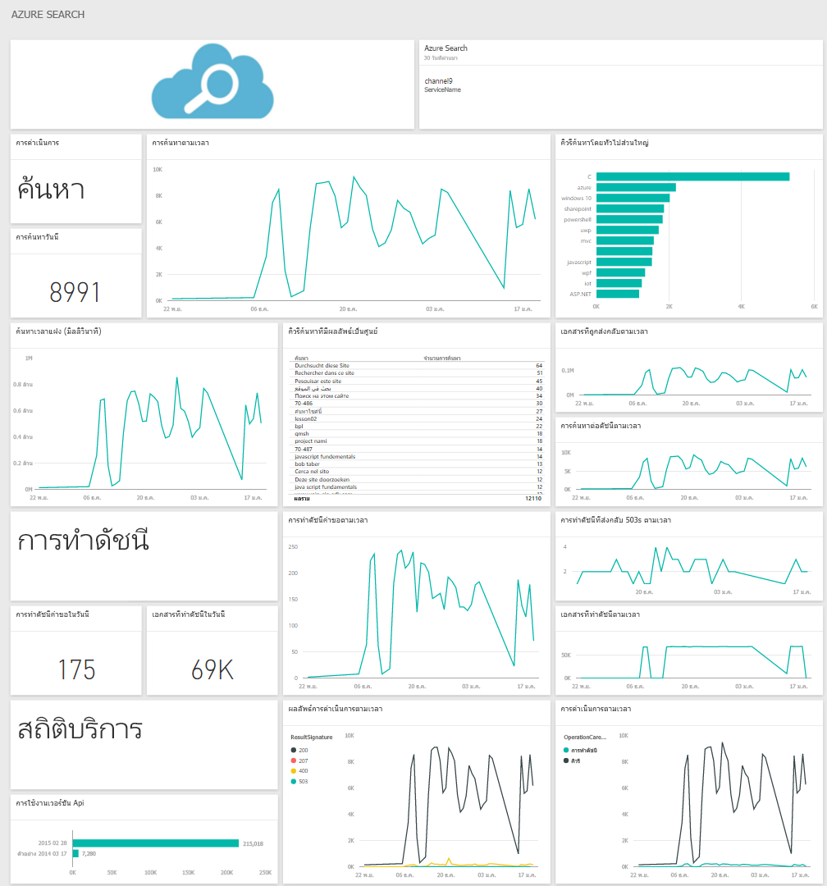

# เชื่อมต่อกับ Azure Search ด้วย Power BI
การวิเคราะห์การรับส่งข้อมูล Azure Search (Azure Search Traffic Analytics) ช่วยให้คุณสามารถตรวจติดตามและทำความเข้าใจเกี่ยวกับการรับส่งข้อมูลไปยังบริการค้นหา Azure ของคุณ ชุดเนื้อหา Azure Search สำหรับ Power BI ให้ข้อมูลเชิงลึกโดยละเอียดเกี่ยวกับข้อมูลการค้นหาของคุณ โดยรวมถึงการค้นหา การทำดัชนี สถิติการบริการ และเวลาแฝงในช่วงเวลส 30 วันที่ผ่านมา คุณสามารถพบรายละเอียดเพิ่มเติมใน[บล็อกโพสต์ Azure](https://azure.microsoft.com/blog/analyzing-your-azure-search-traffic/)

[!INCLUDE [include-short-name](../includes/service-deprecate-content-packs.md)]

เชื่อมต่อไปยัง[ชุดเนื้อหา Azure Search](https://app.powerbi.com/getdata/services/azure-search)สำหรับ Power BI

## วิธีการเชื่อมต่อ
1. เลือก**รับข้อมูล**ที่ด้านล่างของบานหน้าต่างนำทาง
   
    
2. ในกล่อง**บริการ** เลือก**รับ**
   
    
3. เลือก **Azure Search** \> **รับ**
   
   
4. ใส่ชื่อบัญชีเก็บข้อมูลตารางที่จัดเก็บการวิเคราะห์ Azure Search ของคุณ
   
   
5. เลือก**คีย์**เป็นกลไกการรับรองความถูกต้อง และใส่คีย์บัญชีเก็บข้อมูลของคุณ คลิก**ลงชื่อเข้าใช้**เพื่อเริ่มกระบวนการการโหลด
   
   
6. เมื่อการดาวน์โหลดเสร็จสิ้น แดชบอร์ดใหม่ รายงาน และแบบจำลองจะปรากฏในบานหน้าต่างนำทาง เลือกแดชบอร์ดเพื่อดูข้อมูลที่นำเข้าของคุณ
   
    

**ฉันต้องทำอะไรตอนนี้**

* ลอง[ถามคำถามในกล่อง Q&A](../consumer/end-user-q-and-a.md)ที่ด้านบนของแดชบอร์ด
* [เปลี่ยนไทล์](../create-reports/service-dashboard-edit-tile.md)ในแดชบอร์ด
* [เลือกไทล์](../consumer/end-user-tiles.md)เพื่อเปิดรายงานด้านใน
* แม้ว่าชุดข้อมูลของคุณจะถูกกำหนดให้รีเฟรชรายวัน แต่คุณสามารถเปลี่ยนกำหนดการรีเฟรช หรือลองรีเฟรชตามความต้องการได้โดยใช้**รีเฟรชเดี๋ยวนี้**

## ความต้องการของระบบ
ชุดเนื้อหา Azure Search ต้องมีการวิเคราะห์การรับส่งข้อมูล Azure Search ที่เปิดใช้งานในบัญชีผู้ใช้

## การแก้ไขปัญหา
ตรวจสอบให้แน่ใจว่าใส่ชื่อบัญชีเก็บข้อมูลได้อย่างถูกต้อง พร้อมกับคีย์การเข้าถึงแบบเต็ม ชื่อบัญชีเก็บข้อมูลควรตรงกับบัญชีผู้ใช้ที่กำหนดค่าด้วยการวิเคราะห์การรับส่งข้อมูล Azure Search

## ขั้นตอนถัดไป
[Power BI คืออะไร](../fundamentals/power-bi-overview.md)

[แนวคิดพื้นฐานสำหรับนักออกแบบในบริการ Power BI](../fundamentals/service-basic-concepts.md)
