# การเชื่อมต่อเข้ากับรายงานสภาพการณ์การสื่อสารในภาวะวิกฤติ

แอป Power BI นี้เป็นระบบรายงาน/แดชบอร์ดใน Microsoft Power Platform สำหรับการสื่อสารในภาวะวิกฤติ ซึ่งจะติดตามตำแหน่งของผู้ปฏิบัติงานสำหรับผู้ใช้งานแอปการสื่อสารในภาวะวิกฤติ โซลูชั่นนี้จะผสานรวมความจุของ Power Apps, Power Automate, Teams, SharePoint และ Power BI เข้าด้วยกัน ซึ่งสามารถใช้งานได้ทั้งบนเว็บ ในอุปกรณ์เคลื่อนที่ หรือใน Teams

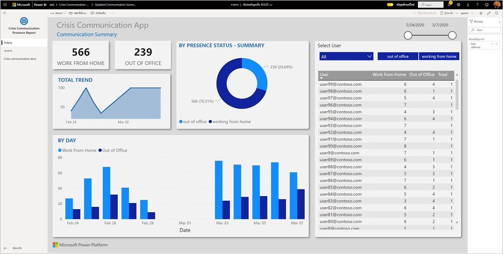

แดชบอร์ดจะแสดงข้อมูลทั้งหมดไว้ในระบบสุขภาพของผู้จัดการกรณีฉุกเฉิน เพื่อช่วยให้พวกเขาได้ดูแล้วทำการตัดสินใจได้อย่างถูกต้องและทันเวลา

บทความนี้จะแจ้งวิธีการติดตั้งแอปและวิธีการเชื่อมต่อกับแหล่งข้อมูลให้คุณทราบ สำหรับข้อมูลเพิ่มเติมเกี่ยวกับแอปการสื่อสารในภาวะวิกฤติ โปรดศึกษาจาก[การตั้งค่าและการเรียนรู้ตัวอย่างเทมเพลตของการสื่อสารในภาวะวิกฤติใน Power Apps](https://docs.microsoft.com/powerapps/maker/canvas-apps/sample-crisis-communication-app)

หลังจากที่คุณได้ติดตั้งแอปเทมเพลตและเชื่อมต่อกับแหล่งข้อมูลแล้ว คุณสามารถปรับแต่งรายงานได้ตามความต้องการของคุณ จากนั้นคุณจะสามารถเผยแพร่รายงานออกเป็นแอปให้กับเพื่อนร่วมงานในองค์กรของคุณได้

## ข้อกำหนดเบื้องต้น

ก่อนที่จะติดตั้งแอปเทมเพลตนี้ คุณต้องติดตั้งและตั้งค่า[ตัวอย่างการสื่อสารในภาวะวิกฤติ](https://docs.microsoft.com/powerapps/maker/canvas-apps/sample-crisis-communication-app)ก่อน การติดตั้งโซลูชันนี้จะสร้างการอ้างอิงแหล่งข้อมูลที่จำเป็นเพื่อป้อนข้อมูลลงในแอป

เมื่อติดตั้งตัวอย่างเทมเพลตของการสื่อสารในภาวะวิกฤติแล้ว ให้จดบันทึก[เส้นทางโฟลเดอร์รายการ SharePoint ของ "CI_Employee Status" และ ID รายการ](https://docs.microsoft.com/powerapps/maker/canvas-apps/sample-crisis-communication-app#monitor-office-absences-with-power-bi)

## ติดตั้งแอป

1. คลิกที่ลิงก์ต่อไปนี้เพื่อเข้าถึงแอป: [แอปเทมเพลตรายงานสภาพการณ์การสื่อสารในภาวะวิกฤติ](https://appsource.microsoft.com/en-us/product/power-bi/pbi-contentpacks.crisiscomms)

1. บนหน้า AppSource สำหรับแอป ให้เลือก [**รับทันที**](https://appsource.microsoft.com/en-us/product/power-bi/pbi-contentpacks.crisiscomms)

    [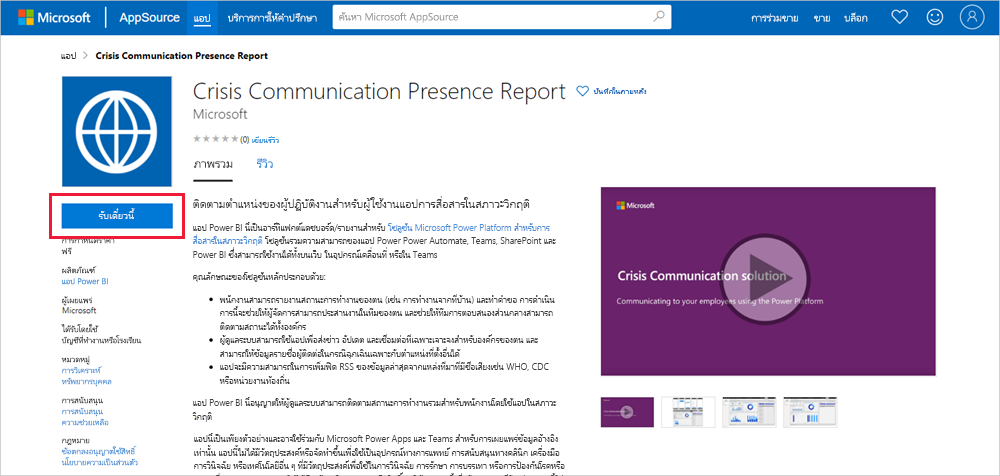](https://appsource.microsoft.com/en-us/product/power-bi/pbi-contentpacks.crisiscomms)

1. อ่านข้อมูลใน**สิ่งสุดท้ายที่ต้องทำเพิ่มเติม** แล้วเลือก **ดำเนินการต่อ**

    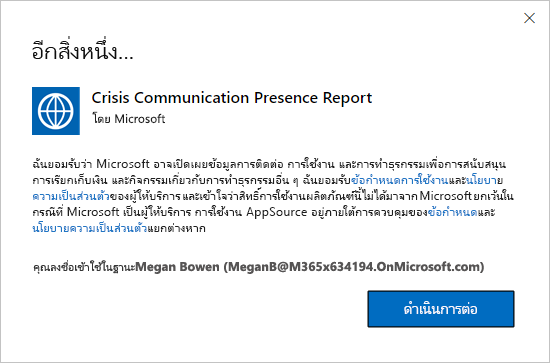

1. เลือก**ติดตั้ง** 

    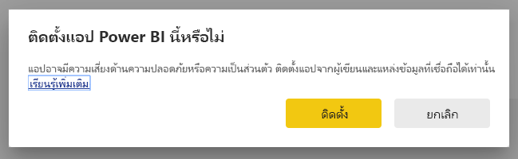

    หลังจากที่ติดตั้งแอปแล้ว คุณจะเห็นแอปบนหน้าแอปของคุณ

   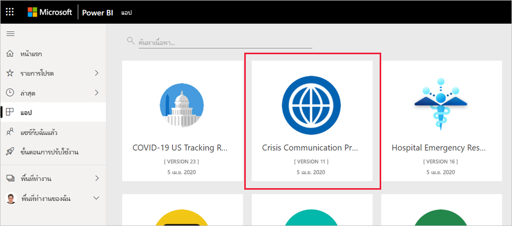

## เชื่อมต่อกับแหล่งข้อมูล

1. เลือกไอคอนบนหน้าแอปของคุณเพื่อเปิดแอป

1. บนหน้าจอเริ่มต้น เลือก **สำรวจ**

   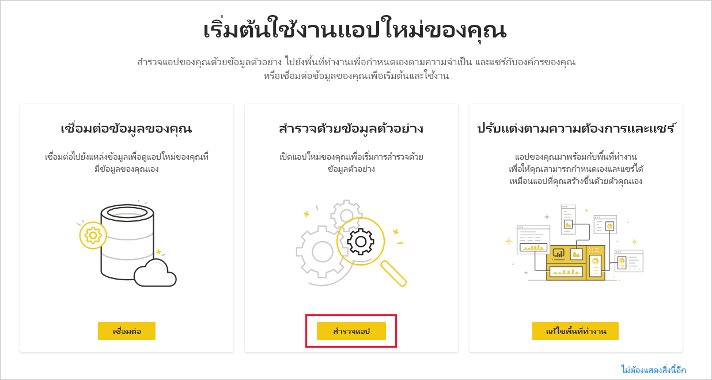

   แอปจะเปิดขึ้นและแสดงข้อมูลตัวอย่าง

1. เลือกลิงก์ **เชื่อมต่อข้อมูลของคุณ** บนแบนเนอร์ที่ด้านบนของหน้า

   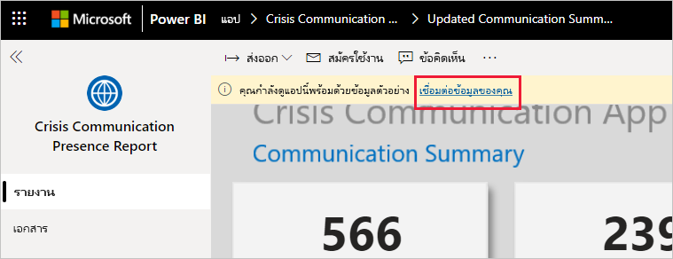

1. ในกล่องโต้ตอบ:
   1. ในช่อง SharePoint_Folder ให้ป้อน[เส้นทางรายการ SharePoint ของ "CI_Employee Status"](https://docs.microsoft.com/powerapps/maker/canvas-apps/sample-crisis-communication-app#monitor-office-absences-with-power-bi)
   1. ในช่อง List_ID ให้ป้อน id รายการที่คุณได้มาจากการตั้งค่ารายการ เมื่อป้อนเสร็จเรียบร้อย ให้คลิก **ถัดไป**

   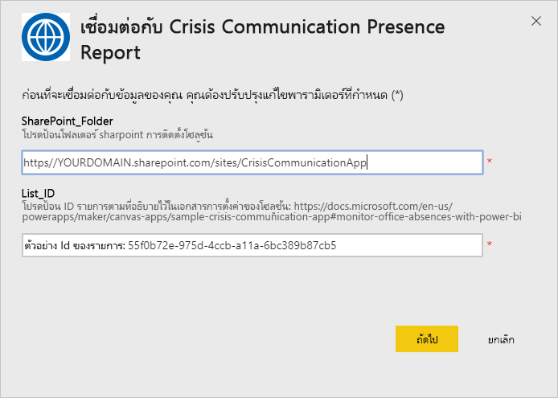

1. ในกล่องโต้ตอบที่ปรากฏขึ้นถัดไป ให้ตั้งค่าวิธีการรับรองความถูกต้องให้กับ **OAuth2** คุณไม่ต้องปรับเปลี่ยนการตั้งค่าระดับความเป็นส่วนตัวใด ๆ

   เลือก **ลงชื่อเข้าใช้**

   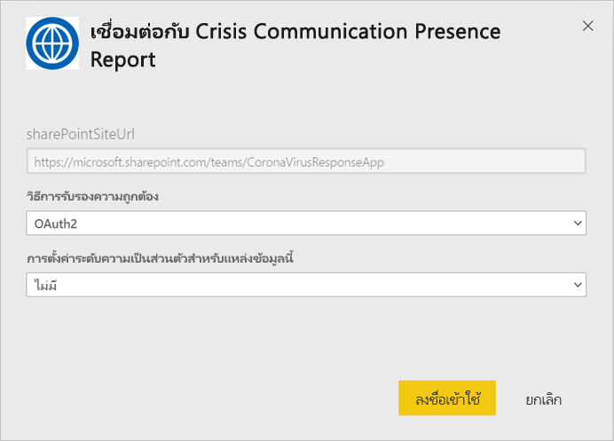

1. ที่หน้าจอลงชื่อเข้าใช้ของ Microsoft ใหลงชื่อเข้าใช้ Power BI

   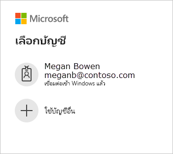

   หลังจากที่คุณลงชื่อเข้าใช้แล้ว รายงานจะเชื่อมต่อเข้ากับแหล่งข้อมูลและจะได้รับข้อมูลล่าสุด ในช่วงเวลานี้ ตัวตรวจสอบกิจกรรมจะเปิดทำงาน

   

## กำหนดเวลาการรีเฟรชรายงาน

เมื่อรีเฟรชข้อมูลแล้ว ให้[ตั้งค่ากำหนดเวลาการรีเฟรช](../connect-data/refresh-scheduled-refresh.md)เพื่อให้ข้อมูลรายงานเป็นข้อมูลล่าสุดอยู่เสมอ

1. ในแถบส่วนหัวด้านบนสุด เลือก **Power BI**

   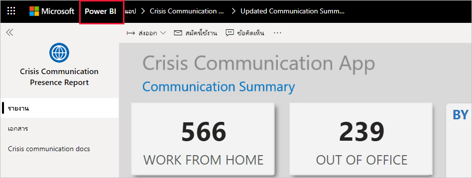

1. ในหน้าต่างนำทางด้านซ้าย มองหาแดชบอร์ดการสนับสนุนการตัดสินใจเกี่ยวกับการตอบสนองต่อสภาวะฉุกเฉินของโรงพยาบาลที่อยู่ใน**พื้นที่ทำงาน** แล้วปฏิบัติตามคำแนะนำที่อธิบายไว้ในบทความ[การปรับค่าการรีเฟรชตามกำหนดเวลา](../connect-data/refresh-scheduled-refresh.md)

## ปรับแต่งตามความต้องการและแชร์

คุณสามารถดูรายละเอียดได้ที่[ปรับแต่งและแชร์แอป](../connect-data/service-template-apps-install-distribute.md#customize-and-share-the-app) ตรวจสอบให้มั่นใจว่าคุณได้อ่าน[ข้อความปฏิเสธความรับผิดชอบของรายงาน](../create-reports/sample-covid-19-us.md#disclaimers)ก่อนที่จะเผยแพร่หรือแจกจ่ายแอป

## ขั้นตอนถัดไป
* [ตั้งค่าและเรียนรู้เกี่ยวกับตัวอย่างเทมเพลตของการสื่อสารในภาวะวิกฤติใน Power Apps](https://docs.microsoft.com/powerapps/maker/canvas-apps/sample-crisis-communication-app)
* มีคำถามหรือไม่ [ลองถามชุมชน Power BI](https://community.powerbi.com/)
* [แอปเทมเพลต Power BI คืออะไร](../connect-data/service-template-apps-overview.md)
* [ติดตั้งและแจกจ่ายแอปเทมเพลตในองค์กรของคุณ](../connect-data/service-template-apps-install-distribute.md)
