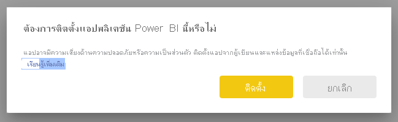
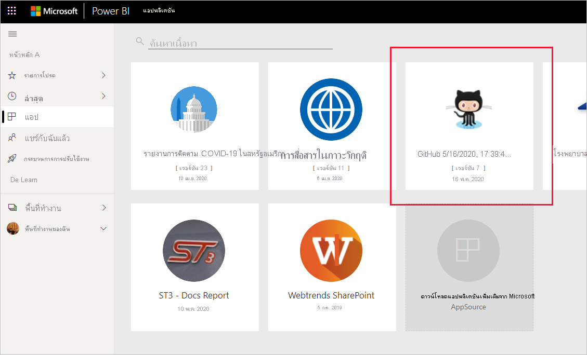
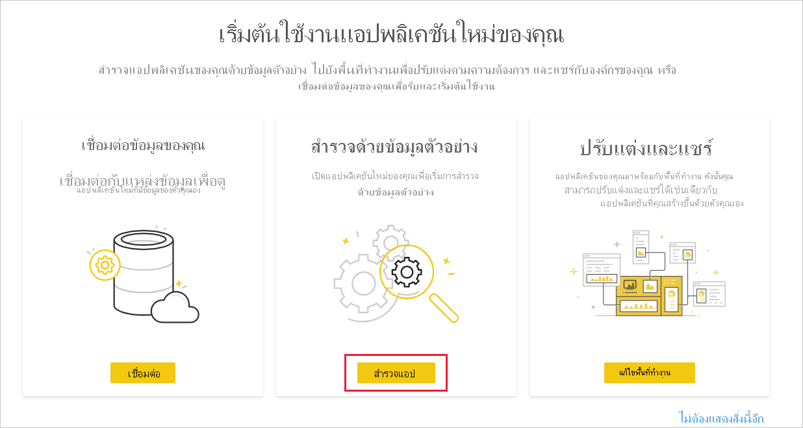
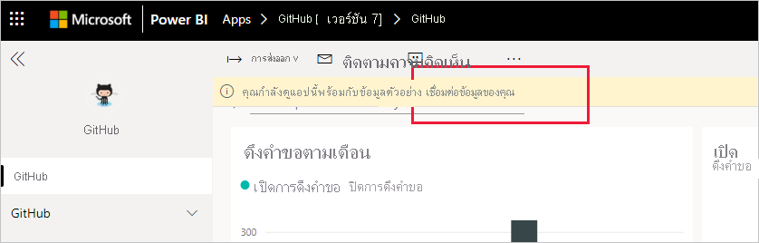
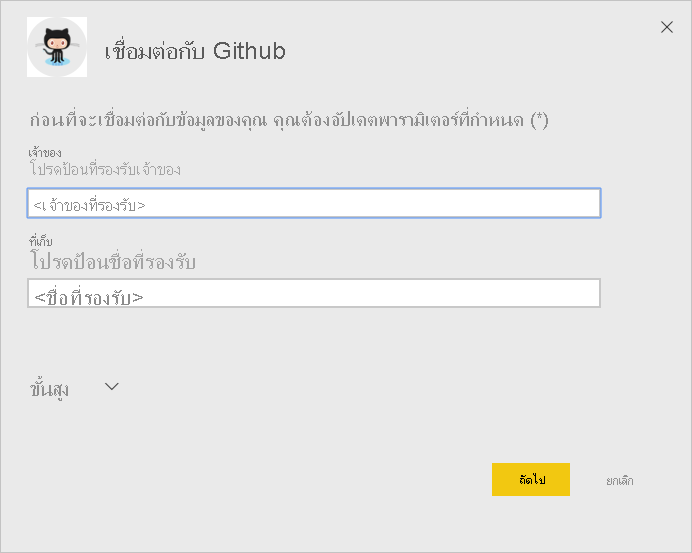
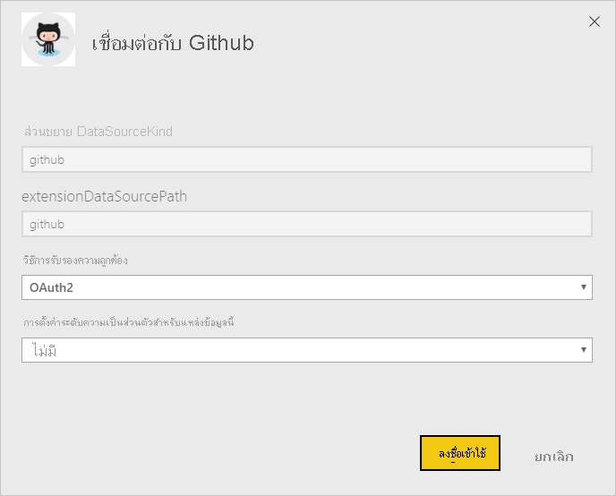
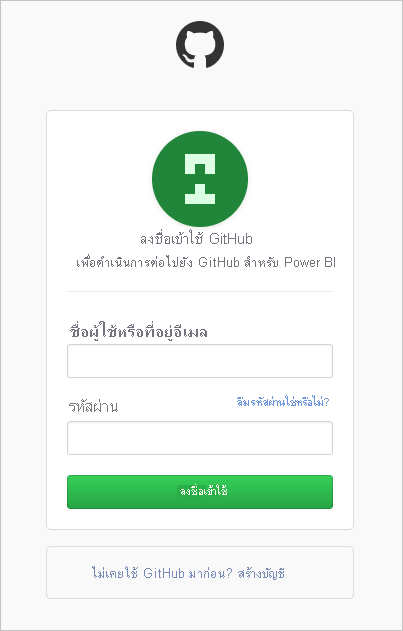
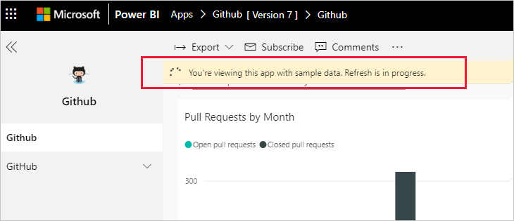
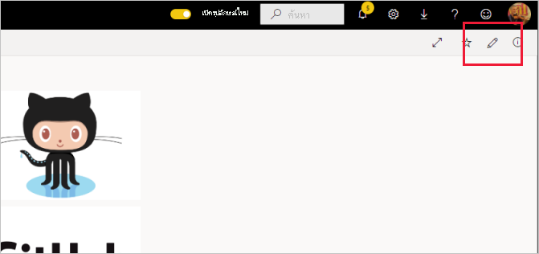
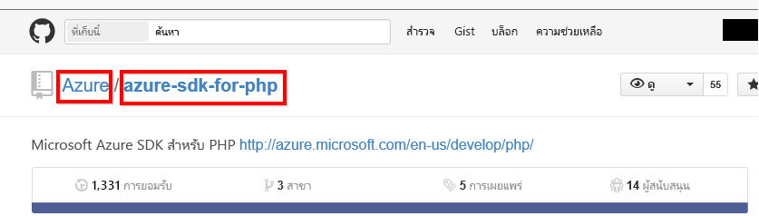

# เชื่อมต่อกับ GitHub ด้วย Power BI
บทความนี้จะแนะนำคุณในการดึงข้อมูลของคุณจากบัญชี GitHub ของคุณด้วยแอปเทมเพลตของ Power BI template แอปเทมเพลตจะสร้างพื้นที่ทำงานที่มีแดชบอร์ด ชุดรายงาน และชุดข้อมูลที่จะช่วยให้คุณสามารถสำรวจข้อมูลบน GitHub ของคุณได้ แอป GitHub สำหรับ Power BI แสดงข้อมูลเชิงลึกในที่ข้อมูลจัดเก็บของ GitHub หรือที่เรียกว่า repo กับข้อมูล การจัดสรร ปัญหา คำขอการดึง และผู้ใช้ที่ใช้งานอยู่

หลังจากที่คุณได้ติดตั้งแอปแบบเทมเพลตแล้ว คุณสามารถเปลี่ยนแดชบอร์ดและรายงานได้ จากนั้นคุณสามารถเผยแพร่เป็นแอปไปยังเพื่อนร่วมงานในองค์กรของคุณได้

เชื่อมต่อไปยัง[แอปเทมเพลต GitHub ](https://app.powerbi.com/groups/me/getapps/services/pbi-contentpacks.pbiapps-github)หรืออ่านเพิ่มเติมเกี่ยวกับการ[รวม GitHub ](https://powerbi.microsoft.com/integrations/github)กับ Power BI

คุณยังสามารถลองใช้[บทช่วยสอน GitHub](service-tutorial-connect-to-github.md) ได้ ซึ่งติดตั้งข้อมูล GitHub ที่แท้จริงเกี่ยวกับ repo สาธารณะสำหรับเอกสาร Power BI

>[!NOTE]
>แอปเทมเพลตนี้จำเป็นต้องมีบัญชีผู้ใช้ GitHub ที่สามารถเข้าถึงที่เก็บได้ รายละเอียดเพิ่มเติมเกี่ยวกับข้อกำหนดด้านล่าง
>
>แอปเทมเพลตนี้ไม่รองรับ GitHub Enterprise

## ติดตั้งแอป

1. คลิกที่ลิงก์ต่อไปนี้เพื่อเข้าถึงแอป: [แอปเทมเพลต GitHub](https://app.powerbi.com/groups/me/getapps/services/pbi-contentpacks.pbiapps-github)

1. บนหน้า AppSource สำหรับแอป ให้เลือก [**รับทันที**](https://app.powerbi.com/groups/me/getapps/services/pbi-contentpacks.pbiapps-github)

    

1. เลือก**ติดตั้ง** 

    

    หลังจากที่ติดตั้งแอปแล้ว คุณจะเห็นแอปบนหน้าแอปของคุณ

   

## เชื่อมต่อกับแหล่งข้อมูล

1. เลือกไอคอนบนหน้าแอปของคุณเพื่อเปิดแอป

1. บนหน้าจอเริ่มต้น เลือก **สำรวจแอป**

   

   แอปจะเปิดขึ้นและแสดงข้อมูลตัวอย่าง

1. เลือกลิงก์ **เชื่อมต่อข้อมูลของคุณ** บนแบนเนอร์ที่ด้านบนของหน้า

   

1. ในกล่องโต้ตอบที่ปราาฏขึ้น ให้ป้อนชื่อที่เก็บและเจ้าของที่เก็บ Repo ดูรายละเอียดที่ [การค้นหาพารามิเตอร์เหล่านี้](#FindingParams) ด้านล่าง เมื่อป้อนเสร็จเรียบร้อย ให้คลิก **ถัดไป**

   

1. ในกล่องโต้ตอบถัดไปที่ปรากฏขึ้น ตรวจสอบให้แน่ใจว่าตั้งค่าวิธีการรับรองความถูกต้องเป็น **OAuth2** คุณไม่ต้องปรับเปลี่ยนการตั้งค่าความเป็นส่วนตัวใด ๆ เมื่อคุณพร้อมแล้ว ให้คลิก **ลงชื่อเข้าใช้**

   

1. ใส่ข้อมูลประจำตัว GitHub ของคุณและทำตามขั้นตอนการรับรองความถูกต้องของ GitHub (คุณอาจข้ามขั้นตอนนี้ ถ้าคุณได้ลงชื่อเข้าใช้ด้วยเบราว์เซอร์ของคุณอยู่แล้ว)

   

หลังจากที่คุณลงชื่อเข้าใช้แล้ว รายงานจะเชื่อมต่อเข้ากับแหล่งข้อมูลและจะได้รับข้อมูลล่าสุด ในช่วงเวลานี้ ตัวตรวจสอบกิจกรรมจะเปิดทำงาน

ข้อมูลรายงานของคุณจะรีเฟรชโดยอัตโนมัติหนึ่งครั้งต่อวัน เว้นแต่ว่าคุณจะปิดใช้งานการดำเนินการนี้ในระหว่างกระบวนการลงชื่อเข้าใช้ นอกจากนี้ คุณยังสามารถ [ตั้งค่าตารางเวลาการรีเฟรชของคุณเอง](./refresh-scheduled-refresh.md) เพื่อรักษาข้อมูลรายงานให้เป็นปัจจุบันหากคุณต้องการ

## ปรับแต่งตามความต้องการและแชร์

เมื่อต้องการกำหนดค่าและแชร์แอปของคุณ ให้เลือกไอคอนรูปดินสอที่มุมบนขวาของหน้า

สำหรับข้อมูลเกี่ยวกับการแก้ไขอาร์ทิแฟกต์ในพื้นที่ทำงาน โปรดดู
* [แนะนำตัวแก้ไขรายงานใน Power BI](../create-reports/service-the-report-editor-take-a-tour.md)
* [แนวคิดพื้นฐานสำหรับนักออกแบบในบริการ Power BI](../fundamentals/service-basic-concepts.md)

หลังจากที่คุณทำการเปลี่ยนแปลงใดก็ตามที่คุณต้องการทำกับอาร์ทิแฟกต์ในพื้นที่ทำงาน คุณก็พร้อมที่จะเผยแพร่และแชร์แอป ดู [เผยแพร่แอปของคุณ](../collaborate-share/service-create-distribute-apps.md#publish-your-app) เพื่อเรียนรู้วิธีการทำเช่นนี้

## มีอะไรรวมอยู่ในแอปบ้าง
ข้อมูลต่อไปนี้จะพร้อมใช้งานจาก GitHub ใน Power BI     

| ชื่อตาราง | คำอธิบาย |
| --- | --- |
| การสนับสนุน |ตารางจัดสรรให้ ผลรวม การเพิ่มเติม การลบและการกระทำที่อนุญาตโดยผู้ให้การสนับสนุนที่เพิ่มแต่ละสัปดาห์ ผู้สนับสนุน 100 อันดับแรกถูกรวมไว้ |
| ปัญหา |รายการปัญหาทั้งหมดสำหรับ repo ที่เลือก และประกอบด้วยการคำนวณเช่นเวลาเฉลี่ยและเวลารวมเพื่อปิดข้อปัญหา รวมปัญหาที่เปิด รวมปัญหาที่ปิด ตารางนี้จะว่างเปล่าเมื่อไม่มีปัญหาใน repo |
| คำขอดึงข้อมูล |ตารางนี้ประกอบด้วย Pull Requests ทั้งหมดดึงของ repo และบุคคลที่ขอดึง ซึ่งยังประกอบด้วยคำนวณ จำนวน Pull Requests เปิด ปิด และจำนวนรวม ระยะเวลาของ Pull Requests และระยะเวลาค่าเฉลี่ยของ Pull Requests ตารางนี้จะว่างเปล่าเมื่อไม่มีคำขอดึงข้อมูลในที่เก็บ |
| ผู้ใช้ |ตารางนี้แสดงรายการของผู้ใช้ GitHub หรือผู้ให้การสนับสนุนที่ได้ทำการจัดสรร ที่เก็บข้อมูลปัญหา หรือได้รับการแก้ไข Pull Requests ของ repo ที่เลือก |
| หลักเป้าหมาย |มีเหตุการณ์สำคัญทั้งหมดสำหรับ repo ที่เลือก |
| DateTable |ตารางนี้ประกอบด้วยวันที่จากวันนี้ และปีในอดีตที่ช่วยให้คุณสามารถวิเคราะห์ข้อมูล GitHub ของคุณตามวัน |
| ContributionPunchCard |ตารางนี้สามารถใช้เป็นการ์ดความสามารถจัดสรรสำหรับ repo ที่เลือก ซึ่งแสดงยอมรับ โดยวันของสัปดาห์และชั่วโมงของวัน ตารางนี้ไม่ได้รับการเชื่อมต่อกับตารางอื่นในแบบจำลอง |
| RepoDetails |ตารางนี้มีรายละเอียดสำหรับ repo ที่เลือก |

## ความต้องการของระบบ
* บัญชีผู้ใช้ GitHub ที่มีสิทธิ์เข้าถึง repo  
* สิทธิ์ที่มอบให้กับ Power BI สำหรับแอป GitHub ในระหว่างการเข้าสู่ระบบครั้งแรก ดูรายละเอียดด้านล่างในการยกเลิกการเข้าถึง  
* มีการเรียกใช้ API เพียงพอที่สามารถดึงและรีเฟรชข้อมูล
>[!NOTE]
>แอปเทมเพลตนี้ไม่รองรับ GitHub Enterprise

### ยกเลิกอนุญาต Power BI
เมื่อต้องการยกเลิกอนุญาต Power BI เนื่องจากได้เชื่อมต่อกับ GitHub repo ของคุณ คุณสามารถยกเลิกการเข้าถึงใน GitHub ดูหัวข้อ[ความช่วยเหลือ GitHub](https://help.github.com/articles/keeping-your-ssh-keys-and-application-access-tokens-safe/#reviewing-your-authorized-applications-oauth) สำหรับรายละเอียด

## การค้นหาพารามิเตอร์
คุณสามารถกำหนดเจ้าของและที่เก็บ โดยด repo ใน GitHub เอง

ส่วนแรกของ "Azure" คือเจ้าของ และส่วนสอง "azure-sdk-for-php" เป็นส่วนเก็บข้อมูล  คุณเห็นสิ่งเหล่านี้เหมือนกันสองรายการใน URL repo

    <https://github.com/Azure/azure-sdk-for-php> .

## การแก้ไขปัญหา
ถ้าจำเป็น คุณสามารถตรวจสอบข้อมูลประจำตัว GitHub ของคุณ  

1. ในหน้าต่างเบราว์เซอร์อื่น ไปที่เว็บไซต์ GitHub และเข้าสู่ระบบ GitHub คุณสามารถเห็นว่าคุณกำลังเข้าสู่ระบบ ที่มุมขวาบนของไซต์ GitHub    
2. ใน GitHub นำทางไปยัง URL ของ repo ที่คุณวางแผนที่จะเข้าถึงใน Power BI ตัวอย่างเช่น: https://github.com/dotnet/corefx  
3. กลับไปที่ Power BI ลองเชื่อมต่อกับ GitHub ในกล่องโต้ตอบการกำหนดค่า GitHub ให้ใช้ชื่อของ repo และเจ้าของ repo สำหรับ repo ที่เดียวกัน  

## ขั้นตอนถัดไป

* [บทช่วยสอน: เชื่อมต่อกับ GitHub repo ด้วย Power BI](service-tutorial-connect-to-github.md)
* [สร้างพื้นที่ทำงานใหม่ใน Power BI](../collaborate-share/service-create-the-new-workspaces.md)
* [ติดตั้งและใช้แอปฯใน Power BI](../consumer/end-user-apps.md)
* [เชื่อมต่อกับแอป Power BI สำหรับบริการภายนอก](service-connect-to-services.md)
* มีคำถามหรือไม่ [ลองถามชุมชน Power BI](https://community.powerbi.com/)
