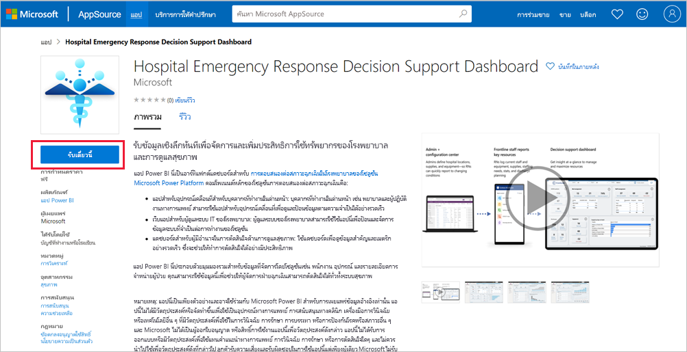
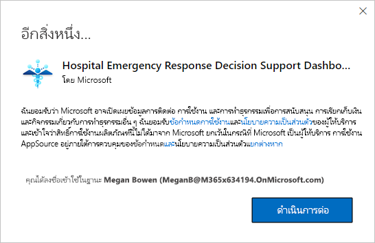

# การเชื่อมต่อเข้ากับแดชบอร์ดการสนับสนุนการตัดสินใจเกี่ยวกับการตอบสนองต่อสภาวะฉุกเฉินของโรงพยาบาล
แอปเทมเพลตแดชบอร์ดการสนับสนุนการตัดสินใจเกี่ยวกับการตอบสนองต่อสภาวะฉุกเฉินของโรงพยาบาลเป็นส่วนประกอบการรายงานของ[โซลูชั่น Microsoft Power Platform สำหรับการตอบสนองต่อสภาวะฉุกเฉินสำหรับการดูแลสุขภาพ](https://powerapps.microsoft.com/blog/emergency-response-solution-a-microsoft-power-platform-solution-for-healthcare-emergency-response/) แดชบอร์ดจะแสดงข้อมูลทั้งหมดไว้ในระบบสุขภาพของผู้จัดการกรณีฉุกเฉิน เพื่อช่วยให้พวกเขาได้ดูแล้วทำการตัดสินใจได้อย่างถูกต้องและทันเวลา

บทความนี้จะแจ้งวิธีการติดตั้งแอปและวิธีการเชื่อมต่อกับแหล่งข้อมูลให้คุณทราบ หากต้องการเรียนรู้วิธีการใช้รายงานที่คุณจะเห็นจากแอปนี้ โปรดศึกษาจาก[เอกสารเรื่องแอปแดชบอร์ดการสนับสนุนการตัดสินใจเกี่ยวกับการตอบสนองต่อสภาวะฉุกเฉินของโรงพยาบาล](https://docs.microsoft.com/powerapps/sample-apps/emergency-response/deploy-configure#view-the-power-bi-dashboard)

หลังจากที่คุณได้ติดตั้งแอปเทมเพลตและเชื่อมต่อกับแหล่งข้อมูลแล้ว คุณสามารถปรับแต่งรายงานได้ตามความต้องการของคุณ จากนั้นคุณจะสามารถเผยแพร่รายงานออกเป็นแอปให้กับเพื่อนร่วมงานในองค์กรของคุณได้

## ข้อกำหนดเบื้องต้น

ก่อนที่จะติดตั้งแอปเทมเพลตนี้ คุณต้องติดตั้งและตั้งค่า[โซลูชั่น Power Platform สำหรับการตอบสนองต่อสภาวะฉุกเฉินของโรงพยาบาล](https://docs.microsoft.com/powerapps/sample-apps/emergency-response/deploy-configure)ก่อน การติดตั้งโซลูชันนี้จะสร้างการอ้างอิงแหล่งข้อมูลที่จำเป็นเพื่อป้อนข้อมูลลงในแอป

เมื่อทำการติดตั้งโซลูชั่น Power Platform สำหรับการตอบสนองต่อสภาวะฉุกเฉินของโรงพยาบาลแล้ว ให้จดบันทึก [URL ของสภาพแวดล้อมอินสแตนซ์ Common Data Service ของคุณ](https://docs.microsoft.com/powerapps/sample-apps/emergency-response/deploy-configure#publish-the-power-bi-dashboard)เอาไว้ คุณจะต้องใช้ข้อมูลนี้เพื่อเชื่อมต่อแอปเทมเพลตเข้ากับข้อมูล

## ติดตั้งแอป

1. คลิกที่ลิงก์ต่อไปนี้เพื่อเข้าถึงแอป: [แอปเทมเพลตแดชบอร์ดการสนับสนุนการตัดสินใจเกี่ยวกับการตอบสนองต่อสภาวะฉุกเฉินของโรงพยาบาล](https://appsource.microsoft.com/en-us/product/power-bi/pbi-contentpacks.powerapps_healthcare)

1. บนหน้า AppSource สำหรับแอป ให้เลือก [**รับทันที**](https://appsource.microsoft.com/en-us/product/power-bi/pbi-contentpacks.powerapps_healthcare)

    

1. อ่านข้อมูลใน**สิ่งสุดท้ายที่ต้องทำเพิ่มเติม** แล้วเลือก **ดำเนินการต่อ**

    

1. เลือก**ติดตั้ง** 

    

    หลังจากที่ติดตั้งแอปแล้ว คุณจะเห็นแอปบนหน้าแอปของคุณ

   

## เชื่อมต่อกับแหล่งข้อมูล

1. เลือกไอคอนบนหน้าแอปของคุณเพื่อเปิดแอป

1. บนหน้าจอเริ่มต้น เลือก **สำรวจ**

   

   แอปจะเปิดขึ้นและแสดงข้อมูลตัวอย่าง

1. เลือกลิงก์ **เชื่อมต่อข้อมูลของคุณ** บนแบนเนอร์ที่ด้านบนของหน้า

   

1. ในกล่องโต้ตอบ:
   1. ในช่องชื่อองค์กร ให้ป้อนชื่อองค์กรของคุณ เช่น "Contoso Health Systems" คุณสามารถป้อนข้อมูลช่องนี้หรือไม่ก็ได้ ชื่อนี้จะปรากฏที่ด้านบนซ้ายของแดชบอร์ด
   1. ในช่อง CDS_base_solution ให้พิมพ์ [URL ของอินสแตนซ์สภาพแวดล้อม Common Data Service ของคุณ](https://docs.microsoft.com/powerapps/sample-apps/emergency-response/deploy-configure#publish-the-power-bi-dashboard) เช่น: https://[myenv].crm.dynamics.com เมื่อป้อนเสร็จเรียบร้อย ให้คลิก **ถัดไป**

   

1. ในกล่องโต้ตอบที่ปรากฏขึ้นถัดไป ให้ตั้งค่าวิธีการรับรองความถูกต้องให้กับ **OAuth2** คุณไม่ต้องปรับเปลี่ยนการตั้งค่าระดับความเป็นส่วนตัวใด ๆ

   เลือก **ลงชื่อเข้าใช้**

   

1. ที่หน้าจอลงชื่อเข้าใช้ของ Microsoft ใหลงชื่อเข้าใช้ Power BI

   

   หลังจากที่คุณลงชื่อเข้าใช้แล้ว รายงานจะเชื่อมต่อเข้ากับแหล่งข้อมูลและจะได้รับข้อมูลล่าสุด ในช่วงเวลานี้ ตัวตรวจสอบกิจกรรมจะเปิดทำงาน

   

## กำหนดเวลาการรีเฟรชรายงาน

เมื่อรีเฟรชข้อมูลแล้ว ให้[ตั้งค่ากำหนดเวลาการรีเฟรช](../connect-data/refresh-scheduled-refresh.md)เพื่อให้ข้อมูลรายงานเป็นข้อมูลล่าสุดอยู่เสมอ

1. ในแถบส่วนหัวด้านบนสุด เลือก **Power BI**

   

1. ในหน้าต่างนำทางด้านซ้าย มองหาแดชบอร์ดการสนับสนุนการตัดสินใจเกี่ยวกับการตอบสนองต่อสภาวะฉุกเฉินของโรงพยาบาลที่อยู่ใน**พื้นที่ทำงาน** แล้วปฏิบัติตามคำแนะนำที่อธิบายไว้ในบทความ[การปรับค่าการรีเฟรชตามกำหนดเวลา](../connect-data/refresh-scheduled-refresh.md)

## ปรับแต่งตามความต้องการและแชร์

คุณสามารถดูรายละเอียดได้ที่[ปรับแต่งและแชร์แอป](../connect-data/service-template-apps-install-distribute.md#customize-and-share-the-app) ตรวจสอบให้มั่นใจว่าคุณได้อ่าน[ข้อความปฏิเสธความรับผิดชอบของรายงาน](../create-reports/sample-covid-19-us.md#disclaimers)ก่อนที่จะเผยแพร่หรือแจกจ่ายแอป

## ขั้นตอนถัดไป
* [การทำความเข้าใจรายงานของการตอบสนองต่อสภาวะฉุกเฉินของโรงพยาบาล](https://docs.microsoft.com/powerapps/sample-apps/emergency-response/deploy-configure#view-the-power-bi-dashboard)
* [ตั้งค่าและเรียนรู้เกี่ยวกับตัวอย่างเทมเพลตของการสื่อสารในภาวะวิกฤติใน Power Apps](https://docs.microsoft.com/powerapps/maker/canvas-apps/sample-crisis-communication-app)
* มีคำถามหรือไม่ [ลองถามชุมชน Power BI](https://community.powerbi.com/)
* [แอปเทมเพลต Power BI คืออะไร](../connect-data/service-template-apps-overview.md)
* [ติดตั้งและแจกจ่ายแอปเทมเพลตในองค์กรของคุณ](../connect-data/service-template-apps-install-distribute.md)
