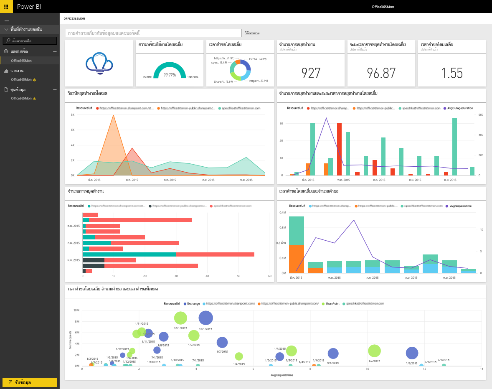

# เชื่อมต่อกับ Office365Mon ด้วย Power BI
การวิเคราะห์การหยุดการทำงานและข้อมูลสมรรถนะการทำงานของ Office 365 ของคุณทำได้ง่ายด้วย Power BI และแอปแม่แบบ Office365Mon Power BI ดึงข้อมูลของคุณ ทั้งการหยุดทำงานและปัญหาด้านสุขภาพ จากนั้นสร้างแดชบอร์ดแบบคิดนอกกรอบและรายงานที่ยึดตามข้อมูลนั้น

เชื่อมต่อไปยัง[แอปแม่แบบ Office365Mon](https://msit.powerbi.com/groups/me/getapps/services/office365mon.office365mon_powerbi_v3)สำหรับ Power BI

>[!NOTE]
>จำเป็นต้องมีบัญชีผู้ดูแลระบบ Office365Mon เพื่อเชื่อมต่อและโหลดแอปแม่แบบ Power BI

## วิธีการเชื่อมต่อ
1. เลือก**รับข้อมูล**ที่ด้านล่างของบานหน้าต่างนำทาง
   
   
2. ในกล่อง**บริการ** เลือก**รับ**
   
    
3. เลือก **Office365Mon** \> **รับ**
   
   
4. สำหรับวิธีการรับรองความถูกต้อง ให้เลือก **oAuth2** \> **ลงชื่อเข้าใช้**
   
   เมื่อไดถูกถาม ให้ใส่ข้อมูลประจำตัวของผู้ดูแลระบบ Office365Mon และทำตามกระบวนการรับรองความถูกต้อง
   
   
   
   
5. หลังจากที่ Power BI นำเข้าข้อมูลแล้ว คุณจะเห็นแดชบอร์ด รายงาน และชุดข้อมูลใหม่ในบานหน้าต่างนำทาง รายการใหม่ถูกทำเครื่องหมายด้วยเครื่องหมายดอกจันสีเหลือง \* เลือกกรอก Office365Mon
   
   

**ฉันต้องทำอะไรตอนนี้**

* ลอง[ถามคำถามในกล่อง Q&A](../consumer/end-user-q-and-a.md)ที่ด้านบนของแดชบอร์ด
* [เปลี่ยนไทล์](../create-reports/service-dashboard-edit-tile.md)ในแดชบอร์ด
* [เลือกไทล์](../consumer/end-user-tiles.md)เพื่อเปิดรายงานด้านใน
* แม้ว่าชุดข้อมูลของคุณจะถูกกำหนดให้รีเฟรชรายวัน แต่คุณสามารถเปลี่ยนกำหนดการรีเฟรช หรือลองรีเฟรชตามความต้องการได้โดยใช้**รีเฟรชเดี๋ยวนี้**

## การแก้ไขปัญหา
ถ้าคุณได้รับข้อผิดพลาด **"เข้าสู่ระบบล้มเหลว"** หลังจากใช้ข้อมูลประจำตัวของการสมัครใช้งาน Office365Mon เข้าระบบ จากนั้นบัญชีคุณไม่มีสิทธิ์ในการดึงข้อมูล Office365Mon จากบัญชีของคุณ ตรวจสอบนี่เป็นบัญชีผู้ดูแลระบบ และลองอีกครั้ง

## ขั้นตอนถัดไป
[Power BI คืออะไร](../fundamentals/power-bi-overview.md)

[รับข้อมูลสำหรับ Power BI](service-get-data.md)
