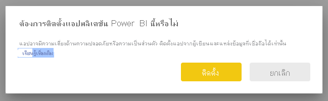
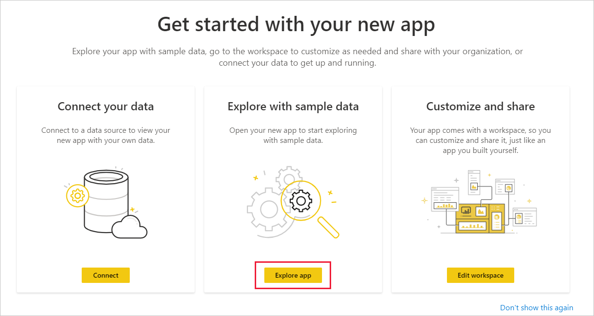

# เชื่อมต่อกับเมตริกความจุ Power BI Premium
การตรวจสอบความจุของคุณเป็นสิ่งสำคัญในการตัดสินใจอย่างชาญฉลาดว่าจะใช้ทรัพยากรความจุ Premium ของคุณให้ดีที่สุดได้อย่างไร แอปเมตริกความจุ Power BI Premium มีข้อมูลเชิงลึกมากที่สุดเกี่ยวกับวิธีการใช้งานความจุของคุณ

บทความนี้จะแจ้งวิธีการติดตั้งแอปและการเชื่อมต่อกับแหล่งข้อมูล สำหรับข้อมูลเกี่ยวกับเนื้อหาของรายงานและวิธีการใช้งาน ดู [ตรวจสอบความจุ Premium ด้วยแอป](../service-admin-premium-monitor-capacity.md)และ [บล็อกโพสต์ของแอปเมตริกความจุ Power BI Premium](https://powerbi.microsoft.com/blog/premium-capacity-metrics-app-new-health-center-with-kpis-to-explore-relevant-metrics-and-steps-to-mitigate-issues/)

หลังจากที่คุณได้ติดตั้งแอปและเชื่อมต่อกับแหล่งข้อมูลแล้ว คุณสามารถปรับแต่งรายงานได้ตามความต้องการของคุณ จากนั้นคุณจะสามารถเผยแพร่รายงานให้กับเพื่อนร่วมงานในองค์กรของคุณได้

> [!NOTE]
> การติดตั้งแอปเทมเพลตจำเป็นต้องใช้[สิทธิ์](./service-template-apps-install-distribute.md#prerequisites) ติดต่อผู้ดูแลระบบผู้เช่าของคุณถ้าคุณพบว่าคุณไม่มีสิทธิ์เพียงพอ

## ติดตั้งแอป

1. คลิกที่ลิงก์ต่อไปนี้เพื่อเข้าถึงแอป: [แอปเทมเพลตเมตริกความจุ Power BI Premium](https://app.powerbi.com/groups/me/getapps/services/pbi_pcmm.capacity-metrics-dxt)

1. บนหน้า AppSource สำหรับแอป ให้เลือก [**รับทันที**](https://app.powerbi.com/groups/me/getapps/services/pbi_pcmm.capacity-metrics-dxt)

    

1. เลือก**ติดตั้ง** 

    

    > [!NOTE]
    > ถ้าคุณได้ติดตั้งแอปก่อนหน้านี้แล้ว คุณจะถูกถามว่าคุณต้องการ [เขียนทับการติดตั้ง](./service-template-apps-install-distribute.md#update-a-template-app) หรือติดตั้งไปยังพื้นที่ทำงานใหม่

    หลังจากที่ติดตั้งแอปแล้ว คุณจะเห็นแอปบนหน้าแอปของคุณ

   

## เชื่อมต่อกับแหล่งข้อมูล

1. เลือกไอคอนบนหน้าแอปของคุณเพื่อเปิดแอป

1. บนหน้าจอเริ่มต้น เลือก **สำรวจ**

   

   แอปจะเปิดขึ้นและแสดงข้อมูลตัวอย่าง

1. เลือกลิงก์ **เชื่อมต่อข้อมูลของคุณ** บนแบนเนอร์ที่ด้านบนของหน้า

   

1. ในกล่องโต้ตอบที่ปรากฏขึ้น ให้ตั้งค่าออฟเซต UTC นั่นคือความแตกต่างของชั่วโมงระหว่างเวลามาตรฐานสากลและเวลาในตำแหน่งที่ตั้งของคุณ จากนั้น คลิก **ถัดไป**
  
   

1. ในกล่องโต้ตอบถัดไปที่ปรากฏขึ้น คุณไม่จำเป็นต้องทำอะไร เพียงแค่เลือก**ลงชื่อเข้าใช้**

   

1. ที่หน้าจอลงชื่อเข้าใช้ของ Microsoft ใหลงชื่อเข้าใช้ Power BI

   

   หลังจากที่คุณลงชื่อเข้าใช้แล้ว รายงานจะเชื่อมต่อเข้ากับแหล่งข้อมูลและจะได้รับข้อมูลล่าสุด ในช่วงเวลานี้ ตัวตรวจสอบกิจกรรมจะเปิดทำงาน

   

   ข้อมูลรายงานของคุณจะรีเฟรชโดยอัตโนมัติหนึ่งครั้งต่อวัน เว้นแต่ว่าคุณจะปิดใช้งานการดำเนินการนี้ในระหว่างกระบวนการลงชื่อเข้าใช้ นอกจากนี้ คุณยังสามารถ [ตั้งค่าตารางเวลาการรีเฟรชของคุณเอง](./refresh-scheduled-refresh.md) เพื่อรักษาข้อมูลรายงานให้เป็นปัจจุบันหากคุณต้องการ

## ปรับแต่งตามความต้องการและแชร์

เมื่อต้องการเริ่มต้นการปรับแต่งแอปตามความต้องการ ให้คลิกที่ไอคอนรูปดินสอในมุมบนขวา

 

คุณสามารถดูรายละเอียดได้ที่[ปรับแต่งและแชร์แอป](./service-template-apps-install-distribute.md#customize-and-share-the-app)

## ขั้นตอนถัดไป
* [ตรวจสอบความจุ Premium ด้วยแอป](../admin/service-admin-premium-monitor-capacity.md)
* [บล็อกโพสต์ของแอปเมตริกความจุ Power BI Premium](https://powerbi.microsoft.com/blog/premium-capacity-metrics-app-new-health-center-with-kpis-to-explore-relevant-metrics-and-steps-to-mitigate-issues/)
* [แอปเทมเพลต Power BI คืออะไร](./service-template-apps-overview.md)
* [ติดตั้งและแจกจ่ายแอปเทมเพลตในองค์กรของคุณ](./service-template-apps-install-distribute.md)
* มีคำถามหรือไม่ [ลองถามชุมชน Power BI](https://community.powerbi.com/)