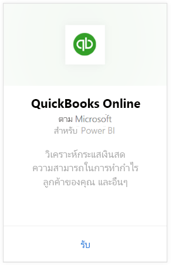

# เชื่อมต่อกับ QuickBooks Online ด้วย Power BI
เมื่อคุณเชื่อมต่อกับข้อมูลของคุณ QuickBooks Online จาก Power BI คุณจะได้รับแดชบอร์ด Power BI และรายงาน Power BI ที่มีข้อมูลเชิงลึกเกี่ยวกับกระแสเงินสดธุรกิจของคุณ กำไรจาก ลูกค้า และอื่น ๆ ทันที ใช้แดชบอร์ดและรายงานอย่างที่มันเป็น หรือปรับแต่งเพื่อไฮไลท์ข้อมูลที่คุณสนใจมากที่สุด ข้อมูลถูกรีเฟรชโดยอัตโนมัติวันละครั้ง

เชื่อมต่อไปยัง [แอปเทมเพลต QuickBooks Online](https://dxt.powerbi.com/getdata/services/quickbooks-online) สำหรับ Power BI

>[!NOTE]
>เพื่อนำเข้าข้อมูล QuickBooks Online ของคุณไปยัง Power BI คุณจำเป็นต้องเป็นผู้ดูแลระบบของบัญชี QuickBooks Online ของคุณและลงชื่อเข้าใช้ด้วยข้อมูลประจำตัวแบบบัญชีผู้ดูแลระบบของคุณ คุณไม่สามารถใช้ตัวเชื่อมต่อนี้กับซอฟต์แวร์ QuickBooks Desktop 

## วิธีการเชื่อมต่อ

[!INCLUDE [powerbi-service-apps-get-more-apps](../includes/powerbi-service-apps-get-more-apps.md)]

3. เลือก**QuickBooks Online**แล้วเลือก**รับ**
   
   

4. ใน **ติดตั้งแอป Power BI นี้หรือไม่** เลือก **ติดตั้ง**

    

4. ในบานหน้าต่าง **แอป** เลือกไทล์ **QuickBooks**

   

6. ในส่วน **เริ่มต้นใช้งานแอปใหม่ของคุณ** ให้เลือก **เชื่อมต่อ**

    

4. สำหรับ **วิธีการรับรองตัวตน** ให้เลือก **oAuth2**ลงชื่อเข้าใช้ 
5. เมื่อถูกถาม ให้ใส่ข้อมูลประจำตัว QuickBooks Online ของคุณและทำตามกระบวนการรับรองตัวตนของ QuickBooks Online ถ้าคุณลงชื่อเข้าใช้ QuickBooks อยู่แล้วในเบราว์เซอร์ของคุณ คุณอาจไม่ได้รับข้อความให้ใส่ข้อมูลประจำตัว
   >[!NOTE]
   >คุณจำเป็นต้องมีข้อมูลประจำตัวแบบผู้ดูแลระบบของบัญชี QuickBooks ของคุณ
6. เลือกบริษัทที่คุณต้องการเชื่อมต่อกับ Power BI ในหน้าจอถัดไป
   
   

7. เลือก**อนุญาต**ในหน้าจอถัดไปเพื่อเริ่มกระบวนการนำเข้า กระบวนการอาจใช้เวลาสักครู่ ขึ้นอยู่กับขนาดของข้อมูลของบริษัทของคุณ 
   
   
   
8. หลังจากที่ Power BI นำเข้าข้อมูล คุณจะเห็นรายการเนื้อหาสำหรับแอป QuickBooks ของคุณ: แดชบอร์ด รายงาน และชุดข้อมูลใหม่
9. เลือกแดชบอร์ด QuickBooks ที่จะเริ่มต้นกระบวนการสำรวจ Power BI สร้างแดชบอร์ดนี้ขึ้นโดยอัตโนมัติเพื่อแสดงข้อมูลนำเข้าของคุณ

    

**ฉันต้องทำอะไรตอนนี้**

* ลอง[ถามคำถามในกล่อง Q&A](../consumer/end-user-q-and-a.md)ที่ด้านบนของแดชบอร์ด
* [เปลี่ยนไทล์](../create-reports/service-dashboard-edit-tile.md)ในแดชบอร์ด
* [เลือกไทล์](../consumer/end-user-tiles.md)เพื่อเปิดรายงานด้านใน
* แม้ว่าชุดข้อมูลของคุณจะถูกกำหนดให้รีเฟรชรายวัน แต่คุณสามารถเปลี่ยนกำหนดการรีเฟรช หรือลองรีเฟรชตามความต้องการได้โดยใช้**รีเฟรชเดี๋ยวนี้**

## การแก้ไขปัญหา
**"ขออภัย! มีข้อผิดพลาดเกิดขึ้น**

ถ้าคุณจะได้รับข้อความนี้หลังจากเลือก**อนุญาต**:

ขออภัย! มีข้อผิดพลาดเกิดขึ้น ปิดหน้าต่างนี้และลองอีกครั้ง

ผู้ใช้อื่นสำหรับบริษัทนี้ได้สมัครใช้งานแอปพลิเคชันเรียบร้อยแล้ว ติดต่อ [admin email] เพื่อเปลี่ยนแปลงการสมัครใช้งานนี้"

...ข้อผิดพลาดนี้หมายความว่า ผู้ดูแลระบบรายอื่นในบริษัทของคุณได้เชื่อมต่อกับข้อมูลบริษัทของคุณด้วย Power BI แล้ว ขอให้ผู้ดูแลระบบแชร์แดชบอร์ดกับคุณ ในปัจจุบัน ผู้ใช้ผู้ดูแลคนเดียวเท่านั้นที่สามารถเชื่อมต่อกับชุดเฉพาะของข้อมูลบริษัทใน QuickBooks Online กับ Power BI หลังจาก Power BI สร้างแดชบอร์ดแล้ว ผู้ดูแลระบบสามารถแชร์ให้เพื่อนร่วมงานหลายคน ภายในผู้เช่า Power BI เดียวกันได้

**แอปนี้ไม่ได้ถูกตั้งค่าให้อนุญาตการเชื่อมต่อจากประเทศของคุณ**

ในขณะนี้ Power BI สนับสนุนเฉพาะรุ่นสำหรับสหรัฐอเมริกาของ QuickBooks Online 

## ขั้นตอนถัดไป
[Power BI คืออะไร](../fundamentals/power-bi-overview.md)

[แนวคิดพื้นฐานสำหรับนักออกแบบในบริการ Power BI](../fundamentals/service-basic-concepts.md)
