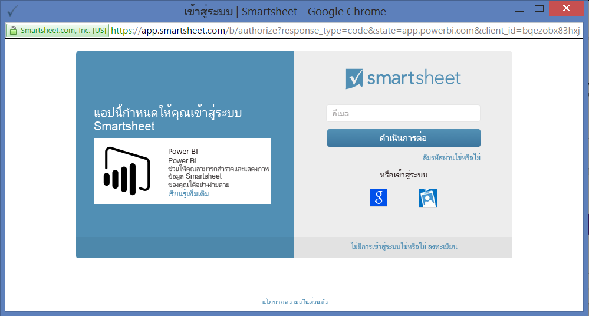

# เชื่อมต่อกับ Smartsheet ด้วย Power BI
บทความนี้จะแนะนำคุณในการดึงข้อมูลของคุณจากบัญชี Smartsheet ของคุณด้วยแอปเทมเพลตของ Power BI Smartsheet มีแพลตฟอร์มอย่างง่าย สำหรับการทำงานร่วมกันและการแชร์ไฟล์ แอปเทมเพลต Smartsheet สำหรับ Power BI มีแดชบอร์ด รายงาน และชุดข้อมูลที่แสดงภาพรวมของบัญชี Smartsheet ของคุณ คุณยังสามารถใช้ [Power BI Desktop](desktop-connect-to-data.md) เพื่อเชื่อมต่อโดยตรงไปยังแต่ละแผ่นงานในบัญชีของคุณได้ 

หลังจากที่คุณได้ติดตั้งแอปแบบเทมเพลตแล้ว คุณสามารถเปลี่ยนแดชบอร์ดและรายงานได้ จากนั้นคุณสามารถเผยแพร่เป็นแอปไปยังเพื่อนร่วมงานในองค์กรของคุณได้

เชื่อมต่อไปยัง[แอปเทมเพลต Smartsheet](https://app.powerbi.com/groups/me/getapps/services/pbi-contentpacks.pbiapps-smartsheet)สำหรับ Power BI

>[!NOTE]
>บัญชีผู้ดูแลระบบ Smartsheet เป็นที่ต้องการสำหรับการเชื่อมต่อและการโหลดแอปเทมเพลต Power BI ที่มีการเข้าถึงเพิ่มเติม

## วิธีการเชื่อมต่อ

[!INCLUDE [powerbi-service-apps-get-more-apps](../includes/powerbi-service-apps-get-more-apps.md)]

3. เลือก **Smartsheet** \> **รับทันที**
4. ใน **ติดตั้งแอป Power BI นี้หรือไม่** เลือก **ติดตั้ง**
4. ในบานหน้าต่าง **แอป** เลือกไทล์ **Smartsheet**

    

6. ในส่วน **เริ่มต้นใช้งานแอปใหม่ของคุณ** ให้เลือก **เชื่อมต่อ**

    

4. สำหรับวิธีการรับรองความถูกต้อง เลือก **oAuth2 \> ลงชื่อเข้าใช้**
   
   เมื่อได้รับพร้อมท์ ใส่ข้อมูลประจำตัวของ Smartsheet และทำตามกระบวนการรับรองความถูกต้อง
   
   
   
   

5. หลังจากที่ Power BI นำเข้าข้อมูลแล้วแดชบอร์ด Smartsheet จะเปิดขึ้น
   
   

## ปรับเปลี่ยนและเผยแพร่แอปของคุณ

คุณได้ติดตั้งแอปเทมเพลต Smartsheet ซึ่งหมายความว่าคุณยังได้สร้างพื้นที่ทำงานของแอป Smartsheet อีกด้วย ในพื้นที่ทำงาน คุณสามารถเปลี่ยนรายงานและแดชบอร์ด จากนั้นเผยแพร่เป็น*แอป*ไปยังเพื่อนร่วมงานในองค์กรของคุณได้ 

1. หากต้องการดูเนื้อหาทั้งหมดของพื้นที่ทำงาน Smartsheet ใหม่ของคุณในบานหน้าต่างนำทาง เลือก **พื้นที่ทำงาน** > **Smartsheet** 

    

    มุมมองนี้เป็นรายการเนื้อหาสำหรับพื้นที่ทำงาน ที่มุมบนขวา คุณจะเห็น **อัปเดตแอป** เมื่อคุณพร้อมที่จะเผยแพร่แอปของคุณไปยังเพื่อนร่วมงานของคุณ นั่นคือที่ที่คุณจะเริ่มต้น 

    

2. เลือก **รายงาน** และ **ชุดข้อมูล** เพื่อดูองค์ประกอบอื่น ๆ ในพื้นที่ทำงาน

    อ่านเกี่ยวกับ [การเผยแพร่แอป](../collaborate-share/service-create-distribute-apps.md) ให้เพื่อนร่วมงานของคุณ

## มีอะไรรวมอยู่บ้าง
แอปเทมเพลต Smartsheet สำหรับ Power BI มีภาพรวมของบัญชี Smartsheet ของคุณ เช่น จำนวนของพื้นที่ทำงาน รายงาน และแผ่นงานที่คุณมี เมื่อใดที่ถูกแก้ไข ฯลฯ ผู้ใช้ที่เป็นผู้ดูแลระบบยังเห็นข้อมูลเกี่ยวกับผู้ใช้ในระบบของพวกเขา เช่น ผู้ที่สร้างแผ่นงานอันดับต้น ๆ  

เพื่อเชื่อมต่อโดยตรงไปยังแต่ละแผ่นงานในบัญชีของคุณ คุณสามารถใช้ตัวเชื่อมต่อ Smartsheet ใน [Power BI Desktop](desktop-connect-to-data.md) ได้  

## ขั้นตอนถัดไป

* [สร้างพื้นที่ทำงานใหม่ใน Power BI](../collaborate-share/service-create-the-new-workspaces.md)
* [ติดตั้งและใช้แอปฯใน Power BI](../consumer/end-user-apps.md)
* [เชื่อมต่อกับแอป Power BI สำหรับบริการภายนอก](service-connect-to-services.md)
* มีคำถามหรือไม่ [ลองถามชุมชน Power BI](https://community.powerbi.com/)