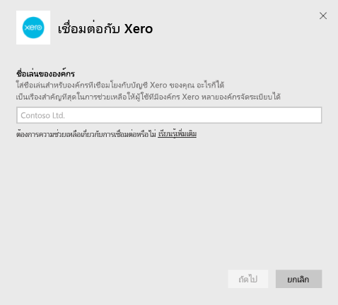

# เชื่อมต่อกับ Xero ด้วย Power BI
Xero เป็นซอฟต์แวร์บัญชีออนไลน์ที่ใช้งานง่ายซึ่งออกแบบมาสำหรับธุรกิจขนาดเล็กโดยเฉพาะ สร้างการนำเสนอข้อมูลที่น่าสนใจโดยอิงจากข้อมูลทางการเงิน Xero ของคุณด้วยแอปเทมเพลต Power BI แดชบอร์ดเริ่มต้นของคุณประกอบด้วยตัวชี้วัดธุรกิจขนาดเล็กหลายรายการ เช่น สถานะเงินสด รายได้และค่าใช้จ่าย แนวโน้มการสูญเสียกำไร จำนวนวันที่จะได้รับรายได้ และผลตอบแทนจากการลงทุน

เชื่อมต่อกับ [แอปเทมเพลต Xero](https://app.powerbi.com/getdata/services/xero) สำหรับ Power BI หรือเรียนรู้เพิ่มเติมเกี่ยวกับการรวม [Xero และ Power BI](https://help.xero.com/Power-BI)

## วิธีการเชื่อมต่อ

[!INCLUDE [powerbi-service-apps-get-more-apps](../includes/powerbi-service-apps-get-more-apps.md)]

3. เลือก **Xero** \> **ดาวน์โหลดตอนนี้**
4. ใน **ติดตั้งแอป Power BI นี้หรือไม่** เลือก **ติดตั้ง**

    

4. ในบานหน้าต่าง **แอป** เลือกไทล์ **Xero**

   

6. ในส่วน **เริ่มต้นใช้งานแอปใหม่ของคุณ** ให้เลือก **เชื่อมต่อ**

    

4. ใส่ชื่อเล่นสำหรับองค์กรที่เชื่อมโยงกับบัญชี Xero ของคุณ ชื่อเล่นนี้จะเป็นอะไรก็ได้ ชื่อนี้จะช่วยให้ผู้ใช้ที่มีหลายกับองค์กร Xero สามารถแยกแยะแต่ละองค์กรได้ ดูรายละเอียดใน [การค้นหาพารามิเตอร์](#FindingParams) ต่อไปในบทความนี้

    

5. สำหรับ **วิธีการรับรองความถูกต้อง** เลือก **OAuth** เมื่อได้รับแจ้งให้ลงชื่อเข้าใช้บัญชี Xero ของคุณ และเลือกองค์กรที่จะเชื่อมต่อ เมื่อเข้าสู่ระบบเสร็จสมบูรณ์แล้ว ให้เลือก **ลงชื่อเข้าใช้** เพื่อเริ่มกระบวนการการโหลด
   
    
   
    
6. หลังจากอนุมัติ กระบวนการนำเข้าจะเริ่มโดยอัตโนมัติ เมื่อเสร็จสิ้น แดชบอร์ด รายงาน และแบบจำลองใหม่จะปรากฏขึ้นในบานหน้าต่างนำทาง เลือกแดชบอร์ดเพื่อดูข้อมูลที่นำเข้าของคุณ
   
     

**ฉันต้องทำอะไรตอนนี้**

* ลอง[ถามคำถามในกล่อง Q&A](../consumer/end-user-q-and-a.md)ที่ด้านบนของแดชบอร์ด
* [เปลี่ยนไทล์](../create-reports/service-dashboard-edit-tile.md)ในแดชบอร์ด
* [เลือกไทล์](../consumer/end-user-tiles.md)เพื่อเปิดรายงานด้านใน
* แม้ว่าชุดข้อมูลของคุณจะถูกกำหนดให้รีเฟรชรายวัน แต่คุณสามารถเปลี่ยนกำหนดการรีเฟรช หรือลองรีเฟรชตามความต้องการได้โดยใช้**รีเฟรชเดี๋ยวนี้**

## มีอะไรรวมอยู่บ้าง
แดชบอร์ดแอปเทมเพลตประกอบด้วยไทล์และเมตริกที่ครอบคลุมหลายส่วน พร้อมกับรายงานที่เกี่ยวข้องเมื่อต้องการเรียนรู้เพิ่มเติม:  

| พื้นที่ | แดชบอร์ดไทล์ | รายงาน |
| --- | --- | --- |
| เงินสด |กระแสเงินสดรายวัน  เงินสดเข้า  เงินสดออก  ยอดดุลปิดบัญชี ตามบัญชีผู้ใช้  ยอดดุลปิดบัญชีวันนี้ |บัญชีธนาคาร |
| ลูกค้า |ยอดขายที่ออกใบแจ้งหนี้  ยอดขายที่ออกใบแจ้งหนี้ตามลูกค้า  แนวโน้มการเพิ่มยอดขายที่ออกใบแจ้งหนี้  ใบแจ้งหนี้ครบกำหนดชำระ  หนี้คงค้าง  หนี้ที่เกินกำหนดชำระ |ลูกค้า  สินค้าคงคลัง |
| ผู้ขาย |การสั่งซื้อที่เรียกเก็บเงิน  การสั่งซื้อที่เรียกเก็บเงินโดยผู้ขาย  แนวโน้มการเติบโตของการสั่งซื้อที่เรียกเก็บเงิน   ใบเรียกเก็บเงินที่ครบกำหนด  เจ้าหนี้คงเหลือ  เจ้าหนี้เกินกำหนด |ผู้ขาย  สินค้าคงคลัง |
| สินค้าคงคลัง |ยอดขายรายเดือนตามผลิตภัณฑ์ |สินค้าคงคลัง |
| กำไรขาดทุน |กำไรและขาดทุนรายเดือน  กำไรสุทธีนี้  กำไรสุทธิเดือนนี้  บัญชีค่าใช้จ่ายสูงสุด |กำไรขาดทุน |
| งบดุล |สินทรัพย์รวม  หนี้สินรวม  ส่วนผู้ถือหุ้น |งบดุล |
| สถานภาพ |อัตราส่วนปัจจุบัน  อัตรากำไรขั้นต้น   อัตราผลตอบแทนจากสินทรัพย์รวม  อัตราส่วนหนี้สินรวมต่อส่วนของผู้ถือหุ้น |สถานภาพ  อภิธานศัพท์และบันทึกทางเทคนิค |

ชุดข้อมูลยังรวมถึงตารางต่อไปนี้เพื่อกำหนดค่ารายงานและแดชบอร์ดของคุณ  

* ที่อยู่  
* การแจ้งเตือน  
* ยอดคงเหลือในบัญชีประจำวันของธนาคาร  
* งบธนาคาร  
* รายชื่อผู้ติดต่อ  
* การเบิกค่าใช้จ่าย  
* รายการใบแจ้งหนี้  
* ใบแจ้งหนี้  
* รายการ  
* สิ้นสุดเดือน  
* องค์กร  
* งบดุลทดลอง  
* บัญชี Xero

## ความต้องการของระบบ
การเข้าถึงแอปเทมเพลต Xero ต้องการบทบาทต่อไปนี้: "มาตรฐาน + รายงาน" หรือ "ผู้แนะนำ"

## การค้นหาพารามิเตอร์
ระบุชื่อสำหรับองค์กรของคุณเพื่อติดตามใน Power BI ชื่อที่ระบุจะทำให้คุณสามารถเชื่อมต่อกับองค์กรหลายองค์กรได้ คุณไม่สามารถเชื่อมต่อกับองค์กรเดียวกันหลายครั้ง เนื่องจากจะส่งผลต่อการรีเฟรชตามกำหนดการ   

## การแก้ไขปัญหา
* ผู้ใช้ Xero ต้องมีบทบาทต่อไปนี้เพื่อเข้าถึงแอปเทมเพลต Xero สำหรับ Power BI: "มาตรฐาน + รายงาน" หรือ "ผู้แนะนำ" แอปเทมเพลตอาศัยการอนุญาตจากผู้ใช้เพื่อเข้าถึงข้อมูลรายงานผ่านทาง Power BI
* ในระหว่างการโหลด ไทล์บนแดชบอร์ดจะอยู่ในสถานะการโหลดแบบทั่วไป ไทล์จะยังคงอยู่ในสถานะนั้นจนกว่าการโหลดทั้งหมดจะเสร็จสมบูรณ์ ถ้าคุณได้รับการแจ้งเตือนว่าการโหลดของคุณเสร็จสมบูรณ์แล้ว แต่ยังคงมีไทล์กำลังโหลด ลองรีเฟรชแดชบอร์ดไทล์โดยใช้...ในด้านบนขวาของแดชบอร์ดของคุณ
* ถ้าแอปเทมเพลตของคุณล้มเหลวในการรีเฟรช โปรดตรวจสอบว่าคุณได้เชื่อมต่อกับองค์กรเดียวกันมากกว่าหนึ่งครั้งใน Power BI หรือไม่ Xero อนุญาตการเชื่อมต่อที่ใช้งานอยู่กับองค์กรเดียวเท่านั้น และคุณอาจเห็นข้อผิดพลาดที่ระบุว่าข้อมูลประจำตัวของคุณไม่ถูกต้องหากคุณเชื่อมต่อกับเครือข่ายเดียวกันมากกว่าหนึ่งครั้ง  
* สำหรับปัญหาการเชื่อมต่อแอปเทมเพลต Xero สำหรับ Power BI เช่น ข้อความข้อผิดพลาดหรือเวลาในการโหลดช้า ก่อนอื่นให้ล้างแคช / คุกกี้และเริ่มระบบเบราว์เซอร์ใหม่ จากนั้นจึงเชื่อมต่อกับ Power BI อีกครั้ง  

สำหรับปัญหาอื่นๆ  ให้รายงานไปยัง https://support.powerbi.com ถ้าปัญหายังคงมีอยู่

## ขั้นตอนถัดไป
[เริ่มต้นใช้งานใน Power BI](../fundamentals/service-get-started.md)

[รับข้อมูลใน Power BI](service-get-data.md)
