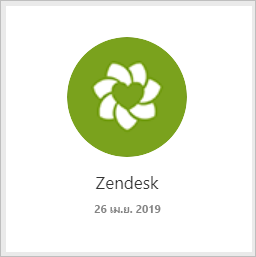
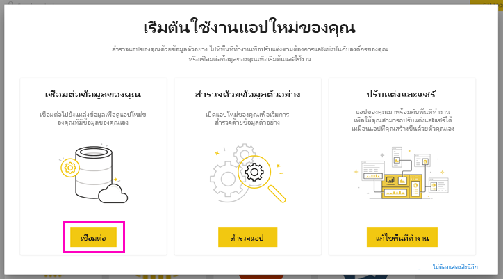
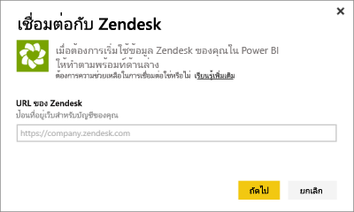
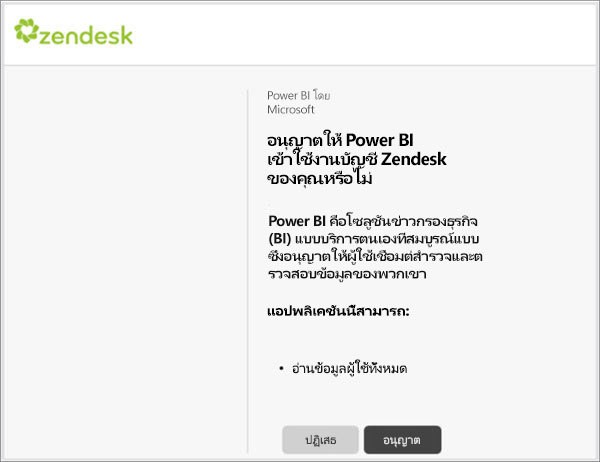
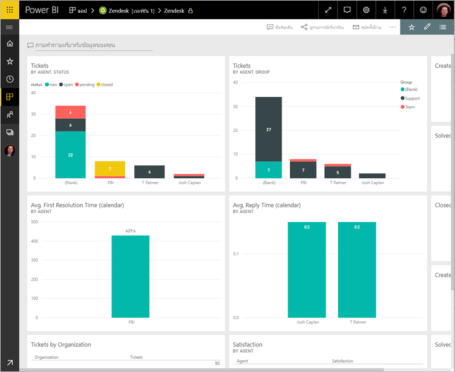
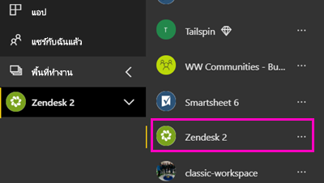
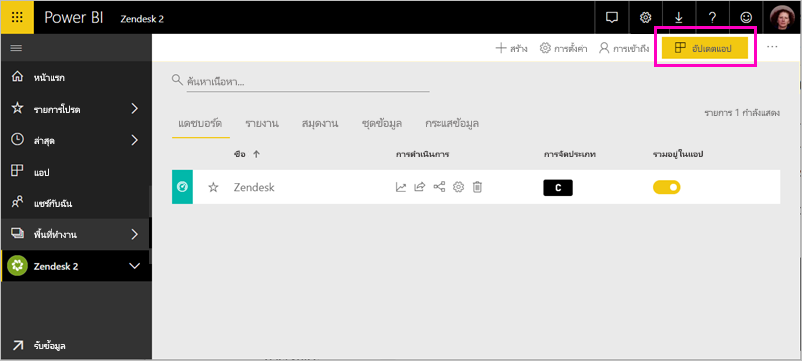

# เชื่อมต่อกับ Zendesk ด้วย Power BI

บทความนี้จะแนะนำคุณในการดึงข้อมูลของคุณจากบัญชี Zendesk ของคุณด้วยแอปเทมเพลตของ Power BI แอป Zendesk นำเสนอแดชบอร์ด Power BI และชุดของรายงาน Power BI ที่มีข้อมูลเชิงลึกเกี่ยวกับปริมาณตั๋วและประสิทธิภาพการทำงานของบริษัทตัวแทน ข้อมูลถูกรีเฟรชโดยอัตโนมัติวันละครั้ง 

หลังจากที่คุณได้ติดตั้งแอปแบบเทมเพลตคุณสามารถกำหนดแดชบอร์ดและรายงานเพื่อเน้นข้อมูลที่คุณสนใจมากที่สุดได้ จากนั้นคุณสามารถเผยแพร่เป็นแอปไปยังเพื่อนร่วมงานในองค์กรของคุณได้

เชื่อมต่อไปยัง[แอปเทมเพลต Zendesk](https://app.powerbi.com/getdata/services/zendesk)หรืออ่านเพิ่มเติมเกี่ยวกับการ[รวม Zendesk](https://powerbi.microsoft.com/integrations/zendesk)กับ Power BI

หลังจากที่คุณได้ติดตั้งแอปแบบเทมเพลตแล้ว คุณสามารถเปลี่ยนแดชบอร์ดและรายงานได้ จากนั้นคุณสามารถเผยแพร่เป็นแอปไปยังเพื่อนร่วมงานในองค์กรของคุณได้

>[!NOTE]
>คุณจำเป็นต้องมีบัญชีผู้ดูแลระบบ Zendesk เพื่อเชื่อมต่อ รายละเอียดเพิ่มเติมเกี่ยวกับ[ข้อกำหนด](#system-requirements) อยู่ที่ด้านล่าง

>[!WARNING]
>ก่อนวันที่ 15 ต.ค. 2019 นั้น Zendesk Support Search API อนุญาตให้ได้รับผลลัพธ์รวม 200,000 รายการ ผ่านการแบ่งหน้าของคิวรีขนาดใหญ่ เพื่อจัดแนวการใช้งานการค้นหาให้สอดคล้องกับขอบเขตที่ตั้งใจไว้ ตอนนี้ Zendesk จำกัดจำนวนผลลัพธ์สูงสุดที่ส่งคืนเท่ากับ 1,000 รายการ โดยมีผลลัพธ์สูงสุด 100 รายการต่อหน้า อย่างไรก็ตาม ตัวเชื่อมต่อ Zendesk Power BI ปัจจุบันยังคงสามารถสร้างการเรียกใช้ API ที่เกินขีดจำกัดใหม่เหล่านี้ส่งผลให้เกิดผลลัพธ์ที่อาจทำให้เข้าใจผิดได้

## วิธีการเชื่อมต่อ

[!INCLUDE [powerbi-service-apps-get-more-apps](../includes/powerbi-service-apps-get-more-apps.md)]

3. เลือก **Zendesk** \> **รับทันที**
4. ใน **ติดตั้งแอป Power BI นี้หรือไม่** เลือก **ติดตั้ง**
4. ในบานหน้าต่าง **แอป** เลือกไทล์ **Zendesk**

    

6. ในส่วน **เริ่มต้นใช้งานแอปใหม่ของคุณ** ให้เลือก **เชื่อมต่อ**

    

4. ให้ URL ที่เชื่อมโยงกับบัญชีของคุณ URL มีฟอร์ม **https://company.zendesk.com** ดูรายละเอียดที่ [การค้นหาพารามิเตอร์เหล่านี้](#finding-parameters) ด้านล่าง
   
   

5. เมื่อมีข้อความปรากฏ ใส่ข้อมูลประจำตัวของ Zendesk  เลือก**oAuth 2**เป็นกลไกการรับรองความถูกต้อง แล้วคลิก**ลงชื่อเข้าใช้** ทำตามขั้นตอนการรับรองความถูกต้อง Zendesk (ถ้าคุณลงชื่อเข้าใช้ Zendesk อยู่แล้วในเบราว์เซอร์ของคุณ คุณอาจไม่ได้รับข้อความปรากฏให้ใส่ข้อมูลประจำตัว)
   
   > [!NOTE]
   > แอปเทมเพลตนี้ต้องการให้คุณเชื่อมต่อกับบัญชีผู้ดูแลระบบ Zendesk 
   > 
   
   
6. คลิก**อนุญาต**เพื่ออนุญาตให้ Power BI เข้าถึงข้อมูล Zendesk ของคุณ
   
   
7. คลิก **เชื่อมต่อ** เพื่อเริ่มกระบวนการนำเข้า 
8. หลังจากที่ Power BI นำเข้าข้อมูลคุณจะเห็นรายการเนื้อหาสำหรับแอ Zendesk ของคุณ: แดชบอร์ด รายงานและชุดข้อมูลใหม่
9. เลือกแดชบอร์ดที่จะเริ่มต้นกระบวนการสำรวจ

    
   
## ปรับเปลี่ยนและเผยแพร่แอปของคุณ

คุณได้ติดตั้งแอปเทมเพลต Zendesk ซึ่งหมายความว่าคุณยังได้สร้างพื้นที่ทำงานของ Zendesk อีกด้วย ในพื้นที่ทำงาน คุณสามารถเปลี่ยนรายงานและแดชบอร์ด จากนั้นเผยแพร่เป็น*แอป*ไปยังเพื่อนร่วมงานในองค์กรของคุณได้ 

1. หากต้องการดูเนื้อหาทั้งหมดของพื้นที่ทำงาน Zendesk ใหม่ของคุณในบานหน้าต่างนำทาง เลือก **พื้นที่ทำงาน** > **Zendesk** 

    

    มุมมองนี้เป็นรายการเนื้อหาสำหรับพื้นที่ทำงาน ที่มุมบนขวา คุณจะเห็น **อัปเดตแอป** เมื่อคุณพร้อมที่จะเผยแพร่แอปของคุณไปยังเพื่อนร่วมงานของคุณ นั่นคือที่ที่คุณจะเริ่มต้น 

    

2. เลือก **รายงาน** และ **ชุดข้อมูล** เพื่อดูองค์ประกอบอื่น ๆ ในพื้นที่ทำงาน

    อ่านเกี่ยวกับ [การเผยแพร่แอป](../collaborate-share/service-create-distribute-apps.md) ให้เพื่อนร่วมงานของคุณ

## ความต้องการของระบบ
บัญชีผู้ดูแลระบบ Zendesk จำเป็นสำหรับการเข้าถึงแอปเทมเพลต Zendesk ถ้าคุณตัวแทนหรือเป็นผู้ใช้ปลายทาง และคุณสนใจดูข้อมูล Zendesk ของคุณ เพิ่มคำแนะนำและตรวจทานตัวเชื่อมต่อ Zendesk ใน [Power BI Desktop](desktop-connect-to-data.md)

## การค้นหาพารามิเตอร์
URL ของ Zendesk ของคุณจะเหมือนกับ URL ที่คุณใช้เพื่อลงชื่อเข้าใช้บัญชี Zendesk ของคุณ ถ้าคุณไม่แน่ใจใน URL ของ Zendesk ของคุณ คุณสามารถใช้ตัว[ช่วยเหลือในการเข้าสู่ระบบ](https://www.zendesk.com/login/) สำหรับ Zendesk ได้

## การแก้ไขปัญหา
ถ้าคุณมีปัญหาในการเชื่อมต่อ ตรวจสอบ URL ของ Zendesk ของคุณ และยืนยันว่าคุณกำลังใช้บัญชีผู้ดูแลระบบ Zendesk

## ขั้นตอนถัดไป

* [สร้างพื้นที่ทำงานใหม่ใน Power BI](../collaborate-share/service-create-the-new-workspaces.md)
* [ติดตั้งและใช้แอปฯใน Power BI](../consumer/end-user-apps.md)
* [เชื่อมต่อกับแอป Power BI สำหรับบริการภายนอก](service-connect-to-services.md)
* มีคำถามหรือไม่ [ลองถามชุมชน Power BI](https://community.powerbi.com/)
