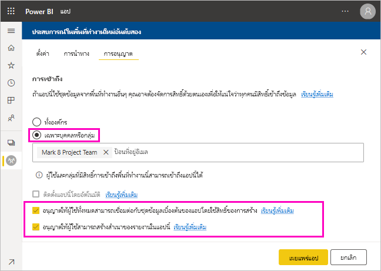

# แชร์ชุดข้อมูล (ตัวอย่าง)

ในฐานะผู้สร้าง*แบบจำลองข้อมูล*ใน Power BI Desktop คุณกำลังสร้าง*ชุดข้อมูล*ที่คุณสามารถแจกจ่ายได้ในบริการของ Power BI จากนั้น ผู้สร้างรายงานอื่น ๆ สามารถใช้ชุดข้อมูลของคุณเป็นพื้นฐานสำหรับรายงานของตนเอง ในบทความนี้ คุณจะได้เรียนรู้วิธีการแชร์ชุดข้อมูลของคุณ หากต้องการเรียนรู้วิธีการให้และลบการเข้าถึงชุดข้อมูลที่คุณแชร์ กรุณาอ่านเกี่ยวกับ[สิทธิ์ในการสร้าง](service-datasets-build-permissions.md)

## ขั้นตอนการแชร์ชุดข้อมูล

1. คุณต้องเริ่มต้นโดยการสร้างไฟล์.pbix ด้วยแบบจำลองข้อมูลใน Power BI Desktop หากคุณวางแผนที่จะเสนอชุดข้อมูลนี้ให้ผู้อื่นสร้างรายงาน คุณอาจไม่ได้ออกแบบรายงานในไฟล์. pbix

    แนวทางปฏิบัติที่ดีที่สุดคือการบันทึกไฟล์.pbix ไว้ในกลุ่ม Office 365

1. เผยแพร่ไฟล์.pbix ไปยัง[พื้นที่ทำงานประสบการณ์การใช้งานใหม่](../collaborate-share/service-create-the-new-workspaces.md)ในบริการของ Power BI
    
    แล้วสมาชิกอื่น ๆ ในพื้นที่ทำงานนี้จะสามารถสร้างรายงานในพื้นที่ทำงานอื่น ๆ โดยยึดตามชุดข้อมูลนี้

1. คุณยังสามารถ[เผยแพร่แอป](../collaborate-share/service-create-distribute-apps.md)จากพื้นที่ทำงานนี้ เมื่อคุณเช่นนั้น บนหน้า**สิทธิ** คุณสามารถระบุได้ว่าใครมีสิทธิและสามารถทำอะไรได้บ้าง

    > [!NOTE]
    > หากคุณเลือก**ทั้งองค์กร** จะไม่มีผู้ใดในองค์กรจะได้รับสิทธิ์ในการสร้าง ปัญหานี้เป็นที่รู้จักกันแล้ว ให้ระบุอยู่อีเมลใน**เฉพาะบุคคลหรือกลุ่ม**  หากคุณต้องการให้ทั้งองค์กรได้รับสิทธิ์ในการสร้าง กรุณาระบุนามแฝงของอีเมลสำหรับทั้งองค์กร

    

1. เลือก**เผยแพร่แอป**หรือ**อัปเดตแอป**ถ้ามีการเผยแพร่อยู่แล้ว

## ติดตามการใช้งานชุดข้อมูลของคุณ

เมื่อคุณมีชุดข้อมูลที่ใช้ร่วมกันในพื้นที่ทำงานของคุณ คุณอาจจำเป็นต้องทราบว่ารายงานใดในพื้นที่ทำงานอื่น ๆ ที่ใช้ชุดข้อมูลนั้น

1. ในมุมมองรายการชุดข้อมูล เลือก**มุมมองที่เกี่ยวข้อง**

    

1. กล่องโต้ตอบ**เนื้อหาที่เกี่ยวข้อง**จะแสดงรายการที่เกี่ยวข้องทั้งหมด ในรายการนี้ คุณจะเห็นรายการที่เกี่ยวข้องในพื้นที่ทำงานนี้ และใน**พื้นที่ทำงานอื่น ๆ**
 
    

## ขั้นตอนถัดไป

- [ใช้ชุดข้อมูลทั้งพื้นที่ทำงาน (ดูตัวอย่าง)](service-datasets-across-workspaces.md)
- มีคำถามหรือไม่? [ลองถามชุมชน Power BI](https://community.powerbi.com/)
