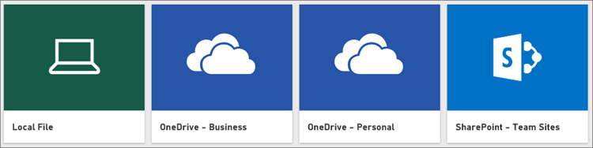

# รับข้อมูลจากไฟล์ Power BI Desktop

**Power BI Desktop**ทำให้ข่าวกรองธุรกิจและการรายงานเป็นเรื่องง่าย ไม่ว่าคุณกำลังเชื่อมต่อกับแหล่งข้อมูลต่าง ๆ มากมาย ทำแบบสอบถาม หรือกำลังแปลงข้อมูล ทำแบบจำลองข้อมูลของคุณ หรือสร้างรายงานแบบไดนามิกและมีประสิทธิภาพ **Power BI Desktop**ทำให้งานด้านข่าวกรองธุรกิจทำงานง่ายและรวดเร็ว ถ้าคุณไม่คุ้นเคยกับ **Power BI Desktop** โปรดดู[เริ่มต้นใช้งาน Power BI Desktop](../fundamentals/desktop-getting-started.md)

เมื่อคุณนำข้อมูลเข้ามายัง **Power BI Desktop** และสร้างสองสามรายงาน ถึงเวลาแล้วที่จะนำไฟล์ของคุณที่บันทึกไว้ลงใน**บริการ Power BI**

## ตำแหน่งที่คุณบันทึกไฟล์สร้างความแตกต่างได้
**ภายในเครื่อง** - ถ้าคุณบันทึกไฟล์ของคุณลงในไดรฟ์ภายในคอมพิวเตอร์ของคุณหรือตำแหน่งอื่นในองค์กรของคุณ คุณสามารถ*นำเข้า*ไฟล์ของคุณหรือสามารถ*เผยแพร่*ได้จาก Power BI Desktop เพื่อนำข้อมูลและ รายงานลงใน Power BI ไฟล์ของคุณจะยังคงอยู่บนไดรฟ์ในเครื่อง ดังนั้นจึงไม่มีการเคลื่อนย้ายไปยัง Power BI จริง ๆ สิ่งที่เกิดขึ้นจริง ๆ คือ ชุดข้อมูลใหม่จะถูกสร้างขึ้นใน Power BI และข้อมูลและแบบจำลองข้อมูลจากไฟล์ Power BI Desktop จะโหลดลงในชุดข้อมูลดังกล่าว ถ้าไฟล์ของคุณมีรายงานใด ๆ รายงานเหล่านั้นจะปรากฏในไซต์ Power BI ของคุณภายใต้รายงาน

**OneDrive - ธุรกิจ**– ถ้าคุณมี OneDrive for Business และคุณลงชื่อเข้าใช้ด้วยบัญชีเดียวกันกับที่คุณลงชื่อเข้าใช้ Power BI ปัจจุบัน นี่คือวิธีที่มีประสิทธิภาพที่สุดในการเก็บงานของคุณใน Power BI Desktop และชุดข้อมูล รายงาน และแดชบอร์ดใน Power BI ของคุณให้รวมกัน เนื่องจากทั้ง Power BI และ OneDrive อยู่ในระบบคลาวด์ Power BI จะ*เชื่อมต่อ*ไปยังไฟล์ของคุณบน OneDrive ประมาณทุกชั่วโมง ถ้าพบการเปลี่ยนแปลงใด ๆ ก็ตาม Power BI จะอัปเดต ชุดข้อมูล รายงาน และแดชบอร์โดยอัตโนมัติ

**OneDrive - ส่วนบุคคล** – ถ้าคุณบันทึกไฟล์ของคุณไปยังบัญชี OneDrive ของคุณเอง คุณจะยังได้รับประโยชน์หลายอย่างแบบเดียวกับที่คุณได้จาก OneDrive for Business ความแตกต่างที่สำคัญที่สุด คือเมื่อคุณเชื่อมต่อกับไฟล์ของคุณ (โดยใช้ รับข้อมูล > ไฟล์ > OneDrive – ส่วนบุคคล) คุณจำเป็นต้องลงชื่อเข้าใช้ OneDrive ของคุณด้วยบัญชี Microsoft ของคุณ ซึ่งโดยปกติแล้วจะแตกต่างจากที่คุณใช้ลงชื่อเข้าใช้ Power BI เมื่อลงชื่อเข้าใช้ OneDrive ของคุณด้วยบัญชี Microsoft ให้แน่ใจว่าได้เลือกตัวเลือก คงการลงชื่อเข้าใช้ของฉันไว้เสมอ ด้วยวิธีนี้ Power BI จะสามารถเชื่อมต่อกับไฟล์ของคุณประมาณทุกชั่วโมง และทำให้คุณแน่ใจว่า ชุดข้อมูลของคุณใน Power BI มีข้อมูลที่ตรงกัน

**SharePoint - ของไซต์ของทีม** การบันทึกไฟล์ Power BI Desktop ของคุณไปยัง SharePoint ไซต์ของทีมจะเหมือนกับการบันทึกไปยัง OneDrive for Business มาก ความแตกต่างที่สำคัญที่สุดคือ วิธีที่คุณเชื่อมต่อไปยังไฟล์จาก Power BI คุณสามารถระบุ URL หรือเชื่อมต่อไปยังโฟลเดอร์รากฐานได้

## นำเข้าหรือเชื่อมต่อไปยังไฟล์ Power BI Desktop จาก Power BI
>[!IMPORTANT]
>ขนาดไฟล์สูงสุดที่คุณสามารถนำเข้าใน Power BI ได้คือ 1 กิกะไบต์

1. ใน Power BI ในพื้นที่ตัวนำทาง คลิก **รับข้อมูล**
   
   
2. ใน**ไฟล์** คลิก**รับ**
   
   
3. ค้นหาไฟล์ของคุณ ไฟล์ Power BI Desktop มีนามสกุลเป็น .PBIX
   
   

## เผยแพร่ไฟล์จาก Power BI Desktop ไปยังไซต์ Power BI ของคุณ
การใช้การเผยแพร่จาก Power BI Desktop นั้นคล้ายคลึงกับการใช้รับข้อมูลใน Power BI ในแง่ของการนำเข้าข้อมูลไฟล์ของคุณจากไดรฟ์ภายในคอมพิวเตอร์ของคุณหรือการเชื่อมต่อกับไฟล์บน OneDrive อย่างไรก็ตาม ทั้งสองแบบมีความแตกต่างบางประการ: หากคุณอัปโหลดจากไดรฟ์ภายในคอมพิวเตอร์ของคุณ คุณจะต้องรีเฟรชข้อมูลนั้นบ่อยครั้งเพื่อให้แน่ใจว่าสำเนาข้อมูลออนไลน์และภายในเครื่องเป็นข้อมูลปัจจุบันซึ่งกันและกัน 

ต่อไปนี้เป็นวิธีที่รวดเร็ว แต่คุณสามารถดู[เผยแพร่จาก Power BI Desktop](../create-reports/desktop-upload-desktop-files.md)ได้เมื่อต้องการเรียนรู้เพิ่มเติม

1. ใน Power BI Desktop คลิก**ไฟล์** > **เผยแพร่** > **เผยแพร่ไปยัง Power BI**หรือคลิก**เผยแพร่**บน Ribbon
   
   
2. ลงชื่อเข้าใช้ไปยัง Power BI คุณจำเป็นต้องทำขั้นตอนนี้เฉพาะครั้งแรกเท่านั้น
   
   เมื่อเสร็จสิ้น คุณจะได้รับลิงก์เพื่อเปิดรายงานของคุณในเว็บไซต์ Power BI ของคุณ
   
   

## ขั้นตอนถัดไป
**สำรวจข้อมูลของคุณ** เมื่อคุณได้รับข้อมูลและรายงานจากไฟล์ของคุณลงใน Power BI แล้ว นั่นก็ถึงเวลาการสำรวจ ถ้าไฟล์ของคุณมีรายงานอยู่แล้ว รายงานเหล่านี้จะปรากฏในพื้นที่ตัวนำทางใน**รายงาน** ถ้าไฟล์ของคุณมีเพียงข้อมูล คุณสามารถสร้างรายงานใหม่ ได้ เพียงคลิกขวาที่ชุดข้อมูลใหม่แล้ว คลิก**สำรวจ**

**รีเฟรชแหล่งข้อมูลภายนอก**- ถ้าไฟล์ Power BI Desktop ของคุณเชื่อมต่อกับแหล่งข้อมูลภายนอก คุณสามารถตั้งค่ารีเฟรชตามกำหนดการ เพื่อให้แน่ใจว่าชุดข้อมูลของคุณเป็นปัจจุบันอยู่เสมอได้ กรณีส่วนใหญ่ การตั้งค่ารีเฟรชตามกำหนดการจะค่อนข้างง่าย แต่การลงในรายละเอียดอยู่นอกขอบเขตของบทความนี้ ดู[รีเฟรชข้อมูลใน Power BI](refresh-data.md)เมื่อต้องการเรียนรู้เพิ่มเติม
