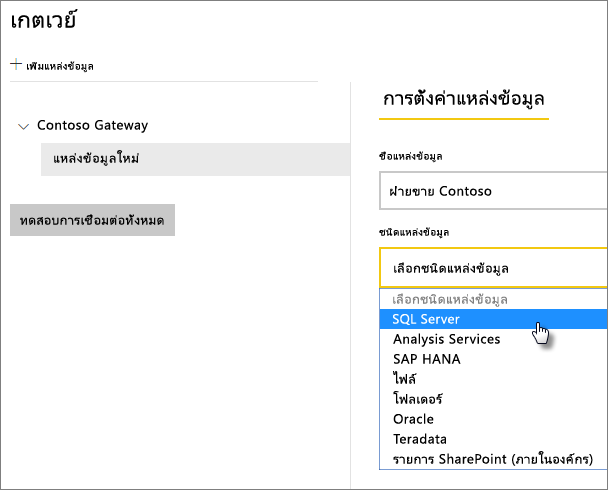

# จัดการแหล่งข้อมูลของคุณ - SQL Server

[!INCLUDE [gateway-rewrite](../includes/gateway-rewrite.md)]

หลังจากคุณ[ติดตั้งเกตเวย์ข้อมูลภายในองค์กรแล้ว](/data-integration/gateway/service-gateway-install) คุณสามารถ[เพิ่มแหล่งข้อมูล](service-gateway-data-sources.md#add-a-data-source)ที่สามารถใช้ได้กับเกตเวย์ดังกล่าว บทความนี้จะดูวิธีการทำงานกับเกตเวย์และแหล่งข้อมูล SQL Server ที่ใช้สำหรับการรีเฟรชตามกำหนดการหรือสำหรับ DirectQuery

## เพิ่มแหล่งข้อมูล

สำหรับข้อมูลเพิ่มเติมเกี่ยวกับวิธีการเพิ่มแหล่งข้อมูล ให้ดู[เพิ่มแหล่งข้อมูล](service-gateway-data-sources.md#add-a-data-source) ภายใต้ **ชนิดแหล่งข้อมูล** ให้เลือก **SQL Server**

> [!NOTE]
> เมื่อคุณใช้ DirectQuery เกตเวย์สนับสนุนเฉพาะ **SQL Server 2012 SP1** และเวอร์ชันถัดมา

จากนั้นให้กรอกข้อมูลเกี่ยวกับแหล่งข้อมูล ซึ่งประกอบด้วย**เซิร์ฟเวอร์**และ**ฐานข้อมูล** 

ภายใต้ **วิธีการรับรองความถูกต้อง** ให้เลือก **Windows** หรือ **พื้นฐาน** เลือก**พื้นฐาน**ถ้าคุณวางแผนที่จะใช้การรับรองความถูกต้องของ SQL แทนการรับรองความถูกต้องของ Windows จากนั้นป้อนข้อมูลประจำตัวที่จะใช้สำหรับแหล่งข้อมูลนี้

> [!NOTE]
> คิวรีทั้งหมดที่ไปยังแหล่งข้อมูลจะทำงานโดยใช้ข้อมูลประจำตัวเหล่านี้ เว้นแต่ว่า single sign-on (SSO) ของ Kerberos จะถูกกำหนดค่าและเปิดใช้งานสำหรับแหล่งข้อมูล SSO จะทำให้ชุดข้อมูลนำเข้าใช้ข้อมูลประจำตัวที่จัดเก็บไว้ แต่ชุดข้อมูล DirectQuery จะใช้ผู้ใช้ Power BI ปัจจุบันเพื่อดำเนินการคิวรีโดยใช้ SSO หากต้องการเรียนรู้เพิ่มเติมเกี่ยวกับวิธีการจัดเก็บข้อมูลประจำตัว ให้ดู [การจัดเก็บข้อมูลประจำตัวที่เข้ารหัสไว้ในระบบคลาวด์](service-gateway-data-sources.md#store-encrypted-credentials-in-the-cloud) หรือดูบทความที่อธิบายวิธีการ [ใช้ Kerberos สำหรับ single sign-on (SSO) จาก Power BI ไปยังแหล่งข้อมูลภายในองค์กร](service-gateway-sso-kerberos.md)

หลังจากที่คุณกรอกข้อมูลทุกอย่างแล้ว ให้เลือก**เพิ่ม** คุณสามารถใช้แหล่งข้อมูลนี้สำหรับการรีเฟรชตามกำหนดการหรือ DirectQuery เทียบกับ SQL Server ที่อยู่ภายในองค์กรได้ คุณจะเห็น*การเชื่อมต่อสำเร็จ* หากการดำเนินการเสร็จสมบูรณ์แล้ว

### การตั้งค่าขั้นสูง

อีกทางหนึ่งคือคุณสามารถกำหนดค่าระดับความเป็นส่วนตัวให้กับแหล่งข้อมูลของคุณ การตั้งค่านี้จะช่วยควบคุมวิธีการรวมข้อมูลได้ ซึ่งใช้ได้เฉพาะกับการรีเฟรชตามกำหนดการเท่านั้น การตั้งค่าระดับความเป็นส่วนตัวจะไม่นำไปใช้กับ DirectQuery หากต้องการเรียนรู้เพิ่มเติมเกี่ยวกับระดับความเป็นส่วนตัวสำหรับแหล่งข้อมูลของคุณ ให้ดู [ระดับความเป็นส่วนตัว (Power Query)](https://support.office.com/article/Privacy-levels-Power-Query-CC3EDE4D-359E-4B28-BC72-9BEE7900B540)

## ใช้แหล่งข้อมูล

หลังจากที่คุณสร้างแหล่งข้อมูล รายการนี้จะพร้อมใช้งานเมื่อต้องใช้ทั้งกับการเชื่อมต่อ DirectQuery หรือการเชื่อมต่อสดผ่านการรีเฟรชตามกำหนดการ

> [!NOTE]
> ชื่อเซิร์ฟเวอร์และชื่อฐานข้อมูลจะต้องตรงกับ Power BI Desktop และแหล่งข้อมูลภายในเกตเวย์ข้อมูลภายในองค์กร

การเชื่อมโยงระหว่างชุดข้อมูลของคุณและแหล่งข้อมูลภายในเกตเวย์จะเป็นไปตามชื่อเซิร์ฟเวอร์และชื่อฐานข้อมูลของคุณ ชื่อเหล่านี้ต้องตรงกัน ตัวอย่างเช่น ถ้าคุณใส่ที่อยู่ IP สำหรับชื่อเซิร์ฟเวอร์ภายใน Power BI Desktop คุณต้องใช้ที่อยู่ IP สำหรับแหล่งข้อมูลภายในการกำหนดค่าเกตเวย์ด้วยเช่นกัน ถ้าคุณใช้ *SERVER\INSTANCE* ใน Power BI Desktop คุณต้องใช้ภายในแหล่งข้อมูลที่กำหนดค่าไว้สำหรับเกตเวย์ดังกล่าวด้วย

ข้อกำหนดนี้เป็นกรณีสำหรับทั้ง DirectQuery และการรีเฟรชตามกำหนดการ

### ใช้แหล่งข้อมูลที่มีการเชื่อมต่อกับ DirectQuery

ตรวจสอบให้แน่ใจว่าชื่อเซิร์ฟเวอร์และชื่อฐานข้อมูลตรงกันระหว่าง Power BI Desktop และแหล่งข้อมูลที่กำหนดค่าไว้สำหรับเกตเวย์ คุณยังต้องตรวจสอบให้แน่ใจอีกว่า ผู้ใช้ของคุณแสดงอยู่ในแท็บ**ผู้ใช้**ของแหล่งข้อมูลเพื่อเผยแพร่ชุดข้อมูล DirectQuery ตัวเลือกสำหรับ DirectQuery จะเกิดขึ้นภายใน Power BI Desktop ตอนที่คุณนำเข้าข้อมูลครั้งแรก สำหรับข้อมูลเพิ่มเติมเกี่ยวกับวิธีการใช้งาน DirectQuery โปรดดู [ใช้ DirectQuery ใน Power BI Desktop](desktop-use-directquery.md)

หลังจากที่คุณเผยแพร่ชุดข้อมูลจาก Power BI Desktop หรือ**รับข้อมูล** รายงานของคุณควรเริ่มการทำงาน ซึ่งอาจจะใช้เวลาหลายนาทีเพื่อให้การเชื่อมต่อสามารถใช้งานได้ หลังจากคุณสร้างแหล่งข้อมูลภายในเกตเวย์

### ใช้แหล่งข้อมูลที่มีการรีเฟรชตามกำหนดการ

ถ้าคุณอยู่ในแท็บ **ผู้ใช้** ของแหล่งข้อมูลที่กำหนดค่าไว้ภายในเกตเวย์ และชื่อเซิร์ฟเวอร์และชื่อฐานข้อมูลตรงกัน คุณจะเห็นเกตเวย์เป็นตัวเลือกเพื่อใช้กับการรีเฟรชตามกำหนดการ

## ขั้นตอนถัดไป

* [เชื่อมต่อกับข้อมูลภายในองค์กรใน SQL Server](service-gateway-sql-tutorial.md)
* [การแก้ไขปัญหาเกตเวย์ข้อมูลภายในองค์กร](/data-integration/gateway/service-gateway-tshoot)
* [แก้ไขปัญหาเกตเวย์-Power BI](service-gateway-onprem-tshoot.md)
* [ใช้ Kerberos สำหรับลงชื่อเข้าใช้ครั้งเดียว (SSO) จาก Power BI ไปยังแหล่งข้อมูลภายในองค์กร](service-gateway-sso-kerberos.md)

มีคำถามเพิ่มเติมหรือไม่ ลองถาม[ชุมชน Power BI](https://community.powerbi.com/)
