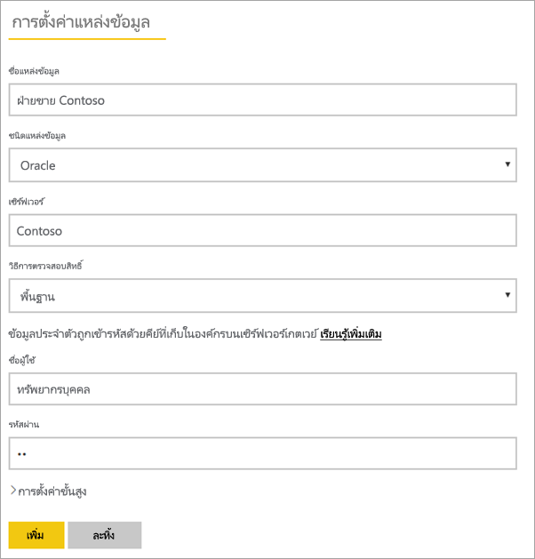

# จัดการแหล่งข้อมูลของคุณ - Oracle

[!INCLUDE [gateway-rewrite](../includes/gateway-rewrite.md)]

หลังจากคุณ[ติดตั้งเกตเวย์ข้อมูลภายในองค์กรแล้ว](/data-integration/gateway/service-gateway-install) คุณจำเป็นต้อง[เพิ่มแหล่งข้อมูล](service-gateway-data-sources.md#add-a-data-source)ที่สามารถใช้ได้กับเกตเวย์ดังกล่าว บทความนี้จะดูวิธีการทำงานกับเกตเวย์และแหล่งข้อมูล Oracle สำหรับการรีเฟรชตามกำหนดการหรือสำหรับ DirectQuery

## เชื่อมต่อกับฐานข้อมูล Oracle
การเชื่อมต่อกับฐานข้อมูล Oracle ด้วยเกตเวย์ข้อมูลภายในองค์กรนั้น ต้องติดตั้งซอฟต์แวร์ไคลเอ็นต์ Oracle ที่ถูกต้องบนคอมพิวเตอร์ที่ใช้งานเกตเวย์ ซอฟต์แวร์ไคลเอ็นต์ Oracle ที่คุณใช้ขึ้นอยู่กับเวอร์ชันของเซิร์ฟเวอร์ Oracle แต่จะตรงกับเกตเวย์ 64 บิตเสมอ

เวอร์ชัน Oracle ที่รองรับ: 
- Oracle Server 9 และเวอร์ชันที่ใหม่กว่า
- ซอฟต์แวร์ Oracle Data Access Client (ODAC) 11.2 และเวอร์ชันที่ใหม่กว่า

## ติดตั้ง Oracle client
- [ดาวน์โหลดและติดตั้งไคลเอ็นต์ Oracle 64 บิต](https://www.oracle.com/database/technologies/odac-downloads.html)

> [!NOTE]
> เลือกเวอร์ชันของ Oracle Data Access Client (ODAC) ซึ่งสามารถทำงานร่วมกับเซิร์ฟเวอร์ Oracle ของคุณได้ ตัวอย่างเช่น ODAC 12.x ไม่รองรับเซิร์ฟเวอร์ Oracle เวอร์ชัน 9
> เลือกตัวติดตั้ง Windows ของไคลเอ็นต์ Oracle
> ระหว่างการตั้งค่าของไคลเอ็นต์ Oracle คุณต้องตรวจสอบให้แน่ใจว่าได้เปิดใช้งาน *กำหนดค่า ODP.NET และ/หรือผู้ให้บริการ Oracle สำหรับ ASP.NET ที่ระดับเครื่อง* โดยการเลือกกล่องกาเครื่องหมายที่เกี่ยวข้องในระหว่างการตั้งค่าตัวช่วยสร้าง ตัวช่วยสร้างไคลเอ็นต์ Oracle บางเวอร์ชันเลือกกล่องกาเครื่องหมายตามค่าเริ่มต้น ซึ่งเวอร์ชันอื่น ๆ ไม่ทำเช่นนี้ ตรวจสอบให้แน่ใจว่าคุณได้เลือกกล่องกาเครื่องหมายเพื่อให้ Power BI สามารถเชื่อมต่อกับฐานข้อมูล Oracle ของคุณได้
 
หลังจากที่ติดตั้งไคลเอ็นต์และกำหนดค่า ODAC อย่างถูกต้องแล้ว เราขอแนะนำให้ใช้ PowerBI Desktop หรือไคลเอ็นต์ทดสอบอื่น ๆ เพื่อตรวจสอบการติดตั้งและการกำหนดค่าที่ถูกต้องบนเกตเวย์

## เพิ่มแหล่งข้อมูล

สำหรับข้อมูลเพิ่มเติมเกี่ยวกับวิธีการเพิ่มแหล่งข้อมูล ให้ดู[เพิ่มแหล่งข้อมูล](service-gateway-data-sources.md#add-a-data-source) ภายใต้ **ชนิดแหล่งข้อมูล** ให้เลือก **Oracle**

หลังจากที่คุณเลือกชนิดแหล่งข้อมูล Oracle แล้ว ให้กรอกข้อมูลสำหรับแหล่งข้อมูลซึ่งรวมถึง **เซิร์ฟเวอร์** และ **ฐานข้อมูล** 

ภายใต้ **วิธีการรับรองความถูกต้อง** คุณสามารถเลือก **Windows** หรือ **พื้นฐาน** ได้ เลือก **พื้นฐาน** ถ้าคุณวางแผนเพื่อใช้บัญชีที่สร้างขึ้นภายใน Oracle แทนการรับรองความถูกต้องของ Windows จากนั้นป้อนข้อมูลประจำตัวที่จะใช้สำหรับแหล่งข้อมูลนี้

> [!NOTE]
> แบบสอบถามทั้งหมดที่ไปยังแหล่งข้อมูลจะทำงานโดยใช้ข้อมูลประจำตัวเหล่านี้ หากต้องการเรียนรู้เพิ่มเติมเกี่ยวกับวิธีการจัดเก็บข้อมูลประจำตัว ให้ดู [จัดเก็บข้อมูลประจำตัวที่เข้ารหัสไว้ในระบบคลาวด์](service-gateway-data-sources.md#store-encrypted-credentials-in-the-cloud)

หลังจากที่คุณกรอกข้อมูลทุกอย่างแล้ว ให้เลือก**เพิ่ม** คุณสามารถใช้แหล่งข้อมูลนี้สำหรับการรีเฟรชตามกำหนดการหรือ DirectQuery เทียบกับ Oracle server ที่อยู่ภายในองค์กรได้ คุณจะเห็น*การเชื่อมต่อสำเร็จ* หากการดำเนินการเสร็จสมบูรณ์แล้ว

### การตั้งค่าขั้นสูง

อีกทางหนึ่งคือคุณสามารถกำหนดค่าระดับความเป็นส่วนตัวให้กับแหล่งข้อมูลของคุณ การตั้งค่านี้จะช่วยควบคุมวิธีการรวมข้อมูลได้ ซึ่งใช้ได้เฉพาะกับการรีเฟรชตามกำหนดการเท่านั้น การตั้งค่าระดับความเป็นส่วนตัวจะไม่นำไปใช้กับ DirectQuery หากต้องการเรียนรู้เพิ่มเติมเกี่ยวกับระดับความเป็นส่วนตัวสำหรับแหล่งข้อมูลของคุณ ให้ดู [ระดับความเป็นส่วนตัว (Power Query)](https://support.office.com/article/Privacy-levels-Power-Query-CC3EDE4D-359E-4B28-BC72-9BEE7900B540)

## ใช้แหล่งข้อมูล

หลังจากที่คุณสร้างแหล่งข้อมูล รายการนี้จะพร้อมใช้งานเมื่อต้องใช้ทั้งกับการเชื่อมต่อ DirectQuery หรือการเชื่อมต่อสดผ่านการรีเฟรชตามกำหนดการ

> [!WARNING]
> ชื่อเซิร์ฟเวอร์และชื่อฐานข้อมูลจะต้องตรงกับ Power BI Desktop และแหล่งข้อมูลภายในเกตเวย์ข้อมูลภายในองค์กร

การเชื่อมโยงระหว่างชุดข้อมูลของคุณและแหล่งข้อมูลภายในเกตเวย์จะเป็นไปตามชื่อเซิร์ฟเวอร์และชื่อฐานข้อมูลของคุณ ชื่อเหล่านี้ต้องตรงกัน ตัวอย่างเช่น ถ้าคุณใส่ที่อยู่ IP สำหรับชื่อเซิร์ฟเวอร์ภายใน Power BI Desktop คุณต้องใช้ที่อยู่ IP สำหรับแหล่งข้อมูลภายในการกำหนดค่าเกตเวย์ด้วยเช่นกัน นอกจากนี้ ชื่อนี้ยังต้องตรงกับนามแฝงที่กำหนดไว้ภายในแฟ้ม tnsnames.ora ด้วย สำหรับข้อมูลเพิ่มเติมเกี่ยวกับไฟล์ tnsnames.ora โปรดดู [ติดตั้ง Oracle Client](#install-the-oracle-client)

ข้อกำหนดนี้เป็นกรณีสำหรับทั้ง DirectQuery และการรีเฟรชตามกำหนดการ

### ใช้แหล่งข้อมูลที่มีการเชื่อมต่อกับ DirectQuery

ตรวจสอบให้แน่ใจว่าชื่อเซิร์ฟเวอร์และชื่อฐานข้อมูลตรงกันระหว่าง Power BI Desktop และแหล่งข้อมูลที่กำหนดค่าไว้สำหรับเกตเวย์ คุณยังต้องตรวจสอบให้แน่ใจอีกว่า ผู้ใช้ของคุณแสดงอยู่ในแท็บ**ผู้ใช้**ของแหล่งข้อมูลเพื่อเผยแพร่ชุดข้อมูล DirectQuery ตัวเลือกสำหรับ DirectQuery จะเกิดขึ้นภายใน Power BI Desktop ตอนที่คุณนำเข้าข้อมูลครั้งแรก สำหรับข้อมูลเพิ่มเติมเกี่ยวกับวิธีการใช้งาน DirectQuery โปรดดู [ใช้ DirectQuery ใน Power BI Desktop](desktop-use-directquery.md)

หลังจากที่คุณเผยแพร่ชุดข้อมูลจาก Power BI Desktop หรือ**รับข้อมูล** รายงานของคุณควรเริ่มการทำงาน ซึ่งอาจจะใช้เวลาหลายนาทีเพื่อให้การเชื่อมต่อสามารถใช้งานได้ หลังจากคุณสร้างแหล่งข้อมูลภายในเกตเวย์

### ใช้แหล่งข้อมูลที่มีการรีเฟรชตามกำหนดการ

ถ้าคุณอยู่ในแท็บ **ผู้ใช้** ของแหล่งข้อมูลที่กำหนดค่าไว้ภายในเกตเวย์ และชื่อเซิร์ฟเวอร์และชื่อฐานข้อมูลตรงกัน คุณจะเห็นเกตเวย์เป็นตัวเลือกเพื่อใช้กับการรีเฟรชตามกำหนดการ

## การแก้ไขปัญหา

คุณอาจพบข้อผิดพลาดต่าง ๆ มากมายจาก Oracle เมื่อไวยากรณ์การตั้งชื่อไม่ถูกต้อง หรือไม่ได้กำหนดค่าอย่างถูกต้อง:

* ORA-12154: TNS: ไม่สามารถแก้ไขตัวระบุการเชื่อมต่อที่ระบุได้
* ORA-12514: TNS: ในขณะนี้ ตัวรอรับการติดต่อไม่รู้จักบริการที่ร้องขอในตัวอธิบายการเชื่อมต่อ
* ORA-12541: TNS: ไม่มีตัวรอรับการติดต่อ
* ORA-12170: TNS: เกิดเหตุการณ์การเชื่อมต่อหมดเวลา
* ORA-12504: TNS: ตัวรอรับการติดต่อไม่ได้รับ SERVICE_NAME ใน CONNECT_DATA

ข้อผิดพลาดเหล่านี้อาจเกิดขึ้นหากไม่ได้ติดตั้ง Oracle client หรือกำหนดค่าไม่ถูกต้อง ถ้ามีการติดตั้งอยู่แล้ว ให้ตรวจสอบว่ามีการกำหนดค่าไฟล์ tnsnames.ora อย่างถูกต้องหรือไม่ และคุณกำลังใช้ net_service_name ที่เหมาะสมหรือไม่ นอกจากนี้ คุณจะต้องตรวจสอบให้แน่ใจว่า net_service_name สำหรับเครื่องที่ใช้ Power BI Desktop และเครื่องที่ใช้งานเกตเวย์นั้นเป็นตัวเดียวกันหรือไม่ สำหรับข้อมูลเพิ่มเติม โปรดดู [ติดตั้ง Oracle Client](#install-the-oracle-client)

คุณอาจประสบปัญหาความเข้ากันได้ระหว่างเวอร์ชัน Oracle server และเวอร์ชัน Oracle Data Access Client โดยทั่วไปแล้ว คุณต้องใช้เวอร์ชันที่สอดคล้องกัน เนื่องจากชุดการทำงานบางอย่างอาจไม่เข้ากัน ตัวอย่างเช่น ODAC 12.x นั้นไม่รองรับเซิร์ฟเวอร์ Oracle เวอร์ชัน 9

สำหรับการวินิจฉัยปัญหาการเชื่อมต่อระหว่างเซิร์ฟเวอร์แหล่งข้อมูลและเครื่องเกตเวย์ เราขอแนะนำให้ติดตั้งไคลเอ็นต์ (เช่น PowerBI Desktop หรือ Oracle ODBC Test) บนเครื่องเกตเวย์ คุณสามารถใช้ไคลเอ็นต์เพื่อตรวจสอบการเชื่อมต่อกับเซิร์ฟเวอร์แหล่งข้อมูลได้

สำหรับข้อมูลการแก้ไขปัญหาเพิ่มเติมที่เกี่ยวข้องกับเกตเวย์ โปรดดู [การแก้ไขปัญหาเกตเวย์ข้อมูลในองค์กร](/data-integration/gateway/service-gateway-tshoot)

## ขั้นตอนถัดไป

* [แก้ไขปัญหาเกตเวย์-Power BI](service-gateway-onprem-tshoot.md)
* [Power BI Premium](../admin/service-premium-what-is.md)

มีคำถามเพิ่มเติมหรือไม่ ลองถาม[ชุมชน Power BI](https://community.powerbi.com/)
