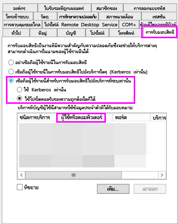

# <a name="troubleshoot-gateways---power-bi"></a>แก้ไขปัญหาเกตเวย์ - Power BI

[!INCLUDE [gateway-rewrite](../includes/gateway-rewrite.md)]

บทความนี้อธิบายถึงปัญหาทั่วไปเมื่อใช้เกตเวย์ข้อมูลภายในองค์กรกับ Power BI ถ้าคุณพบปัญหาที่ไม่ได้อยู่ในรายการนี้ คุณสามารถใช้ไซต์ [ชุมชน Power BI ](https://community.powerbi.com)ได้ หรือคุณสามารถสร้าง [ตั๋วการสนับสนุน](https://powerbi.microsoft.com/support)

## <a name="configuration"></a>การกำหนดค่า

### <a name="error-power-bi-service-reported-local-gateway-as-unreachable-restart-the-gateway-and-try-again"></a>ข้อผิดพลาด: บริการ Power BI รายงานว่าไม่สามารถเข้าถึงเกตเวย์ภายในเครื่องได้ รีสตาร์ทเกตเวย์และลองอีกครั้ง

ตอนท้ายของการกำหนดค่า บริการ Power BI จะถูกเรียกอีกครั้งเพื่อตรวจสอบเกตเวย์ บริการของ Power BI ไม่ได้รายงานสถานะเกตเวย์ว่าสด รีสตาร์ทบริการของ Windows อาจช่วยให้สื่อสารสำเร็จ หากต้องการข้อมูลเพิ่มเติม คุณสามารถรวบรวมและตรวจทานบันทึกตามที่อธิบายไว้ใน[เก็บรวบรวมบันทึกจากแอปในเกตเวย์ข้อมูลภายในองค์กร](/data-integration/gateway/service-gateway-tshoot#collect-logs-from-the-on-premises-data-gateway-app)

## <a name="data-sources"></a>แหล่งข้อมูล

### <a name="error-unable-to-connect-details-invalid-connection-credentials"></a>ข้อผิดพลาด: ไม่สามารถเชื่อมต่อได้ รายละเอียด: "ข้อมูลประจำตัวของการเชื่อมต่อไม่ถูกต้อง"

ภายใน**แสดงรายละเอียด** ข้อความแสดงข้อผิดพลาดที่ได้รับจากแหล่งข้อมูลจะแสดงขึ้นมา สำหรับ SQL Server คุณจะเห็นบางอย่างดังต่อไปนี้

    Login failed for user 'username'.

ตรวจสอบว่า คุณมีชื่อผู้ใช้และรหัสผ่านที่ถูกต้อง อีกทั้ง ตรวจสอบว่า ข้อมูลประจำตัวเหล่านั้นสามารถเชื่อมต่อกับแหล่งข้อมูลเรียบร้อยแล้ว ตรวจสอบให้แน่ใจว่าบัญชีที่ใช้ตรงกับ วิธีการรับรองความถูกต้อง

### <a name="error-unable-to-connect-details-cannot-connect-to-the-database"></a>ข้อผิดพลาด: ไม่สามารถเชื่อมต่อได้ รายละเอียด: "ไม่สามารถติดต่อแหล่งข้อมูลได้"

คุณสามารถเชื่อมต่อไปยังเซิร์ฟเวอร์ แต่ไม่สามารถเชื่อมต่อไปยังฐานข้อมูลที่ให้มา ตรวจสอบชื่อของฐานข้อมูล และตรวจสอบว่าข้อมูลประจำตัวของผู้ใช้มีสิทธิ์เข้าถึงฐานข้อมูลนั้น

ภายใน**แสดงรายละเอียด** ข้อความแสดงข้อผิดพลาดที่ได้รับจากแหล่งข้อมูลจะแสดงขึ้นมา สำหรับ SQL Server คุณจะเห็นบางอย่างดังต่อไปนี้

    Cannot open database "AdventureWorks" requested by the login. The login failed. Login failed for user 'username'.

### <a name="error-unable-to-connect-details-unknown-error-in-data-gateway"></a>ข้อผิดพลาด: ไม่สามารถเชื่อมต่อได้ รายละเอียด: "เกิดข้อผิดพลาดที่ไม่รู้จักในเกตเวย์ข้อมูล"

ข้อผิดพลาดนี้อาจเกิดขึ้นจากหลายสาเหตุ ตรวจสอบให้แน่ใจว่าคุณสามารถเชื่อมต่อกับแหล่งข้อมูลจากเครื่องที่โฮสต์เกตเวย์ สถานการณ์นี้อาจเป็นผลมาจากเซิร์ฟเวอร์ที่ไม่สามารถเข้าถึงได้

ภายใน**แสดงรายละเอียด**คุณสามารถเห็นรหัสข้อผิดพลาดของ**DM_GWPipeline_UnknownError**ได้

คุณยังสามารถค้นหาใน **บันทึกเหตุการณ์** > **บันทึกแอปพลิเคชันและบริการ** > **บริการเกตเวย์ข้อมูลภายในองค์กร**สำหรับรายละเอียดเพิ่มเติม

### <a name="error-we-encountered-an-error-while-trying-to-connect-to-server-details-we-reached-the-data-gateway-but-the-gateway-cant-access-the-on-premises-data-source"></a>ข้อผิดพลาด: เราพบข้อผิดพลาดขณะพยายามเชื่อมต่อกับ\<เซิร์ฟเวอร์\> รายละเอียด: "เราสามารถเข้าถึงเกตเวย์ข้อมูลได้ แต่เกตเวย์ข้อมูลไม่สามารถเข้าถึงแหล่งข้อมูลในองค์กรได้"

คุณไม่สามารถเชื่อมต่อไปยังแหล่งข้อมูลที่ระบุไว้ ตรวจสอบให้แน่ใจว่าข้อมูลที่ให้ไว้สำหรับแหล่งข้อมูลนั้นถูกต้อง

ภายใน**แสดงรายละเอียด**คุณสามารถเห็นรหัสข้อผิดพลาดของ**DM_GWPipeline_Gateway_DataSourceAccessError**ได้

ถ้าข้อผิดพลาดเบื้องต้นคล้ายกับข้อความต่อไปนี้ แสดงว่าบัญชีผู้ใช้ที่คุณกำลังใช้สำหรับแหล่งข้อมูล ไม่ใช่บัญชีผู้ดูแลระบบเซิร์ฟเวอร์สำหรับอินสแตนซ์ของ Analysis Services นั้น สำหรับข้อมูลเพิ่มเติม ให้ดู [การให้สิทธิ์ผู้ดูแลระบบเซิร์ฟเวอร์กับอินสแตนซ์ของ Analysis Services](https://docs.microsoft.com/sql/analysis-services/instances/grant-server-admin-rights-to-an-analysis-services-instance)

    The 'CONTOSO\account' value of the 'EffectiveUserName' XML for Analysis property is not valid.

ถ้าข้อผิดพลาดเบื้องต้นคล้ายกับข้อความต่อไปนี้ แสดงว่าบัญชีบริการสำหรับ Analysis Services อาจจะขาดแอตทริบิวต์ไดเรกทอรี [token-groups-global-and-universal](https://msdn.microsoft.com/library/windows/desktop/ms680300.aspx) (TGGAU)

    The username or password is incorrect.

โดเมนที่มีการเข้าถึงความเข้ากันได้ของ Windows รุ่นก่อน 2000 มีแอตทริบิวต์ TGGAU ที่เปิดใช้งาน โดเมนที่สร้างขึ้นใหม่ส่วนใหญ่ไม่เปิดใช้งานแอตทริบิวต์นี้ตามค่าเริ่มต้น สำหรับข้อมูลเพิ่มเติม ให้ดู [แอปพลิเคชันและ API บางอย่างจำเป็นต้องมีสิทธิ์เข้าถึงข้อมูลการรับรองความถูกต้องเกี่ยวกับออบเจ็กต์ของบัญชี](https://support.microsoft.com/kb/331951)

เพื่อยืนยันว่าเปิดใช้งานแอตทริบิวต์หรือไม่ ให้ทำตามขั้นตอนเหล่านี้

1. เชื่อมต่อไปยังเครื่อง Analysis Services ภายใน SQL Server Management Studio ภายในคุณสมบัติการเชื่อมต่อขั้นสูง ใส่ EffectiveUserName สำหรับผู้ใช้ที่มีปัญหา และดูว่ามีข้อผิดพลาดแบบเดียวกันเกิดขึ้นอีกหรือไม่
2. คุณสามารถใช้เครื่องมือ dsacls ของ Active Directory เพื่อตรวจสอบว่ามีแอตทริบิวต์ในรายการหรือไม่ เครื่องมือนี้มีอยู่ในตัวควบคุมโดเมน คุณจำเป็นต้องทราบชื่อโดเมนเฉพาะสำหรับบัญชีผู้ใช้ และส่งชื่อนั้นไปยังเครื่องมือ

        dsacls "CN=John Doe,CN=UserAccounts,DC=contoso,DC=com"

    คุณต้องการผลลัพธ์ที่คล้ายกับข้อความต่อไปนี้

            Allow BUILTIN\Windows Authorization Access Group
                                          SPECIAL ACCESS for tokenGroupsGlobalAndUniversal
                                          READ PROPERTY

เมื่อต้องการแก้ไขปัญหานี้ คุณต้องเปิดใช้งาน TGGAU บนบัญชีที่ใช้สำหรับบริการ Analysis Services ของ Windows

#### <a name="another-possibility-for-the-username-or-password-is-incorrect"></a>อีกสาเหตุหนึ่งที่เป็นไปได้คือ “ชื่อผู้ใช้หรือรหัสผ่านไม่ถูกต้อง”

ข้อผิดพลาดนี้ก็ยังเกิดขึ้นได้ถ้าเซิร์ฟเวอร์ Analysis Services อยู่ในคนละโดเมนกับผู้ใช้ และไม่มีการกำหนดความน่าเชื่อถือแบบสองทิศทางเอาไว้ก่อน

ทำงานร่วมกับผู้ดูแลระบบโดเมนของคุณเพื่อตรวจสอบความสัมพันธ์ที่น่าเชื่อถือระหว่างโดเมน

#### <a name="unable-to-see-the-data-gateway-data-sources-in-the-get-data-experience-for-analysis-services-from-the-power-bi-service"></a>ไม่สามารถมองเห็นแหล่งข้อมูลของเกตเวย์ข้อมูลในประสบการณ์ใช้งาน 'รับข้อมูล' สำหรับ Analysis Services จากบริการของ Power BI

ตรวจสอบให้แน่ใจว่า บัญชีของคุณอยู่ในรายการในแท็บ**ผู้ใช้** ของแหล่งข้อมูล ในการกำหนดค่าของเกตเวย์ ถ้าคุณไม่สามารถเข้าถึงเกตเวย์ ตรวจสอบกับผู้ดูแลระบบของเกตเวย์ และขอให้เขาตรวจสอบให้ เฉพาะบัญชีผู้ใช้ในรายการ**ผู้ใช้**เท่านั้นที่สามารถดูแหล่งข้อมูลที่แสดงอยู่ในรายการของ Analysis Services ได้

### <a name="error-you-dont-have-any-gateway-installed-or-configured-for-the-data-sources-in-this-dataset"></a>ข้อผิดพลาด: คุณไม่ได้ติดตั้งหรือการกำหนดค่าเกตเวย์ สำหรับแหล่งข้อมูลในชุดข้อมูลนี้

ตรวจสอบให้แน่ใจว่าคุณได้เพิ่มแหล่งข้อมูลหนึ่งรายการหรือมากกว่าไปยังเกตเวย์ ตามที่อธิบายไว้ใน[เพิ่มแหล่งข้อมูล](service-gateway-data-sources.md#add-a-data-source) ถ้าเกตเวย์ไม่ปรากฏในพอร์ทัลผู้ดูแลระบบภายใต้**จัดการเกตเวย์** ให้ล้างแคชของเบราว์เซอร์ หรือลงชื่อออกจากบริการแล้วลงชื่อเข้าใช้อีกครั้ง

## <a name="datasets"></a>ชุดข้อมูล

### <a name="error-there-is-not-enough-space-for-this-row"></a>ข้อผิดพลาด: มีเนื้อที่ไม่เพียงพอสำหรับแถวนี้

ข้อผิดพลาดนี้เกิดขึ้นถ้าคุณมีแถวเดียวที่มีขนาดมากกว่า 4 เมกะไบต์ ตรวจหาว่าแถวไหนมาจากแหล่งข้อมูลของคุณ และพยายามทำการกรองออกหรือลดขนาดสำหรับแถวนั้น

### <a name="error-the-server-name-provided-doesnt-match-the-server-name-on-the-sql-server-ssl-certificate"></a>ข้อผิดพลาด: ชื่อเซิร์ฟเวอร์ที่ระบุไม่ตรงกับชื่อเซิร์ฟเวอร์บนใบรับรอง SSL ของ SQL Server

ข้อผิดพลาดนี้สามารถเกิดขึ้นเมื่อชื่อสามัญของใบรับรองมีไว้สำหรับเซิร์ฟเวอร์ที่มีชื่อโดเมนที่มีคุณสมบัติครบถ้วน (FQDN) แต่คุณใส่เพียงชื่อ NetBIOS สำหรับเซิร์ฟเวอร์ สถานการณ์นี้ทำให้เกิดการไม่ตรงกันสำหรับใบรับรอง เมื่อต้องแก้ไขปัญหานี้ ต้องตั้งชื่อเซิร์ฟเวอร์ภายในแหล่งข้อมูลเกตเวย์ และไฟล์ PBIX จะใช้ FQDN ของเซิร์ฟเวอร์

### <a name="error-you-dont-see-the-on-premises-data-gateway-present-when-you-configure-scheduled-refresh"></a>ข้อผิดพลาด: คุณไม่เห็นเกตเวย์ข้อมูลภายในองค์กรอยู่เมื่อกำหนดค่าการรีเฟรชตามกำหนดการ

สถานการณ์ที่แตกต่างกันบางอย่างอาจเป็นต้นเหตุของข้อผิดพลาดนี้:

- ชื่อเซิร์ฟเวอร์และชื่อฐานข้อมูลไม่ตรงกันกับชื่อที่ระบุไว้ใน Power BI Desktop และแหล่งข้อมูลที่กำหนดค่าสำหรับเกตเวย์ ชื่อเหล่านี้จะต้องเหมือนกัน ซึ่งไม่ต้องตรงตามตัวพิมพ์ใหญ่-เล็กก็ได้
- บัญชีของคุณไม่ได้แสดงอยู่ในรายการในแท็บ**ผู้ใช้** ของแหล่งข้อมูลในการกำหนดค่าของเกตเวย์ คุณจะต้องเพิ่มในรายการนั้นโดยสิทธิ์ของผู้ดูแลระบบของเกตเวย์
- ไฟล์ Power BI Desktop ของคุณมีแหล่งข้อมูลหลายแหล่ง แต่บางแหล่งข้อมูลไม่ได้กำหนดค่าไว้ในเกตเวย์ คุณจำเป็นต้องมีแหล่งข้อมูลแต่ละแหล่งที่กำหนดด้วยเกตเวย์สำหรับเกตเวย์เพื่อแสดงขึ้นภายในการรีเฟรชตามกำหนดการ

### <a name="error-the-received-uncompressed-data-on-the-gateway-client-has-exceeded-the-limit"></a>ข้อผิดพลาด: ข้อมูลที่ไม่มีการบีบอัดที่ได้รับบนไคลเอ็นต์ของเกตเวย์ได้เกินขีดจำกัด

มีการจำกัดขนาดของข้อมูลไม่บีบอัดที่ 10 GB ต่อ ตาราง ถ้าคุณกำลังมีปัญหานี้ มีหลายทางเลือกในการปรับให้เหมาะสม และหลีกเลี่ยงปัญหาดังกล่าว โดยเฉพาะอย่างยิ่ง ลดการใช้ค่าสตริงที่คงที่ สูง และยาว แล้วใช้คีย์ปกติแทน หรือการเอาคอลัมน์ออกถ้าไม่ได้ใช้งานจะช่วยได้

## <a name="reports"></a>รายงาน

### <a name="error-report-could-not-access-the-data-source-because-you-do-not-have-access-to-our-data-source-via-an-on-premises-data-gateway"></a>ข้อผิดพลาด: รายงานไม่สามารถเข้าถึงแหล่งข้อมูลได้ เนื่องจากคุณไม่มีสิทธิ์การเข้าถึงแหล่งข้อมูลของเราผ่านเกตเวย์ข้อมูลภายในองค์กร

ข้อผิดพลาดนี้มักจะเกิดจากหนึ่งในสาเหตุต่อไปนี้:

- ข้อมูลจากแหล่งข้อมูลไม่ตรงกับข้อมูลที่อยู่ในชุดข้อมูลเบื้องต้น ชื่อเซิร์ฟเวอร์และฐานข้อมูลที่กำหนดในแหล่งข้อมูลของเกตเวย์ข้อมูลในองค์กร และที่คุณใส่ใน Power BI Desktop ต้องตรงกัน ถ้าคุณใช้อยู่ที่อยู่ IP ใน Power BI Desktop แล้ว แหล่งข้อมูลในเกตเวย์ข้อมูลภายในองค์กร ก็ต้องใช้ที่อยู่ IP เช่นกัน
- ไม่มีแหล่งข้อมูลใดในเกตเวย์ใด ๆ ภายในองค์กรของคุณพร้อมใช้งาน คุณสามารถกำหนดค่าแหล่งข้อมูลบนเกตเวย์ข้อมูลภายในองค์กรที่มีอยู่หรืออันใหม่

### <a name="error-data-source-access-error-please-contact-the-gateway-administrator"></a>ข้อผิดพลาด: ข้อผิดพลาดในการเข้าถึงแหล่งข้อมูล โปรดติดต่อผู้ดูแลระบบเกตเวย์

ถ้ารายงานนี้ใช้การเชื่อมต่อสดของ Analysis Services คุณอาจเจอปัญหากับค่าที่ส่งผ่านไปยัง EffectiveUserName ที่ไม่ถูกต้อง หรือไม่มีสิทธิ์บนเครื่องของ Analysis Services โดยทั่วไปแล้ว ปัญหาในการรับรองความถูกต้องเกิดจากค่า EffectiveUserName ไม่ตรงกับภายในชื่อผู้ใช้หลัก (UPN) ในเครื่อง

เมื่อต้องการยืนยันชื่อผู้ใช้ที่มีผลบังคับ ให้ทำตามขั้นตอนเหล่านี้

1. ค้นหาชื่อผู้ใช้ที่มีผลบังคับใช้จากใน[รายการบันทึกของเกตเวย์](/data-integration/gateway/service-gateway-tshoot#collect-logs-from-the-on-premises-data-gateway-app)
2. หลังจากที่คุณได้รับค่าที่ส่งผ่าน ให้ตรวจสอบว่าข้อมูลนั้นถูกต้อง ถ้าเป็นผู้ใช้ของคุณ คุณสามารถใช้คำสั่งต่อไปนี้จากพร้อมท์คำสั่งเพื่อดู UPN UPN มีลักษณะเหมือนกับที่อยู่อีเมล

        whoami /upn

อีกทางเลือกหนึ่ง คุณดูว่า Power BI ได้รับอะไรจาก Azure Active Directory

1. เรียกดู[https://developer.microsoft.com/graph/graph-explorer](https://developer.microsoft.com/graph/graph-explorer)
2. เลือก **ลงชื่อเข้าใช้** ที่มุมขวาบน
3. เรียกใช้คิวรีต่อไปนี้ คุณเห็นการตอบสนอง JSON ขนาดใหญ่แทน

        https://graph.windows.net/me?api-version=1.5
4. ค้นหา**userPrincipalName**

ถ้า Azure Active Directory UPN ของคุณไม่ตรงกับ UPN Active Directory ในเครื่องของคุณ คุณสามารถใช้การ[แมปชื่อผู้ใช้](service-gateway-enterprise-manage-ssas.md#map-user-names-for-analysis-services-data-sources)เพื่อแทนที่ด้วยค่าถูกต้องได้ หรือคุณสามารถทำงานกับผู้ดูแลระบบผู้เช่าหรือผู้ดูแลระบบ Active Directory ภายในเครื่องของคุณ เพื่อเปลี่ยน UPN ของคุณ

## <a name="kerberos"></a>Kerberos

ถ้าเซิร์ฟเวอร์ฐานข้อมูลเบื้องต้นและเกตเวย์ข้อมูลภายในองค์กรไม่ได้รับการกำหนดค่าอย่างเหมาะสมสำหรับ [การรับมอบสิทธิ์แบบจำกัดของ Kerberos](service-gateway-sso-kerberos.md) ให้เปิดใช้งาน [การเข้าสู่ระบบ verbose](/data-integration/gateway/service-gateway-performance#slow-performing-queries) บนเกตเวย์ จากนั้นให้ตรวจสอบโดยยึดตามข้อผิดพลาดหรือการติดตามในแฟ้มบันทึกของเกตเวย์เป็นจุดเริ่มต้นสำหรับการแก้ไขปัญหา เมื่อต้องการรวบรวมบันทึกเกตเวย์สำหรับการดู ดูที่ [รวบรวมบันทึกจากแอปในเกตเวย์ข้อมูลภายในองค์กร](/data-integration/gateway/service-gateway-tshoot#collect-logs-from-the-on-premises-data-gateway-app)

### <a name="impersonationlevel"></a>ImpersonationLevel

ค่า ImpersonationLevel เกี่ยวข้องกับการตั้งค่า SPN หรือการตั้งค่านโยบายภายใน

```
[DataMovement.PipeLine.GatewayDataAccess] About to impersonate user DOMAIN\User (IsAuthenticated: True, ImpersonationLevel: Identification)
```

**วิธีแก้**

ทำตามขั้นตอนต่อไปนี้เพื่อแก้ไขปัญหา:

1. ตั้งค่า SPN สำหรับเกตเวย์ภายในองค์กร
2. ตั้งค่าการรับสิทธิ์ที่มีข้อจำกัดใน Active Directory ของคุณ

### <a name="failedtoimpersonateuserexception-failed-to-create-windows-identity-for-user-userid"></a>FailedToImpersonateUserException: ไม่สามารถสร้างข้อมูลประจำตัวของ windows สำหรับผู้ใช้ userid

FailedToImpersonateUserException จะเกิดขึ้นถ้าคุณไม่สามารถเลียนแบบในนามของผู้ใช้อื่น ข้อผิดพลาดนี้อาจเกิดขึ้นถ้าบัญชีผู้ใช้ของคุณกำลังพยายามจะเลียนแบบ มาจากโดเมนอื่นนอกเหนือจากโดเมนที่บริการเกตเวย์อยู่ นี่คือข้อจำกัด

**วิธีแก้**

* ตรวจสอบว่าการกำหนดค่าถูกต้องตามขั้นตอนในส่วน “ImpersonationLevel” ก่อนหน้านี้
* ให้แน่ใจว่า ID ผู้ใช้ที่จะพยายามเลียนแบบเป็นบัญชี Active Directory ที่ถูกต้อง

### <a name="general-error-1033-error-while-you-parse-the-protocol"></a>ข้อผิดพลาดทั่วไป: ข้อผิดพลาด 1033 ขณะที่คุณแยกวิเคราะห์โพรโทคอล

คุณได้รับข้อมูลข้อผิดพลาด 1033 เมื่อ ID ภายนอกของคุณที่กำหนดค่าไว้ใน SAP HANA ไม่ตรงกับการลงชื่อเข้าใช้ถ้าผู้ใช้ถูกเลียนแบบโดยใช้ UPN (alias@domain.com) ในบันทึก คุณจะเห็น "UPN ต้นฉบับ 'alias@domain.com' ที่แทนที่ด้วย UPN 'alias@domain.com' ใหม่" ที่ด้านบนของบันทึกข้อผิดพลาดตามที่เห็นที่นี่:

```
[DM.GatewayCore] SingleSignOn Required. Original UPN 'alias@domain.com' replaced with new UPN 'alias@domain.com.'
```

**วิธีแก้**

* SAP HANA กำหนดให้ผู้ใช้ที่เลียนแบบต้องใช้แอตทริบิวต์ sAMAccountName ใน Active Directory (นามแฝงผู้ใช้) ถ้าแอตทริบิวต์ไม่ถูกต้อง คุณเห็นข้อผิดพลาด 1033

    

* ในบันทึก คุณเห็น sAMAccountName (นามแฝง) และไม่ใช่ UPN ซึ่งเป็นนามแฝงที่ตามด้วยโดเมน (alias@doimain.com)

    

```xml
      <setting name="ADUserNameReplacementProperty" serializeAs="String">
        <value>sAMAccount</value>
      </setting>
      <setting name="ADServerPath" serializeAs="String">
        <value />
      </setting>
      <setting name="CustomASDataSource" serializeAs="String">
        <value />
      </setting>
      <setting name="ADUserNameLookupProperty" serializeAs="String">
        <value>AADEmail</value>
```

### <a name="sap-aglibodbchdb-dllhdbodbc-communication-link-failure-10709-connection-failed-rte-1-kerberos-error-major-miscellaneous-failure-851968-minor-no-credentials-are-available-in-the-security-package"></a>[SAP AG] [LIBODBCHDB DLL] [HDBODBC] การเชื่อมโยงการสื่อสารล้มเหลว: -10709 เชื่อมต่อล้มเหลว (RTE: ข้อผิดพลาด Kerberos [-1] หลัก: "ล้มเหลวไม่รุนแรง [851968]" รอง: "ไม่มีข้อมูลประจำตัวที่พร้อมใช้งานในแพคเกจการรักษาความปลอดภัย”

คุณได้รับข้อความข้อผิดพลาด “การเชื่อมต่อล้มเหลว-10709” ถ้าการรับมอบสิทธิ์ของคุณไม่ได้กำหนดค่าอย่างถูกต้องใน Active Directory

**วิธีแก้**

* ให้แน่ใจว่ คุณมีเซิร์ฟเวอร์ SAP Hana บนแท็บการรับมอบสิทธิ์ใน Active Directory สำหรับบัญชีบริการเกตเวย์

   

## <a name="refresh-history"></a>รีเฟรชประวัติ

เมื่อคุณใช้เกตเวย์สำหรับการรีเฟรชตามกำหนดการ **ประวัติการรีเฟรช** จะช่วยให้คุณเห็นว่าเกิดข้อผิดพลาดอะไรขึ้น นอกจากนี้ยังสามารถให้ข้อมูลที่เป็นประโยชน์ถ้าคุณต้องการสร้างคำขอการสนับสนุน คุณสามารถดูการรีเฟรชตามกำหนดการ และตามต้องการได้ ขั้นตอนต่อไปนี้แสดงวิธีการที่คุณไปที่ประวัติการรีเฟรช

1. ในบานหน้าต่างนำทางของ Power BI ใน**ชุดข้อมูล** ให้เลือกชุดข้อมูล เปิดเมนูและเลือก**การรีเฟรชตามกำหนดการ**

    

2. ใน**ตั้งค่าสำหรับ...** &gt; **กำหนดตารางเวลาการรีเฟรช** เลือก**ประวัติการรีเฟรช**

    

    

สำหรับข้อมูลเพิ่มเติมเกี่ยวกับการแก้ไขปัญหาสถานการณ์การรีเฟรช โปรดดู [การแก้ไขปัญหาสถานการณ์การรีเฟรช](refresh-troubleshooting-refresh-scenarios.md)

## <a name="fiddler-trace"></a>ติดตาม Fiddler

[Fiddler](https://www.telerik.com/fiddler) เป็นเครื่องมือฟรีจาก Telerik ที่ใช้ตรวจดูการรับส่งข้อมูลใน HTTP คุณสามารถดูด้านหลังและข้างหน้าด้วย Power BI service จากเครื่องของลูกค้า รายการปริมาณการใช้งานนี้อาจแสดงข้อผิดพลาดและข้อมูลอื่น ๆ ที่เกี่ยวข้อง


## <a name="next-steps"></a>ขั้นตอนถัดไป

* [แก้ไขปัญหาเกตเวย์ข้อมูลภายในองค์กร](/data-integration/gateway/service-gateway-tshoot)
* [กำหนดค่าการตั้งค่าพร็อกซีสำหรับเกตเวย์ข้อมูลภายในองค์กร](/data-integration/gateway/service-gateway-proxy)  
* [จัดการแหล่งข้อมูลของคุณ - Analysis Services](service-gateway-enterprise-manage-ssas.md)  
* [จัดการแหล่งข้อมูลของคุณ - SAP HANA](service-gateway-enterprise-manage-sap.md)  
* [จัดการแหล่งข้อมูลของคุณ - SQL Server](service-gateway-enterprise-manage-sql.md)  
* [จัดการแหล่งข้อมูลของคุณ - นำเข้า/รีเฟรชตามกำหนดการ](service-gateway-enterprise-manage-scheduled-refresh.md)  

มีคำถามเพิ่มเติมหรือไม่ ลองไปที่ [ชุมชน Power BI](https://community.powerbi.com/)
