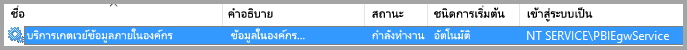

# <a name="configure-kerberos-based-sso-from-power-bi-service-to-on-premises-data-sources"></a>ใช้ Kerberosสำหรับ SSO จากPower BI ไปยังแหล่งข้อมูลภายในองค์กร

การเปิดใช้งาน SSO ทำให้รายงาน Power BI และแดชบอร์ดสามารถรีเฟรชข้อมูลจากแหล่งข้อมูลภายในองค์กรได้อย่างง่ายดาย ในขณะที่ยังเป็นไปตามสิทธิ์ระดับผู้ใช้ที่กำหนดค่าไว้บนแหล่งข้อมูลเหล่านั้น ใช้ [การมอบสิทธิ์แบบจำกัดของ Kerberos](/windows-server/security/kerberos/kerberos-constrained-delegation-overview) เพื่อเปิดใช้งานการเชื่อมต่อการลงชื่อเข้าใช้ครั้งเดียว (SSO) แบบไร้รอยต่อ 

## <a name="prerequisites"></a>ข้อกำหนดเบื้องต้น

คุณจะต้องกำหนดค่าหลายรายการเพื่อให้การมอบสิทธิ์แบบจำกัดของ Kerberos ทำงานได้อย่างถูกต้อง ซึ่งรวมถึง_ชื่อบริการหลัก (SPN)_ และการตั้งค่าการมอบสิทธิ์บนบัญชีบริการ

### <a name="install-and-configure-the-microsoft-on-premises-data-gateway"></a>ติดตั้งและกำหนดค่าเกตเวย์ข้อมูลภายในองค์กร Microsoft

เกตเวย์ข้อมูลภายในองค์กรรองรับการอัปเกรดแบบแทนที่ และ_การแทนที่การตั้งค่า_ของเกตเวย์เดิม

### <a name="run-the-gateway-windows-service-as-a-domain-account"></a>เรียกใช้บริการ Windows ของเกตเวย์ด้วยบัญชีโดเมน

ในการติดตั้งแบบมาตรฐาน เกตเวย์จะทำงานเป็นบัญชีบริการภายในเครื่อง **NT Service\PBIEgwService**



เมื่อต้องการเปิดใช้งานการมอบสิทธิ์แบบจำกัดของ Kerberos เกตเวย์ต้องทำงานเป็นบัญชีโดเมน เว้นแต่ว่าอินสแตนซ์ Azure Active Directory (Azure AD) ของคุณได้ซิงโครไนซ์กับอินสแตนซ์ Active Directory ภายในเครื่องของคุณแล้ว (โดยใช้ Azure AD DirSync/Connect) เมื่อต้องการสลับไปยังบัญชีโดเมน ให้ดู [เปลี่ยนบัญชีบริการเกตเวย์](/data-integration/gateway/service-gateway-service-account)

> [!NOTE]
> ถ้ามีการกำหนดค่า Azure AD Connect และบัญชีผู้ใช้ซิงโครไนซ์ บริการเกตเวย์ไม่จำเป็นต้องดำเนินการภายใน Azure AD ค้นหาในขณะทำงาน แต่คุณสามารถใช้ SID ของบริการภายในเครื่องสำหรับบริการเกตเวย์เพื่อทำการกำหนดค่าที่จำเป็นทั้งหมดใน Azure AD ให้เสร็จสมบูรณ์ ขั้นตอนการกำหนดค่าการมอบสิทธิ์แบบจำกัดของ Kerberos ที่ระบุไว้ในบทความนี้เหมือนกับการกำหนดค่าที่จำเป็นในบริบท Azure AD โดยแค่นำไปใช้กับออบเจ็กต์คอมพิวเตอร์ของเกตเวย์ (ตามที่ได้ระบุโดย SID ของบริการภายในเครื่อง) ใน Azure AD แทนบัญชีโดเมน

## <a name="obtain-domain-admin-rights-to-configure-spns-setspn-and-kerberos-constrained-delegation-settings"></a>รับสิทธิ์ผู้ดูแลระบบโดเมนเพื่อกำหนดค่า SPN (SetSPN) และการตั้งค่าการมอบสิทธิ์แบบจำกัดของ Kerberos

เมื่อต้องการกำหนดค่าการตั้งค่าการมอบสิทธิ์ SPN และ Kerberos ผู้ดูแลระบบโดเมนควรหลีกเลี่ยงการให้สิทธิ์กับบุคคลที่ไม่มีสิทธิ์ผู้ดูแลระบบโดเมน ในส่วนต่อไปนี้ มีรายละเอียดเพิ่มเติมเกี่ยวกับขั้นตอนการกำหนดค่าที่แนะนำ

## <a name="configure-kerberos-constrained-delegation-for-the-gateway-and-data-source"></a>กำหนดค่าการมอบสิทธิ์แบบจำกัดของ Kerberos สำหรับเกตเวย์และแหล่งข้อมูล

ในกรณีที่จำเป็น ให้กำหนดค่า SPN สำหรับบัญชีโดเมนของบริการเกตเวย์ในฐานะผู้ดูแลระบบโดเมนและกำหนดค่าการตั้งค่าการมอบสิทธิ์บนบัญชีโดเมนของบริการเกตเวย์

### <a name="configure-an-spn-for-the-gateway-service-account"></a>กำหนดค่า SPN สำหรับบัญชีของบริการเกตเวย์

ขั้นแรก ตรวจสอบว่ามีการสร้าง SPN สำหรับบัญชีโดเมน ที่จะใช้เป็นบัญชีของบริการเกตเวย์ ไว้แล้วหรือไม่:

1. ในฐานะผู้ดูแลระบบโดเมน ให้เรียกใช้สแน็ปอิน **Active Directory Users and Computers** Microsoft Management Console (MMC)

2. ในบานหน้าต่างด้านซ้าย ให้คลิกขวาที่ชื่อโดเมน เลือก **ค้นหา** จากนั้นป้อนชื่อบัญชีของบัญชีบริการเกตเวย์

3. ในผลลัพธ์การค้นหา คลิกขวาบนบัญชีของบริการเกตเวย์ แล้วเลือก **คุณสมบัติ**

4. ถ้าเห็นแท็บ**การมอบสิทธิ์** ในกล่องโต้ตอบ**คุณสมบัติ** แสดงว่า SPN ได้ถูกสร้างขึ้นเรียบร้อยแล้ว และคุณสามารถข้ามไปยัง [ตัดสินใจเลือกประเภทของการมอบสิทธิ์แบบจำกัดของ Kerberos ที่จะใช้](#decide-on-the-type-of-kerberos-constrained-delegation-to-use)

5. ถ้าไม่มีแท็บ**การมอบสิทธิ์**บนกล่องโต้ตอบ**คุณสมบัติ** คุณสามารถสร้าง SPN บนบัญชีผู้ใช้นั้นด้วยตนเองเพื่อเปิดการใช้งาน ใช้ [เครื่องมือ setspn](https://technet.microsoft.com/library/cc731241.aspx) ที่มาพร้อมกับ Windows (คุณจำเป็นต้องมีสิทธิ์ผู้ดูแลระบบโดเมนเพื่อสร้าง SPN)

   ยกตัวอย่าง สมมติว่าบัญชีผู้ใช้บริการเกตเวย์คือ **Contoso\GatewaySvc** และบริการเกตเวย์กำลังทำงานบนเครื่องชื่อว่า **MyGatewayMachine** เมื่อต้องการตั้งค่า SPN สำหรับบัญชีบริการเกตเวย์ ให้เรียกใช้คำสั่งต่อไปนี้:

   ```setspn -a gateway/MyGatewayMachine Contoso\GatewaySvc```

   คุณสามารถตั้งค่า SPN ได้โดยใช้สแนปอิน **Active Directory Users and Computers** MMC
   
### <a name="add-gateway-service-account-to-windows-authorization-and-access-group-if-required"></a>เพิ่มบัญชีผู้ใช้บริการเกตเวย์ไปยัง Windows Authorization และ Access Group ถ้าจำเป็น

ในบางกรณีบัญชีผู้ใช้บริการเกตเวย์จะต้องถูกเพิ่มเข้าไปใน Windows Authorization และ Access Group ซึ่งกรณีนี้รวมถึงการรักษาความปลอดภัยของ Active Directory environment และเมื่อบัญชีผู้ใช้บริการเกตเวย์และผู้ใช้เกตเวย์นั้นต้องเลียนแบบโดเมนหรือฟอเรสต์ที่แยกกัน คุณยังสามารถเพิ่มบัญชีผู้ใช้บริการเกตเวย์ไปยัง Windows Authorization และ Access Group ในสถานการณ์ที่โดเมนและฟอเรสต์ไม่ได้ทำงานหนักมาก (ไม่บังคับ)

สำหรับข้อมูลเพิ่มเติมให้ดู [การอนุมัติของ Windows และกลุ่มการเข้าถึง](/windows/security/identity-protection/access-control/active-directory-security-groups#bkmk-winauthaccess)

ในการดำเนินการขั้นตอนการกำหนดค่านี้ให้เสร็จสมบูรณ์สำหรับแต่ละโดเมนที่มีผู้ใช้ Active Directory ที่คุณต้องการให้บัญชีบริการเกตเวย์สามารถเลียนแบบได้:
1. ลงชื่อเข้าใช้คอมพิวเตอร์ในโดเมนและเปิดใช้งาน Active Directory และคอมพิวเตอร์ MMC snap-in
2. ค้นหากลุ่ม **การอนุญาตของ Windows และการเข้าถึงกลุ่ม**ซึ่งโดยทั่วไปแล้วจะพบได้ในคอนเทนเนอร์ **บิวท์อิน**
3. ดับเบิลคลิกที่กลุ่มและคลิกที่แท็บ **สมาชิก**
4. คลิก **เพิ่ม**และเปลี่ยนตำแหน่งที่ตั้งโดเมนไปยังโดเมนที่บัญชีผู้ใช้บริการเกตเวย์อาศัยอยู่ใน
5. พิมพ์ชื่อบัญชีผู้ใช้บริการเกตเวย์และคลิก **ตรวจสอบชื่อ** เพื่อตรวจสอบว่าบัญชีบริการเกตเวย์สามารถเข้าถึงได้
6. คลิก **ตกลง**
7. คลิก**ใช้**
8. รีสตาร์ทบริการเกตเวย์

### <a name="decide-on-the-type-of-kerberos-constrained-delegation-to-use"></a>ตัดสินใจเลือกประเภทของการมอบสิทธิ์แบบจำกัดของ Kerberos ที่จะใช้

คุณสามารถกำหนดค่าการตั้งค่าการมอบสิทธิ์สำหรับทั้งการมอบสิทธิ์แบบจำกัดของ Kerberos ตามมาตรฐาน หรือการมอบสิทธิ์แบบจำกัดของ Kerberos ตามทรัพยากร ใช้การมอบสิทธิ์ตามทรัพยากร (ต้องใช้ Windows Server 2012 หรือใหม่กว่า) ถ้าแหล่งข้อมูลของคุณเป็นของโดเมนอื่นนอกเหนือจากเกตเวย์ของคุณ สำหรับข้อมูลเพิ่มเติมเกี่ยวกับความแตกต่างระหว่างสองวิธีในการมอบสิทธิ์ โปรดดู[ภาพรวมของการมอบสิทธิ์แบบจำกัดของ Kerberos](/windows-server/security/kerberos/kerberos-constrained-delegation-overview)

 ให้ดำเนินการในส่วนใดส่วนหนึ่งต่อไปนี้ โดยขึ้นอยู่กับวิธีการที่คุณต้องการใช้ ไม่จำเป็นต้องทำให้เสร็จทั้งสองส่วน:
 - [กำหนดค่าบัญชีผู้ใช้บริการเกตเวย์สำหรับการมอบสิทธิ์แบบจำกัดของ Kerberos ตามมาตรฐาน](#configure-the-gateway-service-account-for-standard-kerberos-constrained-delegation)
- [กำหนดค่าบัญชีผู้ใช้บริการเกตเวย์สำหรับการมอบสิทธิ์แบบจำกัดของ Kerberos ตามทรัพยากร](#configure-the-gateway-service-account-for-resource-based-kerberos-constrained-delegation) 

## <a name="configure-the-gateway-service-account-for-standard-kerberos-constrained-delegation"></a>กำหนดค่าบัญชีผู้ใช้บริการเกตเวย์สำหรับการมอบหมายที่มีข้อจำกัดของ Kerberos มาตรฐาน

> [!NOTE]
> ทำตามขั้นตอนในส่วนนี้ให้เสร็จสมบูรณ์ถ้าคุณต้องการเปิดใช้งาน[การมอบสิทธิ์แบบจำกัดของ Kerberos ตามมาตรฐาน](/windows-server/security/kerberos/kerberos-constrained-delegation-overview) มิฉะนั้น ถ้าคุณต้องการเปิดใช้งานการมอบสิทธิ์แบบจำกัดของ Kerberos ตามทรัพยากร ให้ทำตามขั้นตอนใน [กำหนดค่าบัญชีบริการเกตเวย์สำหรับการมอบสิทธิ์แบบจำกัดของ Kerberos ตามทรัพยากร](#configure-the-gateway-service-account-for-resource-based-kerberos-constrained-delegation)

ตอนนี้เราจะตั้งค่าการมอบสิทธิ์สำหรับบัญชีบริการเกตเวย์ มีเครื่องมือหลายตัวที่คุณสามารถใช้เพื่อดำเนินการขั้นตอนเหล่านี้ ในที่นี้ เราจะใช้สแนปอิน **Active Directory Users and Computers** MMC เพื่อจัดการและเผยแพร่ข้อมูลในไดเรกทอรี ซึ่งพร้อมใช้งานบนตัวควบคุมโดเมนตามค่าเริ่มต้น; บนเครื่องอื่น คุณสามารถเปิดใช้งานผ่านทางการกำหนดค่าคุณลักษณะของ Windows

เราจำเป็นต้องกำหนดค่าการมอบสิทธิ์แบบจำกัดของ Kerberos ด้วยเปลี่ยนโพรโทคอล สำหรับการมอบสิทธิ์แบบจำกัด คุณต้องมีความชัดเจนว่าบริการใดที่คุณต้องการอนุญาตให้เกตเวย์นำเสนอข้อมูลประจำตัวที่ได้รับมอบสิทธิ์ ตัวอย่างเช่น เฉพาะ SQL Server หรือเซิร์ฟเวอร์ SAP HANA ของคุณเท่านั้นที่ยอมรับการเรียกรับสิทธิ์จากบัญชีบริการเกตเวย์

ส่วนนี้ถือว่า คุณได้กำหนดค่า SPN สำหรับแหล่งข้อมูลพื้นฐานของคุณ (เช่น SQL Server, SAP HANA,SAP BW Teradata และ Spark) หากต้องการเรียนรู้วิธีกำหนดค่า SPN ของเซิร์ฟเวอร์แหล่งข้อมูล โปรดอ้างอิงเอกสารทางเทคนิคสำหรับเซิร์ฟเวอร์ฐานข้อมูลที่เกี่ยวข้องและดูส่วน *SPN ใดที่แอปของคุณจำเป็นต้องมี* ในบล็อกโพสต์ [รายการตรวจสอบ Kerberos ของฉัน](https://techcommunity.microsoft.com/t5/SQL-Server-Support/My-Kerberos-Checklist-8230/ba-p/316160)

ในขั้นตอนต่อไปนี้ เราสมมติว่าสภาพแวดล้อมในองค์กรที่มีสองเครื่องในโดเมนที่เหมือนกัน: เครื่องเกตเวย์และเซิร์ฟเวอร์ฐานข้อมูลที่เรียกใช้ SQL Server ที่ได้รับการกำหนดค่าสำหรับ SSO ที่ใช้ Kerberos อยู่แล้ว ขั้นตอนนี้สามารถนำมาใช้ได้กับแหล่งข้อมูลที่ได้รับการสนับสนุนอีกหนึ่งรายการดังนั้นตราบใดที่แหล่งข้อมูลได้รับการกำหนดค่าไว้สำหรับการลงชื่อเข้าใช้แบบครั้งเดียวที่ใช้ Kerberos สำหรับตัวอย่างนี้ เราจะใช้การตั้งค่าต่อไปนี้:

* Active Directory Domain (Netbios): **Contoso**
* ชื่อเครื่องเกตเวย์: **MyGatewayMachine**
* บัญชีบริการเกตเวย์: **Contoso\GatewaySvc**
* ชื่อเครื่องแหล่งข้อมูล SQL Server: **TestSQLServer**
* บัญชีบริการแหล่งข้อมูล SQL Server: **Contoso\SQLService**

นี่คือวิธีการกำหนดค่าการตั้งค่าการมอบสิทธิ์:

1. ให้เปิดสแนปอิน **Active Directory Users and Computers** MMC ด้วยสิทธิ์ผู้ดูแลระบบโดเมน

2. คลิกขวาบนบัญชีบริการเกตเวย์ (**Contoso\GatewaySvc**) แล้วเลือก **คุณสมบัติ**

3. เลือกแถบ **การมอบหมาย**

4. เลือก **เชื่อถือคอมพิวเตอร์เครื่องนี้สำหรับการมอบหมายบริการที่ระบุเท่านั้น** > **ใช้โพรโทคอลการรับรองความถูกต้องใด ๆ**

5. ภายใต้ **บริการที่บัญชีผู้ใช้นี้สามารถใช้ข้อมูลประจำตัวที่ได้รับมอบหมาย:** เลือก **เพิ่ม**

6. ในกล่องโต้ตอบใหม่ เลือก **ผู้ใช้หรือคอมพิวเตอร์**

7. ป้อนบัญชีบริการสำหรับแหล่งข้อมูล จากนั้นเลือก **ตกลง**

   ตัวอย่างเช่น แหล่งข้อมูล SQL Server สามารถมีบัญชีบริการเช่น *Contoso\SQLService* ควรตั้งค่า SPN ที่เหมาะสมสำหรับแหล่งข้อมูลในบัญชีนี้แล้ว 

8. เลือก SPN ที่คุณสร้างขึ้นสำหรับเซิร์ฟเวอร์ฐานข้อมูล 

   ในตัวอย่างของเรา SPN จะเริ่มต้นด้วย *MSSQLSvc* ถ้าคุณเพิ่มทั้ง FQDN และ NetBIOS SPN สำหรับบริการฐานข้อมูลของคุณ ให้เลือกทั้งสองอย่าง คุณอาจเห็นได้เพียงหนึ่งรายการเท่านั้น

9. เลือก**ตกลง** 

   ขณะนี้คุณควรเห็น SPN ในรายการของบริการ ซึ่งบัญชีบริการเกตเวย์สามารถแสดงข้อมูลประจำตัวที่ได้รับมอบหมายได้

    

10. หากต้องการดำเนินกระบวนการตั้งค่าต่อไป ดำเนินการต่อเพื่อ[อนุญาตให้ใช้สิทธิ์ของนโยบายภายในของบัญชีบริการเกตเวย์บนเครื่องเกตเวย์](#grant-the-gateway-service-account-local-policy-rights-on-the-gateway-machine)

## <a name="configure-the-gateway-service-account-for-resource-based-kerberos-constrained-delegation"></a>กำหนดค่าบัญชีผู้ใช้บริการเกตเวย์สำหรับการมอบหมายที่มีข้อจำกัดของ Kerberos ที่ใช้ทรัพยากร

> [!NOTE]
> ทำตามขั้นตอนในส่วนนี้ให้เสร็จสมบูรณ์ถ้าคุณต้องการเปิดใช้งาน[การมอบสิทธิ์แบบจำกัดของ Kerberos ตามทรัพยากร](/windows-server/security/kerberos/kerberos-constrained-delegation-overview#resource-based-constrained-delegation-across-domains) มิฉะนั้น ถ้าคุณต้องการเปิดใช้งานการมอบสิทธิ์แบบจำกัดของ Kerberos ตามมาตรฐาน ให้ทำตามขั้นตอนใน [กำหนดค่าบัญชีบริการเกตเวย์สำหรับการมอบสิทธิ์แบบจำกัดของ Kerberos ตามมาตรฐาน](#configure-the-gateway-service-account-for-standard-kerberos-constrained-delegation)

คุณใช้[การมอบสิทธิ์แบบจำกัดของ Kerberos ตามทรัพยากร](/windows-server/security/kerberos/kerberos-constrained-delegation-overview#resource-based-constrained-delegation-across-domains)เพื่อเปิดใช้งานการเชื่อมต่อการลงชื่อเข้าใช้แบบครั้งเดียวสำหรับ Windows Server 2012 และเวอร์ชันที่ใหม่กว่า การมอบสิทธิ์ประเภทนี้จะอนุญาตให้บริการส่วนหน้าและส่วนหลังอยู่ในโดเมนที่ต่างกัน เพื่อให้สามารถใช้งานได้ โดเมนบริการส่วนหลังจำเป็นต้องเชื่อถือโดเมนบริการส่วนหน้า

ในขั้นตอนต่อไปนี้เราสมมติว่าสภาพแวดล้อมในองค์กรที่มีสองเครื่องในโดเมนที่ต่างกัน: เครื่องเกตเวย์และเซิร์ฟเวอร์ฐานข้อมูลที่เรียกใช้ SQL Server ที่ได้รับการกำหนดค่าสำหรับ SSO ที่ใช้ Kerberos อยู่แล้ว ขั้นตอนเหล่านี้สามารถนำมาใช้ได้กับแหล่งข้อมูลใดแหล่งข้อมูลหนึ่งในแหล่งข้อมูลที่ได้รับการสนับสนุนอื่น ๆ ตราบใดที่มีการกำหนดค่าแหล่งข้อมูลสำหรับการลงชื่อเข้าใช้แบบครั้งเดียวที่ใช้ Kerberos สำหรับตัวอย่างนี้ เราจะใช้การตั้งค่าต่อไปนี้:

* ระบบโดเมนส่วนหน้าของ Active Directory (Netbios): **ContosoFrontEnd**
* ระบบโดเมนส่วนหลังของ Active Directory (Netbios): **ContosoBackEnd**
* ชื่อเครื่องเกตเวย์: **MyGatewayMachine**
* บัญชีบริการเกตเวย์: **ContosoFrontEnd\GatewaySvc**
* ชื่อเครื่องแหล่งข้อมูล SQL Server: **TestSQLServer**
* บัญชีบริการแหล่งข้อมูล SQL Server: **ContosoBackEnd\SQLService**

ทำตามขั้นตอนการกำหนดค่าต่อไปนี้ให้เสร็จสิ้น:

1. ใช้สแนปอิน **Active Directory Users and Computers** MMC บนตัวควบคุมโดเมนสำหรับโดเมน **ContosoFrontEnd** และตรวจสอบว่าไม่มีการตั้งค่าการมอบสิทธิ์สำหรับบัญชีบริการเกตเวย์

    

2. ใช้ **Active Directory Users and Computers** บนตัวควบคุมโดเมนสำหรับโดเมน **ContosoBack-end** และตรวจสอบว่าไม่มีการปรับใช้การตั้งค่าการมอบสิทธิ์สำหรับบัญชีบริการส่วนหลัง

    

3. ในแท็บ **ตัวแก้ไขแอตทริบิวต์** ของคุณสมบัติบัญชี ให้ตรวจสอบว่าไม่มีการตั้งค่าแอตทริบิวต์ **msDS-AllowedToActOnBehalfOfOtherIdentity**

    

4. ใน **Active Directory Users and Computers** ให้สร้างกลุ่มบนตัวควบคุมโดเมนสำหรับโดเมน **ContosoBackEnd** เพิ่มบัญชีบริการเกตเวย์ **GatewaySvc** ไปยังกลุ่ม **ResourceDelGroup** 

    

5. เปิดพร้อมท์คำสั่งและเรียกใช้คำสั่งต่อไปนี้ในตัวควบคุมโดเมนสำหรับโดเมน **ContosoBackEnd** เพื่ออัปเดตแอตทริบิวต์ **msDS-AllowedToActOnBehalfOfOtherIdentity** ของบัญชีบริการส่วนหลัง:

    ```powershell
    $c = Get-ADGroup ResourceDelGroup
    Set-ADUser SQLService -PrincipalsAllowedToDelegateToAccount $c
    ```

6. ใน **Active Directory Users and Computers** ให้ตรวจสอบว่าการอัปเดตจะแสดงอยู่ในแท็บ **ตัวแก้ไขแอตทริบิวต์** ในคุณสมบัติสำหรับบัญชีบริการส่วนหลังหรือไม่ 

## <a name="grant-the-gateway-service-account-local-policy-rights-on-the-gateway-machine"></a>การอนุญาต สิทธิ์ของนโยบายภายในของบัญชีบริการเกตเวย์บนเครื่องเกตเวย์

สุดท้าย บนเครื่องที่ใช้บริการเกตเวย์ (**MyGatewayMachine** ในตัวอย่างของเรา) ให้สิทธิ์ในการ**เลียนแบบไคลเอ็นต์หลังจากการรับรองความถูกต้อง** และ**การทำหน้าที่เป็นส่วนหนึ่งของระบบปฏิบัติการ (SeTcbPrivilege)** ของนโยบายภายในเครื่องแก่บัญชีบริการเกตเวย์ ดำเนินการกำหนดค่านี้ด้วยตัวแก้ไขนโยบายกลุ่มภายใน (**gpedit.msc**)

1. บนเครื่องเกตเวย์ ให้เรียกใช้ **gpedit.msc**

2. ฟหกดไปยัง **นโยบายคอมพิวเตอร์** &gt;  **การกำหนดค่าคอมพิวเตอร์** &gt; **การตั้งค่า Windows** &gt; **การตั้งค่าความปลอดภัย** &gt; **นโยบายภายในเครื่อง** &gt;  **การกำหนดสิทธิ์ของผู้ใช้**

    

3. ภายใต้ **การกำหนดสิทธิ์ของผู้ใช้** จากรายการนโยบาย ให้เลือก **เลียนแบบไคลเอ็นต์หลังจากการรับรองความถูกต้อง**

    
    
4. คลิกขวาที่นโยบาย เปิด**คุณสมบัติ** จากนั้นดูรายการบัญชี 

    รายการจะต้องมีบัญชีบริการเกตเวย์ (**Contoso\GatewaySvc** หรือ **ContosoFrontEnd\GatewaySvc** ทั้งนี้ขึ้นอยู่กับประเภทของการมอบสิทธิ์แบบจำกัด)

5. ภายใต้**การกำหนดสิทธิ์ของผู้ใช้** ให้เลือก**ทำหน้าที่เป็นส่วนหนึ่งของระบบปฏิบัติการ (SeTcbPrivilege)** จากรายการนโยบาย ตรวจสอบให้แน่ใจว่าบัญชีบริการเกตเวย์รวมอยู่ในรายการบัญชีหรือไม่

6. รีสตาร์ต **เกตเวย์ข้อมูลในองค์กร**

### <a name="set-user-mapping-configuration-parameters-on-the-gateway-machine-if-necessary"></a>ตั้งพารามิเตอร์การกำหนดค่าการแมปผู้ใช้บนเครื่องเกตเวย์ (ถ้าจำเป็น)

ถ้าคุณไม่ได้กำหนดค่า Azure AD Connect ไว้ ให้ทำตามขั้นตอนเหล่านี้เพื่อแมปผู้ใช้ของบริการ Power BI ทุกรายเข้ากับผู้ใช้ Azure AD ผู้ใช้ Active Directory แต่ละคนที่ถูกแมปด้วยวิธีนี้จะต้องมีสิทธิ์ SSO สำหรับแหล่งข้อมูลของคุณ สำหรับข้อมูลเพิ่มเติม โปรดดูที่ [วิดีโอ Guy in a Cube](https://www.youtube.com/watch?v=NG05PG9aiRw)

1. เปิดไฟล์การกำหนดค่าเกตเวย์หลัก Microsoft.PowerBI.DataMovement.Pipeline.GatewayCore.dll ตามค่าเริ่มต้น ไฟล์นี้จะถูกเก็บไว้ที่ C:\Program Files\On-premises data gateway

1. ตั้งค่า **ADUserNameLookupProperty** เป็นแอตทริบิวต์ Active Directory ที่ยังไม่ได้ใช้งาน เราจะใช้ `msDS-cloudExtensionAttribute1` ในขั้นตอนต่อไปนี้ แอตทริบิวต์นี้จะพร้อมใช้งานใน Windows Server 2012 และรุ่นที่ใหม่กว่าเท่านั้น 

1. ตั้งค่า **ADUserNameReplacementProperty** เป็น `SAMAccountName` จากนั้นบันทึกไฟล์การกำหนดค่า

1. จากแท็บ **บริการ** ของตัวจัดการงาน ให้คลิกขวาบริการเกตเวย์ แล้วเลือก **รีสตาร์ท**

    

1. สำหรับผู้ใช้บริการของ Power BI แต่ละคนที่คุณต้องการเปิดใช้งาน Kerberos SSO ให้ตั้งค่าคุณสมบัติ `msDS-cloudExtensionAttribute1` ของผู้ใช้ Active Directory ภายในเครื่อง (ด้วยสิทธิ์ SSO กับแหล่งข้อมูลของคุณ) เป็นชื่อผู้ใช้แบบเต็ม (UPN) ของผู้ใช้บริการ Power BI ตัวอย่างเช่น ถ้าคุณเข้าสู่ระบบบริการ Power BI ในฐานะ test@contoso.com และคุณต้องการแมปผู้ใช้รายนี้ไปยังผู้ใช้ Active Directory ภายในเครื่องที่มีสิทธิ์ SSO ให้พูดว่า test@LOCALDOMAIN.COM ตั้งค่าแอตทริบิวต์`msDS-cloudExtensionAttribute1` ของผู้ใช้เป็น test@contoso.com

    คุณสามารถตั้งค่าคุณสมบัติ `msDS-cloudExtensionAttribute1` ด้วยสแนปอิน Active Directory Users and Computers MMC:
    
    1. ในฐานะผู้ดูแลโดเมน ให้เรียกใช้งาน **Active Directory Users and Computers**
    
    1. คลิกขวาบนชื่อโดเมน เลือก **ค้นหา** และพิมพ์ชื่อบัญชีของผู้ใช้ Active Directory ภายในเครื่องที่คุณต้องการแมป
    
    1. เลือกแท็บ **ตัวแก้ไขแอตทริบิวต์**
    
        วางตำแหน่งคุณสมบัติ `msDS-cloudExtensionAttribute1` แล้วดับเบิลคลิก ตั้งค่าให้กับชื่อผู้ใช้แบบเต็ม (UPN) ของผู้ใช้ที่คุณใช้ในการลงชื่อเข้าใช้บริการของ Power BI
    
    1. เลือก**ตกลง**
    
        
    
    1. เลือก**นำไปใช้** ตรวจสอบว่ามีการตั้งค่าที่ถูกต้องในคอลัมน์ **Value** หรือไม่

## <a name="complete-data-source-specific-configuration-steps"></a>ทำตามขั้นตอนการกำหนดค่าเฉพาะแหล่งข้อมูล

SAP HANA และ SAP BW มีข้อกำหนดการกำหนดค่าเฉพาะแหล่งข้อมูลเพิ่มเติมและข้อกำหนดเบื้องต้นที่จำเป็นต้องได้รับการตอบสนองก่อนที่คุณสามารถสร้างการเชื่อมต่อ SSO ผ่านเกตเวย์ไปยังแหล่งข้อมูลเหล่านี้ได้ สำหรับข้อมูลเพิ่มเติม โปรดดูหน้า [การกำหนดค่า SAP HANA](service-gateway-sso-kerberos-sap-hana.md) และ [SAP BW-CommonCryptoLib (sapcrypto.dll)](service-gateway-sso-kerberos-sap-bw-commoncryptolib.md) แม้ว่าเป็นไปได้ที่จะ [กำหนดค่า SAP BW สำหรับใช้กับไลบรารี gx64krb5 SNC](service-gateway-sso-kerberos-sap-bw-gx64krb.md) แต่ไม่แนะนำให้ใช้ไลบรารีนี้เนื่องจากไม่มีการสนับสนุนจาก SAP อีกต่อไป คุณควรใช้ CommonCryptoLib _หรือ_ gx64krb5 เป็นไลบรารีของคุณ ไม่ต้องทำขั้นตอนการกำหนดค่าสำหรับทั้งสองไลบรารีให้เสร็จสมบูรณ์

> [!NOTE]
> แม้ว่าไลบรารี SNC อื่นอาจใช้งานได้กับ BW SSO แต่ก็ไม่ได้รับการสนับสนุนอย่างเป็นทางการจาก Microsoft

## <a name="run-a-power-bi-report"></a>เปิดใช้รายงาน Power BI

หลังจากคุณดำเนินการขั้นตอนการกำหนดค่าทั้งหมดเสร็จสิ้นแล้ว ให้ใช้หน้า **จัดการเกตเวย์** ใน Power BI เพื่อกำหนดค่าแหล่งข้อมูลที่จะใช้สำหรับ SSO ถ้าคุณมีเกตเวย์หลายแห่งให้ตรวจสอบให้แน่ใจว่าคุณเลือกเกตเวย์ที่กำหนดค่าไว้สำหรับ Kerberos SSO จากนั้นภายใต้ **การตั้งค่าขั้นสูง** สำหรับแหล่งข้อมูล คุณควรตรวจสอบให้แน่ใจว่า **ใช้ SSO ผ่านทาง Kerberos สำหรับคิวรี DirectQuery** หรือ **ใช้ SSO ผ่าน Kerberos สำหรับคิวรี DirectQuery และ Import** ได้รับการตรวจสอบสำหรับรายงานที่ยึดตาม DirectQuery และ **ใช้ SSO ผ่าน Kerberos สำหรับคิวรี DirectQuery และ Import** ได้รับการตรวจสอบสำหรับการรีเฟรชตามรายงาน


ถ้าคุณเผยแพร่รายงานที่ยึดตาม DirectQuery จาก Power BI Desktop และแมปรายงานดังกล่าวไปยังแหล่งข้อมูลที่มี **ใช้ SSO ผ่าน Kerberos สำหรับคิวรี DirectQuery** หรือ **ใช้ SSO ผ่าน Kerberos สำหรับคิวรี DirectQuery และ Import** ที่ตรวจสอบแล้ว รายงานนี้จะใช้ข้อมูลที่สามารถเข้าถึงผู้ใช้ที่มีการแมปกับผู้ใช้ (Azure) Active Directory ที่ลงทะเบียนไว้ในบริการ Power BI

ในทำนองเดียวกันถ้าคุณเผยแพร่รายงานที่ยึดตามการรีเฟรชจาก Power BI desktop และแมปรายงานดังกล่าวไปยังแหล่งข้อมูลที่มี **ใช้ SSO ผ่าน Kerberos สำหรับคิวรี DirectQuery และ Import** ที่ตรวจสอบแล้ว คุณไม่จำเป็นต้องระบุข้อมูลประจำตัวใดๆ การรีเฟรชจะดำเนินการภายใต้บริบทไดเรกทอรีที่ใช้งานของเจ้าของชุดข้อมูล

อย่างไรก็ตาม หากคุณแมปรายงานกับแหล่งข้อมูลที่ไม่ได้มีการตรวจสอบ **ใช้ SSO ผ่าน Kerberos สำหรับคิวรี DirectQuery และ Import** การรีเฟรชจะใช้ข้อมูลประจำตัวที่คุณป้อนในเขตข้อมูล **ชื่อผู้ใช้** และ **รหัสผ่าน** เมื่อคุณสร้างแหล่งข้อมูล อีกอย่างหนึ่ง Kerberos SSO *ไม่ได้*ถูกนำมาใช้งาน 

 เมื่อคุณเผยแพร่ ให้เลือกเกตเวย์ที่กำหนดค่าไว้สำหรับ SSO ถ้าคุณมีหลายเกตเวย์ 

กำหนดค่านี้ทำงานในกรณีส่วนใหญ่ อย่างไรก็ตาม การใช้งานกับ Kerberos อาจต้องมีการตั้งค่าที่แตกต่างกันออกไป ขึ้นอยู่กับสภาพแวดล้อมของคุณ ถ้าไม่สามารถโหลดรายงานได้ ให้ติดต่อผู้ดูแลระบบโดเมนของคุณเพื่อตรวจสอบเพิ่มเติม ถ้าแหล่งข้อมูลของคุณคือ SAP BW ให้ดูส่วนการแก้ไขปัญหาของหน้าการกำหนดค่าเฉพาะแหล่งข้อมูลสำหรับ [CommonCryptoLib](service-gateway-sso-kerberos-sap-bw-commoncryptolib.md#troubleshooting) และ [gx64krb5/gsskrb5 ](service-gateway-sso-kerberos-sap-bw-gx64krb.md#troubleshooting) ทั้งนี้ขึ้นอยู่กับไลบรารี SNC ที่คุณเลือกไว้แล้ว

## <a name="next-steps"></a>ขั้นตอนถัดไป

สำหรับข้อมูลเพิ่มเติมเกี่ยวกับเกตเวย์ข้อมูลภายในองค์กรและ DirectQuery ให้ดูแหล่งข้อมูลต่อไปนี้:

* [เกตเวย์ข้อมูลภายในองค์กรคืออะไร](/data-integration/gateway/service-gateway-onprem)
* [DirectQuery ใน Power BI](desktop-directquery-about.md)
* [แหล่งข้อมูลที่สนับสนุนโดย DirectQuery](power-bi-data-sources.md)
* [DirectQuery และ SAP BW](desktop-directquery-sap-bw.md)
* [DirectQuery และ SAP HANA](desktop-directquery-sap-hana.md)
