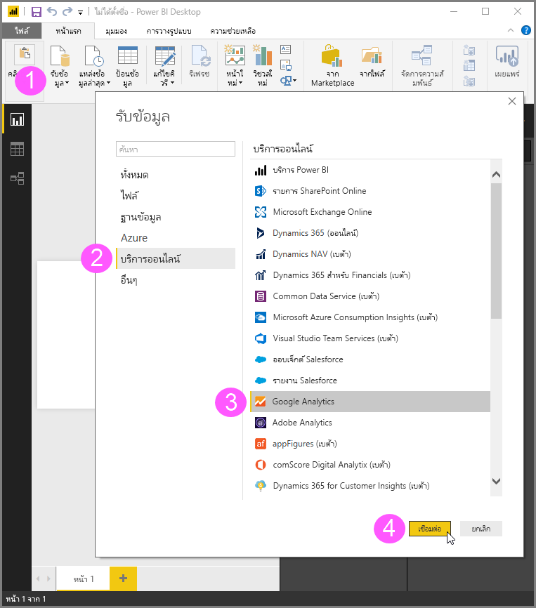
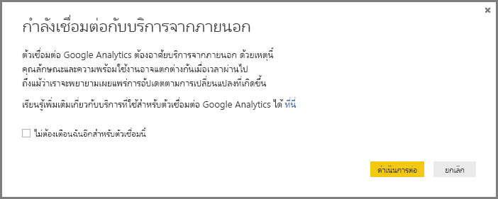
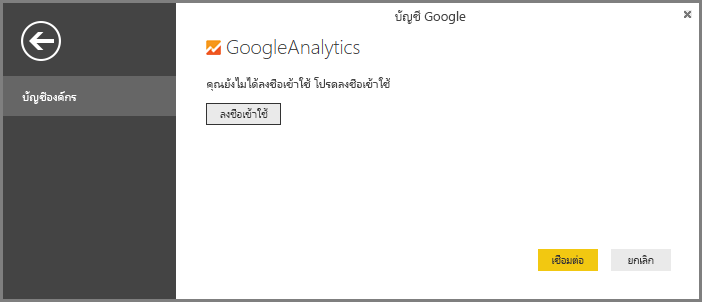
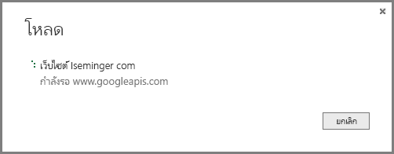

# ใช้ตัวเชื่อมต่อ Google Analytics สำหรับ Power BI Desktop
> [!NOTE]
> ชุดเนื้อหา Google Analytics และตัวเชื่อมต่อใน Power BI Desktop พึ่งพา Google Analytics Core Reporting API ด้วยเหตุนี้ คุณลักษณะและความพร้อมใช้งาน อาจแตกต่างกันไปตามเวลา

คุณสามารถเชื่อมต่อกับข้อมูล Google Analytics โดยใช้ตัวเชื่อมต่อ **Google Analytics** ได้ เพื่อเชื่อมต่อ ทำตามขั้นตอนต่อไปนี้:

1. ใน **Power BI Desktop** เลือก**รับข้อมูล**จากการแท็บ ribbon **หน้าแรก**
2. ในหน้าต่าง**รับข้อมูล** เลือก**บริการออนไลน์**จากประเภทในบานหน้าต่างด้านซ้าย
3. เลือก **Google Analytics** จากตัวเลือกในบานหน้าต่างด้านขวา
4. ที่ด้านล่างของหน้าต่าง เลือก**เชื่อมต่อ**  
   

คุณได้รับพร้อมท์กล่องโต้ตอบที่อธิบายว่า ตัวเชื่อมต่อเป็นบริการจากบุคคลที่สาม และเตือนเกี่ยวกับคุณลักษณะและความพร้อมใช้งาน ที่อาจเปลี่ยนไปตามช่วงเวลา และคำอธิบายอื่น ๆ  

เมื่อคุณเลือก**ดำเนินการต่อ** คุณจะได้รับพร้อมท์ให้ลงชื่อเข้าใช้ Google Analytics  

เมื่อคุณใส่ข้อมูลประจำตัวของคุณ คุณได้รับพร้อมท์ว่า Power BI ต้องสามารถเข้าถึงแบบออฟไลน์ นี่คือวิธีที่คุณใช้ **Power BI Desktop** เพื่อเข้าถึงข้อมูล Google Analytics ของคุณ  

เมื่อคุณยอมรับ **Power BI Desktop** แสดงให้เห็นว่าคุณลงชื่อเข้าใช้แล้ว  

เลือก**เชื่อมต่อ** และข้อมูล Google Analytics ของคุณ จะถูกเชื่อมต่อกับ **Power BI Desktop** และโหลดข้อมูล  

## การเปลี่ยนแปลงของ API
แม้ว่าเราพยายามเผยแพร่อัปเดตที่สอดคล้องกับการเปลี่ยนแปลงใด ๆ API อาจเปลี่ยนแปลงในลักษณะที่ส่งผลกระทบต่อผลลัพธ์ของคิวรีที่เราสร้างขึ้น ในบางกรณี บางแบบสอบถามอาจไม่สนับสนุนอีกต่อไป เนื่องจากการต้องพึ่งพาจากบุคคลที่สามนี้ เราไม่สามารถรับประกันผลลัพธ์ของคิวรีคุณเมื่อใช้ตัวเชื่อมต่อนี้

รายละเอียดเพิ่มเติมเกี่ยวกับ การเปลี่ยนแปลง Google Analytics API สามารถอ่านใน[บันทึกการเปลี่ยนแปลง](https://developers.google.com/analytics/devguides/changelog)ของพวกเขาได้

