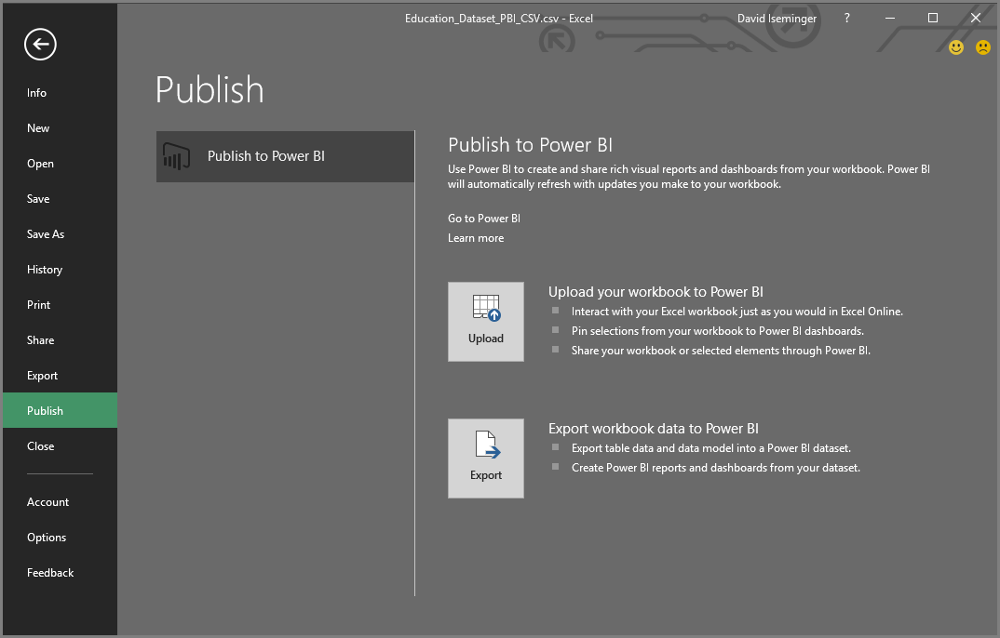
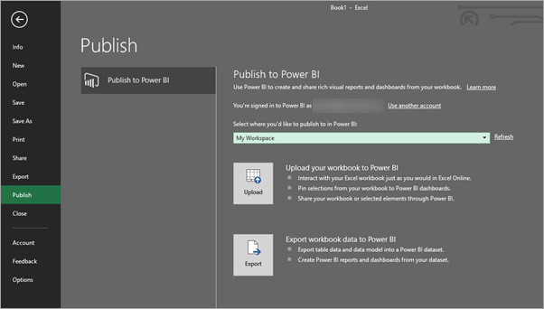
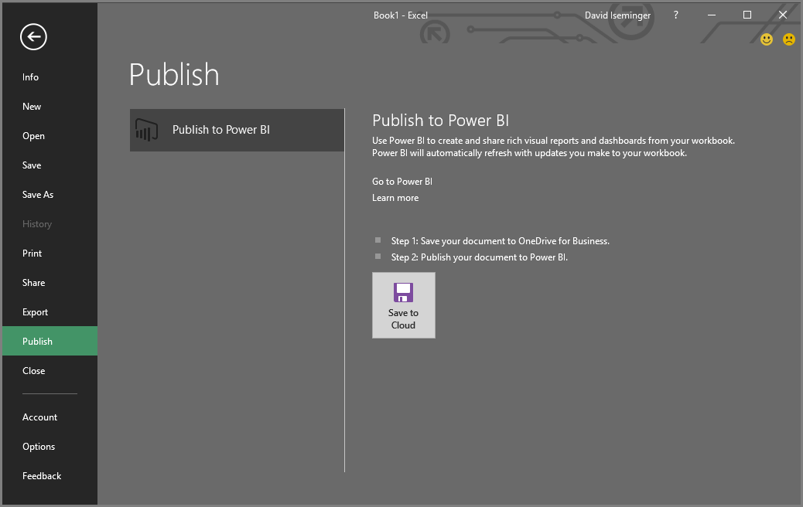

# เผยแพร่ไปยัง Power BI จาก Microsoft Excel
ด้วย Microsoft Excel 2016 และรุ่นใหม่กว่า คุณสามารถเผยแพร่สมุดงาน Excel ของคุณไปยังพื้นที่ทำงาน [Power BI](https://powerbi.microsoft.com) ได้โดยตรง ซึ่งเป็นที่ที่คุณสามารถสร้างรายงานและแดชบอร์ดแบบโต้ตอบสูงตามข้อมูลของสมุดงานของคุณได้ จากนั้นคุณสามารถแชร์ข้อมูลเชิงลึกของคุณกับผู้อื่นในองค์กรของคุณได้

เมื่อเผยแพร่เวิร์กบุ๊กไปยัง Power BI มีบางสิ่งที่ควรพิจารณา:

* บัญชีที่คุณใช้เพื่อลงชื่อเข้าใช้ Office, OneDrive for Business และ Power BI ต้องเป็นบัญชีเดียวกัน
* คุณไม่สามารถเผยแพร่สมุดงานเปล่าหรือสมุดงานที่มีเนื้อหาที่ไม่สนับสนุนใน Power BI ได้
* คุณไม่สามารถเผยแพร่สมุดงานที่มีการเข้ารหัสลับ หรือป้องกันด้วยรหัสผ่าน หรือสมุดงานที่มีการจัดการการปกป้องข้อมูล ( Information Protection Management) ได้
* การเผยแพร่ไปยัง Power BI จำเป็นต้องเปิดใช้งานการรับรองความถูกต้องสมัยใหม่ (ค่าเริ่มต้น) หากปิดใช้งานอยู่ ตัวเลือกเผยแพร่จะไม่พร้อมใช้งานจากเมนูไฟล์

## เผยแพร่เวิร์กบุ๊ก Excel ของคุณ
หากต้องการเผยแพร่เวิร์กบุ๊ก Excel ของคุณใน Excel เลือก**ไฟล์**  > **เผยแพร่** และเลือก **อัปโหลด** หรือ **ส่งออก**

ถ้าคุณ **อัปโหลด** สมุดงานของคุณไปยัง Power BI คุณสามารถโต้ตอบกับเวิร์กบุ๊กได้เช่นเดียวกับที่คุณจะโต้ตอบโดยใช้ Excel Online คุณยังสามารถปักหมุดการเลือกจากเวิร์กบุ๊กของคุณลงในแดชบอร์ด Power BI และแชร์เวิร์กบุ๊กของคุณหรือองค์ประกอบที่เลือกได้ผ่านทาง Power BI

หากคุณเลือก **ส่งออก** คุณสามารถส่งออกข้อมูลตารางและรูปแบบข้อมูลไปยังชุดข้อมูล Power BI ซึ่งคุณสามารถใช้เพื่อสร้างรายงาน Power Dash และแดชบอร์ดได้

### เผยแพร่ไฟล์ภายในเครื่อง
Excel สนับสนุนการเผยแพร่ไฟล์ Excel ภายในเครื่อง ไฟล์เหล่านี้ไม่จำเป็นต้องถูกบันทึกไปยัง OneDrive for Business หรือ SharePoint Online

> [!IMPORTANT]
> คุณสามารถเผยแพร่ไฟล์ได้เฉพาะในกรณีที่คุณใช้ Excel 2016 (หรือใหม่กว่า) ด้วยการสมัครใช้งาน Office 365 การติดตั้งแบบสแตนด์อโลน Excel ๒๐๑๖สามารถเผยแพร่ไปยัง Power BI ได้แต่เฉพาะเมื่อสมุดงานถูกบันทึกไปยัง OneDrive for Business หรือ SharePoint Online
> 

เมื่อคุณเลือก**เผยแพร่** คุณจะสามารถเลือกพื้นที่ทำงานที่คุณต้องการเผยแพร่ไปยังได้ หากไฟล์ Excel ของคุณจัดเก็บอยู่ใน OneDrive for Business คุณสามารถเผยแพร่ไปยัง *พื้นที่ทำงานของฉัน* ได้เท่านั้น หากไฟล์ Excel ของคุณจัดเก็บอยู่บนไดรฟ์ภายในเครื่อง คุณสามารถเผยแพร่ไปยัง *พื้นที่ทำงานของฉัน* หรือพื้นที่ทำงานที่ใช้ร่วมกันซึ่งคุณสามารถเข้าถึงได้

คุณจะได้รับสองตัวเลือกเกี่ยวกับวิธีการทำให้สมุดงานของคุณอยู่ใน Power BI

เมื่อเผยแพร่แล้วเนื้อหาเวิร์กบุ๊กที่คุณเผยแพร่จะถูกนำเข้าไปยัง Power BI โดยแยกจากไฟล์ภายในเครื่อง If you want to update the file in Power BI, you must publish the updated version again, or you can refresh the data by configuring a scheduled refresh, on the workbook, or on the dataset in Power BI.

### การเผยแพร่จากการติดตั้ง Excel แบบสแตนด์อโลน
เมื่อมีการเผยแพร่จากการติดตั้ง Excel แบบสแตนด์อโลนเวิร์กบุ๊กจะต้องได้รับการบันทึกไปยัง OneDrive for Business เลือก **บันทึกไปยัง Cloud** และเลือกตำแหน่งที่ตั้งใน OneDrive for Business

เมื่อสมุดงานของคุณบันทึกไปยัง OneDrive แล้ว เมื่อคุณเลือก**เผยแพร่** คุณจะได้รับสองตัวเลือกเกี่ยวกับวิธีการทำให้สมุดงานของคุณอยู่ใน Power BI

#### อัปโหลดสมุดงานของคุณไปยัง Power BI
เมื่อคุณเลือกตัวเลือก **อัปโหลด** เวิร์กบุ๊กของคุณจะปรากฏใน Power BI เช่นเดียวกับใน Excel Online แต่ไม่เหมือนกับ Excel Online เนื่องจากคุณจะมีคุณลักษณะบางอย่างที่ใช้งานได้ดีเพื่อช่วยให้คุณปักหมุดองค์ประกอบจากแผ่นงานของคุณไปยังแดชบอร์ดได้

คุณไม่สามารถแก้ไขสมุดงานของคุณใน Power BI ได้ ถ้าคุณจำเป็นต้องทำการเปลี่ยนแปลงบางอย่างในข้อมูลคุณสามารถเลือก **แก้ไข** จากนั้นเลือกเพื่อแก้ไขเวิร์กบุ๊กของคุณใน Excel Online หรือเปิดใน Excel บนคอมพิวเตอร์ของคุณ การเปลี่ยนแปลงใด ๆ ที่คุณดำเนินการจะถูกบันทึกไปยังสมุดงานบน OneDrive

เมื่อคุณ **อัปโหลด**ไม่มีชุดข้อมูลถูกสร้างขึ้นใน Power BI สมุดงานของคุณจะปรากฏในรายงาน ในบานหน้าต่างนำทางของพื้นที่ทำงานของคุณ สมุดงานที่อัปโหลดไปยัง Power BI มี Excel ไอคอนพิเศษ ระบุสมุดงานเหล่านั้นเป็นสมุดงาน Excel ที่มีการอัปโหลด

เลือกตัวเลือก **อัปโหลด** ถ้าคุณมีข้อมูลในแผ่นงานเท่านั้นหรือคุณมี PivotTables และแผนภูมิที่คุณต้องการดูใน Power BI

การใช้การอัปโหลดจากการเผยแพร่ไปยัง Power BI ใน Excel เป็นประสบการณ์ที่คล้ายกันเพื่อ **รับไฟล์ > ข้อมูล > OneDrive for Business > เชื่อมต่อจัดการและดู Excel ใน Power BI** จาก Power BI ในเบราว์เซอร์ของคุณ

#### ส่งออกข้อมูลในสมุดงานไปยัง Power BI
เมื่อคุณเลือกตัวเลือก **ส่งออก** ข้อมูลใดๆ ที่รองรับในตาราง และ/หรือ รูปแบบข้อมูลจะถูกส่งออกไปยังชุดข้อมูลใหม่ใน Power BI ถ้าคุณมีแผ่นงาน Power View ใด ๆ แผ่นงานเหล่านั้นจะถูกสร้างอีกครั้งใน Power BI เป็นรายงาน

คุณสามารถทำการแก้ไขสมุดงานของคุณต่อได้ เมื่อบันทึกการเปลี่ยนแปลงของคุณ การเปลี่ยนแปลงเหล่านั้นจะถูกรวมเข้ากับชุดข้อมูลใน Power BI โดยปกติแล้วจะรวมภายในประมาณหนึ่งชั่วโมง หากคุณต้องการการอัปเดตในทันทีคุณสามารถเลือก **เผยแพร่** อีกครั้งจาก Excel และการเปลี่ยนแปลงของคุณจะถูกส่งออกทันที การจัดรูปแบบการแสดงข้อมูลในรายงานและแดชบอร์ดจะได้รับการอัปเดตอยู่เสมอ

เลือกตัวเลือก **เผยแพร่** หากคุณใช้คุณลักษณะรับและ แปลงข้อมูลหรือคุณลักษณะของ Power Pivot เพื่อโหลดข้อมูลลงในรูปแบบข้อมูล หรือหากสมุดงานของคุณมีแผ่นงาน Power View ที่มีการแสดงภาพที่คุณต้องการเห็นใน Power BI 

การใช้ การ**ส่งออก**จะคล้ายกันมากกับการใช้ **รับไฟล์ > ข้อมูล > OneDrive for Business > ส่งออกข้อมูล Excel ลงใน Power BI** จาก Power BI ในเบราว์เซอร์ของคุณ

## กำลังเผยแพร่
เมื่อคุณเลือกตัวเลือกใดตัวเลือกหนึ่ง Excel จะลงชื่อเข้าใช้ Power BI ด้วยบัญชีปัจจุบันของคุณ จากนั้นจะเผยแพร่สมุดงานไปยังไซต์ Power BI ของคุณ คุณสามารถตรวจสอบแถบสถานะใน Excel เพื่อดูว่ากระบวนการเผยแพร่มีความคืบหน้าอย่างไร

เมื่อเสร็จสิ้น คุณสามารถไปที่ Power BI ได้จาก Excel

## ขั้นตอนถัดไป
[ข้อมูล Excel ใน Power BI](service-excel-workbook-files.md)  
มีคำถามเพิ่มเติมหรือไม่ [ลองไปที่ชุมชน Power BI](https://community.powerbi.com/)

