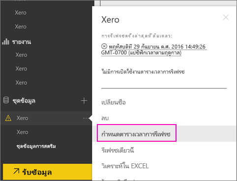

# วิธีรีเฟรชข้อมูลประจำตัวของชุดเนื้อหา Xero ถ้าการรีเฟรชล้มเหลว
ถ้าคุณใช้ชุดเนื้อหา Xero Power BI คุณอาจพบปัญหาบางอย่าง กับการรีเฟรชชุดเนื้อหาประจำวัน เนื่องจากปัญหาบริการของ Power BI เมื่อไม่นานมานี้

คุณสามารถดูว่าชุดเนื้อหาของคุณรีเฟรชสำเร็จหรือไม่ โดยการตรวจสอบสถานะการรีเฟรชล่าสุด สำหรับชุดข้อมูล Xero ของคุณ ดังแสดงในภาพหน้าจอด้านล่าง

ถ้าคุณเห็นการรีเฟรชที่ล้มเหลวตามที่แสดงด้านบน โปรดทำตามขั้นตอนเหล่านี้ เพื่อต่ออายุข้อมูลประจำตัวชุดเนื้อหาของคุณ

1. คลิกที่**ตัวเลือกเพิ่มเติม** (...) ซึ่งอยู่ถัดจากชุดข้อมูล Xero ของคุณ แล้วคลิก**กำหนดตารางเวลาการรีเฟรช** ซึ่งจะเปิดหน้าการตั้งค่า สำหรับชุดเนื้อหา Xero
   
    
2. ในหน้า**ตั้งค่าสำหรับ Xero** เลือก**ข้อมูลประจำตัวแหล่งข้อมูล** > **แก้ไขข้อมูลประจำตัว**
   
    
3. ใส่ชื่อองค์กรของคุณ > **ถัดไป**
   
    
4. ลงชื่อเข้าใช้ ด้วยบัญชี Xero ของคุณ
   
    
5. ตอนนี้ข้อมูลประจำตัวของคุณได้รับการปรับปรุงแล้ว ลองตรวจสอบว่า กำหนดเวลารีเฟรช ถูกตั้งค่าให้ทำงานทุกวัน ตรวจสอบโดยคลิกที่**ตัวเลือกเพิ่มเติม** (...) ซึ่งอยู่ถัดจากชุดข้อมูล Xero ของคุณ จาก นั้นคลิก**กำหนดตารางเวลาการรีเฟรช**อีกครั้ง
   
    
6. คุณยังสามารถเลือกรีเฟรชชุดข้อมูลทันที คลิกที่**ตัวเลือกเพิ่มเติม** (...) ซึ่งอยู่ถัดจากชุดข้อมูล Xero ของคุณ แล้วคลิก **รีเฟรชทันที**
   
    

ถ้าคุณยังคงมีปัญหาการรีเฟรช โปรดอย่าลังเลที่จะติดต่อเราที่ [https://support.powerbi.com](https://support.powerbi.com) 

เมื่อต้องการเรียนรู้เพิ่มเติมเกี่ยวกับชุดเนื้อหา Xero สำหรับ Power BI โปรดไป[หน้าความช่วยเหลือของชุดเนื้อหา Xero](service-connect-to-xero.md)

### ขั้นตอนถัดไป
* มีคำถามเพิ่มเติมหรือไม่ [ลองไปที่ชุมชน Power BI](https://community.powerbi.com/)

