# บทช่วยสอน: สร้างแบบจำลอง Machine Learning ใน Power BI

ในบทความการบทช่วยสอนนี้คุณใช้ **Machine Learning อัตโนมัติ**เพื่อสร้างและใช้แบบจำลองการคาดการณ์ไบนารีใน Power BI บทช่วยสอนประกอบด้วยคำแนะนำสำหรับการสร้าง Power BI dataflow และการใช้เอนทิตีที่กำหนดไว้ใน dataflow เพื่อฝึกและตรวจสอบแบบจำลองการเรียนรู้ของเครื่องได้โดยตรงใน Power BI จากนั้นเราใช้แบบจำลองดังกล่าวสำหรับการให้คะแนนข้อมูลใหม่เพื่อสร้างการคาดการณ์

ก่อนอื่นคุณจะสร้างเครื่องแบบจำลองการเรียนรู้ไบนารีเพื่อคาดการณ์การซื้อของนักช็อปออนไลน์ที่ยึดตามชุดของแอตทริบิวต์เซสชันออนไลน์ของพวกเขา ชุดข้อมูลการเรียนรู้ของเครื่อง benchmark ที่ใช้สำหรับการดำเนินการนี้ เมื่อแบบจำลองได้รับการฝึกใช้งานแล้ว Power BI จะสร้างรายงานการตรวจสอบความถูกต้องโดยอัตโนมัติเพื่ออธิบายผลลัพธ์แบบจำลอง จากนั้นคุณสามารถตรวจสอบรายงานการตรวจสอบความถูกต้องและนำรูปแบบไปใช้กับข้อมูลของคุณสำหรับการให้คะแนนได้

บทช่วยสอนนี้ประกอบด้วยขั้นตอนต่อไปนี้:
> [!div class="checklist"]

> * สร้างกระแสข้อมูลด้วยข้อมูลป้อนเข้า
> * สร้างและฝึกอบรมโมเดลการเรียนรู้ของเครื่อง
> * ตรวจทานรายงานการตรวจสอบความถูกต้องของแบบจำลอง
> * นำแบบจำลองไปใช้กับเอนทิตีกระแสข้อมูล
> * การใช้ผลลัพธ์ที่ได้จากแบบจำลองในรายงาน Power BI

## สร้างกระแสข้อมูลด้วยข้อมูลป้อนเข้า

ส่วนแรกของบทช่วยสอนนี้สร้างกระแสข้อมูลด้วยข้อมูลนำเข้า กระบวนการดังกล่าวใช้เวลาสองถึงสามขั้นตอนดังที่แสดงในส่วนต่อไปนี้โดยเริ่มต้นด้วยการรับข้อมูล

### รับข้อมูล

ขั้นตอนแรกในการสร้างกระแสข้อมูล คือการให้แหล่งข้อมูลของคุณให้พร้อมใช้งาน ในกรณีของเราเราใช้ชุดข้อมูลการเรียนรู้ของเครื่องจากชุดของเซสชันออนไลน์ซึ่งบางส่วนถึงขั้นตอนสุดท้ายของการซื้อ ชุดข้อมูลประกอบด้วยชุดของแอตทริบิวต์เกี่ยวกับเซสชันเหล่านี้ซึ่งเราจะใช้สำหรับการฝึกแบบจำลองของเรา

คุณสามารถดาวน์โหลดชุดข้อมูลจากเว็บไซต์ UC เออร์ไวน์ได้ นอกจากนี้เรายังมีการใช้งาน UC เออร์ไวน์เพื่อเป็นวัตถุประสงค์ของบทช่วยสอนนี้จากการเชื่อมโยงต่อไปนี้:[ online_shoppers_intention.csv](https://raw.githubusercontent.com/santoshc1/PowerBI-AI-samples/master/Tutorial_AutomatedML/online_shoppers_intention.csv)

### สร้างเอนทิตี

หากต้องสร้างเอนทิตีในกระแสข้อมูลของคุณ ให้ลงชื่อเข้าใช้บริการของ Power BI และนำทางไปยังพื้นที่ทำงานบนความจุเฉพาะของคุณที่มี AI เปิดการใช้งานอยู่

หากคุณยังไม่มีพื้นที่ทำงาน คุณสามารถสร้างได้โดยเลือก **พื้นที่ทำงาน** ในหน้าต่างนำทางในบริการ Power BI แล้วเลือก **สร้างพื้นที่ทำงาน** ในบานหน้าต่างด้านล่างที่ปรากฏ ซึ่งจะเปิดแผงทางด้านขวาเพื่อป้อนรายละเอียดพื้นที่ทำงาน ป้อนชื่อพื้นที่ทำงาน และเลือก **ขั้นสูง** ยืนยันว่าพื้นที่ทำงานใช้ความจุเฉพาะโดยใช้ปุ่มเรดิโอและกำหนดให้กับอินสแตนซ์ความจุเฉพาะที่มีการเปิดใช้งานการแสดงตัวอย่าง AI จากนั้นเลือก**บันทึก**

เมื่อสร้างพื้นที่ทำงานแล้ว คุณสามารถเลือก **ข้าม** ที่ด้านขวาล่างของหน้าจอต้อนรับตามที่แสดงในภาพต่อไปนี้

 เลือกปุ่ม **สร้าง** ที่ด้านขวาบนของพื้นที่ทำงาน และเลือก**กระแสข้อมูล**

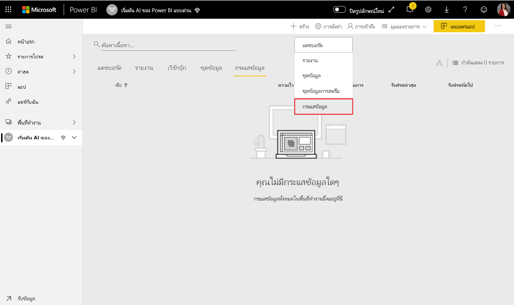

เลือก **เอนทิตีใหม่** การดำเนินการนี้จะเป็นการเปิดใช้งานตัวแก้ไข**Power Query** ในเบราว์เซอร์

เลือกไฟล์**ข้อความ/CSV** เป็นแหล่งข้อมูลที่แสดงในรูปต่อไปนี้

ในหน้า**เชื่อมต่อกับแหล่งข้อมูล**ที่ปรากฏถัดไป วางลิงก์ต่อไปนี้ไปยัง _online_shoppers_intention.csv_ ลงในกล่องของ**ไฟล์พาธหรือ URL** แล้วเลือก **ถัดไป**

`https://raw.githubusercontent.com/santoshc1/PowerBI-AI-samples/master/Tutorial_AutomatedML/online_shoppers_intention.csv`

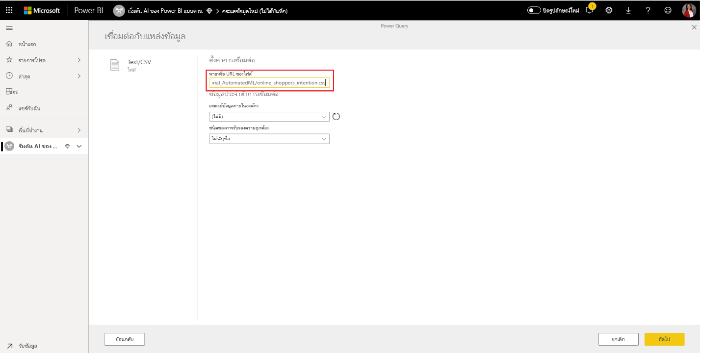

ตัวแก้ไข Power Query จะแสดงตัวอย่างของข้อมูลจากไฟล์ CSV คุณสามารถเปลี่ยนชื่อคิวรีให้เป็นชื่อเรียกง่ายขึ้นได้โดยการเปลี่ยนแปลงค่าในกล่องชื่อที่พบในบานหน้าต่างด้านขวา ตัวอย่างเช่น คุณสามารถเปลี่ยนชื่อคิวรีเป็น_ผู้เยี่ยมชมออนไลน์_

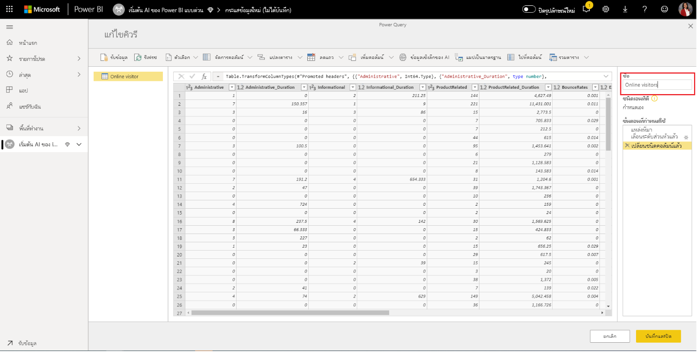

Power Query อ้างถึงชนิดของคอลัมน์โดยอัตโนมัติ คุณสามารถเปลี่ยนชนิดคอลัมน์ได้โดยการคลิกที่ไอคอนชนิดแอตทริบิวต์ที่ด้านบนของส่วนหัวของคอลัมน์ ในตัวอย่างนี้ เราจะเปลี่ยนชนิดของคอลัมน์รายได้เป็น True/False

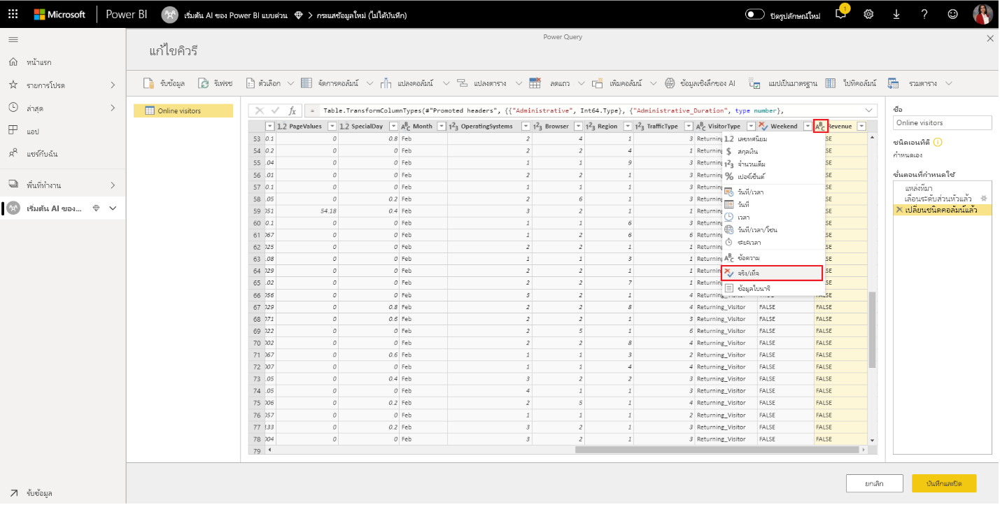

เลือกปุ่ม **บันทึกและปิด** เพื่อปิดตัวแก้ไข Power Query ตั้งชื่อกระแสข้อมูล จากนั้นเลือก**บันทึก**ในกล่องตอบโต้ดังที่แสดงในรูปต่อไปนี้

## สร้างและฝึกอบรมโมเดลการเรียนรู้ของเครื่อง

หากต้องการเพิ่มแบบจำลองการเรียนรู้ของเครื่องให้เลือกปุ่ม**ใช้แบบจำลอง ML** ในรายการการ**ดำเนินการ**สำหรับเอนทิตีพื้นฐานที่ประกอบด้วยข้อมูลการฝึกอบรมและข้อมูลป้ายชื่อของคุณจากนั้นเลือก**เพิ่ม แบบจำลองการเรียนรู้ของเครื่อง**

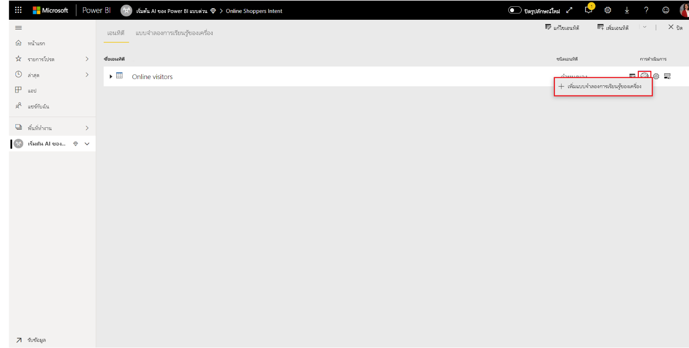

ขั้นตอนแรกในการสร้างแบบจำลองการเรียนรู้ของเครื่องของเราคือการระบุข้อมูลในอดีตซึ่งรวมถึงเขตข้อมูลผลลัพธ์ที่คุณต้องการคาดการณ์ แบบจำลองจะถูกสร้างขึ้นโดยการเรียนรู้จากข้อมูลนี้

ในกรณีของชุดข้อมูลที่เรากำลังใช้นี่คือเขตข้อมูล**รายได้** เลือก**รายได้**เป็นค่า ' เขตข้อมูลผลลัพธ์' จากนั้นเลือก**ถัดไป**

จากนั้น เราจะต้องเลือกชนิดของแบบจำลองการเรียนรู้ของเครื่องที่จะสร้าง Power BI วิเคราะห์ค่าในเขตข้อมูลผลลัพธ์ที่คุณระบุและแนะนำชนิดของแบบจำลองการเรียนรู้ของเครื่องที่สามารถสร้างขึ้นเพื่อคาดการณ์เขตข้อมูลนั้นได้

ในกรณีนี้เนื่องจากเรากำลังคาดคะเนผลลัพธ์ไบนารีว่าผู้ใช้จะทำการซื้อหรือไม่ ขอแนะนำให้ใช้การคาดการณ์ไบนารี เนื่องจากเรามีความสนใจในการคาดการณ์ผู้ใช้ที่จะทำการซื้อ ให้เลือก True เป็นผลลัพธ์ด้านรายได้ที่คุณสนใจมากที่สุด นอกจากนี้ คุณสามารถกำหนดป้ายชื่อที่เรียกง่ายสำหรับผลลัพธ์ที่จะใช้ในรายงานที่สร้างขึ้นโดยอัตโนมัติ ซึ่งจะสรุปผลลัพธ์ของการตรวจสอบแบบจำลอง จากนั้นเลือกถัดไป

ถัดไป Power BI จะทำการสแกนตัวอย่างข้อมูลเบื้องต้น และแนะนำการป้อนค่าที่อาจสร้างการคาดการณ์ที่ถูกต้องมากขึ้น ถ้า Power BI ไม่แนะนำเขตข้อมูล จะมีการกำหนดคำอธิบายไว้ข้าง ๆ คุณมีตัวเลือกในการเปลี่ยนการเลือกเพื่อรวมเฉพาะเขตข้อมูลที่คุณต้องการให้แบบจำลองศึกษา หรือคุณสามารถเลือกเขตข้อมูลทั้งหมดโดยเลือกกล่องกาเครื่องหมายถัดจากชื่อเอนทิตี เลือก**ถัดไป**เพื่อยอมรับข้อมูลป้อนเข้า

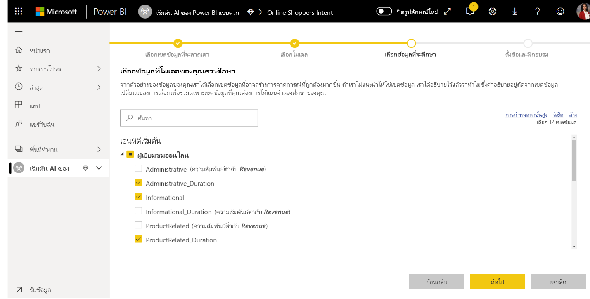

ในขั้นตอนสุดท้าย เราต้องใส่ชื่อสำหรับแบบจำลองของเรา ตั้งชื่อแบบจำลอง _การคาดการณ์จุดประสงค์ในการซื้อไปใช้_ คุณสามารถเลือกที่จะลดเวลาการฝึกเพื่อดูผลลัพธ์อย่างรวดเร็วหรือเพิ่มระยะเวลาที่ใช้ในการฝึกเพื่อให้ได้แบบจำลองที่ดีที่สุด จากนั้นเลือก **บันทึกและฝึก** เพื่อเริ่มต้นการฝึกแบบจำลอง

กระบวนการฝึกอบรมจะเริ่มต้นด้วยการสุ่มตัวอย่างและ normalizing ข้อมูลในอดีตของคุณและแยกชุดข้อมูลของคุณลงในสองเอนทิตีใหม่_การซื้อการคาดการณ์การดำเนินการ_และ_การทดสอบการคาดการณ์เจตนาการซื้อข้อมูล_ได้

ทั้งขึ้นอยู่กับขนาดของชุดข้อมูล กระบวนการฝึกอบรมสามารถใช้ที่ใดก็ได้จากไม่กี่นาทีจนถึงเวลาการฝึกอบรมที่เลือกในหน้าจอก่อนหน้า ในขั้นตอนนี้คุณสามารถดูแบบจำลองในแท็บ**แบบจำลองการเรียนรู้ของเครื่อง**ของกระแสข้อมูล สถานะพร้อมแล้วแสดงว่าแบบจำลองได้รับการจัดคิวสำหรับการฝึกหรืออยู่ระหว่างการฝึก

คุณสามารถยืนยันว่าแบบจำลองกำลังได้รับการฝึกและผ่านการตรวจสอบความถูกต้องผ่านสถานะของกระแสข้อมูล การดำเนินการนี้จะปรากฏขึ้นเป็นการรีเฟรชข้อมูลในแท็บ**กระแสข้อมูล**ของพื้นที่ทำงาน

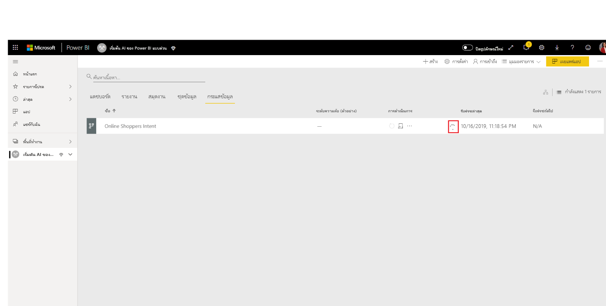

เมื่อการฝึกแบบจำลองเสร็จสมบูรณ์กระแสข้อมูล จะแสดงเวลาการรีเฟรชที่อัปเดตแล้ว คุณสามารถยืนยันว่าแบบจำลองได้รับการฝึกแล้วโดยการนำทางไปยังแท็บ**แบบจำลองการเรียนรู้ของเครื่อง**ในกระแสข้อมูล แบบจำลองที่คุณสร้างขึ้นควรแสดงสถานะเป็น**ฝึกแล้ว**และ**เวลาที่ฝึกครั้งล่าสุด**ควรได้รับการอัปเดต

## ตรวจทานรายงานการตรวจสอบความถูกต้องของแบบจำลอง
หากต้องการตรวจสอบรายงานการตรวจสอบความถูกต้องของแบบจำลองในแท็บแบบจำลองการเรียนรู้ของเครื่อง ให้เลือกปุ่มรายงานการฝึกในคอลัมน์การดำเนินการสำหรับแบบจำลอง รายงานนี้จะอธิบายวิธีการแบบจำลองการเรียนรู้ของเครื่องของคุณมีแนวโน้มที่จะดำเนินการ

ในหน้า**ประสิทธิภาพของแบบจำลอง**ของรายงาน ให้เลือก**ตัวคาดการณ์ยอดนิยม**เพื่อดูตัวคาดการณ์ยอดนิยมสำหรับแบบจำลองของคุณ คุณสามารถเลือกหนึ่งในตัวคาดการณ์เพื่อดูว่าการกระจายผลลัพธ์เกี่ยวข้องกับตัวคาดการณ์นั้นได้อย่างไร

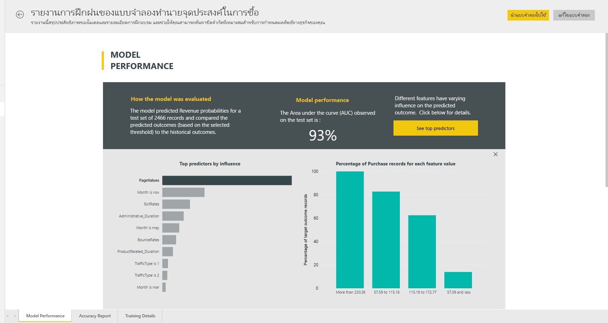

คุณสามารถใช้ตัวแบ่งส่วน**ขีดจำกัดความน่าจะเป็น**บนหน้าประสิทธิภาพของแบบจำลองเพื่อตรวจสอบอิทธิพลของความแม่นยำและการเรียกคืนสำหรับแบบจำลอง

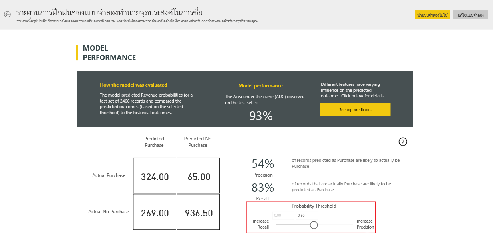

หน้าอื่นๆของรายงานอธิบายเมตริกประสิทธิภาพเชิงสถิติสำหรับแบบจำลอง

รายงานยังรวมถึงหน้ารายละเอียดการฝึกอบรมที่อธิบายการเกิดซ้ำต่างๆที่มีการเรียกใช้วิธีการแยกลักษณะการทำงานออกจากอินพุทและ hyperparameters สำหรับแบบจำลองขั้นสุดท้ายที่ใช้

## นำแบบจำลองไปใช้กับเอนทิตีกระแสข้อมูล

เลือกปุ่ม**ใช้แบบจำลอง**ที่ด้านบนของรายงานเพื่อเรียกแบบจำลองนี้ ในกล่องโต้ตอบ**นำไปใช้**คุณสามารถระบุเอนทิตีเป้าหมายที่มีข้อมูลต้นทางที่ควรใช้แบบจำลอง

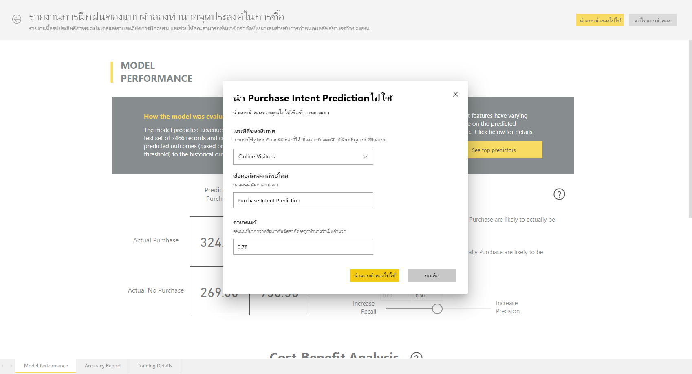

เมื่อได้รับพร้อมท์คุณจะต้อง**รีเฟรช**กระแสข้อมูล เพื่อแสดงตัวอย่างผลลัพธ์ของแบบจำลองของคุณ

การใช้แบบจำลองจะสร้างเอนทิตีใหม่สองตัวที่มีส่วนต่อท้าย  **<model_name> ที่สมบูรณ์** และ **คำอธิบาย <model_name> ที่สมบูรณ์**. ในกรณีของเรา การนำแบบจำลองไปใช้กับเอนทิตีของ**ผู้เยี่ยมชม ออนไลน์** จะสร้าง **การคาดการณ์จุดประสงค์ในการซื้อที่สมบูรณ์ของผู้เยี่ยมชมออนไลน์** ซึ่งรวมถึงผลลัพธ์ที่คาดการณ์จากแบบจำลอง และ **คำอธิบายการคาดการณ์จุดประสงค์ในการซื้อที่สมบูรณ์ของผู้เยี่ยมชมออนไลผู้เยี่ยมชมออนไลน์** ซึ่งประกอบด้วยอิทธิพลที่เฉพาะเจาะจงของไฟล์ข้อมูลสำหรับการคาดการณ์. 

การใช้แบบจำลองการคาดการณ์ไบนารีจะเพิ่มคอลัมน์ที่สี่ที่มีผลลัพธ์ที่คาดการณ์ คะแนนความน่าจะเป็น อิทธิพลที่เฉพาะเจาะจงของไฟล์ข้อมูล และดัชนีคำอธิบายสำหรับการคาดการณ์ ซึ่งแต่ละคอลัมน์จะขึ้นต้นด้วยชื่อคอลัมน์ที่ระบุ  

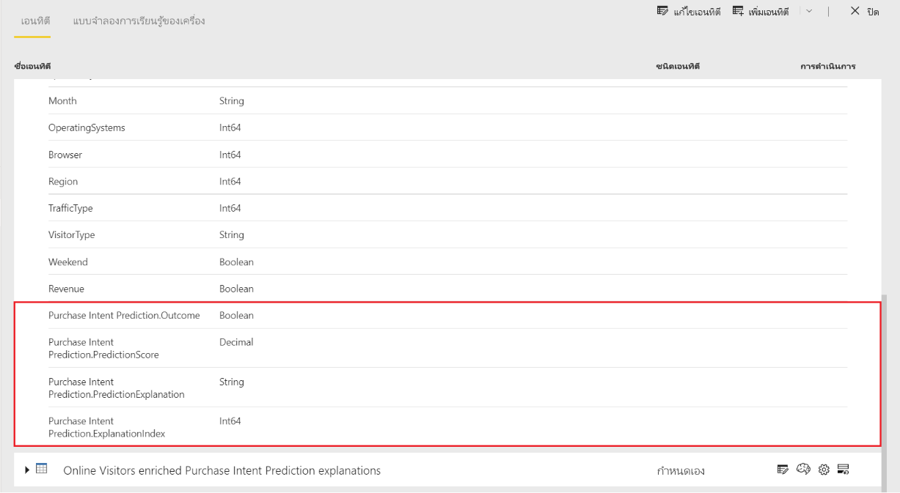

เมื่อรีเฟรชกระแสข้อมูลเสร็จสมบูรณ์ คุณสามารถเลือกเอนทิตี**การคาดการณ์จุดประสงค์ในการสั่งซื้อที่สมบูรณ์ของผู้เยี่ยมชมออนไลน์** เพื่อดูผลลัพธ์ได้

## การใช้ผลลัพธ์ที่ได้จากแบบจำลองในรายงาน Power BI

ในการใช้ผลลัพธ์ที่ได้จากการเรียนรู้ของเครื่อง คุณสามารถเชื่อมต่อกับกระแสข้อมูลของคุณจาก Power BI desktop โดยใช้ตัวเชื่อมต่อกระแสข้อมูลได้ เอนทิตี**การคาดการณ์จุดประสงค์ในการซื้อของผู้เยี่ยมชมออนไลน์**สามารถใช้เพื่อรวมการคาดการณ์จากแบบจำลองของคุณในรายงาน Power BI ได้ในขณะนี้

## ขั้นตอนถัดไป

ในบทช่วยสอนนี้คุณสร้างและนำไปใช้แบบจำลองการคาดการณ์ไบนารีใน Power BI โดยใช้ขั้นตอนเหล่านี้:

* สร้างกระแสข้อมูลด้วยข้อมูลป้อนเข้า
* สร้างและฝึกอบรมโมเดลการเรียนรู้ของเครื่อง
* ตรวจทานรายงานการตรวจสอบความถูกต้องของแบบจำลอง
* นำแบบจำลองไปใช้กับเอนทิตีกระแสข้อมูล
* การใช้ผลลัพธ์ที่ได้จากแบบจำลองในรายงาน Power BI

สำหรับข้อมูลเพิ่มเติมเกี่ยวกับ Machine Learning อัตโนมัติใน Power BI โปรดดูข้อมูลเกี่ยวกับ [ Machine Learning อัตโนมัติใน Power BI](../transform-model/service-machine-learning-automated.md)
