# <a name="tutorial-use-cognitive-services-in-power-bi"></a>บทช่วยสอน: ใช้ Cognitive Services ใน Power BI

Power BI ให้สิทธิ์เข้าถึงชุดของฟังก์ชันจาก Azure Cognitive Services เพื่อเติมแต่งข้อมูลของคุณในการเตรียมข้อมูลด้วยตนเองสำหรับกระแสข้อมูล บริการที่ได้รับการรองรับประจำวันนี้ ได้แก่ [การวิเคราะห์ความคิดเห็น](https://docs.microsoft.com/azure/cognitive-services/text-analytics/how-tos/text-analytics-how-to-sentiment-analysis)[การแยกวลีหลัก](https://docs.microsoft.com/azure/cognitive-services/text-analytics/how-tos/text-analytics-how-to-keyword-extraction)[การตรวจหาภาษา](https://docs.microsoft.com/azure/cognitive-services/text-analytics/how-tos/text-analytics-how-to-language-detection) และ [การแท็กรูปภาพ](https://docs.microsoft.com/azure/cognitive-services/computer-vision/concept-tagging-images) การแปลงข้อมูลจะดำเนินการบนบริการของ Power BI และไม่จำเป็นต้องมีการสมัครใช้งาน Azure Cognitive Services คุณลักษณะนี้ต้องใช้ Power BI Premium

การแปลงข้อมูล Cognitive Services ได้รับการรองรับใน [การเตรียมข้อมูลด้วยตนเองสำหรับกระแสข้อมูล](https://powerbi.microsoft.com/blog/introducing-power-bi-data-prep-wtih-dataflows/) ใช้ตัวอย่างทีละขั้นตอนสำหรับการวิเคราะห์ข้อความและรูปภาพที่แท็กด้านล่างเพื่อเริ่มต้นใช้งาน

ในบทช่วยสอนนี้ คุณจะเรียนรู้วิธีการ:

> [!div class="checklist"]
> * นำเข้าข้อมูลลงในกระสข้อมูล
> * ให้คะแนนความคิดเห็นและแยกวลีหลักของคอลัมน์ข้อความในกระแสข้อมูล
> * เชื่อมต่อกับผลลัพธ์จาก Power BI Desktop


## <a name="prerequisites"></a>ข้อกำหนดเบื้องต้น

คุณต้องทำขั้นตอนต่อไปนี้เพื่อดำเนินบทช่วยสอนให้เสร็จสิ้น: 

- บัญชี Power BI ถ้าคุณไม่ได้ลงทะเบียน Power BI ให้[ลงทะเบียนรุ่นทดลองใช้ฟรี](https://app.powerbi.com/signupredirect?pbi_source=web)ก่อนที่คุณจะเริ่มต้นใช้งาน
- เข้าถึงความจุ Power BI Premium ด้วยปริมาณงาน AI ที่เปิดการใช้งาน ปริมาณงานนี้จะถูกปิดโดยค่าเริ่มต้นระหว่างการแสดงตัวอย่าง หากคุณอยู่ในความจุพรีเมียมและข้อมูลเชิงลึก AI ไม่แสดงขึ้น โปรดติดต่อผู้ดูแลความจุพรีเมียมของคุณเพื่อเปิดการใช้งานปริมาณงาน AI ในพอร์ทัลผู้ดูแลระบบ

## <a name="text-analytics"></a>การวิเคราะห์ข้อความ

ทำตามขั้นตอนในส่วนนี้เพื่อเสร็จสิ้นส่วนการวิเคราะห์ข้อความของบทช่วยสอน

### <a name="step-1-apply-sentiment-scoring-in-power-bi-service"></a>ขั้นตอนที่ 1: ใช้การให้คะแนนความคิดเห็นในบริการของ Power BI

หากต้องการเริ่มต้นใช้งาน ให้นำทางไปยังพื้นที่ทำงาน Power BI ด้วยความจุพรีเมียม และสร้างกระแสข้อมูลใหม่โดยใช้ปุ่ม **สร้าง** มุมขวาบนของหน้าจอ

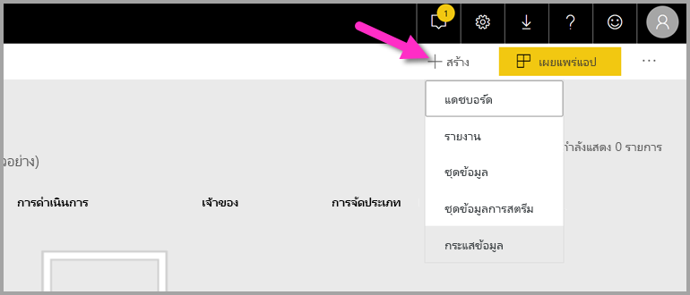

กล่องโต้ตอบกระแสข้อมูลจะแสดงตัวเลือกสำหรับการสร้างกระแสข้อมูลใหม่ ให้เลือก **เพิ่มเอนทิตีใหม่** จากนั้นเลือก **ข้อความ/CSV** จากเมนูของแหล่งข้อมูล


วาง URL นี้ลงในเขตข้อมูล URL: [https://pbiaitutorials.blob.core.windows.net/textanalytics/FabrikamComments.csv](https://pbiaitutorials.blob.core.windows.net/textanalytics/FabrikamComments.csv) และคลิก **ถัดไป**

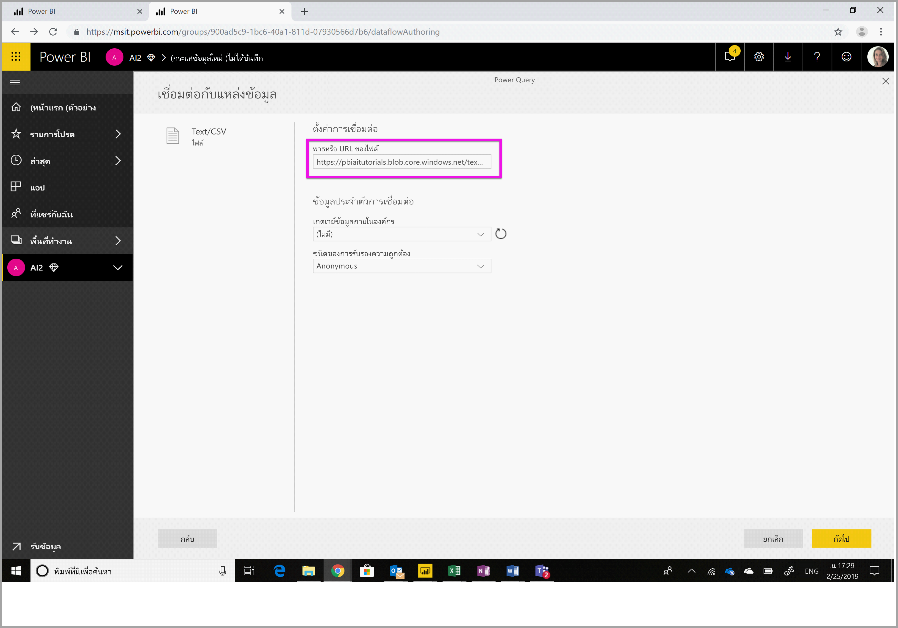

ขณะนี้ข้อมูลพร้อมใช้งานสำหรับการวิเคราะห์ข้อความแล้ว และสามารถใช้การให้คะแนนความคิดเห็นและการแยกวลีหลักกับคอลัมน์ความคิดเห็นของลูกค้าได้

ในตัวแก้ไข Power Query ให้เลือก **ข้อมูลเชิงลึก AI**


ขยายโฟลเดอร์ **Cognitive Services** และเลือกฟังก์ชันที่คุณต้องการใช้ ตัวอย่างนี้กำลังให้คะแนนความคิดเห็นของคอลัมน์ข้อคิดเห็น แต่คุณสามารถทำตามขั้นตอนเดียวกันนี้เพื่อลองใช้การตรวจหาภาษาและการแยกวลีหลักได้

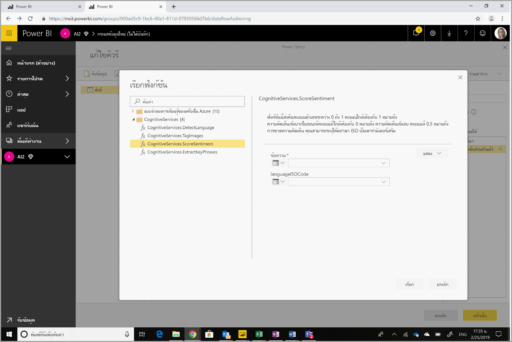

เมื่อเลือกฟังก์ชันแล้ว เขตข้อมูลที่จำเป็นและไม่จำเป็นจะแสดงขึ้น หากต้องการให้คะแนนความคิดเห็นรีวิวตัวอย่าง ให้เลือกคอลัมน์รีวิวเป็นข้อมูลป้อนเข้าที่เป็นข้อความ ข้อมูลวัฒนธรรมคือข้อมูลป้อนเข้าเพิ่มเติมและจำเป็นต้องใช้รูปแบบ ISO ยกตัวอย่างเช่น ป้อน 'en' หากต้องการดำเนินการข้อความเป็นภาษาอังกฤษ สำหรับเขตข้อมูลที่ปล่อยว่าง Power BI จะตรวจหาภาษาของค่าที่ป้อนเข้าเป็นอันดับแรกก่อนที่จะให้คะแนนความคิดเห็น


จากนั้นเลือก **การเรียก** เพื่อเรียกใช้ฟังก์ชัน คอลัมน์ใหม่ที่มีคะแนนความคิดเห็นสำหรับแต่ละแถวจะถูกเพิ่มลงในตาราง คุณสามารถย้อนกลับไปที่ **ข้อมูลเชิงลึก AI** เพื่อแยกวลีหลักของข้อความรีวิวด้วยวิธีเดียวกันนี้ได้

เมื่อเสร็จสิ้นการแปลงข้อมูลแล้ว ให้เปลี่ยนชื่อคิวรีเป็น 'ข้อคิดเห็นของลูกค้า' และเลือก **เสร็จสิ้น**

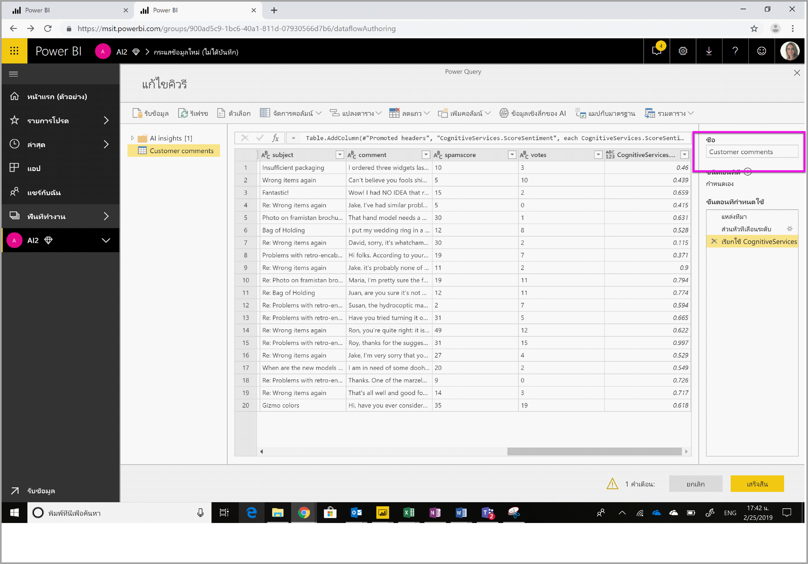

จากนั้น **บันทึก** กระแสข้อมูลและตั้งชื่อว่า Fabrikam เลือกปุ่ม **รีเฟรชตอนนี้** ที่ปรากฏขึ้นมาหลังจากการบันทึกกระแสข้อมูล

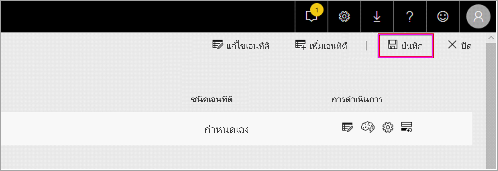

เมื่อบันทึกและรีเฟรชกระแสข้อมูลแล้ว คุณจะสามารถนำไปใช้ในรายงาน Power BI ได้

### <a name="step-2-connect-from-power-bi-desktop"></a>ขั้นตอนที่ 2: เชื่อมต่อจาก Power BI Desktop

เปิด Power BI Desktop ใน Ribbon หน้าแรก ให้เลือก **รับข้อมูล**

นำทางไปยัง **กระแสข้อมูล Power BI (เบต้า**) ในส่วน Power BI และเลือก **เชื่อมต่อ**

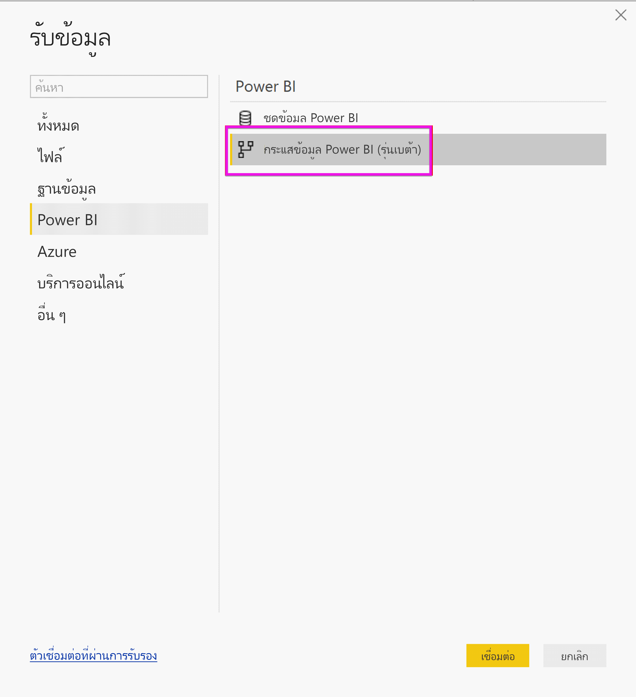

เนื่องจากนี่เป็นคุณลักษณะตัวอย่าง ตัวเชื่อมต่อจะสอบถามเพื่อให้คุณยอมรับเงื่อนไขการแสดงตัวอย่าง หลังจากยอมรับแล้ว ให้ลงชื่อเข้าใช้ด้วยบัญชีองค์กรของคุณ

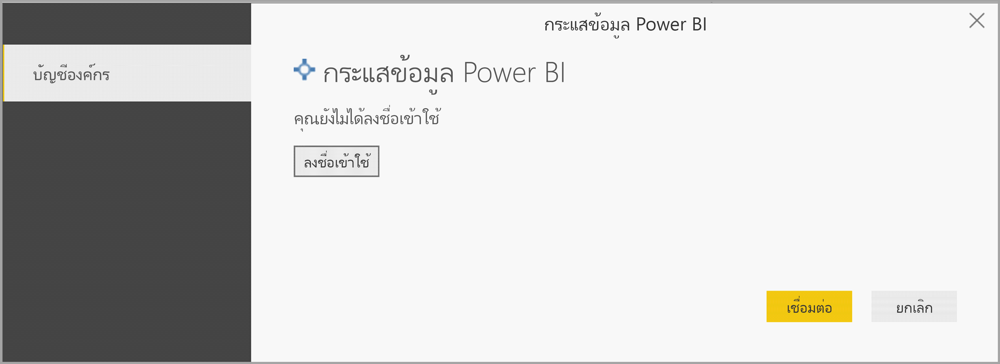

เลือกกระแสข้อมูลที่คุณเพิ่งสร้าง นำทางไปยังตารางข้อคิดเห็นของลูกค้า และคลิก **โหลด**

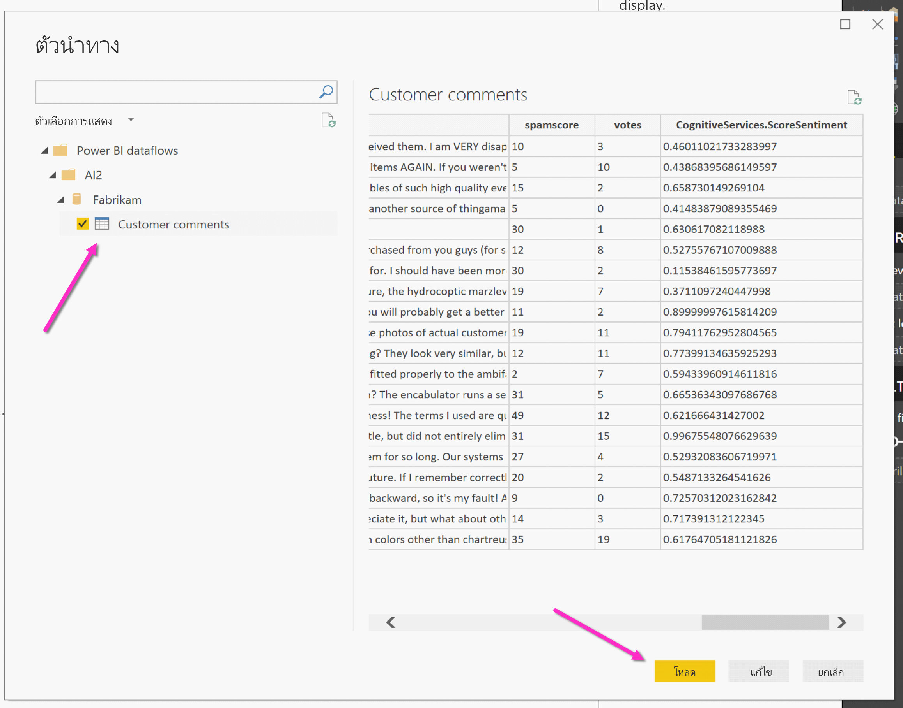

เมื่อโหลดข้อมูลแล้ว คุณสามารถเริ่มต้นการสร้างรายงานได้

## <a name="image-tagging"></a>การแท็กรูปภาพ

นำทางไปยังพื้นที่ทำงาน Power BI ที่มีความจุพรีเมียม สร้างกระแสข้อมูลใหม่โดยใช้ปุ่ม **สร้าง** ที่มุมขวาบนของหน้าจอ

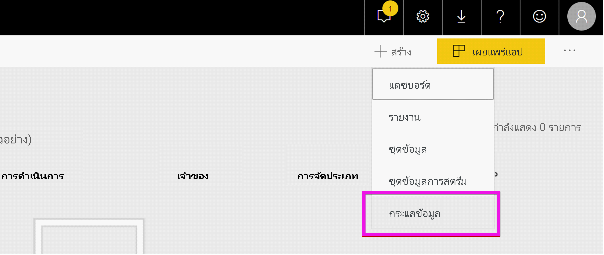

เลือก **เอนทิตีใหม่**

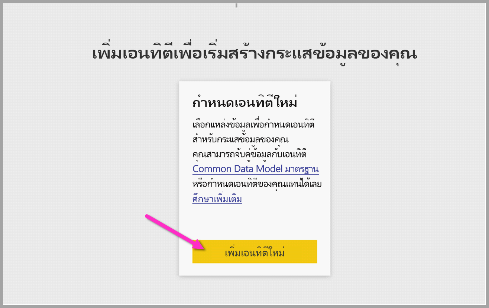

เมื่อปรากฏข้อความให้เลือกแหล่งข้อมูล ให้เลือก **คิวรีเปล่า**


คัดลอกคิวรีด้านล่างในตัวแก้ไขคิวรีและคลิกถัดไป คุณสามารถแทนที่เส้นทาง URL ด้านล่างด้วยรูปภาพอื่นๆ หรือเพิ่มแถวได้ ฟังก์ชัน *Web.Contents* จะนำเข้า URL รูปภาพเป็นไบนารี นอกจากนี้หากคุณมีแหล่งข้อมูลที่มีรูปภาพจัดเก็บเป็นไบนารี คุณสามารถใช้ได้โดยตรง


```python
let
  Source = Table.FromRows({
  { Web.Contents("https://images.pexels.com/photos/87452/flowers-background-butterflies-beautiful-87452.jpeg") },
  { Web.Contents("https://upload.wikimedia.org/wikipedia/commons/5/53/Colosseum_in_Rome%2C_Italy_-_April_2007.jpg") }}, { "Image" })
in
  Source
```

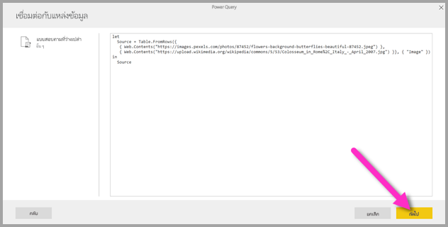

เมื่อได้รับพร้อมท์สำหรับข้อมูลประจำตัว ให้เลือก *ไม่ระบุชื่อ*

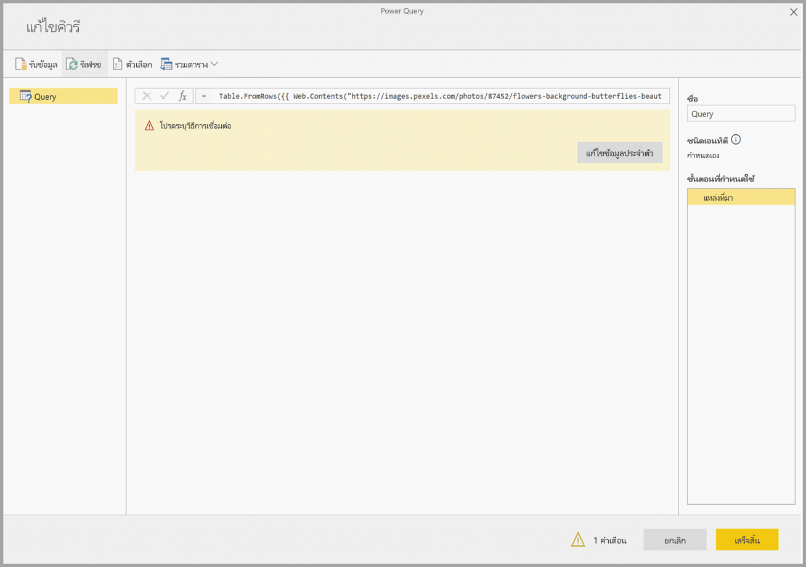

คุณจะเห็นรูปภาพดังต่อไปนี้

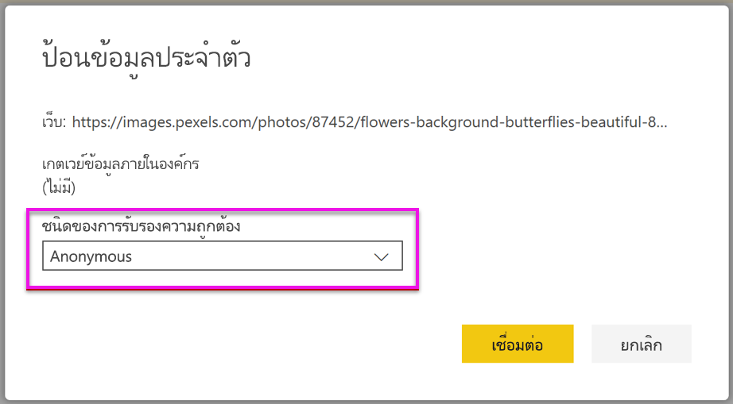

คุณจะได้รับพร้อมท์สำหรับข้อมูลประจำตัวของแต่ละหน้าเว็บ

เลือก **ข้อมูลเชิงลึก AI** ในตัวแก้ไขคิวรี


จากนั้น ลงชื่อเข้าใช้ด้วย **บัญชีองค์กร**


เลือกฟังก์ชันแท็กรูปภาพ และป้อน _[ไบนารี]_ ในเขตเขตข้อมูลคอลัมน์ และ _en_ ในเขตข้อมูลวัฒนธรรม 

> [!NOTE]
> ขณะนี้คุณจะไม่สามารถเลือกคอลัมน์โดยใช้ดรอปดาวน์ได้ ทั้งนี้ปัญหาดังกล่าวจะได้รับการแก้ไขโดยเร็วที่สุดระหว่างการแสดงตัวอย่างส่วนบุคคล


ในตัวแก้ไขฟังก์ชัน ให้ลบเครื่องหมายอัญประกาศรอบๆ ชื่อคอลัมน์ 

> [!NOTE]
> การลบเครื่องหมายอัญประกาศจะเป็นการแก้ไขปัญหาชั่วคราว ทั้งนี้ปัญหาดังกล่าวจะได้รับการแก้ไขโดยเร็วที่สุดระหว่างการแสดงตัวอย่างส่วนบุคคล


ฟังก์ชันจะส่งกลับทั้งระเบียนที่มีแท็กในรูปแบบที่ใช้จุลภาคเป็นตัวคั่น และระเบียน json เลือกปุ่มขยายเพื่อเพิ่มอย่างน้อยหนึ่งระเบียนเป็นคอลัมน์ในตาราง

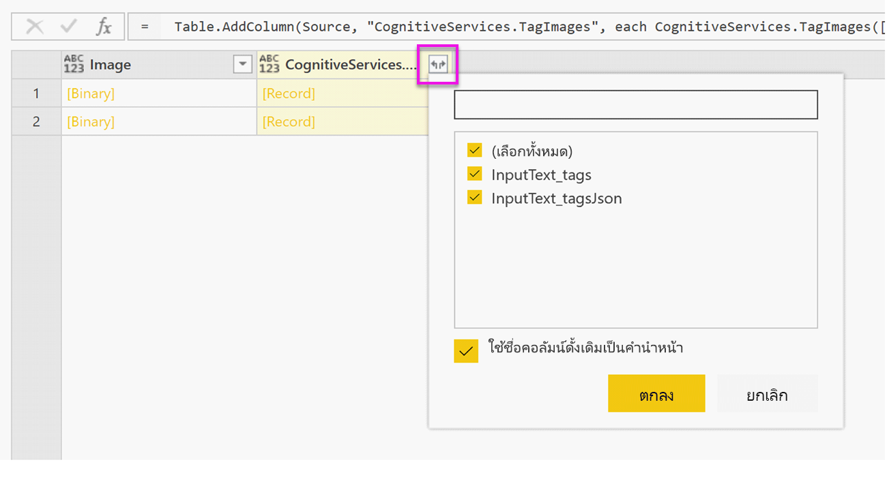

เลือก **เสร็จสิ้น** และบันทึกกระแสข้อมูล เมื่อรีเฟรชกระแสข้อมูลแล้ว คุณสามารถเชื่อมต่อกระแสข้อมูลจาก Power BI Desktop ได้โดยใช้ตัวเชื่อมต่อกระแสข้อมูล (ดูขั้นตอนในหน้าที่ 5 ของเอกสารนี้)

## <a name="clean-up-resources"></a>ล้างแหล่งข้อมูล

หากไม่ต้องการใช้แล้ว ให้ลบคิวรีโดยคลิกขวาที่ชื่อคิวรีในตัวแก้ไข Power Query และเลือก **ลบ**

## <a name="next-steps"></a>ขั้นตอนถัดไป

ในบทช่วยสอนนี้คุณได้ใช้ฟังก์ชันการให้คะแนนความคิดเห็นและการแท็กรูปภาพบนกระแสข้อมูล Power BI หากต้องการเรียนรู้เพิ่มเติมเกี่ยวกับ Cognitive Services ใน Power BI โปรดอ่านบทความต่อไปนี้

* [Cognitive Services ใน Azure](https://docs.microsoft.com/azure/cognitive-services/)
* เริ่มต้นใช้งาน [ด้วยการเตรียมข้อมูลด้วยตนเองบนกระแสข้อมูล](../transform-model/service-dataflows-overview.md)
* เรียนรู้เพิ่มเติมเกี่ยวกับ [Power BI Premium](https://powerbi.microsoft.com/power-bi-premium/)

คุณอาจสนใจบทความต่อไปนี้

* [บทช่วยสอน: เรียกใช้แบบจำลอง Machine Learning Studio (คลาสสิก) ใน Power BI (ตัวอย่าง)](service-tutorial-invoke-machine-learning-model.md)
* [การรวม Azure Machine Learning ใน Power BI (ตัวอย่าง)](../transform-model/service-machine-learning-integration.md)
* [Cognitive Services ใน Power BI (ตัวอย่าง)](../transform-model/service-cognitive-services.md)