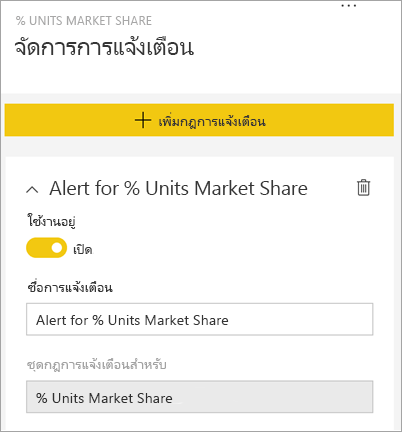

# บทช่วยสอน: ตั้งค่าการแจ้งเตือนบนแดชบอร์ด Power BI

[!INCLUDE[consumer-appliesto-yynn](../includes/consumer-appliesto-yynn.md)]

[!INCLUDE [power-bi-service-new-look-include](../includes/power-bi-service-new-look-include.md)]

ตั้งค่าการแจ้งเตือนในบริการ Power BI เพื่อแจ้งให้คุณทราบเมื่อข้อมูลบนแดชบอร์ดเปลี่ยนแปลงเหนือหรือต่ำกว่าขีดจำกัดที่คุณตั้งไว้ การแจ้งเตือนสามารถตั้งค่าบนหมุดไทล์ที่ปักหมุดจากวิชวลรายงานเท่านั้น และบนหน้าปัดวัด Kpi และการ์ดเท่านั้น 

สามารถสร้างการแจ้งเตือนบนแดชบอร์ด:
- ที่คุณสร้างและบันทึกไว้ใน **พื้นที่ทำงานของฉัน**
- ที่แบ่งปันกับคุณใน [ความจุแบบพรีเมียม](end-user-license.md) 
- ในพื้นที่ทำงานใด ๆ คุณก็สามารถเข้าถึงได้ ถ้าคุณมีสิทธิ์การใช้งาน Power BI Pro    

ข้อความแจ้งเตือนทำงานกับข้อมูลที่ได้รับการรีเฟรชเท่านั้น เมื่อมีการรีเฟรชข้อมูล Power BI จะค้นหาเพื่อดูว่าข้อความแจ้งเตือนถูกตั้งค่าสำหรับข้อมูลนั้นหรือไม่ ถ้าข้อมูลได้ถึงค่าเกณฑ์การแจ้งเตือน ข้อความแจ้งเตือนจะถูกเริ่ม 

คุณลักษณะนี้ยังคงได้รับการพัฒนา ดังนั้นโปรดดู[คำแนะนำและหัวข้อการแก้ไขปัญหาด้านล่าง](#tips-and-troubleshooting)

มีเพียงคุณที่สามารถดูการแจ้งเตือนที่คุณตั้งไว้ แม้ว่าคุณได้แชร์แดชบอร์ดของคุณ การแจ้งเตือนข้อมูลจะถูกซิงโครไนซ์เต็มรูปแบบข้ามแพลตฟอร์ม ตั้งค่าและดูการแจ้งเตือนข้อมูลได้[ในแอป mobile Power BI](mobile/mobile-set-data-alerts-in-the-mobile-apps.md)และใน Power BI service 

> [!WARNING]
> การแจ้งเตือนเหล่านี้จะให้ข้อมูลเกี่ยวกับข้อมูลของคุณ ถ้าคุณดูข้อมูล Power BI ของคุณบนอุปกรณ์เคลื่อนที่ และอุปกรณ์ที่ถูกขโมย เราขอแนะนำให้ใช้บริการของ Power BI เพื่อปิดการแจ้งเตือนทั้งหมด
> 

บทช่วยสอนนี้ครอบคลุมเรื่องต่อไปนี้
> [!div class="checklist"]
> * ใครสามารถตั้งค่าการแจ้งเตือน
> * ภาพที่รองรับการแจ้งเตือน
> * ผู้ที่สามารถดูการแจ้งเตือนของฉัน
> * การแจ้งเตือนการทำงาน บน Power BI Desktop และอุปกรณ์เคลื่อนที่
> * วิธีการสร้างการแจ้งเตือน
> * รับการแจ้งเตือนของฉันที่ไหน

## ข้อกำหนดเบื้องต้น

ถ้าคุณไม่ได้ลงทะเบียน Power BI ให้[ลงทะเบียนรุ่นทดลองใช้ฟรี](https://app.powerbi.com/signupredirect?pbi_source=web)ก่อนที่คุณจะเริ่มต้นใช้งาน

1. ตัวอย่างนี้ใช้ไทล์การ์ดแดชบอร์ดจากตัวอย่างการขายและการตลาด เปิดบริการ Power BI (app.powerbi.com) ลงชื่อเข้าใช้และเปิด **พื้นที่ทำงานของฉัน** ของคุณ    
    

2. ในมุมด้านล่างซ้าย เลือก**รับข้อมูล**

    

3. ในหน้ารับข้อมูลที่ปรากฏขึ้น ให้เลือก **ตัวอย่าง**

4. เลือกตัวอย่างการขายและการตลาด จากนั้นเลือก **เชื่อมต่อ**

    

5. หลังจาก Power BI เชื่อมต่อกับตัวอย่างแล้ว ให้เลือก **ไปที่แดชบอร์ด** จากกล่องโต้ตอบที่ปรากฏขึ้น     
    

## เพิ่มการแจ้งเตือนไปยังไทล์แดชบอร์ด

1. จากแป้นวัดแดชบอร์ด KPI หรือการ์ดไทล์ เลือกจุดไข่ปลา
   
   

2. เลือกไอคอนการแจ้งเตือน  หรือ **จัดการการแจ้งเตือน** เพื่อเพิ่มการแจ้งเตือนอย่างน้อยหนึ่งรายการสำหรับการ์ด **ส่วนแบ่งทางการตลาด**

   

   
1. บนบานหน้าต่าง**จัดการการแจ้งเตือน** เลือก **+ เพิ่มกฎการแจ้งเตือน**  ตรวจสอบให้แน่ใจว่า แถบเลื่อนถูกตั้งค่าเป็น**เปิด**และตั้งชื่อให้การแจ้งเตือนของคุณ ชื่อช่วยให้คุณสามารถจดจำข้อความการแจ้งเตือนของคุณได้
   
   
4. เลื่อนลง แล้วใส่รายละเอียดการแจ้งเตือน  ในตัวอย่างนี้เราจะสร้างการแจ้งเตือนที่แจ้งให้เราทราบวันละครั้งหากส่วนแบ่งทางการตลาดของเราเพิ่มขึ้นเป็น 40 หรือสูงกว่า การแจ้งเตือนจะปรากฏใน [ศูนย์การแจ้งเตือน](end-user-notification-center.md) ของเรา และเราจะให้ Power BI ส่งอีเมลเช่นกัน
   
   

5. เลือก **บันทึกและปิด**
 

   > 

## การรับการแจ้งเตือน
เมื่อติดตามข้อมูลถึงค่าเกณฑ์หนึ่งที่คุณตั้งไว้ เกิดหลายสิ่งขึ้น ประการแรก Power BI จะตรวจสอบเพื่อดูว่าเกินหนึ่งชั่วโมงหรือ 24 ชั่วโมงแล้วหรือไม่ (ขึ้นอยู่กับตัวเลือกที่คุณเลือก) นับตั้งแต่มีการส่งการแจ้งเตือนล่าสุด ตราบใดที่ข้อมูลเกินค่าเกณฑ์ คุณจะได้รับการแจ้งเตือนทุกชั่วโมงหรือทุกๆ 24 ชั่วโมง

ถัดไป Power BI ส่งข้อความแจ้งเตือนไปยังศูนย์การแจ้งเตือนของคุณ และหรือในอีเมล แต่ละข้อความแจ้งเตือนประกอบด้วยการเชื่อมโยงโดยตรงกับข้อมูลของคุณ เลือกลิงก์เพื่อดูไทล์ที่เกี่ยวข้อง  

1. ถ้าคุณได้ตั้งค่าการแจ้งเตือนให้ส่งอีเมล์ คุณจะพบสิ่งที่เหมือนสิ่งนี้้ในกล่องอีเมลเข้าของคุณ นี่คือการแจ้งเตือนที่เราตั้งไว้สำหรับการ์ด **ความคิดเห็น**
   
   
2. Power BI ยังเพิ่มข้อความใน **ศูนย์การแจ้งเตือน** ของคุณ
   
   
3. เปิดศูนย์การแจ้งเตือนของคุณเพื่อดูรายละเอียดการแจ้งเตือน
   
    
   
  

## การจัดการการแจ้งเตือน

มีหลายวิธีในการจัดการการแจ้งเตือนของคุณ: จากไทล์แดชบอร์ดเอง จากเมนูการตั้งค่า Power BI บนไทล์แต่ละรายการใน [แอปมือถือ Power BI บน iPhone](mobile/mobile-set-data-alerts-in-the-mobile-apps.md) หรือใน [แอปมือถือ Power BI สำหรับ Windows 10](mobile/mobile-set-data-alerts-in-the-mobile-apps.md)

### จากตัวไทล์เอง

1. หากคุณต้องการเปลี่ยนหรือลบการแจ้งเตือนสำหรับไทล์ ให้เปิดหน้าต่าง **จัดการการแจ้งเตือน** อีกครั้งโดยเลือกไอคอนการแจ้งเตือน  แจ้งเตือนทั้งหมดที่คุณได้ตั้งค่าสำหรับไทล์ได้แสดงขึ้น
   
    .
2. เพื่อเปลี่ยนข้อความแจ้งเตือน ให้เลือกลูกศรทางด้านซ้ายของชื่อการแจ้งเตือน
   
    .
3. เพื่อลบการแจ้งเตือน ให้เลือกถังขยะทางด้านขวาของชื่อการแจ้งเตือน
   
      

### จากเมนูการตั้งค่า Power BI

1. เลือกไอคอนรูปเฟืองจากแถบเมนู Power BI
   
    .
2. ภายใต้**ตั้งค่า**ให้เลือก**การแจ้งเตือน**
   
    
3. จากที่นี่ คุณสามารถเปิดหรือปิดข้อความแจ้งเตือน เปิดตัว**จัดการการแจ้งเตือน**เพื่อทำการเปลี่ยนแปลง หรือลบการแจ้งเตือนได้

## เคล็ดลับและการแก้ไขปัญหา 

* หากคุณไม่สามารถตั้งค่าการแจ้งเตือนสำหรับมาตรวัด, KPI หรือการ์ดได้ โปรดติดต่อผู้ดูแลระบบผู้เช่าหรือฝ่ายช่วยเหลือด้านไอทีเพื่อขอความช่วยเหลือ บางครั้งการแจ้งเตือนจะถูกปิดหรือไม่พร้อมใช้งานสำหรับแดชบอร์ดของคุณหรือสำหรับไทล์แดชบอร์ดบางชนิด
* ข้อความแจ้งเตือนทำงานกับข้อมูลที่ได้รับการรีเฟรชเท่านั้น การแจ้งเตือนจะไม่ทำงานกับข้อมูลแบบคงที่ ส่วนใหญ่ของตัวอย่างที่ Microsoft กำหนดเป็นค่าคงที่ 
* ความสามารถในการรับและดูเนื้อหาที่แชร์ต้องใช้สิทธิการใช้งาน Power BI Pro หรือ Premium สำหรับข้อมูลเพิ่มเติม ให้อ่าน [ฉันมีสิทธิการใช้งานใดอยู่บ้าง](end-user-license.md)
* คุณสามารถตั้งค่าการแจ้งเตือนบนวิชวลที่สร้างขึ้นจากชุดข้อมูลการสตรีมที่คุณถูกปักหมุดจากรายงานไปยังแดชบอร์ดได้ ไม่สามารถตั้งค่าการแจ้งเตือนบนไทล์การสตรีมที่สร้างขึ้นโดยตรงบนแดชบอร์ดโดยใช้**เพิ่มไทล์** > **ข้อมูลการสตรีมแบบกำหนเอง**

## ล้างแหล่งข้อมูล
คำแนะนำสำหรับการลบการแจ้งเตือนจะอธิบายไว้ข้างต้น โดยย่อคือเลือกไอคอนรูปเฟืองจากแถบเมนู Power BI ภายใต้**การตั้งค่า**เลือก**แจ้งเตือน**และลบการแจ้งเตือน

> [!div class="nextstepaction"]
> [ตั้งค่าการแจ้งเตือนข้อมูลบนอุปกรณ์เคลื่อนที่ของคุณ](mobile/mobile-set-data-alerts-in-the-mobile-apps.md)

