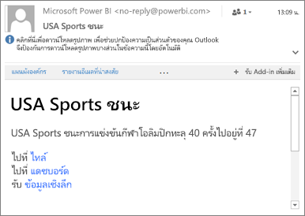
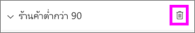

# บทช่วยสอน: ตั้งค่าการแจ้งเตือนข้อมูลใน Power BI service
ต้งค่าการแจ้งเตือน เมื่อมีข้อมูลในแดชบอร์ดของคุณเปลี่ยนเกินขีดจำกัดที่คุณตั้งไว 

คุณสามารถตั้งค่าการแจ้งเตือนบนไทล์ ถ้าคุณมีสิทธิ์การใช้งาน Power BI Pro หรือถ้ามีการแชร์แดชบอร์ดให้กับคุณจาก[ความจุพรีเมียม](../service-premium.md) การแจ้งเตือนสามารถตั้งค่าบนหมุดไทล์ที่ปักจากภาพรายงานเท่านั้น และบนหน้าปัดวัด Kpi และการ์ดเท่านั้น การแจ้งเตือนบนภาพถูกสร้างขึ้นจากชุดข้อมูลที่มีการปักหมุดจากรายงานกับแดชบอร์ด แต่ไม่สามารถตั้งค่าแบบสตรีมมิ่งบนไทล์ที่สร้างขึ้นโดยตรงบนแดชบอร์ด โดยใช้การ**เพิ่มไทล์**  >   **ข้อมูลการสตรีมแบบกำหนดเอง** 

มีเพียงคุณที่สามารถดูการแจ้งเตือนที่คุณตั้งไว้ แม้ว่าคุณได้แชร์แดชบอร์ดของคุณ การแจ้งเตือนข้อมูลจะถูกซิงโครไนซ์เต็มรูปแบบข้ามแพลตฟอร์ม ตั้งค่าและดูการแจ้งเตือนข้อมูลได้[ในแอป mobile Power BI](mobile/mobile-set-data-alerts-in-the-mobile-apps.md)และใน Power BI service 

> [!WARNING]
> การแจ้งเตือนข้อมูลแสดงข้อมูลของคุณ ถ้าคุณดูข้อมูล Power BI ของคุณบนอุปกรณ์เคลื่อนที่ และอุปกรณ์ที่ถูกขโมย เราขอแนะนำให้ใช้บริการ Power BI เพื่อปิดการใช้งานแบบฎการแจ้งเตือนข้อมูลทั้งหมด
> 

บทช่วยสอนนี้ครอบคลุมเรื่องต่อไปนี้
> [!div class="checklist"]
> * ใครสามารถตั้งค่าการแจ้งเตือน
> * ภาพที่รองรับการแจ้งเตือน
> * ผู้ที่สามารถดูการแจ้งเตือนของฉัน
> * การแจ้งเตือนการทำงาน บน Power BI Desktop และอุปกรณ์เคลื่อนที่
> * วิธีการสร้างการแจ้งเตือน
> * รับการแจ้งเตือนของฉันที่ไหน

ถ้าคุณไม่ได้ลงทะเบียน Power BI ให้[ลงทะเบียนรุ่นทดลองใช้ฟรี](https://app.powerbi.com/signupredirect?pbi_source=web)ก่อนที่คุณจะเริ่มต้นใช้งาน

## ตั้งค่าการแจ้งเตือนข้อมูลใน Power BI service
ดู Amanda เพิ่มบางการแจ้งเตือนไปยังไทล์บนแดชบอร์ดของเธอ แล้วทำตามคำแนะนำทีละขั้นตอนด้านล่างวิดีโอเพื่อลองทำด้วยตนเอง

<iframe width="560" height="315" src="https://www.youtube.com/embed/JbL2-HJ8clE" frameborder="0" allowfullscreen></iframe>

ตัวอย่างนี้ใช้การ์ดไทล์จากแดชบอร์ด[ตัวอย่างการวิเคราะห์ร้านค้าปลีก](http://go.microsoft.com/fwlink/?LinkId=529778)

1. จากแป้นวัดแดชบอร์ด KPI หรือการ์ดไทล์ เลือกจุดไข่ปลา
   
   
2. เลือกไอคอนระฆัง หรือ **จัดการการแจ้งเตือน**เพื่อเพิ่มการแจ้งเตือนอย่างน้อยหนึ่งตัวสำหรับ**ค่ารวมของร้านค้า**
   
1. บนบานหน้าต่าง**จัดการการแจ้งเตือน** เลือก **+ เพิ่มกฎการแจ้งเตือน**  ตรวจสอบให้แน่ใจว่า แถบเลื่อนถูกตั้งค่าเป็น**เปิด**และตั้งชื่อให้การแจ้งเตือนของคุณ ชื่อช่วยให้คุณสามารถจดจำข้อความการแจ้งเตือนของคุณได้
   
   
4. เลื่อนลง แล้วใส่รายละเอียดการแจ้งเตือน  ในตัวอย่างนี้ เราจะสร้างการแจ้งเตือนที่แจ้งให้ทราบเราวันละครั้ง ถ้าหมายเลขของร้านค้ารวมมากกว่า 100 ร้าน ข้อความแจ้งเตือนจะปรากฏในศูนย์การแจ้งเตือนของเรา และเราจะให้ Power BI ส่งอีเมลเช่นกัน
   
   
5. เลือก **บันทึกและปิด**

## การรับการแจ้งเตือน
เมื่อติดตามข้อมูลถึงค่าเกณฑ์หนึ่งที่คุณตั้งไว้ เกิดหลายสิ่งขึ้น ประการแรก Power BI จะตรวจสอบเพื่อดูว่าเกินหนึ่งชั่วโมงหรือ 24 ชั่วโมงแล้วหรือไม่ (ขึ้นอยู่กับตัวเลือกที่คุณเลือก) นับตั้งแต่มีการส่งการแจ้งเตือนล่าสุด ตราบใดที่ข้อมูลเกินค่าเกณฑ์ คุณจะได้รับการแจ้งเตือนทุกชั่วโมงหรือทุกๆ 24 ชั่วโมง

ถัดไป Power BI ส่งข้อความแจ้งเตือนไปยังศูนย์การแจ้งเตือนของคุณ และหรือในอีเมล แต่ละข้อความแจ้งเตือนประกอบด้วยการเชื่อมโยงโดยตรงกับข้อมูลของคุณ เลือกลิงก์เพื่อดูไทล์ที่เกี่ยวข้อง  

1. ถ้าคุณได้ตั้งค่าการแจ้งเตือนให้ส่งอีเมล์ คุณจะพบสิ่งที่เหมือนสิ่งนี้้ในกล่องอีเมลเข้าของคุณ
   
   
2. Power BI จะเพิ่มข้อความไปยัง**ศูนย์การแจ้งเตือน**ของคุณและเพิ่มไอคอนการแจ้งเตือนใหม่ใหักับไทล์ที่เกี่ยวข้อง
   
   
3. เปิดศูนย์การแจ้งเตือนของคุณเพื่อดูรายละเอียดการแจ้งเตือน
   
    
   
   > [!NOTE]
   > ข้อความแจ้งเตือนทำงานกับข้อมูลที่ได้รับการรีเฟรชเท่านั้น เมื่อมีการรีเฟรชข้อมูล Power BI จะค้นหาเพื่อดูว่าข้อความแจ้งเตือนถูกตั้งค่าสำหรับข้อมูลนั้นหรือไม่ ถ้าข้อมูลได้ถึงค่าเกณฑ์การแจ้งเตือน ข้อความแจ้งเตือนจะถูกส่ง
   > 
   > 

## การจัดการการแจ้งเตือน
มีหลายวิธีในการจัดการการแจ้งเตือนของคุณ: เช่น จากแดชบอร์ดไทล์ จากเมนูการตั้งค่า Power BI จากแต่ละไทล์ใน[แอปสำหรับอุปกรณ์เคลื่อนที่ Power BI บน iPhone](mobile/mobile-set-data-alerts-in-the-mobile-apps.md) หรือใน[แอปสำหรับอุปกรณ์เคลื่อนที่ Power BI สำหรับ Windows 10](mobile/mobile-set-data-alerts-in-the-mobile-apps.md)

### จากตัวไทล์เอง
1. ถ้าคุณต้องการเปลี่ยนหรือลบการแจ้งเตือนสำหรับไทล์ ให้เปิดหน้าต่าง**จัดการการแจ้งเตือน**ใหม่อีกครั้ง โดยการเลือกไอคอนระฆัง  แจ้งเตือนทั้งหมดที่คุณได้ตั้งค่าสำหรับไทล์ได้แสดงขึ้น
   
    .
2. เพื่อเปลี่ยนข้อความแจ้งเตือน ให้เลือกลูกศรทางด้านซ้ายของชื่อการแจ้งเตือน
   
    .
3. เพื่อลบการแจ้งเตือน ให้เลือกถังขยะทางด้านขวาของชื่อการแจ้งเตือน
   
      

### จากเมนูการตั้งค่า Power BI
1. เลือกไอคอนรูปเฟืองจากแถบเมนู Power BI
   
    .
2. ภายใต้**ตั้งค่า**ให้เลือก**การแจ้งเตือน**
   
    
3. จากที่นี่ คุณสามารถเปิดหรือปิดข้อความแจ้งเตือน เปิดตัว**จัดการการแจ้งเตือน**เพื่อทำการเปลี่ยนแปลง หรือลบการแจ้งเตือนได้

## เคล็ดลับและการแก้ไขปัญหา
* การแจ้งเตือนในขณะนี้ไม่ไดรองรับไทล์ Bing หรือการ์ดไทล์ ที่มีหน่วยวัดวันที่/เวลา
* การแจ้งเตือนจะทำงานกับข้อมูลตัวเลขเท่านั้น
* ข้อความแจ้งเตือนทำงานกับข้อมูลที่ได้รับการรีเฟรชเท่านั้น การแจ้งเตือนจะไม่ทำงานกับข้อมูลแบบคงที่
* การเตือนจะทำงานกับชุดข้อมูลสตรีมมิ่ง ถ้าคุณสร้างรายงานรูป KPI/card/gauge และปักรูปนั้นในแดชบอร์ด

## เพิ่มพื้นที่ทรัพยากร
คำแนะนำสำหรับการลบการแจ้งเตือนจะอธิบายไว้ข้างต้น โดยย่อคือเลือกไอคอนรูปเฟืองจากแถบเมนู Power BI ภายใต้**การตั้งค่า**เลือก**แจ้งเตือน**และลบการแจ้งเตือน

> [!div class="nextstepaction"]
> [ตั้งค่าการแจ้งเตือนข้อมูลบนอุปกรณ์เคลื่อนที่ของคุณ](mobile/mobile-set-data-alerts-in-the-mobile-apps.md)

