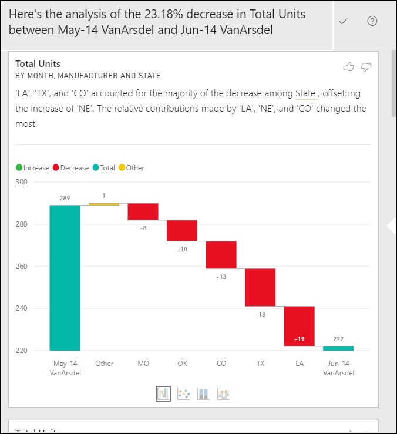

# ใช้ฟีเจอร์วิเคราะห์เพื่ออธิบายการผันผวนในภาพรายงาน

[!INCLUDE[consumer-appliesto-yynn](../includes/consumer-appliesto-yynn.md)]

บ่อยครั้งในการแสดงผลด้วยภาพของรายงาน คุณจะเห็นการเพิ่มขึ้นอย่างมากจากนั้นลดความคมชัดในค่า และสงสัยเกี่ยวกับสาเหตุของความผันผวนดังกล่าว คุณสามารถเรียนรู้สาเหตุด้วยการคลิกเพียงไม่กี่ครั้งด้วยการ**วิเคราะห์**ใน**บริการ Power BI**

ตัวอย่างเช่น พิจารณาภาพต่อไปนี้ที่แสดง*หน่วยทั้งหมด*ตาม*เดือน*และ*ผู้ผลิต* VanArsdel มีประสิทธิภาพเหนือกว่าคู่แข่ง แต่มีการลงลึกในเดือนมิถุนายน 2014 ในกรณีดังกล่าว คุณสามารถสำรวจข้อมูล เพื่อช่วยอธิบายการเปลี่ยนแปลงที่เกิดขึ้นได้ 

คุณสามารถขอให้บริการของ Power BI อธิบายการเพิ่มขึ้น ลดลง หรือตวามผิดปกติในภาพ และได้รับการวิเคราะห์ที่รวดเร็ว อัตโนมัติ และการวิเคราะห์มีข้อมูลเชิงลึกเกี่ยวกับข้อมูลของคุณ คลิกขวาที่จุดข้อมูล และเลือก **วิเคราะห์ > อธิบายการลดลง** (หรือเพิ่มขึ้น หากเส้นก่อนหน้านี้ต่ำกว่า) หรือ **วิเคราะห์ > หาว่าการกระจายนี้ต่างกันตรงไหน**และข้อมูลเชิงลึกจะถูกส่งไปให้คุณในหน้าต่างที่ใช้งานง่าย

ฟีเจอร์วิเคราะห์ข้อมูลเชิงลึกมีบริบท และขึ้นอยู่กับจุดข้อมูลก่อนหน้า - เช่นแถบก่อนหน้า  หรือคอลัมน์ก่อนหน้า

> [!NOTE]
> คุณลักษณะนี้ยังเป็นแค่ตัวอย่าง และอาจเปลี่ยนแปลงได้ เปิดใช้งานฟีเจอร์ข้อมูลเชิงลึกแล้วตามค่าเริ่มต้น (คุณไม่จำเป็นต้องตรวจสอบกล่องตัวอย่างเพื่อเปิดใช้งาน)

### มีการเลือกปัจจัยและหมวดหมู่ใด

หลังจากตรวจสอบคอลัมน์ที่แตกต่างกัน Power BI จะเลือกและแสดงปัจจัยข้อมูลที่แสดงการเปลี่ยนแปลงที่ใหญ่ที่สุดกับการสนับสนุนที่สัมพันธ์กัน สำหรับแต่ละหมวดหมู่ ค่าที่มีการเปลี่ยนแปลงของส่วนสนับสนุนอย่างมีนัยสำคัญที่สุดจะถูกนำไปใช้ในการอธิบาย นอกจากนี้ ค่าที่มีการเพิ่มขึ้นและลดลงมากที่สุดตามที่เกิดขึ้นจริงจะถูกนำไปใช้ด้วย

หากต้องการดูข้อมูลเชิงลึกทั้งหมดที่สร้างขึ้นโดย Power BI ให้ใช้แถบเลื่อน ลำดับคือการจัดอันดับด้วยผู้สนับสนุนที่สำคัญที่สุดจะแสดงก่อน 

## การใช้ข้อมูลเชิงลึก
หากต้องการใช้ข้อมูลเชิงลึกเพื่ออธิบายแนวโน้มที่เห็นในภาพ ให้คลิกขวาบนจุดข้อมูลใดๆ ก็ตามในแผนภูมิแท่งหรือเส้น และเลือก**วิเคราะห์** จากนั้นเลือกตัวเลือกที่ปรากฏขึ้น: **อธิบายการเพิ่มขึ้น** **อธิบายการลดลง** หรือ**อธิบายส่วนต่าง**

Power BI Desktop จะเรียกใช้อัลกอริทึมการเรียนรู้ กับข้อมูล และเพิ่มวิชวลและคำอธิบายลงในหน้าต่าง ที่ใช้อธิบายว่าข้อมูลประเภทไหนส่งผลต่อการเพิ่มขึ้นหรือลดลงมากที่สุด  สำหรับตัวอย่างนี้ ข้อมูลเชิงลึกแรกคือแผนภูมิแบบน้ำตก

โดยการเลือกไอคอนขนาดเล็กที่ด้านล่างของแผนแบบภูมิน้ำตก คุณสามารถเลือกให้แสดงข้อมูลเชิงลึก เป็น แผนภูมิกระจาย แผนภูมิคอลัมน์แบบเรียงซ้อน หรือแผนภูมิ ribbon

ใช้ไอคอน*ยกนิ้วโป้งขึ้น*และ*คว่ำนิ้วโป้งลง* ที่ด้านบนของหน้า เพื่อเสนอแนะคำติชมภาพและฟีเจอร์นี้  

คุณสามารถใช้ข้อมูลเชิงลึกเมื่อรายงานของคุณอยู่ในโหมดอ่านหรือแก้ไข ซึ่งทำให้มีความยืดหยุ่นในการวิเคราะห์ข้อมูล และสร้างภาพที่คุณสามารถเพิ่มในรายงานของคุณได้อย่างง่ายดาย ถ้าคุณมีรายงานที่เปิดอยู่ในมุมมองการแก้ไข คุณจะเห็นไอคอนเครื่องหมายบวกถัดจากไอคอนรูปนิ้วโป้ง เลือกไอคอนเครื่องหมายบวกเพื่อเพิ่มข้อมูลเชิงลึกลงในรายงานของคุณเป็นภาพใหม่ 

## รายละเอียดของผลลัพธ์ที่ส่งกลับ

รายละเอียดที่ส่งกลับโดยข้อมูลเชิงลึกมีจุดมุ่งหมายเพื่อเน้นสิ่งที่แตกต่างกันระหว่างสองช่วงเวลา เพื่อช่วยให้คุณเข้าใจการเปลี่ยนแปลงระหว่างกัน  

อัลกอริธึมสามารถคิดได้ว่าจะใช้คอลัมน์อื่นๆ ทั้งหมดในโมเดลและคำนวณรายละเอียดตามคอลัมน์นั้น*ก่อน*และ*หลัง*ช่วงเวลาโดยพิจารณาว่ามีการเปลี่ยนแปลงเกิดขึ้นในรายละเอียดนั้น และจากนั้นส่งคืนคอลัมน์เหล่านั้นที่มีขนาดการเปลี่ยนแปลงมากที่สุด ตัวอย่างเช่น*รัฐ* ถูกเลือกในข้อมูลเชิงลึกแบบน้ำตกด้านบน เนื่องจากการสนับสนุนที่โดยรัฐหลุยเซียนา เท็กซัส และโคโลราโดลดลง 13% ถึง 19% จากเดือนมิถุนายนถึงเดือนกรกฎาคม และให้ประโยชน์สูงสุดในการลดลงของ*หน่วยรวม*  

สำหรับข้อมูลเชิงลึกแต่ละรายการที่ถูกส่งกลับ มีสี่ภาพที่สามารถแสดงได้ ภาพสามภาพเหล่านี้มีจุดมุ่งหมายเพื่อเน้นการเปลี่ยนแปลงของส่วนสนับสนุนระหว่างสองช่วงเวลา ตัวอย่าง เช่นสำหรับคำอธิบายการเพิ่มขึ้นจาก*ไตรมาส 2* ถึง*ไตรมาส 3* แผนภูมิ ribbon แสดงการเปลี่ยนแปลงทั้งก่อนและหลังจุดข้อมูลที่ถูกเลือก

### แผนภูมกระจาย

ภาพแผนภูมิกระจายจะแสดงค่าของการวัดในช่วงแรก (บนแกน x) เทียบกับค่าของการวัดในช่วงที่สอง (บนแกน y) สำหรับแต่ละค่าของคอลัมน์ (ในกรณีนี้คือ*รัฐ*ู่) จุดข้อมูลอยู่ในภูมิภาคสีเขียวหากเพิ่มขึ้น และในภูมิภาคสีแดงหากลดลง 

เส้นประแสดงให้เห็นถึงจุดที่พอเหมาะที่สุด  จุดข้อมูลเหนือเส้นนี้เพิ่มขึ้นมากกว่าแนวโน้มโดยรวมและจุดข้อมูลต่ำกว่าเส้นลดน้อยลง  

รายการข้อมูลที่มีค่าว่างในช่วงเวลาหนึ่งๆ จะไม่ปรากฏในแผนภูมิกระจาย

### แผนภูมิคอลัมน์แบบเรียงซ้อน 100%

ภาพแผนภูมิคอลัมน์แบบเรียงซ้อน 100% แสดงค่าของการสนับสนุนสำหรับผลรวม (100%) สำหรับจุดข้อมูลที่เลือกและก่อนหน้านี้ ซึ่งจะช่วยให้เปรียบเทียบการสนับสนุนสำหรับแต่ละจุดข้อมูลได้แบบแบบเคียงข้างกัน ในตัวอย่างนี้ คำแนะนำเครื่องมือแสดงการสนับสนุนจริงสำหรับค่าที่เลือกของรัฐเท็กซัส เนื่องจากรายการของรัฐมีความยาว คำแนะนำเครื่องมือจะช่วยให้คุณเห็นรายละเอียด โดยใช้คำแนะนำเครื่องมือ เราเห็นว่ารัฐเท็กซัสมีส่วนเกี่ยวเนื่องกับจำนวนหน่วยรวม (31% และ 32%) แต่จำนวนของหน่วยทั้งหมดที่ลดลงจาก 89 เป็น 71 โปโปรดจำไว้ว่าแกน Y เป็นเปอร์เซ็นต์ ไม่ใช่ผลรวมและแต่ละแถบคอลัมน์เป็นเปอร์เซ็นต์ไม่ใช่ค่า 

### แผนภูมิริบบอน

ภาพแผนภูมิ ribbon แสดงค่าของหน่วยวัดก่อนและหลัง ซึ่งมีประโยชน์โดยเฉพาะอย่างยิ่งในการแสดงการเปลี่ยนแปลงของส่วนสนับสนุนเมื่อ*การเรียงลำดับ* ของผู้สนับสนุนมีการเปลี่ยนแปลง (ตัวอย่างเช่น *LA* ลดลงจากจำนวนผู้สนับสนุนอันดับสองไปเป็นอันดับสิบเอ็ด)  และแม้ว่า *TX* ถูกแสดงด้วยริบบอนแบบกว้างที่ด้านบนซึ่งบ่งบอกว่าเป็นผู้สนับสนุนที่สำคัญที่สุดก่อนและหลัง ค่าที่ลดลงแสดงให้เห็นว่าค่าของการสนับสนุนลดลงทั้งในช่วงระยะเวลาที่เลือกไว้และหลังจากนั้น

### แผนภูมิน้ำตก

ภาพที่สี่คือแผนภูมิน้ำตก ซึ่งแสดงการเพิ่มขึ้นหรือลดลงระหว่างช่วงเวลาตามจริง ภาพนี้แสดงให้เห็นมีผู้มีสนับสนุนอย่างมีนัยสำคัญต่อการลดลงของเดือนมิถุนายน 2014 -- ในกรณีนี้คือ**รัฐ** และผลกระทบของ**รัฐ**ในหน่วยรวมคือการปฏิเสธในรัฐหลุยเซียนา เท็กซัส และโคโลราโดที่มีบทบาทที่สำคัญที่สุด      

 

## ข้อควรพิจารณาและข้อจำกัด
เนื่องจากข้อมูลเชิงลึกเหล่านี้ขึ้นอยู่กับการเปลี่ยนแปลงจากจุดข้อมูลก่อนหน้า ดังนั้นจึงไม่สามารถใช้งานได้เมื่อคุณเลือกจุดข้อมูลแรกในภาพ 

การ**วิเคราะห์**ไม่พร้อมใช้งานสำหรับชนิดภาพทั้งหมด 

รายการต่อไปนี้คือคอลเลกชันของสถานการณ์ที่ไม่ได้รับการสนับสนุนในขณะนี้สำหรับ**วิเคราะห์ - อธิบายการเพิ่ม/ลด/ส่วนต่าง**:

* ตัวกรอง TopN
* ตัวกรอง รวม/ไม่รวม
* ตัวกรองหน่วยวัด
* หน่วยวัดที่ไม่ใช่ตัวเลข
* ใช้ "แสดงค่าเป็น"
* การวัดที่กรองแล้ว - การวัดที่กรองแล้วคือการคำนวณระดับชั้นด้วยสายตาโดยใช้ตัวกรองเฉพาะ (ตัวอย่างเช่น *ยอดขายรวมสำหรับประเทศฝรั่งเศส*) และใช้กับภาพจริงบางส่วนที่สร้างโดยคุณลักษณะข้อมูลเชิงลึก
* คอลัมน์ประเภทที่ใช้เป็นแกน X เว้นแต่ว่าจะกำหนดการเรียงลำดับตามคอลัมน์ที่เป็นสเกลา ถ้ามีการใช้ลำดับชั้น ทุกคอลัมน์ในลำดับชั้นที่ใช้งานจะต้องตรงกับเงื่อนไขนี้

## ขั้นตอนถัดไป
[แผนภูมิน้ำตก](../visuals/power-bi-visualization-waterfall-charts.md)    
[แผนภูมิกระจาย](../visuals/power-bi-visualization-scatter.md)    
[แผนภูมิคอลัมน์](../visuals/power-bi-report-visualizations.md)    
[แผนภูมิ Ribbon](../visuals/desktop-ribbon-charts.md)
