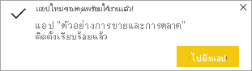

# ติดตั้งและใช้แอปตัวอย่างการขายและการตลาดในบริการของ Power BI

[!INCLUDE[consumer-appliesto-yyny](../includes/consumer-appliesto-yyny.md)]

ในตอนนี้คุณมี[ความเข้าใจพื้นฐานเกี่ยวกับวิธีการรับเนื้อหา Power BI](end-user-app-view.md) แล้ว เรามาลองใช้ Microsoft AppSource เพื่อรับแอปทางการตลาดและการขายกันดู 

## ดาวน์โหลดแอปจาก Microsoft AppSource

1. เปิด [https://appsource.microsoft.com](https://appsource.microsoft.com)

   

1. ในกล่องค้นหา ให้ใส่ **การตลาด** และใส่เครื่องหมายถูกที่ข้าง ๆ **กำหนดตามผลิตภัณฑ์ > แอป Power BI** 

    

1. เลือกช่องแอปของ **ตัวอย่างของ Microsoft - การขายและการตลาด** หรือ อ่านภาพรวมและบทวิจารณ์ และดูภาพ  แล้วเลือก**รับทันที**

   

1. ยืนยันว่าคุณต้องการติดตั้งแอปนี้

   

5. บริการของ Power BI จะแสดงข้อความยืนยันเมื่อมีการติดตั้งแอปแล้ว เลือก**ไปที่แอป**เพื่อเปิดแอป แดชบอร์ดของแอปหรือรายงานแอปจะแสดงขึ้นตามวิธีการที่นักออกแบบสร้างแอป

    

    คุณยังสามารถเปิดแอปได้โดยตรงจากรายการเนื้อหาแอปของคุณโดยการเลือก**แอป** และเลือกแอป **การขายและการตลาด**

    

6. เลือกว่าจะเชื่อมต่อข้อมูลของคุณเอง สำรวจด้วยข้อมูลตัวอย่าง หรือปรับแต่งและแบ่งปันแอปใหม่ของคุณ เนื่องจากเราได้เลือกแอปตัวอย่าง Microsoft มาเริ่มต้นด้วยการสำรวจ 

    

7.  แอปใหม่ของคุณเปิดขึ้นพร้อมกับแดชบอร์ด *นักออกแบบ*แอปสามารถตั้งค่าแอปเพื่อเปิดรายงานแทนได้  

    

## โต้ตอบกับแดชบอร์ดและรายงานในแอป
ใช้เวลาสักครู่เพื่อสำรวจข้อมูลในแดชบอร์ดและรายงานที่สร้างแอป คุณสามารถเข้าถึงการโต้ตอบของ Power BI แบบมาตรฐานทั้งหมดเช่น การกรอง การเน้น การเรียงลำดับ และการดูรายละเอียดแนวลึก  ยังสับสนเล็กน้อยจากความแตกต่างระหว่างแดชบอร์ดและรายงานหรือไม่  อ่าน[บทความเกี่ยวกับแดชบอร์ด](end-user-dashboards.md)และ[บทความเกี่ยวกับรายงาน](end-user-reports.md)  

## ขั้นตอนถัดไป
* [กลับไปยังภาพรวมของแอป](end-user-apps.md)    
* [ดูรายงาน Power BI](end-user-report-open.md)    
* [มีการแชร์เนื้อหาด้วยวิธีอื่นกับคุณ](end-user-shared-with-me.md)
